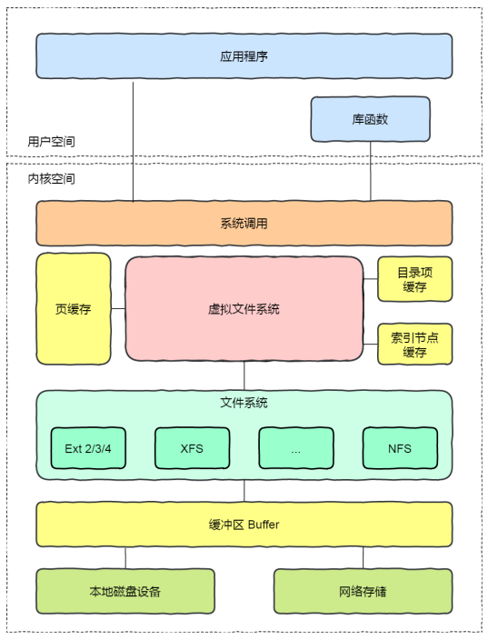
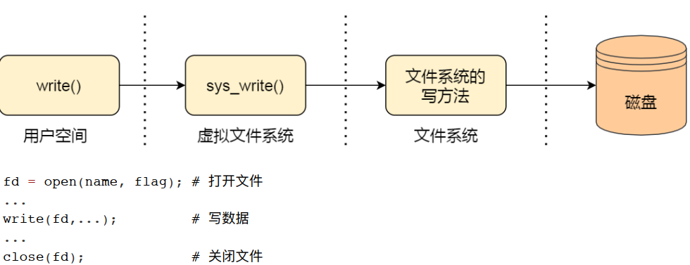
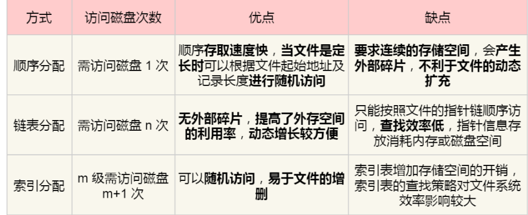

# 第六章、文件系统

## 【Why】为何要引入虚拟文件系统

1. 因为文件系统种类众多，而操作系统希望对用户提供一个统一的接口，于是在用户层与文件系统层引入了中间层，称为虚拟文件系统（VFS）。
2. 程序员不需要了解文件系统的工作原理，只需要了解VFS提供的统一接口即可。

## 【What】虚拟文件系统是什么

VFS：Virtual File System。定义了一组所有文件系统都支持的数据结构和标准接口。

## linux支持的文件系统有什么

1.  磁盘的⽂件系统：直接把数据存储在磁盘中。⽐如 Ext 2/3/4、 XFS 等。

2. 内存的⽂件系统：这类⽂件系统的数据，不是存储在硬盘的，⽽是占⽤内存空间。经常⽤到的/proc 和 /sys ⽂件系统都属于这⼀类。读写这类⽂件，实际上是读写内核中相关的数据。

3. ⽹络的⽂件系统：⽤来访问其他计算机主机数据，⽐如 NFS、 SMB 等等。

   ⽂件系统⾸先要先挂载到某个⽬录才可以正常使⽤，⽐如 Linux 系统在启动时，会把⽂件系统挂载到根⽬录。  

## 【How to】用户角度如何使用文件

1. 通过系统调用打开一个文件。
   操作系统为每个进程维护一个打开文件表，文件中的每一项代表文件描述符，是打开文件的标识。
   
2. 读文件+写文件
   1. 读文件：用户进程从文件读取1个字节大小的数据时；文件系统获取字节所在的数据块，返回数据块中对应的用户进程所需的数据部分。
   2. 写文件：用户进程把1个字节大小的数据写进文件时；文件系统找到需要写入数据的数据块位置，然后修改数据块中对应部分，最后将数据块协写回磁盘。

文件系统的基本操作单位是数据块。

## 【How】文件的数据在硬盘上是如何存储的

1. 连续空间存放
   文件连续存放在磁盘物理空间中。读写效率高，一次磁盘寻道即可读出整个文件。需先知道文件大小。
   存在磁盘空间碎片，文件长度不易拓展。
2. 非连续空间存放
   1. 链式方式
   2. 索引方式

