# 自我介绍

面试官您好，我叫孔静静，孔子的孔，安静的静。硕士就读于电子科技大学信息与通信工程专业。研究方向为智能通信与网络。此次应聘的为咱们公司的软件开发岗位。

目前在研两个核心项目，分别为5G远程医疗终端和博客论坛项目，在其中分别均负责信息处理及软件开发部分工作。

5G远程医疗终端是我研究生团队的一个在研纵向合作项目。主要研发一个面向移动医院应用的 5G 可信行业远程医疗终端；以实现超高清视频传输 专家在线诊疗、临床检验大数据分析等功能。
该项目主要研究突破移动远程医疗系统架构、医疗设备数据信息采集融合和通信接口、医疗超高清视频数据压缩和编解码、5G高速通信与自适应网络切片。
该终端对应的系统架构主要包括射频硬件电路、终端信息处理、远程医疗信息 显示中心这三个主要模块，可实现异构数据接入、处理、存储、传输、显示等。
本人主要负责以下几点工作：
1、针对医疗设备侧数据的多源异构，进行医疗设备接口调研 及 医疗终端总体方案设计， 起草并形成终端信息处理技术方案及接口调研报告；
2、负责并完成 linux环境下多传感器生理数据采集处理；实现 ffmpeg 流媒体平台搭建；整合并传输生理数据，实现 web 页面简单显示；
3、同时负责团队内部会议活动的组织召开、相关资料整理等事宜。
经过该项目，我的抗压和自学能力得到了极大的提升，同时，也充分的锻炼了自己与小组成员之间的合作配合能力，自己对于工作计划的制定和高效实施也有了更深刻的认识，能力得到了极大提升。

第二个博客论坛项目是个人在计算机能力提升过程中的一个学习项目。
该项目是基于SSM + Spring Boot + Redis等技术栈开发的论坛社区网站，是一个具有问答功能的互动交流平台，实现了注册登录、发帖评论、回复点赞、消息提醒、内容搜索和网站数据统计 等功能。 
我主要负责后端业务逻辑编写，其中包括以下几点核心工作内容：
技术栈： Springboot+Mybatis+MySQL+Redis 
1、利用 Spring Security 实现注册登录模块开发；
2、实现网站核心功能，利用事务实现发帖评论、AOP 统一日志记录，并通过前缀树实现敏感词过滤；
3、运用 Redis 的 set 结构实现点赞、zset 实现关注，并进行了缓存优化。
该项目的完成让我对于java前后端这个方向的兴趣更浓厚了，同时将所学知识进行了实践验证，对于java面向对象语言的特性以及springboot中AOP等核心思想有了更深刻的理解，学习到了部分系统设计思维，在实践中也提升了自己发现问题解决问题的能力。 

在校期间对于个人素质也进行了多方面的学习提升。
学业上，学习了通信相关专业课程，并多次获得奖学金，具有较强学习能力；
学科竞赛方面，积极主动参加科技竞赛，并取得较优名次，例如电子设计大赛省赛二等奖；
技能证书方面，通过了全国英语六级、全国计算机三级等相关职业技能考试；
社会实践方面，担任班级心理委员、社团部长等职位，锻炼了自己的组织协调能力；
个人兴趣方面，多次参加公益活动；喜欢乒乓球、旅游等户外运动；同时看书、书法也让我更沉稳。

以上经历锻炼了均自己的个人综合素质，让我具备从事软件开发相关岗位的一些特质，再加上自己本身对于互联网行业的兴趣及从业意愿，所以此次我应聘了贵公司的软件开发岗位。对于该岗位，我个人的理解是，通过后端数据平台的维护、业务逻辑处理优化，来保证公司业务范围的扩大以及核心竞争力的提升。
贵公司在这个方向具有较大发展空间，同时与我的职业发展规划较契合，所以我希望能够加入进来，进一步发展完善相关业务，实现个人特点与岗位工作的共同进步。

# 项目简介

## 5G远程医疗

### 你负责哪些工作？

### 数据采集怎么实现的

### ffmpeg是什么。

1. 是一套开源软件。
2. 可以记录、转换音视频：可以从摄像头中记录视频，从声卡中记录音频，并可以转换为各种格式保存起来。
3. 可以把各种格式的音视频转换为流，供在线观看。
4. 还具备视频截图、加水印、裁剪等功能。
5. Mpalyer、ffplay、暴风影音、QQ影音等视频播放器、格式工厂等，其内核就是ffmpeg。

ffmpeg数据处理过程：将从摄像头、声卡采集到的原始数据，通过视频、音频编码器生成压缩的音视频数据，在容器层进行复用、打包等操作，之后通过协议层将流媒体数据转发给流媒体服务器。此处的容器就是以一种文件格式，比如flv、mkv等，包含流以及文件头信息。流是一种视频数据信息的传输方式，包括音频、视频、字母、附件、数据。帧代表一副静止的图像。编解码器实现对于视频进行压缩/解压缩。复用/解复用是把不同的流按照某种容器的规则放入容器/从容器中解析出来。过滤器是指，流在被编码到输出文件之前用来修改文件内容的一个软件工具。

注意：MP4只是一种封装格式，里面有音视频。音频和视频均有自己的压缩格式且不止一种。

### 如何搭建ffmpeg？

下载并安装其开源包，进行环境配置后，利用ffmpeg 搭配其关键命令，即可以实现对于音视频流的操作了。

ffmpeg程序把-i参数指定的若干文件内容读入内存中，按照输入的参数/程序默认参数 来处理，且把结果写入到若干文件中。输入、输出文件可以是计算机文件、管道、网络流、捕获到的设备。

### 与5G之间的关系？采用了什么传输方式？


### 你遇到了什么困难，是如何解决的呢？

系统设计+项目功能实现

1)技术方案制定环节，基于合理的分析论证后，需要有统筹全局并作出最终决定的人。然而前期，我们进展比较不顺利，无人领导统筹，各自做各自的事情，后来经过一系列的磨合以及发现问题，我们对于项目整体都有了一致的理解和认可，指导老师和项目组成员，配合的也更加默契了一点。

2）传感设备采集数据的时候，设备接触导致数据接收不稳定。通过对于软硬件的逐个排查，确定了是接口的问题，后更换设备，重新连接，在验证了系统基础功能的情况下，配合其他模块，继续往后推进项目进度。

3）摄像头数据采集的时候，需要对于公网IP进行配置和服务器的搭建。前期需要将PC和摄像头设置在一个网段，？？？

## 博客论坛项目

### **一、怎么实现你负责的部分的？**

### 1、登录注册功能怎么实现的？

​    1）首先**开发注册功能，基于已有的注册页面，完成三步提交注册数据**。第一步是通过表单提交数据，提交的数据分别为账号、密码、确认密码、邮箱。第二步是服务端验证账号是否已存在，邮箱是否已注册，如果账号已存在或者邮箱已注册，那么服务端会返回一个json格式字符串来响应浏览器发出的异步请求，告知用户，否则进入第三步。第三步是服务端发送激活邮件，这个功能是利用Spring Email来实现。三步完成之后，用户就可以激活注册账号，用户通过点击邮件中的链接，访问服务端的激活服务（激活服务的具体业务逻辑是什么？）。

​    2）**开发登录功能，基于已有的登录页面，验证用户输入的账号、密码、验证码**，其中，验证码通过第三方jar包kaptcha生成，并将第三方jar包产生的验证码放到Session里，和用户输入的验证码进行比对，若三个信息均校验正确，即登录成功，生成登录凭证，最终发送一个ticket对应的值给客户端，客户端将登录信息存储在cookie里；若三个信息中有任何一个校验错误，均仍停留在登录页面。

   3）**根据登录与否，调整显示页面头部信息**。如果是已登录状态，头部信息会显示用户的具体信息， 为了实现在头部信息中显示用户信息的功能，需要**使用到Spring Security的拦截器，拦截登录与注册请求，并从请求信息中获取对应用户的登录凭证**。首先检查登录凭证是否有效，判别是否有效的依据是请求的cookie中是否有登陆凭证、登陆凭证的状态是否有效、登录凭证是否超时；如果登录凭证有效，则根据登录凭证查询用户信息，并将用户信息存储到Threadlocal里，最终用户信息嵌入模板里返回给浏览器，之后清除Threadlocal里的用户信息。

#### 1.1 如何实现登录后给用户发邮件告知“已登录”的？

发邮件是一个耗时较长的操作，要连接邮件服务器，肯定不能放在同步里面，一定要放在异步来做，一旦涉及到跟服务器的网络交互都是很慢的。为了提升效率，项目中用了一个异步框架，相当于一个消息中间件(好处)。

该异步框架的优点：第一，它是异步的(@EnableAsync)。第二，它通过内部注解的方式能够实现自己注册事件。第三，这个异步用的Redis的list，当然也可以用java自带的blockingqueue。

> 1. 首先定义事件类型EventType，这是一个Enum（说一下理解）；
> 2. 定义事件模型EventModel；
> 3. 定义事件生产者EventProducer，添加@service注解，内部的fireEvent方法把传入的EventModel序列化后写入Redis的队列中。
> 4. 定义事件处理接口EventHandler。其中包含两个方法doHandle来处理事件、getSupportEventTypes实现事件处理器注册资金，让别人知道自己关注哪些时间类型，当关注的类型事件发生后，就对其进行处理。
> 5. 定义事件消费者EventComsumer。初始化对象InitializingBean 的时候，就调用消费者类，实现对应接口，获得ApplicationContext对象。a.通过该对象找出所有Handler的实现类，并将实现类和各个事件关联起来。b.新建一个线程，在while(true)循环中，不断从事件队列中弹出事件。该线程一开始就会永久运行。c. 获取事件的value，并将其反序列化成对应模型的事件，传入对应的Handler进行处理。

#### 1.2 **session和cookie的具体会话过程**？

**1.2.1 什么是会话过程呢**？所谓的会话过程就是指从打开浏览器到关闭浏览器的过程。不管浏览器发送多少请求(就相当于接通电话后说话一样)，都视为一次会话，直到浏览器关闭，本次会话结束。同一台电脑、不同浏览器 访问同一个服务器，这是两次不同的会话。

> **会话机制**用来跟踪用户的整个会话。cookie通过在客户端记录信息确定用户身份，session通过在服务器端记录信息确定用户身份。
>
> HTTP是无状态的协议，客户每次读取web页面时，服务器都打开新的会话，且服务器不会自动维护客户的上下文信息。cookie和session是域对象，所谓域就相当于给存储的内容设置一个边界，将内容存储到这片区域内。（https://blog.csdn.net/weixin_42047611/article/details/80424521）

**1.2.2 什么是cookie和什么是session**？cookie是一种在客户端记录用户信息的技术，因为http协议是无状态的，为了解决这个问题而产生了cookie。记录用户名等一些应用。session是一种在服务端记录用户信息的技术，一般session用来在服务器端共享数据，

**cookie的工作原理？**

​         浏览器访问服务器时，服务器会创建一个cookie对象（在http的响应头里有一个参数），在响应时发送给浏览器，浏览器保存cookie到本地，当浏览器再次对服务器发起请求时，在http请求头里会携带cookie参数，这个cookie需要指定要访问服务器哪些路径，浏览器将cookie信息返回给服务器，服务器通过这种方式来记住用户。其中cookie是使用键值对来存储信息的，并且一个cookie只能存储一个键值对。所以在获取cookie时，是会获取到所有的cookie，然后从其中遍历。

**session的工作原理？**

​       session的工作原理就是依靠cookie来做支撑，当服务端第一次使用request.getSession()获取客户端请求时，session被创建，并且会为该session创建一个独一无二的sessionid存放到cookie中，然后发送会浏览器端，浏览器端每次请求时，都会带着这个sessionid，服务器就会认识该sessionid，知道了sessionid，就找得到该请求对应哪个session。以此来达到共享数据的目的。 这里需要注意的是，session不会随着浏览器的关闭而死亡，而是等待超时时间。

**session详解**：浏览器请求服务器访问web站点时，程序需要为客户端的请求创建一个session的时候，服务器首先会检查这个客户端请求是否已经包含了一个session标识、称为SESSIONID，如果已经包含了一个sessionid则说明以前已经为此客户端创建过session，服务器就按照sessionid把这个session检索出来使用，如果客户端请求不包含session id，则服务器为此客户端创建一个session并且生成一个与此session相关联的session id，sessionid 的值应该是一个既不会重复，又不容易被找到规律以仿造的字符串，这个sessionid将在本次响应中返回到客户端保存，保存这个sessionid的方式就可以是cookie，这样在交互的过程中，浏览器可以自动的按照规则把这个标识发回给服务器，服务器根据这个sessionid就可以找得到对应的session，这样服务器就可以区分不同的浏览器。

除非程序通知服务器删除一个session，否则服务器会一直保留，然而浏览器从来不会主动在关闭之前通知服务器它将要关闭，因此服务器根本不会有机会知道浏览器已经关闭。恰恰是由于关闭浏览器不会导致session被删除，迫使服务器为seesion设置了一个失效时间，一般是30分钟，当距离客户端上一次使用session的时间超过这个失效时间时，服务器就可以认为客户端已经停止了活动，才会把session删除以节省存储空间

> 例子1：假如一个咖啡店有喝5杯免费赠1杯的优惠，此时则需要某种方式记录某顾客消费量。1、店员自己能记住每个顾客消费数量。=协议本身支持状态。但http协议是无状态的。2、给顾客一张卡片，记录消费数量、有效期限。=客户端保持状态cookie，顾客相当于浏览器。3、发给顾客会员卡，除卡号外什么信息也不记录，每次消费时出示会员卡，店员在店里的记录表中找该卡号，并添加消费信息记录。=服务器保持状态。由于服务端保持状态的方案在客户端也需要保存一个标识，所以session机制可能需要借助于cookie机制来达到保存标识的目的。https://www.cnblogs.com/whgk/p/6422391.html
>
> 例子2：原理很简单，假设你访问网页时就像逛澡堂，第一次进去你是没有钥匙的，这个时候你交了钱服务台就分配一把钥匙给你，你走到哪里都要带上，因为这是你身份的唯一标识，接下来你用这把钥匙可以去打开一个专有的储物柜存储你的衣物，游完泳，你再用钥匙去打开柜子拿出衣物，最后离开游泳池时，把钥匙归还，你的这次游泳的过程就是一次session，或者叫做会话，在这个例子中，钥匙就是session的key，而储物柜可以理解为存储用户会话信息的介质。

**Cookie**工作流程：

1. servlet创建cookie，保存少量数据，发送浏览器。

2. 浏览器获得服务器发送的cookie数据，将自动的保存到浏览器端。

3. 下次访问时，浏览器将自动携带cookie数据发送给服务器。

cookie操作

　　　1.创建cookie：new Cookie(name,value)

 　　　2.发送cookie到浏览器：HttpServletResponse.addCookie(Cookie)

　　　3.servlet接收cookie：HttpServletRequest.getCookies() 浏览器发送的所有cookie。

cookie案例

　　1.**记住用户名**：登录时，在服务器端获取到用户名，然后创建一个cookie，将用户名存入cookie中，发送回浏览器端，然后浏览器下次在访问登录页面时，先拿到cookie，将cookie中的信息拿出来，看是否保存了该用户名，如果保存了，那么直接用他，如果没有，则自己手写用户名。

　　2.**历史记录**。比如购物网站，都会有我们的浏览记录的，实现原理其实也是用cookie技术，每浏览一个商品，就将其存入cookie中，到需要显示浏览记录时，只需要将cookie拿出来遍历即可。　　

#### 1.2.1 如何实现session共享？

 SpringSecurity的认证结果如何在多个请求之间共享。

在web server中实现session共享，可以用内存、也可以用文件，也可以用数据库。对于Session来说，肯定是频繁使用的，虽然**可以把它存放在数据库中**，但是真正生产环境中更推荐存放在性能更快的分布式**KV数据**中。例如：**Memcached和Redis**

1. 使用**redis共享session**。 redis是一个key-value的储存系统。可以简单的将其理解为一个数据库，与传统数据库的区别是，它将数据储存于内存中，并自带有内存到硬盘的序列化策略，即按策略将内存中的数据同步到磁盘，避免数据丢失，是目前比较流行的解决方案。优点：无需增加数据库的压力，因为数据存储于内存中，所以读取非常快，高性能，并能处理多种类型的数据。 缺点：额外增加一些编码，以便操作redis。
2. 使用**memcache(内存缓存)同步session**。memcache可以实现分布式，可将服务器中的内存组合起来，形成一个“内存池”，以此充当公共空间，保存session信息。[Memcache](http://www.danga.com/memcached/)由于是一款多路异步I/O技术的内存共享系统，内存hash拥有数据过期淘汰机制，正好和Session的过期机制不谋而合，降低了过期Session数据删除的代码复杂度。优点：数据储存在内存中，读取非常快，性能好。缺点：memcache把内存分成很多种规格的存储块，有大有小，不能完全利用内存，会产生内存碎片，浪费资源，如果储存块不足，还会产生内存溢出。
3. **基于数据库**的session共享。使用数据库支持的会话。所有机器的会话数据都从同一个数据库读，就不会存在不一致的问题，方案的实用性比较强。缺点在于session的并发读写能力取决于Mysql数据库的性能，同时需要自己实现session淘汰逻辑，以便定时从数据表中更新、删除 session记录，当并发过高时容易出现表锁。
4. **缓存存储**。**简单的缓存**：此时会话数据将直接存储在你的缓存中。然而，缓存数据将可能不会持久：如果缓存填满或者缓存服务器重启，缓存数据可能会被清理掉。**持久的缓**存：它的写操作使用缓存，对缓存的每次写入都将再写入到数据库。对于读取的会话，如果数据不在缓存中，则从数据库读取。两种会话的存储都非常快，但是简单的缓存更快，因为它放弃了持久性。
5. 使用**文件保存session**。为解决Unix网络主机间的目录共享而研发。无需做过多的二次开发，仅需将共享目录服务器mount到各频道服务器的本地session目录即可，缺点是NFS依托于复杂的安全机制和文件系统，因此并发效率不高，尤其对于session这类高并发读写的小文件，会由于共享目录服务器的io-wait过高，最终拖累前端WEB应用程序的执行效率。
6. 服务器间同步。定时同步各个服务器的session信息，此方法可能有一定延时，用户体验也不是很好。 
7. **基于Cookie的Session共享**。将全站用户的Session信息加密、序列化后以Cookie的方式，统一种植在根域名下（如：.host.com），利用浏览器访问该根域名下的所有二级域名站点时 ，会传递与之域名对应的所有Cookie内容的特性，从而实现用户的Cookie化Session 在多服务间的共享访问。优点是无需额外的服务器资源；缺点是由于受http协议头长度的限制，仅能够存储小部分的用户信息，同时Cookie化的 Session内容需要进行安全加解密（如：采用DES、RSA等进行明文加解密；再由MD5、SHA-1等[算法](http://lib.csdn.net/base/datastructure)进行防伪认证），另外它也会占用一定的带宽资源，因为浏览器会在请求当前域名下任何资源时将本地Cookie附加在http头中传递到服务器。

#### 1.3 用户Spring Security的表单登录流程详细阐述

Spring Security本质就是一组过滤器，请求和响应都经过这个过滤器。

 1）**用户登录验证是基于Spring Security的表单登录流程思想来实现的。**用户注册时的密码会加密再存入数据库，加密方式是MD5(明文+随机salt)+随机两个字母。

2）用户登录时，在service层实现验证逻辑，验证登录信息。如果验证成功会生成一个LoginTicket对象，里面存储用户id、过期时间、权限信息、一个全局唯一标识的ticket，把该LoginTicket对象存入数据库，ticket通过service层的map进行返回。如果密码验证不成功，则service层返回的map中不包含ticket，而会包含ErrorMsg。

3）controller层拿到这个map后，检查里面的“ticket”，若有值，则将其存入cookie，并加入response中；若没有，则返回Map的错误信息。

> ​         **为何要给ticket建表呢？**因为，假设有两台服务器，用户在A服务器登录后继续访问，B服务器处理了这个新的请求，若没有ticket表，则B无法确定A是否是之前登录过的用户。**实现了（session共享）**。

4）**获取ticket后，用自定义拦截器检测用户登录状态**。( **如何实现自定义拦截器的？**)

> -  a.自定义的拦截器实现HandlerInteceptor接口，重写preHandle方法，该方法作用在所有请求发生之前。
> -  b.在每个请求进入时，重写的方法会检测cookie中是否包含全局唯一标识的ticket，若包含ticket，则根据ticket值在数据库中找对应信息，看是否过期。若能找到用户登录信息，则进一步根据ticket在数据库中查找userId、根据userId找到User，并将User信息存入HostHolder对象中。
> -  c. 这个HostHolder对象是用来保存认证的用户信息的，其私有变量是ThreadLocal类型的，所以每个线程都会有一个拷贝，每个线程拷贝的这个变量所占用的内存是不一样的，但又能通过一个公共的接口来访问。

5）经过这个拦截器，所有登录用户都会有一个线程私有的HostHolder对象，没有登录的用户则没有。

6）所以我们可以再自定义第二个拦截器，来检查用户是否持有HostHolder，若有就继续进行请求处理，如果没有就重定向至登录页面。

`注意：拦截器的注册顺序就是调用顺序，注册时可以指定哪些页面调用该拦截器。`

#### 1.3.1 密码为何加盐?MD5如何理解？

一、MD5加密

1）为什么？如果数据库里用户账号的密码没有加密处理，如果数据库被盗，密码被知道导致用户数据被窃取，这是很危险的。数据库里存放密码的密文会安全一点，密码安全性高的话破解也需要时间。

2）怎么做？对密码进行加密。除了MD5加密，还有其他的加密方式。

二、加盐

1）为什么？普通的密码利用MD5加密后，有可能被破解。原因：常见的密码如“123456”，利用MD5加密的密文是固定的。把常见的密码的密文和明文通过键值对保存，输入密文很快就能查出明文。加盐操作是为了让密码更为复杂，保密性更强。一般而言，“盐”指的是，这个随机码会与密码一起被MD5进行散列计算，再与生成的序列一同存进数据库。所以需通过对输入密码结合随机码进行散列计算，将得到的值再去数据库进行匹配。

2）怎么做？将用户输入的密码和计算机动态生成的随机码（盐，位数不固定）拼接（提高了密码的安全性），再利用md5进行散列计算加密，数据库保存密文和随机码(四个字母盐-)。再次进行登录验证密码时，由于经过散列计算处理的数据不可逆向恢复，校验时，将用户输入的密码和数据库里保存的随机码4个字母拼接 并进行散列计算加密，将得到的值再去看是否和数据库里保存的密文一致。

> 盐是由系统随机生成，只有系统知道。即便两个用户使用了同一个密码，由于系统为它们生成的salt值不同，散列值也是不同的。
> MD5算法生成一个128位的散列值，目的是为了防止反向查询密码，多次破解。

### 2、利用事务实现发帖评论怎么实现的？

​    显示评论功能的具体实现过程为，首先在数据层根据实体查询评论的数据和评论的数量。然后在业务层处理查询评论数据和评论数量的业务（具体的业务逻辑是什么？）。最后在表现层实现显示帖子详情数据时，同时显示该帖子的所有评论数据。

​    添加评论功能的具体实现过程为，首先在数据层实现添加评论数据以及修改帖子上显示的评论数量；然后在业务层需要同时实现增加评论、更新帖子上显示的评论数量，业务层进行的两个操作要么都成功要么都失败，为了保证业务的完整性，这就会涉及到事务管理以及事务管理实现方式的选择，事务管理是使用编程式事务管理还是声明式事务管理呢？由于本项目将要实现的事务放在一个方法里，最简便的方式是采用声明式事务管理，直接使用@transactinal注解即可。同时，此处还需要思考是否需要通过使用AOP的思想将事务管理解耦出来？将系统组件和业务组件解耦，由于此处仅想对这一处方法进行业务管理，因此暂时没有将事务管理解耦出来。

### 3、AOP统一日志记录怎么实现的

业务组件的方法主要是用来处理业务的，处理业务的同时，我们需要加入记录日志这样的系统需求。

记录日志刚开始时，考虑能不能利用拦截器来记录日志。因为拦截器它可以拦截所有请求。但是拦截器是针对于控制器的处理，我们记日志未必一定针对于控制器记日志，有可能针对于业务组件、数据访问层。而该项目中恰巧是针对于业务组件，比如针对于帖子、评论、消息等模块，为了对于所有的service业务组件、方法 来记日志，起初选择了把记录日志的功能放在组件里面，通过不同方法来调用该组件，这种方法比较原始，存在弊端：在业务里面耦合了系统需求，很危险。将来系统需求发生了变化，我们想在后面/抛异常/某些方法中记录日志，一旦业务发生变化，将会修改很多代码。

后来了解到AOP的编程思想，于是将记录日志这样的功能拆分出去，而不是记录在业务组件中，实现了解耦合。对于项目中的很多模块具有相同的系统需求，我们要对其统一记日志、权限检查、事务管理，使用AOP可以实现对其进行统一管理。

AOP解决系统需求的时候，不需要在业务组件中去调用，只需单独定义一个额外的系统组件，将业务组件通用的逻辑都划分到系统组件中，相当于是横跨着切了一刀。采用AOP解决问题，不是在目标对象上写组件，而是将代码单独封装到一个aspect组件里面，整个编程过程完全是针对于切面的，所以叫做面向切面编程。目标对象上有可能被织入代码的位置，称为连接点，比如有属性、构造块、成员方法等。

> 编写切面组件：通过表达式声明切点，指出到底要织入哪些对象的哪些位置；通过advice实现具体的系统逻辑，组件要做什么、在哪实现(是在程序运行前、后、还是有返回、异常的地方)。

我们写好切面组件后，需要将其织入到系统中的业务组件中。利用系统提供的框架，可以分不同时机进行织入：如果在编译时织入，需要用特殊编译器；若在装载时织入，则使用特殊类加载器。织入方式越原始，程序运行的时候，处理效率越高，运行时织入的效率较低。

**AOP有两种实现方式**。1）AspectJ是语言级的实现，扩展了Java语言，定义了AOP语法，在编译期织入代码，具有专门的编译器，用来生成遵守Java字节码规范的class文件。2）SpringAOP，使用纯java实现，不需要专门的编译器、类加载器。在运行时通过代理的方式织入代码，只支持方法类型的连接点，支持对于AspectJ的集成。

**SpringAOP的代理模式**：代理就是对某个对象生成代理对象来替代它，调用的时候调用代理对象，不调用原始对象，织入代码到代理对象里面。Spring所调用的Bean，都是通过容器调用。通过容器调用目标对象时，若目标对象有AOP的作用，就需要调用代理对象，而代理对象上又有织入的代码，就能解决添加系统功能的问题了。1）JDK动态代理的时候，要求目标对象必须有接口才可以实现代理，在代理的时候自动生成接口的一个实现类来代替原始接口。spring默认采用JDK，在接口的代理实例中织入代码。2）我们项目中写的service业务没有接口，则不能使用JDK，需要使用CGLib。CGLib采用底层的字节码技术，在运行时创建子类代理实例，在目标对象不存在接口时，spring AOP会采用此方式，用子类型代替父类型，在子类实例中织入代码。

> AOP的代码实现：1）新建包、类，在类上声明@Component注解，声明为一个Bean，不属于特定的某一层，让容器来管理它；声明@Aspect表明这是一个切面组件，不是普通组件。2）在切面组件中定义切点、添加注解@Pointcut，指出代码织入的位置。定义通知，分别为开始、结束、返回、抛异常、连接点前后，针对切点有效。实现记日志功能，实例化logger，并实现方法，获取IP地址、拼写时间、类 方法、连接点参数，组成logger.info。3）启动项目并测试，可以看到控制台打印输出操作内容和异常信息。

### 4、前缀树算法怎么用的？

**前缀树介绍**：

前缀树(Trie树)即字典树，是一种树形结构，有3个基本性质：a.根节点不包含字符，除根节点外每个节点都只包含一个字符。b.从根节点到某一节点，路径上经过的字符连接起来，为该节点对应的字符串。c.每个节点的所有子节点包含的字符都不相同。

前缀树的特点是`加入`和`查询`的操作与数据量无关，只与被操作字符串长度有关，可以最大限度的减少无谓的字符串比较。其核心思想是空间换时间，利用字符串的公共前缀来降低查询时间的开销以达到提高效率的目的。同时支持动态查询。

前缀树的时间复杂度为O(K)，查找效率高，但是要存储目标串，因此消耗较大空间。多个敏感词组成前缀树，末尾节点不能用null来判断，要用标志位进行标记，表示是敏感词的最后一个字符，中文也是一个字存一个节点。

前缀树应用于字符串检索、词频统计、字符串排序等。

**项目中的实现**：**针对用户发布的内容，使用前缀树算法，实现敏感词过滤。**定义敏感词，根据敏感词初始化前缀树，编写过滤敏感词的方法。

在资源文件包下新建文本文件，在其中输入需要过滤的敏感词。在工具包util下建立敏感词过滤工具类来实现前缀树算法，并将该类通过@Component注解添加到容器，交给容器来管理。服务器启动时，因为添加了@PostConstruct注解，前缀树即被初始化。

**前缀树算法实现**：

需要三个指针：根节点root、字符串的第一个字符left--指向敏感词的首字符、字符串的最后一个字符right--指向敏感词的尾字符。从left指针字符串的开始一直查找到末尾，依次用right和root指针比对。首指针一直往后走，尾指针进行了反复。

```java
public class TrieTree{
    //构建节点类
    public void class TrieNode{
        public int pass;		//在加字符的时候，该节点经过了几次
        public int end;			//标记以该字符结尾的字符串个数
        public TrieNode[] nexts;	//nexts[0]==null:没有走向'a'的路；nexts[0]!=null:有走向'a'的路；... nexts[25]!=null:有走向'z'的路。判断下级是否有节点，准备了26条路，因为有26个字符。也可以用哈希表达字符种类，记录下个节点是谁，只不过空间可能没有数组多
        public TrieTree(){
            pass = 0;
            end = 0;
            nexts = new TrieNode[26];
        }
    }
    
    public static void Trie{
        private TrieNode root;		//唯一的头结点
        
        public Trie(){	root = new TrieNode();	}
        
        //将字符串插入进前缀树
        public void insert(String word){
            if(word == null)	return;
            char[] chs = word.toCharArray();	//转换为字符数组
            TrieNode node = root;				//从根节点出发
            node.pass++;						//经过根节点的次数+1
            int index = 0;
            for(int i = 0; i < chs.length; i++){	//从左往右遍历字符
                index = chs[i] - 'a';			//由字符对应成走向哪条路
                if(node.nexts[index] == null){	//有无走向'nexts[index]'的路，没有则新建节点
                    node.nexts[index] = new TrieNode();    
                }
                
                node = node.nexts[index];	//将当前节点指针指向下一个字符
                node.pass++;
            }
            node.end++;
        }
        
        //搜索字符串出现过几次
        public int search(String word){
            if(word == null)	return;
            char[] chs = word.toCharArray();
            TrieNode node = root;				//从根节点出发
            int index = 0;
            for(int i = 0; i < chs.length; i++){	//从左往右遍历字符
                index = chs[i] - 'a';			//由字符对应成走向哪条路
                if(node.nexts[index] == null){	//有无走向'nexts[index]'的路，没有则直接返回
                    return 0;    
                }
                
                node = node.nexts[index];	//将当前节点指针指向下一个字符
            }
            return node.end;	//整个字符串遍历完后，返回该字符串加入过几次
        }
        
        //所有加入的字符串中，有几个是以pre曾字符串作为前缀的
        public int prefixNumber(String pre){
            if(pre == null)	return 0;
            char[] chs =  pre.toCharArray();
            TrieNode node = root;				//从根节点出发
            int index = 0;
            for(int i = 0; i < chs.length; i++){	//从左往右遍历字符
                index = chs[i] - 'a';
                if(node.nexts[index] == null){	//有无走向'nexts[index]'的路，没有则直接返回
                    return 0;    
                }
                
                node = node.nexts[index];	//将当前节点指针指向下一个字符
            }
            return node.pass;
        }
        
        //删除当前字符串对前缀树的影响
        public void delete(String word){
            if(search(word) != 0){			//前缀树中存在，才可执行删除操作
                char[] chs = word.toCharArray();
                TrieNode node = root;
                node.pass--;
                int index = 0;
                for(int i = 0; i < chs.length; i++){
                    index = chs[i] - 'a';
                    if(--node.nexts[index].pass == 0){	//字符串沿途的每个pass都减一
                        node.nexts[index] = null;	//减到末尾则删除、返回
                        return;
                    }
                    node = node.nexts[index];
                }
                node.end--;			//最后一个节点的标志位减一
            }
        }
    }
}
```

### 5、用Redis实现点赞与关注怎么实现的？

项目中Redis的使用，不需要写DAO层的逻辑，首先引入redis的依赖，配置redis，将redis与Spring整合，然后构造RedisTemplate通过相应的方法去访问redis。   

5.1 **点赞**

**用户点赞、点踩、统计 帖子页面和详情页面 的点赞数量，用到了redis的Set结构。**在访问之前定义一个获取redis key的方法，Key是对象id，比如文章的id，其内容为：实体类型（帖子页面或者详情页面或者评论页面）+实体编号。key对应的value有多种数据结构，Value存储用户id，此处选用的是无序集合set，因为Set结构的Value是不能是重复的，可以防止用户重复点赞。

> - 通过查询的结果，**判断用户是否给这篇文章/帖子点过赞和点过踩**，用sismember命令同时查询赞和踩的数据，如果该用户给该评论点了赞，则返回1，如果点了“踩”，则返回-1，如果没点赞也没点踩，则返回0。
> - **统计帖子页面和详情页面的点赞数量**。是通过redis key对应的集合里存储着几个value值来判断。获得某篇文章的点赞总数只需要调用scard命令

  5.2 **用户关注功能的实现。**

(zset)关注部分主要是开发关注以及取消关注的功能，以及统计用户的关注数以及粉丝数。
        1 **关注/取消关注功能的事务管理**。.azdd()实现关注。.zrem取消关注。开发逻辑同点赞功能一致，但有一处不同，用户点击关注伴随着两件事情的发生，A关注B、B多了一个粉丝A，两件事必须同时完成，因此需要进行**Redis事务管理**。

> - 批量操作在发送 EXEC 命令前被放入队列缓存。
> - 收到 EXEC 命令后进入事务执行，事务中任意命令执行失败，其余的命令都不会被执行。
> - 在事务执行过程，其他客户端提交的命令请求不会插入到事务执行命令序列中。

​         2  **为记录某个用户关注的实体**，(zset)**redis**里key存储的内容为 ：用户id+实体类型 。key对应的value有多种数据结构，选用的是无序集合set，存储实体编号，按照时间排序。获取我的关注列表，用zrevrange(key,startIndex,endIndex)。endIndex传入Integer.MAX_VALUE来获取所有的关注人员。zrevrange按分数值从大到小排序，zrange按分数值从小到大排序。时间最新分数值越大，放前面，要用递减排序。
​         3  **为记录某个实体拥有的粉丝**，(zset)redis里key存储的内容为 ：实体类型+实体编号。 key对应的value有多种数据结构，选用的是有序集合set，存储用户id，按照时间排序。这里用到了有序的Set结构，添加了时间，这样既可以防止重复关注，还能根据时间先后来排序粉丝，显示最新的粉丝。

5.3 **共同好友、共同关注等功能**。

（set）因为Redis提供了求交集、并集等操作，因此可以非常方便的实现：

> -  方法1：根据交集获得**共同关注**的人:使用SINTER求交集。
> -  方法2：（我关注的人也关注xx）关注一个人以后，以这个人作为s2 ，判断共同关注的人 是否 同时出现在他关注列表、以及我的关注列表(smember)。if(sismemer s1 3 and sismember s2 3) 

5.4**推荐可能认识的人**。

（set）关注这个人以后做为s2,自己为s1,取得s2-s1，获得属于S2但不属于S1的元素构成的集合，即为可能认识的人。

### 6、通过Redis实现缓存优化怎么实现的？

​    **优化验证码的存储，验证码不需要永久保存，通常在很短时间会失效。**此处涉及到一个问题，未登录用户还不知道自己的userid，那么redis的key值应该放什么？如何将redis中的key和特定的用户进行关联？通过发给用户一个随机的存储在cookie里的字符串，需要设置这个cookie的作用时间，并把这个随机的字符串作为key。第三方jar包产生的验证码存储在redis对应特定key的value中，即redis以key value的形式存储验证码。同时要设置用户信息的失效时间。通过比较用户输入的验证码和redis中对应key值对应的value值判断用户输入是否正确。

​    **优化登录凭证的存储，退出登录仅修改登录凭证对应的状态，这个数据是永久保存**。不需要写DAO层的逻辑，首先需要使得Spring整合redis，引入redis的依赖，配置redis，构造RedisTemplate通过相应的方法去访问redis。在访问之前需要定义一个获取redis的key的方法，保存登录凭证的key的内容为一个ticket值，这个值在用户登录成功以后存放在客户端的cookie里。key对应的value存储用户登录成功后产生的登录凭证对象(redis会自动把这个对象序列化为一个jaon格式字符串)，登录凭证中包含了用户id，用户名，Ticket（对应不同的用户生成随机的字符串）等字段。（原先登录凭证）

​    **优化用户信息的存储，使用redis进行缓存。** 登录成功以后帖子头部用户的信息是存在mysql里的，为了提高性能把用户数据临时存储在redis中，在访问redis之前需要定义一个获取redis的key的方法，key的内容为用户id。key对应的value有多种数据结构，选用的是字符串，存储用户信息。同时要设置用户信息的过期时间(三种缓存异常、持久化机制？)。

​    **做redis缓存设计有以下几步**：①优先从缓存中取值。②如果取不到，说明缓存数据没有初始化进去，数据来源于mysql，需要初始化缓存数据。③用户数据变更时，比如用户修改密码或头像等，有两种做法，一种是更新缓存（可能会有并发的问题），一种是清除缓存中数据，一般使用后一种。

​     **redis的优点**：提高系统性能，响应速度快，并且可以永久保存数据

#### 5.1、为什么要用缓存？

用缓存主要有两个用途：高性能、高并发。    

**高性能。**对于一些需要复杂操作、耗时查出来的结果，且确定后面不怎么变化，但是有很多读请求，那么直接将查询出来的结果通过key-value数据形式放入缓存中，后面直接读缓存即可。

**高并发**。MySQL单机支撑的QPS较低，若大量请求访问mysql，会发生故障。通过将很多数据放入缓存，通过key-value式操作，提高单机承载的并发量。缓存是在内存中，内存天然支持高并发。

#### 5.2 用了缓存后有什么不良后果吗？如何避免？

​    **1. 缓存与数据库双写不一致**。只要用缓存，就可能会涉及缓存与数据库双存储双写，只要是双写就一定会有数据一致性的问题。

**a.读请求和写请求串行化，串到一个内存队列里面**。串行化可以保证一定不会出现不一致的情况，但是会导致系统的吞吐量大幅度降低，需要用比正常情况下多几倍的机器去支撑线上的一个请求。

**b.缓存+数据库模式**(Cache Aside Pattern)：读的时候，先读缓存，缓存没有的话，就读数据库，然后取出数据后放入缓存，同时返回响应。更新时，先更新数据库，再删除缓存。

​         **为何是删除缓存，而不是更新缓存**？1）复杂点的缓存场景，缓存不单是从数据库中直接取出来的值，比如缓存更新需要两个表的数据并进行运算，那么就不能单一的根据一个数据库表的更新而更新缓存。2）另外更新缓存的代价很高。对于比较复杂的缓存数据计算的场景，不需要每次修改数据库的时候都一定要将对应的缓存更新一份，因为修改缓存和访问缓存是不一样的，我们可以在用到缓存的时候再去计算缓存，是一个lazy计算的思想。

​        **初级的缓存不一致：**更新数据库后，删除缓存失败了，导致数据库中是新数据，缓存中是旧数据，出现数据不一致。解决思路：1）先删除缓存，再更新数据库。若数据库更新失败，则数据库中是旧数据，缓存中为空，那么数据不会不一致，因为读的时候缓存中没有数据，所以去读了数据库中的旧数据，然后更新到缓存中。2）延时双删。先更新数据库，再删除缓存，将删除的动作在几秒后再执行一次。

​         **比较复杂的数据不一致问题**：每天上亿流量访问时，如果对一个数据进行并发读写、每秒并发读是几万，每秒只要有数据更新的请求，就会出现如下问题：数据发生变更，先删除了缓存，然后要去修改数据库，在还没修改的时候，一个请求过来读缓存，发现缓存空的，去查询数据库，查到了修改前的旧数据，并放入缓存中。随后数据变的程序完成了数据库的修改，导致数据库是新数据、缓存是旧数据，不一致。解决思路：1）串行队列等待。2）对队列中内容过滤，若发现队列已有一个更新缓存的请求了，则不用再放个更新请求操作进去了。	

​          高并发时，该解决方案要注意：1）读请求长时阻塞。读请求必须在超时时间范围内返回，若数据更新较频繁 导致大量更新操作积压在队列，则读请求会发生大量超时，会直接走数据库。另外，部署多个服务，每个服务分摊一些队列中数据的更新操作，如果都是一个服务在处理，则排在队列后面的就会出现读请求的长时阻塞。我们需要根据实际业务系统的运行情况，做一些压力测试、模拟线上环境。2）读请求并发量过高。3）多服务实例部署的请求路由。在某个服务部署了多个实例时，必须保证执行数据更新、缓存更新的请求，都通过Nginx服务器路由到相同的服务实例上。4）热点商品的路由问题，导致请求的倾斜。

​    2.**缓存雪崩、缓存穿透、缓存击穿**。

​        **缓存雪崩**。缓存失效，请求全部落在数据库。

- 事前：设置随机过期时间；进行缓存标记/预热；设置互斥锁。redis高可用，主从+哨兵，Redis cluster，避免全盘崩溃
- 事中：本地ehcache缓存+hystrix限流&降级，避免数据库被打死。用户发送一个请求，系统收到请求后，先访问本地ehcache缓存，若没查到，则查Redis；若都没有，则查数据库；将数据库中的结果写入ehcache和Redis。限流组件设置每秒请求可以通过组件的请求数量，未通过则降级，返回默认值、友情提示、空值等。
- 事后：Redis持久化，一旦重启，自动从磁盘上加载数据，快速恢复缓存数据。

​        **缓存穿透**。黑客的恶意请求攻击，缓存中没有、数据库也没有。

- 进行接口层校验，用户鉴权。
- 系统从数据库中未查到，则往缓存中写入一个空值、设置过期时间，下次有相同key访问时，在缓存失效前都可以直接从缓存中取数据。
- 布隆过滤器。黑客每次使用不同id攻击。在缓存前增加布隆过滤器，将数据库中所有可能的值都哈希映射到布隆过滤器中，然后对每个请求进行判断：请求的值不在布隆过滤器中，则数据定不存在于数据库，系统立刻返回不存在；请求数据的key存在布隆过滤器中，则继续向缓存查询。起到了一定的初筛作用，避免了因数据不存在引起的查询压力。

​        **缓存击穿**。热点key失效瞬间，大量请求落在数据库，像是在一道屏障上凿开了一个洞。

- 若缓存数据基本不更新 → 设置热点数据永不过期。
- 若缓存数据更新不频繁、缓存刷新流程耗时较少 → 可采用Redis等中间件的分布式互斥锁/本地互斥锁，保证仅少量请求能访问数据库，重新构建缓存，其他线程在锁释放后能访问到缓存。
- 若缓存数据更新频繁、刷新流程耗时较长 → 利用定时线程，在缓存过期前主动重新构建缓存、延后缓存过期时间，保证所有请求能一直访问到对应缓存。

​    **3. 缓存并发竞争**。多客户端同时并发写一个Key、多客户端同时获取一个key 修改后再写入，导致数据顺序问题。Redis有CAS类的乐观锁解决方案。

- 基于zookeeper实现分布式锁，每个系统都通过zookeeper获取分布式锁，保证同一时间只有一个系统实例在操作某个key。
- 写入、查询MySQL时，都保留时间戳。写入时，若时间戳比缓存中value的时间戳旧，则不能覆盖。

### 7、遇到什么问题？怎么解决的

1) MySQL5.7以上，不支持子查询中order by模式下的查询排序，5.6就可以。

2）**实现统一日志记录**。对于业务组件记录日志、解决耦合问题，印象比较深刻。见第3点的回答。

### 8、项目哪里可以优化？

1）部署到tomcat集群、Redis集群上，来提升访问并发量，利用分布式部署。

2）应用服务上，可以把用户的token存储在redis，现在是存储在数据库中，每次请求拦截器都要访问数据库比对，比较耗费时间。

3）前端交互页面也可以进一步美化。

#### 7.1 如何提高网站并发性能？

tomcat优化、JVM优化

###   补充：怎么实现私信的？异步框架如何实现的？

​    私信部分主要实现了私信列表、私信详情、发送私信。

**私信列表**部分，通过查询当前用户的会话列表，每个会话只显示一条最新的私信，也支持分页显示，私信列表以人为维度，点开之后是详细的往来。

**私信详情**通过查询某个会话所包含的私信，进行分页显示私信详情。

**发送私信**：采用异步的方式发送私信，发送成功后刷新私信列表。

**设置已读**：访问私信详情时，将显示的私信设置为已读状态。私信的实现过程相对比较简单，涉及到的技术也比较少，主要就是要注意，如何响应异步请求，是通过返回json格式字符串实现。

解析构建JSON字符串？

> JSON：JavaScript 对象表示法（JavaScript Object Notation）。是存储和交换文本信息的语法，类似XML，JSON比XML更小、更快，更易解析。JSON中分为6种对象：数字(整数、浮点数)、字符串(在双引号中)、逻辑值(true、false)、数组(JsonArray)、对象(JsonObject)、null。

构建：创建一个整体的JSON对象，并对其设置添加不同的属性和对应属性值。

解析：根据提取到的字符，转入不同的解析方法中。例如字符是t，说明值可能是true，只需检查后面三个字符，如果是r、u、e，则可以直接返回true。字符是f，说明值可能是false，只需检查后面四个字符，如果是a、l、s、e，则可以直接返回false。碰到 \”，说明是字符串，在下一个\”出现之前，把扫描出来的字符都当成字符串中的字符，放到一个StringBuilder中去。碰到 [ 符号，说明是数组了，就需要new一个JsonArray，在下一个 ] 符号出现之前，调用nextObject方法，把解析到的对象都放到这个JsonArray里面去。碰到 { 符号，说明是JsonObject，就new一个JsonObject，这里每次需要连续调用两次nextObject，第一次结果作为key，第二次结果作为value。放到JsonObject中去。

# 反问

部门主要业务、未来发展发展方向
这份工作比较挑战的地方在哪里？cto
在本次面试表现中的不足您方便给一些点评或指导吗？
对新进入这个行业的新人有什么建议
年流失率

薪资结构
公积金比例、基数
福利补贴
工作时间
加班
出差
面试结果什么时候通知
考核淘汰机制、比例
职业发展路径、晋升通道
绩效有多少人能拿到
团队架构、具体分工

# java基础

## 面向对象

是一种对现实世界理解和抽象的方法。具有封装、继承、多态的特点。面向对象更注重有哪些参与者、各自需要做什么，更易于复用、拓展、维护。

面向过程注重事情的步骤和顺序，比较高效。

**封装**

把客观事物封装成抽象类，明确标识出所有允许外部使用的成员函数和数据项，内部细节对外部调用透明，外部调用无需关心内部实现。

1. 对象对内部数据提供了不同级别的保护，防止 程序中无关部分的意外改变、错误使用对象的私有部分。
2. javaBean属性私有，提供get set供外部访问。属性的赋值/获取逻辑只能由javaBean本身决定，不能由外部修改。
3. ORM框架：操作数据库无需关心连接是如何建立、SQL如何执行，只需引入mybatis，调用方法即可。

**继承**

继承是使⽤已存在的类的定义作为基础建⽴新类的技术，新类的定义可以增加新的数据或新的功能，也可以⽤⽗类的功能，但不能选择性地继承⽗类。通过使⽤继承我们能够⾮常⽅便地复⽤以前的代码。  

1. ⼦类拥有⽗类对象所有的属性和⽅法（包括私有属性和私有⽅法），但是⽗类中的私有属性和⽅法 ⼦类⽆法访问， 只是拥有。
2. ⼦类可以拥有⾃⼰属性和⽅法，即⼦类可以对⽗类进⾏扩展。
3. ⼦类可以⽤⾃⼰的⽅式实现⽗类的⽅法。（以后介绍）。  

**多态**

所谓多态就是指程序中定义的引⽤变量所指向的具体类型和通过该引⽤变量发出的⽅法调⽤在编程时并不确定，⽽是在程序运⾏期间才确定，即⼀个引⽤变量到底会指向哪个类的实例对象，该引⽤变量发出的⽅法调⽤到底是哪个类中实现的⽅法，必须在由程序运⾏期间才能决定。  

Java多态可以分为编译时多态和运行时多态。 
编译时多态主要指方法的重载，即通过参数列表的不同来区分不同的方法。运行时多态主要指继承父类和实现接口时，可使用父类引用指向子类对象。
运行时多态的实现：主要依靠方法表，方法表中最先存放的是Object类的方法，接下来是该类的父类的方法，最后是该类本身的方法。如果子类改写了父类的方法，那么子类和父类的那些同名方法共享一个方法表项，都被认作是父类的方法。因此可以实现运行时多态。    

实现多态的方式：继承（多个⼦类对同⼀⽅法的重写）和接⼝（实现接⼝并覆盖接⼝中同⼀⽅法）。  

---

## Java语言不支持多重继承？

1、为了程序的结构能够更加清晰，从而便于维护。假设Java语言支持多重继承，类C继承自类A和类B，如果类A和B都有自定义的成员方法f()，那么当代码中调用类C的f()会产生二义性。Java语言通过实现多个接口间接支持多重继承，接口由于只包含方法定义，不能有方法的实现，类C继承接口A与接口B时即使它们都有方法f()，也不能直接调用方法，需实现具体的f()方法才能调用，不会产生二义性。
2、多重继承会使类型转换、构造方法的调用顺序变得复杂，会影响到性能。

## Java提供的多态机制？

Java提供了两种用于多态的机制，分别是重载与覆盖。
1、重载：重载是指同一个类中有多个同名的方法，但这些方法有不同的参数，在**编译期间**就可以确定调用哪个方法。
2、覆盖：覆盖是指派生类重写基类的方法，使用基类 指向其子类的实例对象，或接口的引用变量指向其实现类的实例对象，在程序调用的运行期根据引用变量所指的具体实例对象，调用正在运行的那个对象的方法，即需要到**运行期**才能确定调用哪个方法。  

## 重载与覆盖（重写）的区别？

重写即子类重写父类的方法，方法对应的形参和返回值类型都不能变 ；
重载即在一个类中，方法名相同，参数类型或数量不同 。
1、覆盖是父类与子类之间的关系，是垂直关系；重载是同一类中方法之间的关系，是水平关系。
2、覆盖只能由一个方法或一对方法产生关系；重载是多个方法之间的关系。
3、覆盖要求参数列表相同；重载要求参数列表不同。
4、覆盖中，调用方法体是根据对象的类型来决定的，而重载是根据调用时实参表与形参表来对应选择方法体。
5、重载方法可以改变返回值的类型，覆盖方法不能改变返回值的类型。

## 接口、抽象类：相同+不同

抽象类：体现的是is-a的关系，如对于man is a person，就可以将person定义为抽象类。  
接口：体现的是can的关系。是作为模板实现的。如设置接口fly，plane类和bird类均可实现该接口。

相同点:  
1、都不能被实例化。
2、接口的实现类或抽象类的子类，需实现接口或抽象类中相应的方法，才能被实例化。
不同点：
1、接口只能有方法定义，不能有方法的实现；而抽象类可以有方法的定义与实现。
2、实现接口的关键字为implements，继承抽象类的关键字为extends。一个类可以实现多个接口，只能继承一个抽象类。
3、当子类和父类之间存在逻辑上的层次结构，推荐使用抽象类，有利于功能的累积。当功能不需要，希望支持差别较大的两个或更多对象间的特定交互行为，推荐使用接口。使用接口能降低软件系统的耦合度，便于日后维护或添加删除方法。  

---

## java语言特点

1、Java为纯面向对象的语言。它能够直接反应现实生活中的对象。
2、具有平台无关性。java利用Java虚拟机运行字节码，无论是在Windows、Linux还是MacOS等其它平台对Java程序进行编译，编译后的程序可在其它平台运行。
3、Java为解释型语言，编译器把Java代码编译成平台无关的中间代码，然后在JVM上解释运行，具有很好的可移植性。
4、Java提供了很多内置类库。如对多线程、网络通信支持，最重要的是提供了垃圾回收器。
5、Java具有较好的安全性和健壮性。Java提供了异常处理和垃圾回收机制，去除了C++中难以理解的指针特性。
6、Java语言提供了对Web应用开发的支持 。

## 字节序定义、java属于那种字节序

字节序是指多字节数据在计算机内存中存储或网络传输时各字节的存储顺序。通常由小端和大端两组方式。
1、小端：低位字节存放在内存的低地址端，高位字节存放在内存的高地址端。
2、大端：高位字节存放在内存的低地址端，低位字节存放在内存的高地址端。
Java语言的字节序是大端 。

## JDK与JRE区别？

1、JDK：Java开发工具包（Java Development Kit），提供了Java的开发环境和运行环境。
2、JRE：Java运行环境(Java Runtime Environment)，提供了Java运行所需的环境。
JDK包含了JRE。如果只运行Java程序，安装JRE即可。要编写Java程序需安装JDK.  

---

## Java访问修饰符

default: 默认访问修饰符，在同一包内可见
private: 在同一类内可见，不能修饰类
protected : 对同一包内的类和所有子类可见，不能修饰类
public: 对所有类可见  

## 代码块执行顺序

\1. 父类静态代码块（只执行一次）\2. 子类静态代码块（只执行一次）
\3. 父类构造代码块							\4. 父类构造函数
\5. 子类构造代码块							\6. 子类构造函数
\7. 普通代码块

## 构造方法、成员变量初始化、静态成员变量，三者初始化顺序？

先后顺序：	静态成员变量、成员变量、构造方法。
详细的先后顺序：
				父类静态变量、父类静态代码块、
				子类静态变量、子类静态代码块、
				父类非静态变量、父类非静态代码块、父类构造函数、
				子类非静态变量、子类非静态代码块、子类构造函数。  

---

## final、finally、finalize的区别  

**final** 关键字主要⽤在三个地⽅：变量、⽅法、类。表示属性不可变、方法不可覆盖、类不可继承。
1、对于⼀个 final 变量，如果是基本数据类型的变量，则其数值⼀旦在初始化之后便不能更改；如果是引⽤类型的变量，则在对其初始化之后便不能再让其指向另⼀个对象。
2、当⽤ final 修饰⼀个类时，表明这个类不能被继承。 final 类中的所有成员⽅法都会被隐式地指定为 final ⽅法。
3、使⽤ final ⽅法的原因有两个。第⼀个原因是把⽅法锁定，以防任何继承类修改它的含义；第⼆个原因是效率。在早期的 Java 实现版本中，会将 final ⽅法转为内嵌调⽤。但是如果⽅法过于庞⼤，可能看不到内嵌调⽤带来的任何性能提升（现在的 Java 版本已经不需要使⽤final ⽅法进⾏这些优化了）。类中所有的 private ⽅法都隐式地指定为 final。  

**finally**作为异常处理的一部分，只能在try/catch语句中使用，finally附带一个语句块用来表示这个语句最终一定被执行，经常被用在需要释放资源的情况下。  

**finalize**是Object类的一个方法，在垃圾收集器执行的时候会调用被回收对象的finalize()方法。当垃圾回收器准备好释放对象占用空间时，首先会调用finalize()方法，并在下一次垃圾回收动作发生时真正回收对象占用的内存。  

## finally代码块是否一定会执行？  

当遇到下面情况不会执行。
1、当程序在进入try语句块之前就出现异常时会直接结束。
2、当程序在try块中强制退出时，如使用System.exit(0)，也不会执行finally块中的代码。
其它情况下，在try/catch/finally语句执行的时候，try块先执行，当有异常发生，catch和finally进行处理后程序就结束了，当没有异常发生，在执行完finally中的代码后，后面代码会继续执行。值得注意的是，当try/catch语句块中有return时，finally语句块中的代码会在return之前执行。如果try/catch/finally块中都有return语句，finally块中的return语句会覆盖try/catch模块中的return语句。  

---

## static的作用

static的主要作用有两个：
1、为某种特定数据类型或对象，分配与创建 对象个数无关的单一的存储空间。
2、使得某个方法或属性 与类而不是对象 关联在一起，即在不创建对象的情况下可通过类直接调用方法或使用类的属性。

static 4种使用方式：
1、修饰成员变量。用static关键字修饰的静态变量在内存中只有一个副本。只要静态变量所在的类被加载，这个静态变量就会被分配空间，可以使用''类.静态变量''和''对象.静态变量''的方法使用。
2、修饰成员方法。static修饰的方法无需创建对象就可以被调用。static方法中不能使用this和super关键字，不能调用非static方法，只能访问所属类的静态成员变量和静态成员方法。
3、修饰代码块。JVM在加载类的时候会执行static代码块。static代码块常用于初始化静态变量。static代码块只会被执行一次。
4、修饰内部类。static内部类，可以不依赖外部类 实例对象 而被实例化。静态内部类不能与外部类有相同的名字，不能访问普通成员变量，只能访问外部类中的静态成员和静态成员方法。

---

## String、StringBuffer、StringBuilder 有什么区别？

- String用于字符串操作，属于不可变类。String对象一旦被创建，其值将不能被改变。利用final修饰的字符数组进行字符串保存，因此不可变。如果对String类型对象修改，需要新建对象，将老字符和新增加的字符一并存进去。
- StringBuffer是可变类，当对象创建后，仍然可以对其值进行修改。  采用无final修饰的字符数组进行保存，可理解为实现线程安全的StringBuilder。  
- StringBuilder，采用无final修饰的字符数组进行保存，因此可变。但线程不安全。

## String是不变量，为何？

**String 不属于基本数据类型，只是代表一个类，属于引用类型**。因为对象的默认值是 null，所以String的默认值也是 null。 String 可以不用 new 的形式来创建对象，是因为 Java 有字符串常量池机制，所以不用 new 关键字创建对象时，会在常量池中创建对象。

1、节省空间：字符串常量存储在JVM的字符串池中可以被用户共享。
2、提高效率：String会被不同线程共享，是线程安全的。在涉及多线程操作中不需要同步操作。
3、安全：String常被用于用户名、密码、文件名等使用，由于其不可变，可避免黑客行为对其恶意修改。  

## 字符串连接操作，底层实现。

​		由于 **String 是一个不可变的类**，对字符串的连接操作总是通过**生成新的 String 对象**来进行的，因此 Javac 编译器会对 String 连接做自动优化，在 JDK 5 以前，字符串加法会转化为 StringBuffer 对象的连续 append() 操作，而在 JDK 5 及以后的版本中，会转化为 StringBuilder 对象的连续 append() 操作。

---

## ==与equals的区别  

== 比较的是引用，equals比较的是内容。
1、如果变量是基础数据类型，== 用于比较其对应值是否相等。如果变量指向的是对象，== 用于比较两个对象是否指向同一块存储空间，也就是说对引用数据类型比较时，比较的是其内存的存放地址。
2、对于equals方法，在该方法未被重写时，其效果和==一致，但用户可以根据对应需求对判断逻辑进行改写（覆盖），比如直接比较对象某个属性值是否相同，相同则返回true，不同则返回false。需保证equals方法相同对应的对象hashCode也相同。equals是Object类提供的方法之一，每个Java类都继承自Object类，所以每个对象都具有equals这个方法。Object类中定义的equals方法内部是直接调用 == 比较对象的。但通过覆盖的方法可以让它不是比较引用而是比较数据内容。

## Object类常用方法

1、hashCode：通过对象计算出的散列码。用于map型或equals方法。
需要保证同一个对象多次调用该方法，总返回相同的整型值。
2、equals：判断两个对象是否一致。需保证equals方法相同对应的对象hashCode也相同。
3、toString: 用字符串表示该对象
4、clone:深拷贝一个对象  

## 内部类及其作用

1. 成员内部类：作为成员对象的内部类。可以访问private及以上外部类的属性和方法。外部类想要访问内部类属性或方法时，必须要创建一个内部类对象，然后通过该对象访问内部类的属性或方法。外部类也可访问private修饰的内部类属性。
2. 局部内部类：存在于方法中的内部类。访问权限类似局部变量，只能访问外部类的final变量。
3. 匿名内部类：只能使用一次，没有类名，只能访问外部类的final变量。
4. 静态内部类：类似类的静态成员变量  

---

## 序列化是什么？

序列化是一种将对象转换成字节序列的过程，用于解决在对 对象流 进行读写操作时所引发的问题。
序列化可以将对象的状态写在流里进行网络传输，或者保存到文件、数据库等系统里，并在需要的时候把该流读取出来重新构造成一个相同的对象。  

## Java序列化与反序列化的实现

序列化：将java对象转化为字节序列，由此可以通过网络对象进行传输。
反序列化：将字节序列转化为java对象。
具体实现：实现Serializable接口，或实现Externalizable接口中的writeExternal()与readExternal()方法。  

## Java中Class对象

java中对象可以分为实例对象和Class对象，每一个类都有一个Class对象，其包含了与该类有关的信息。
获取Class对象的方法：1、Class.forName(“类的全限定名”)；
											2、实例对象.getClass()
											3、类名.class  

## Java反射机制是什么？

Java反射机制是指在程序的运行过程中可以：1、构造任意一个类的对象；2、获取任意一个类的成员变量和成员方法；3、获取任意一个对象所属的类信息；4、调用任意一个对象的属性和方法。
反射机制使得Java具有动态获取程序信息和动态调用对象方法的能力。可以通过以下类调用反射API：
Class类：可获得类属性方法
Field类：获得类的成员变量
Method类：获取类的方法信息
Construct类：获取类的构造方法等信息  

## 注解

Java 注解用于为 Java 代码提供元数据。
作为元数据，注解不直接影响你的代码执行，但也有一些类型的注解实际上可以用于这一目的。其可以用于提供信息给编译器，在编译阶段时，给软件提供信息，进行相关的处理，在运行时处理写相应代码，做对应操作。 

## 简述元注解

元注解可以理解为注解的注解，即在注解中使用，实现想要的功能。其具体分为：@Retention: 表示注解存在阶段是保留在源码，还是在字节码（类加载）或者运行期（JVM中运行）。
@Target：表示注解作用的范围。
@Documented：将注解中的元素包含到 Javadoc 中去。
@Inherited：一个被@Inherited注解了的注解修饰了一个父类，如果他的子类没有被其他注解修饰，则它的子类也继承了父类的注解。
@Repeatable：被这个元注解修饰的注解可以同时作用一个对象多次，但是每次作用注解又可以代表不同的含义。

---

## Java异常的分类

Java异常分为Error（程序无法处理的错误），和Exception（程序本身可以处理的异常）。
1、这两个类均继承Throwable。
2、Error常见的有StackOverFlowError，OutOfMemoryError等等。
3、Exception可分为运行时异常和非运行时异常。对于运行时异常，可以利用try catch的方式进行处理，也可以不处理。对于非运行时异常，必须处理，不处理的话程序无法通过编译。  

## throw与throws的区别

throw一般是用在方法体的内部，由开发者定义。当程序语句出现问题后主动抛出一个异常。
throws一般用于方法声明上，代表该方法可能会抛出的异常列表。  

---

## 泛型

泛型，即“参数化类型”，解决不确定对象具体类型的问题。在编译阶段有效。在泛型使用过程中，操作的数据类型被指定为一个参数，这种参数类型在类中称为泛型类、接口中称为泛型接口和方法中称为泛型方法。

## 简述泛型擦除

Java编译器生成的字节码是不包涵泛型信息的，泛型类型信息将在编译处理是被擦除，这个过程被称为泛型擦除。

---

## java基本数据类型

**数据是一个抽象的概念，并且缺乏分类，不能表达明确事物的意义。**而**数据类型则是程序设计语言用来描述不同事物**的。
在 Java 中数据类型分为了（**基本数据类型**）**内置数据类型**：是 Java 语言本身提供的基本数据类型，比如，整型数，浮点数，字符，布尔值等等。

byte: 占用1个字节，取值范围-128 ~ 127
short: 占用2个字节，取值范围-2^15 ~ 2^15-1
int：占用4个字节，取值范围-2^31 ~ 2^31-1
long：占用8个字节
float：占用4个字节
double：占用8个字节
char: 占用2个字节
boolean：占用大小根据实现虚拟机不同有所差异

（**引用数据类型）扩展类型**：是 Java 语言根据基本类型扩展出的其他类型，Java 要求所有的扩展类型都必须包括在类定义里面，这也是 Java 被叫做面向对象编程语言的原因。

  类、接口、枚举、注解、数组。
底层结构和基本类型差别较大，主要是在创建对象上有所不同。引用类型的数据创建对象时需要通过关键字 new 创建对象，创建的对象将会保存在堆中，然后将该对象赋值给一个引用，也就是这个引用将会指向该对象堆中的地址，而这个引用则存储在栈中。

## 一维/二维 数组的声明方式

对象是用来封装数据的。java中的数组是对象。

一维数组的声明方式：
1、type arrayName[]
2、type[] arrayName
二维数组的声明方式：
1、type arrayName[] []
2、type[] [] arrayName
3、type[] arrayName[]

type为基本数据类型或类，arrayName为数组名字。

## 自动装箱、拆箱

对于Java基本数据类型，均对应一个包装类。
装箱就是自动将基本数据类型转换为包装器类型，如int->Integer
拆箱就是自动将包装器类型转换为基本数据类型，如Integer->int  

---

## 为何使用枚举类

避免反射、克隆、序列化等破坏单例模式；
解决反射：在私有构造方法中加入判断，阻止新实例生成

## 数组与集合的区别

1. 数组长度不可变化；无法保存具有映射关系的数据；数组元素既可以是基本类型的值，也可以是对象；
2. 集合用于保存数量不确定的数据；可以保存具有映射关系的数据；集合只能保存对象；

---

## 集合

集合可以看作是一种容器，用来存储对象信息。所有集合都位于java.util包下，但支持多线程的集合类位于java.util.concurrent包下。
java集合类主要由两个根接口派生出来，Collection派生出三个子接口：List、Set、Queue，泛指“多个元素的聚集”。Map独立于Collection。
因此java集合大致可以分为List、Set、Queue、Map四种接口体系，具体使用时使用的是这些接口的实现类。常用的实现类有：ArrayList、LinkedList、ArrayQueue、HashSet、TreeSet、HashMap、TreeMap。

> **List**：元素有序；可重复；可根据索引访问元素。
> **Set**：元素无序；不可重复；不可索引访问。
> **Deque**：队列。
> **Map**：存储key-value对，可根据key来访问value。key无序，不可重复，每个key最多映射到一个值。


集合中放置的元素都是指向对象的引用，而不是对象本身。使用接口的引用来操作一个对象，中心思想在于“不管该接口的实现类是如何完成接口中定义的方法的，只要该实现类能够提供这些方法，能够完成这些功能就可以了，在使用实现类的实例时，具体类的类型可以不用关心。”

> **接口名 变量名 = new 实现类();**
> ArrayList：以动态增长数组为基础，实现了List接口中的方法。使用的是Object数组，因为Object类的引用可以指向任何对象，所以ArraysList中的元素可以是任何类型的引用。同时，ArrayList对象，会在增加一个新元素的时候检查数组的大小，必要时创建一个更大的数组，将数据复制过去。作为使用者，无需关系ArrayList内部是如何操作的。其随机访问较优；增删节点若在尾部较优，否则需要数据元素移动。
> LinkedList：基于双链表的数据组织形式，实现了List接口中的方法。增删较优。查询节点距离头部近时优。
> ArrayQueue
> HashSet：只保存哈希表的key，不保存value。
> LinkedHashSet：是集合的邻接表，以元素插入顺序来维护，允许以插入的顺序在集合中迭代。
> TreeSet：使用树结构存储set接口的实现，对象升序存储，访问、遍历时间短。
> HashMap：哈希表，通过使用散列算法存储信息，元素无序。
> TreeMap

---

## Collection、Collections，区别？

1、Collection是一个集合接口，它提供了对集合对象进行基本操作的通用接口方法，所有集合都是它的子类，比如List、Set等。
2、Collections是一个包装类，包含了很多静态方法、不能被实例化，而是作为工具类使用，比如提供的排序方法：Collections.sort(list)；提供的反转方法：Collections.reverse(list)。  

---

## List简述

List是一个有序队列，在JAVA中有两种实现方式:
ArrayList 使用数组实现，是容量可变的非线程安全列表，随机访问快，集合扩容时会创建更大的数组，把原有数组复制到新数组。
LinkedList 本质是双向链表，与 ArrayList 相比插入和删除速度更快，但随机访问元素很慢。 

## 两个list求交集的方式

```
public static void main(String[] args) {

    String[] arrayA = new String[] { "1", "2", "3", "4"};
    String[] arrayB = new String[] { "3", "4", "5", "6" };
    List<String> listA = Arrays.asList(arrayA);
    List<String> listB = Arrays.asList(arrayB);

    //1、并集 union
    System.out.println(CollectionUtils.union(listA, listB));
    //输出: [1, 2, 3, 4, 5, 6]

    //2、交集 intersection
    System.out.println(CollectionUtils.intersection(listA, listB));
    //输出:[3, 4]

    //3、交集的补集（析取）disjunction
    System.out.println(CollectionUtils.disjunction(listA, listB));
    //输出:[1, 2, 5, 6]

    //4、差集（扣除）
    System.out.println(CollectionUtils.subtract(listA, listB));
    //输出:[1, 2]
}
```


## ArrayList、Vector和LinkedList有什么共同点与区别？

\1. ArrayList、Vector和LinkedList都是可伸缩的数组，即可以动态改变长度的数组。
\2. ArrayList和Vector都是基于存储元素的Object[] array来实现的，它们会在内存中开辟一块连续的空间来存储，支持下标、索引访问。但在涉及插入元素时可能需要移动容器中的元素，插入效率较低。当存储元素超过容器的初始化容量大小，ArrayList与Vector均会进行扩容。
\3. Vector是线程安全的，其大部分方法是直接或间接同步的。ArrayList不是线程安全的，其方法不具有同步性质。LinkedList也不是线程安全的。
\4. LinkedList采用双向列表实现，对数据索引需要从头开始遍历，因此随机访问效率较低，但在插入元素的时候不需要对数据进行移动，插入效率较高。  

## ArrayList和Linkedlist区别

1. **是否保证线程安全**。两者都是不同步的，不保证线程安全。
2. **底层数据结构**：ArrayList底层使用Object数组；Linkedlist底层使用双向链表。
3. **插入和删除是否受元素位置影响**：ArrayList采用数组存储，插入和删除的时间复杂度受元素位置影响，比如add方法会默认将制定元素追加到列表末尾，这种情况时间复杂度是O(1)，但若要在指定位置i增删元素，时间复杂度为O(n-i)，因为集合中i和i之后的元素都要执行向后/前移动一位的操作。Linkedlist采用链表存储，增删元素不受元素位置影响，近似O(1)，若在指定位置i增删元素，时间复杂度近似O(N)，因为要先移动到指定位置再插入。
4. **是否支持随机访问**。ArrayList支持高效随机访问。Linkedlist不支持。快速随机访问是指通过元素序号快速获取元素对象的方法。
5. **内存空间占用**：ArrayList在list结尾会预留一定容量的空间，造成空间浪费。Linkedlist的每个元素都要消耗更多空间，因为要存放直接后继和直接前驱以及数据。

## ArrayList扩容机制是怎么样的？

ArrayList添加元素的实质就相当于为数组赋值。实际上初始化赋值的是一个空数组。ArrayList的默认容量是10，每次扩容后容量会变为原来的1.5倍左右[^ 1 ]（oldCapacity为偶数就是1.5倍，否则是1.5倍左右）！ 奇偶不同，比如 ：10+10/2 = 15, 33+33/2=49。如果是奇数的话会丢掉小数）。

ArrayList是采取延迟分配对象数组大小空间的，当第一次添加元素时才会分配10个对象空间，当添加第11个元素的时候，会扩容1.5倍，当添加到16个元素的时候扩容为15*1.5=22，以此类推。

在我们new一个ArrayList时，调用的是无参数构造方法，默认会有一个空的Object数组，大小为0。在第一次使用add方法添加数据的时候，会将这个数组大小初始化为10。如果调用的是有参构造方法，数组大小就初始化为我们设定的值。在add元素时，如果空间是够的，则直接添加元素倒末尾，ArrayList中有个int型变量size来记录数组的元素个数，判断数组的length属性和size+1的大小，看容量是否足够。若不够，则需要扩容，扩容时会通过调用Arrays.copyof(elementData,newCapacity)把原数组整个复制到新的数组中，这个操作的代价较高，所以最好在创建ArrayList对象时就指定大致容量大小，减小扩容操作的次数。

注意：　　
①java 中的 length 属性是针对数组说的,比如说你声明了一个数组,想知道这个数组的长度则用到了 length 这个属性.　
②java 中的 length() 方法是针对字符串说的,如果想看这个字符串的长度则用到 length() 这个方法.　　
③java 中的 size() 方法是针对泛型集合说的,如果想看这个泛型有多少个元素,就调用此方法来查看!

---

## Set简述

Set 即集合，该数据结构 不允许元素重复且无序 .JAVA对Set有三种实现方式：

1. HashSet 通过 HashMap 实现，HashMap 的 Key 即 HashSet 存储的元素，Value系统自定义一个名为PRESENT 的 Object 类型常量。判断元素是否相同时，先比较hashCode，相同后再利用equals比较，查询O(1).
2. LinkedHashSet 继承自 HashSet，通过 LinkedHashMap 实现，使用双向链表维护元素插入顺序。
3. TreeSet 通过 TreeMap 实现的，底层数据结构是红黑树，添加元素到集合时按照比较规则将其插入合适的位置，保证插入后的集合仍然有序。查询O(logn) 。

## HashSet中，equals与hashCode之间的关系？  

equals和hashCode这两个方法都是从object类中继承过来的,equals主要用于判断对象的内存地址引用是否是同一个地址；hashCode根据定义的哈希规则将对象的内存地址转换为一个哈希码。
HashSet中存储的元素是不能重复的，主要通过hashCode与equals两个方法来判断存储的对象是否相同：
1、如果两个对象的hashCode值不同，说明两个对象不相同。
2、如果两个对象的hashCode值相同，接着会调用对象的equals方法，如果equlas方法的返回结果为true，那么说明两个对象相同，否则不相同。  

---

## HashMap简述

JDK8 之前底层实现是数组 + 链表，JDK8 改为数组 + 链表/红黑树。主要成员变量包括存储数据的table 数组、元素数量 size、加载因子 loadFactor。
HashMap 中数据以键值对的形式存在，键对应的 hash 值用来计算数组下标，如果两个元素 key 的hash 值一样，就会发生哈希冲突，被放到同一个链表上。
table 数组记录 HashMap 的数据，每个下标对应一条链表，所有哈希冲突的数据都会被存放到同一条链表。
Node/Entry 节点包含四个成员变量：key、value、next 指针和 hash 值。在JDK8后链表超过8会转化为红黑树。
若当前数据/总数据容量>负载因子，Hashmap将执行扩容操作。
默认初始化容量为 16，扩容容量必须是 2 的幂次方、最大容量为 1<< 30 、默认加载因子为 0.75。  

## TreeMap  简述

TreeMap是底层利用红黑树实现的Map结构，底层实现是一棵平衡的排序二叉树，由于红黑树的插入、删除、遍历时间复杂度都为O(logN)，所以性能上低于哈希表。但是哈希表无法提供键值对的有序输出，红黑树可以按照键的值的大小有序输出。  

## 如何决定使用HashMap还是TreeMap?

如果对Map进行插入、删除或定位一个元素的操作更频繁，HashMap是更好的选择。如果需要对key集合进行有序的遍历，TreeMap是更好的选择 。

## HashMap、Hashtable 区别？

1、HashMap是Hashtable的轻量级实现，HashMap允许key和value为null，但最多允许一条记录的key为null.而HashTable不允许。
2、 HashTable中的方法是线程安全的，而HashMap不是。在多线程访问HashMap需要提供额外的同步机制。
3、Hashtable使用Enumeration进行遍历，HashMap使用Iterator进行遍历。  

---

## 线程安全的基本数据结构：

HashTable: 哈希表的线程安全版，效率低
ConcurrentHashMap：哈希表的线程安全版，效率高，用于替代HashTable
Vector：线程安全版Arraylist
Stack：线程安全版栈
BlockingQueue及其子类：线程安全版队列

## HashMap为何线程不安全  

在JDK1.7中，HashMap采用头插法插入元素，因此并发情况下会导致环形链表，产生死循环。
虽然JDK1.8采用了尾插法解决了这个问题，但是并发下的put操作也会使前一个key被后一个key覆盖。
由于HashMap有扩容机制存在，也存在A线程进行扩容后，B线程执行get方法出现失误的情况。  

## 16、简述ConcurrentHashMap

Segment继承了ReentrantLock，表明每个segment都可以当做一个锁。这样对每个segment中的数据需要同步操作的话都是使用每个segment容器对象自身的锁来实现。只有对全局需要改变时锁定的是所有的segment。

Segment下面包含很多个HashEntry列表数组。对于一个key，需要经过三次（为什么要hash三次下文会详细讲解）hash操作，才能最终定位这个元素的位置，这三次hash分别为：

- 对于一个key，先进行一次hash操作，得到hash值h1，也即h1 = hash1(key)；
- 将得到的h1的高几位进行第二次hash，得到hash值h2，也即h2 = hash2(h1高几位)，通过h2能够确定该元素的放在哪个Segment；
- 将得到的h1进行第三次hash，得到hash值h3，也即h3 = hash3(h1)，通过h3能够确定该元素放置在哪个HashEntry。

JDK7 采用锁分段技术。首先将数据分成 Segment 数据段进行存储每个段是一个小的HashTable，有自己的锁，然后给每一个数据段配一把锁，当一个线程占用锁访问 其中一个段的数据时，其他段的数据也能被其他线程访问，能够实现真正的并发访问，极大提高了并发下的处理能力。只有在同一个分段内才存在竞争关系，所以在进行一般操作时，不需要对整个map加锁。

- get读不需要加锁， 除非读到空值（如果value为null，会调用readValueUnderLock，只有这个步骤会加锁）。通过volatile修饰符、final保证数据安全，后插入后特殊的算法实现读不加锁。该方法先经过一次散列，用这个散列值通过散列运算定位到 Segment，最后通过散列算法定位到元素。
- put 需加锁，首先定位到 Segment，然后进行插入操作，第一步判断是否需要对 Segment 里的 HashEntry 数组进行扩容，第二步定位添加元素的位置，然后将其放入数组。会导致hash过程比普通HashMap长，在最理想的情况下，ConcurrentHashMap可以最高同时支持Segment数量大小的写操作(刚好这些写操作都平均分布在所有Segment上)。
- 执行读取操作的线程和执行写入操作的线程可以并发的访问Map。

JDK8 的改进

1. 取消分段锁机制，采用 CAS 算法进行值的设置，如果 CAS 失败，再使用 synchronized 加锁添加元素
2. 引入红黑树结构，当某个槽内的元素个数超过8且 Node 数组 容量大于 64 时，链表转为红黑树。
3. 使用了更加优化的方式统计集合内的元素数量。
4. jdk1.7是以Segment为锁对象,jdk1.8是以Node为锁对象.

## 17、HashMap、HashTable、ConcurrentHashMap、ReentrantLock

- HashMap是线程不安全的，在**多线程的环境下**，操作HashMap会导致**线程安全的问题**。为此，JDK提供了ConcurrentHashMap来解决此问题。多线程下put会造成死循环，主要是扩容时transfer方法会造成死循环。
- HashTable是一个线程安全的类，它使用synchronized来**锁住整张Hash表**来实现线程安全，即每次锁住整张表让线程独占。使用synchornized保证线程安全，线程竞争激烈的情况下，效率低下。当一下线程访问hashTable方法的时候，其他的线程会进入轮询或者阻塞的情况。如果线程1是用put方法添加元素，线程2不能put元素也不能get元素，所以竞争越激烈越低。
- concurrentHashmap： 使用锁分段技术，假设容器对数据进行分段，**每一段都加入分配一把锁**，当一个线程占用锁访问其中一个段数据的时候，其他的数据段也能被访问。
- ReentrantLock：显示获得、释放锁，可以知道有无成功获取锁；等待过程中，可响应中断、可轮回；是API级别的；可实现公平锁；通过Condition可绑定多个条件；只可以修饰代码块；
- Lock：同步非阻塞，采用乐观并发策略；可以让等待锁的线程响应中断；是一个接口；发生异常时，若未unlock，则可能死锁，需要在finally块中手动释放锁；
- synchronized：隐式获得锁；不可响应中断，为处理锁的不可用性提供了更高灵活性；JVM级别；是同步阻塞，使用悲观并发策略；是java中的关键字，是内置的语言实现；在发生异常时，会自动释放线程占有的锁，不会导致死锁；

## fail-fast和fail-safe迭代器的区别是什么？

1、fail-fast直接在容器上进行，在遍历过程中，一旦发现容器中的数据被修改，就会立刻抛出ConcurrentModificationException异常从而导致遍历失败。常见的使用fail-fast方式的容器有HashMap和ArrayList等。
2、fail-safe这种遍历基于容器的一个克隆。因此对容器中的内容修改不影响遍历。常见的使用fail-safe方式遍历的容器有ConcurrentHashMap和CopyOnWriteArrayList 。

## synchronized与ReentrantLock的区别

[面试官：谈谈synchronized与ReentrantLock的区别？ - 知乎 (zhihu.com)](https://zhuanlan.zhihu.com/p/126085068)

① **底层实现**上来说，synchronized 是**JVM**层面的锁，是**Java关键字**，通过monitor对象来完成（monitorenter与monitorexit），对象只有在同步块或同步方法中才能调用wait/notify方法，ReentrantLock 是从jdk1.5以来（java.util.concurrent.locks.Lock）提供的**API层面**的锁。

synchronized 的实现涉及到锁的升级，具体为无锁、偏向锁、自旋锁、向OS申请重量级锁，ReentrantLock实现则是通过利用CAS（CompareAndSwap）自旋机制保证线程操作的原子性和volatile保证数据可见性以实现锁的功能。

② **是否可手动释放：**

synchronized 不需要用户去手动释放锁，synchronized 代码执行完后系统会自动让线程释放对锁的占用； ReentrantLock则需要用户去手动释放锁，如果没有手动释放锁，就可能导致死锁现象。一般通过lock()和unlock()方法配合try/finally语句块来完成，使用释放更加灵活。

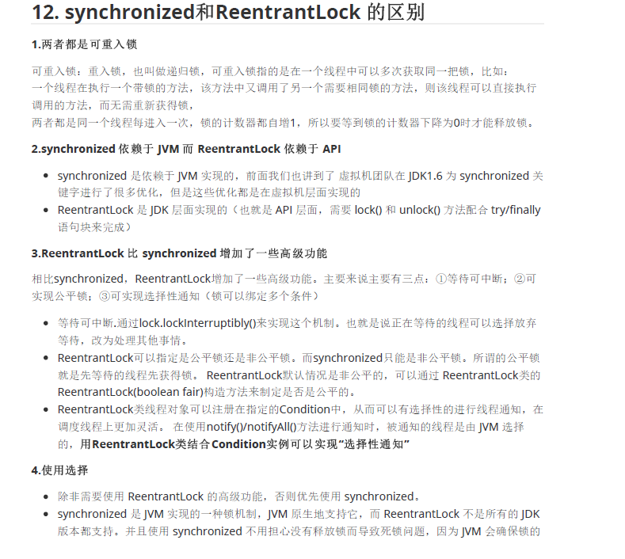

## 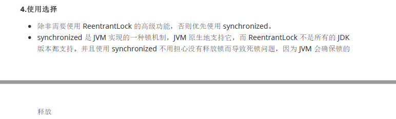值传递和引用传递

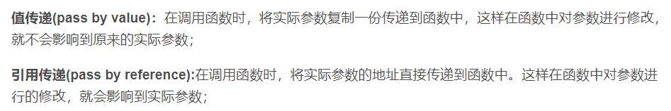

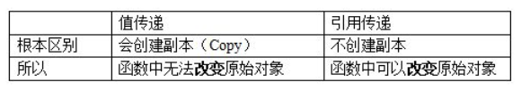

---


## map、线程安全、装填因子、默认值

## 五大原则：

- - **单一职责**SRP(Single Responsibility Principle)：一个类的功能要单一。

  - **开放封闭原则**OCP(Open－Close      Principle)：一个模块，在拓展性方面应该是开放的，在更改性方面应该是封闭的。

  - - 一个网络模块，原来只有服务端功能，现在要加入客户端，则应该在不用修改服务端功能代码前提下，就能够增加客户端功能的实现代码。这要求在设计之初，就应当将服服务端和客户端分开，公共部分抽象出来。

  - **替换原则**LSP(the Liskov Substitution Principle) ：子类应当可以替换父类，并出现在父类能够出现的任何地方。

  - - 公司年会，所有员工可抽奖。不管新老员工、总部/外派员工，均应当可以参加抽奖，否则公司不和谐。

  - **依赖倒置原则**DIP(the Dependency Inversion Principle):具体依赖抽象、上层依赖下层。

  - - 编译A模块时需要直接包含B模块的cpp文件。

  - **接口分离原则**ISP(the Interface Segregation Principle)：模块间应通过抽象接口隔离开，而不是通过具体类强耦合。

# java多线程并发


## 运行时常量池

存放常量池表，

## 直接内存

也称为堆外内存，把内存对象分配在JVM堆外的内存区域。这部分内存不是虚拟机管理，而是由操作系统管理。java通过DirectByteBuffer对其进行操作，避免了在java堆和native堆来回切换数据。

## 2、as-if-serial

编译器等会对原始的程序进行指令重排和优化。但不管怎么重排序，其结果和用户原始程序输出预定结果一致。

## 3、happens-before八大原则	

1. 程序次序原则：一个线程内，写在前面的操作	先行发生于	后面的。
2. 锁定原则：unlock操作	先行发生于	后面对同一个锁的lock操作。
3. volatile原则：对volatile变量的写操作	先行发生于	后面的读操作。
4. 线程启动原则：线程的start方法	先行发生于	线程的每个操作。
5. 线程中断规则：对线程的interrupt()方法的调用	先行发生于	被中断线程的代码检测到中断事件的发生。
6. 线程终止规则：线程所有操作	先行发生于	对线程的终止检测。
7. 对象终结规则：对象的初始化	先行发生于	finalize方法。
8. 传递性规则：若操作A先行发生于操作B，操作B先行发生于操作C，那么操作A先行发生于操作C。

注：as-if-serial 保证单线程程序的执行结果不变，happens-before 保证正确同步的多线程程序的执行结果不变。

## 4、java线程实现方式

1. 实现Runnable接口
2. 继承Thread类
3. 实现Callable接口

## 5、java线程状态

1. new新建状态：线程被创建且未启动，此时未调用start方法。
2. Runnable运行状态：线程正在JVM中执行，但这个执行不一定真的在跑，也可能在排队等CPU。
3. Blocked阻塞状态：线程等待获取锁，锁还没获得。
4. Waiting等待状态：线程内Run方法，运行完语句Object.wait()或Thread.join()后，进入该状态。
5. Timing_Waiting限期等待：在一定时间之后跳出状态。调用Thread.sleep(long) Object.wait(long) Thread.join(long) 进入状态。其中这些参数代表等待的时间。
6. Terminated：结束状态。线程调用完run方法，进入该状态。

## 6、线程通信方式

- Volatile关键字修饰变量，保证所有线程对变量访问的可见性。
- - 可见性：保证变量对所有线程的可见性。volatile, synchronized, final关键字都能保证可见性。
    - 当一条线程修改了共享变量值，新值对于其他线程来说是立即可以得知修改的。所有被volatile修饰的变量一旦被更改必须立即同步到主存；每次使用变量之前都要重新读取主存的值。
  - 有序性：虽然多线程存在并发和指令优化等操作，在本线程内观察该线程的所有执行操作是有序的。
    - 禁止指令重排优化。使用 volatile 变量进行写操作，汇编指令带有 lock 前缀，相当于一个内存屏障，编译器不会将后面的指令重排到内存屏障之前。、
    - 虽然多线程存在并发和指令优化等操作，在本线程内观察该线程的所有执行操作是有序的。
- Wait/notify=等待通知机制：线程调用object类的wait方法后，进入等待队列，直到被通知/被唤醒。wait方法释放锁，notify方法不释放锁。
- Join：当前线程阻塞等待被调用join方法的线程执行完毕，后继续执行。可保证线程执行顺序，基于等待通知机制。
- threadlocal：是线程共享变量。一个线程内部，将当前线程和map绑定，在当前线程内可以任意存取数据，减少方法调用间参数传递。

  - ThreadLocal 是线程共享变量。ThreadLoacl 有一个静态内部类 ThreadLocalMap，其 Key 是 ThreadLocal 对象，值是 Entry 对象，ThreadLocalMap是每个线程私有的。
  - set 给ThreadLocalMap设置值。get 获取ThreadLocalMap。remove 删除ThreadLocalMap类型的对象。
  - 存在的问题：
    1. 对于线程池，由于线程池会重用 Thread 对象，因此与 Thread 绑定的 ThreadLocal 也会被重用，造成一系列问题。
    2. 内存泄漏。由于 ThreadLocal 是弱引用，但 Entry 的 value 是强引用，因此当 ThreadLocal 被垃圾回收后，value 依旧不会被释放，产生内存泄漏。
- synchronized关键字。确保多个线程在同一时刻只能有一个处于方法或同步块中。
- IO 通信

## 线程状态


## sleep、wait

sleep未释放锁，执行后线程自动苏醒；wait释放了锁，需要别线程调用同一个对象的notify唤醒。

## 线程安全的实现

1. 加锁：synchronized或者ReentrantLock
2. volatile修饰变量
3. 原子类 
4. 线程安全的容器
5. ThreadLocal

## 等待、阻塞区别

- 等待：A线程等待 B线程通知调度器 一个条件时，A线程进入等待状态。调用：Object.wait()、Thread.join()以及等待Lock或Condition。
- 阻塞：当A线程试图获取一个内部的对象锁，而该锁被B线程持有时，A线程进入阻塞状态。

## 7、简述线程池。

没有线程池的情况下，多次创建、销毁线程，开销比较大。若在开辟的线程执行完当前任务后，继续执行接下来的任务，复用已创建的线程，可以降低开销、控制最大并发数。

线程池创建线程时，会将线程封装成工作线程Worker，Worker在执行完任务后会循环获取工作队列中的任务来执行。

将任务派发给线程池时，会出现以下几种情况：(依次条件范围缩小)

1. 核心线程池未满：创建一个新的线程执行任务。
2. 工作队列未满：将线程存储在工作队列；
3. 线程数<最大线程数，就创建一个新线程处理任务。
4. 按照拒绝策略来处理任务。

## 8、线程池参数

1. corePoolSize：常驻核心线程数。超过该值后如果线程空闲会被销毁。
2. maximumPoolSize：线程池能够容纳同时执行的线程最大数。
3. keepAliveTime：线程空闲时间，线程空闲时间达到该值后会被销毁，直到只剩下 corePoolSize 个线程为止，避免浪费内存资源。
4. workQueue：工作队列。
5. threadFactory：线程工厂，用来生产一组相同任务的线程。
6. handler：拒绝策略。有以下几种拒绝策略：
   1. AbortPolicy：丢弃任务并抛出异常
   2. CallerRunsPolicy：重新尝试提交该任务
   3. DiscardOldestPolicy 抛弃队列里等待最久的任务并把当前任务加入队列
   4. DiscardPolicy 表示直接抛弃当前任务但不抛出异常。

## 9、线程池创建方法

1. newFixedThreadPool，创建固定大小的线程池。
2. newSingleThreadExecutor，使用单线程线程池。
3. newCachedThreadPool，maximumPoolSize 设置为 Integer 最大值，工作完成后会回收工作线程
4. newScheduledThreadPool：支持定期及周期性任务执行，不回收工作线程。
5. newWorkStealingPool：一个拥有多个任务队列的线程池。

## 10、java并发包下unsafe类的理解

对于 Java 语言，没有直接的指针组件，一般也不能使用偏移量对某块内存进行操作。这些操作相对来讲是安全（safe）的。

Java 有个类叫 `Unsafe` 类，这个类使 Java 拥有了像 C 语言的指针一样操作内存空间的能力，同时也带来了指针的问题。这个类可以说是 Java 并发开发的基础。

## 11、java中乐观锁、CAS算法

对于乐观锁，开发者认为数据发送时，发生冲突的概率并不大，所以读操作前不上锁。到了写操作时才会进行 判断数据在此期间是否被其他线程修改。若发生修改，则返回写入失败；若未被修改，则执行修改操作，返回修改成功。

乐观锁一般采用CAS（Compare And Swap）算法进行实现。

1. 该算法认为不同线程对变量进行操作时，产生竞争的情况较少。
2. 算法在于：对当前读取变量值E 和 内存中变量旧值V进行比较。
3. 若相等，代表其他线程未对该变量进行修改，则将该变量值更新为新值N。
4. 若不等，则认为在读取值E 到 比较阶段，有其他线程对变量进行过修改，不进行任何操作。

### ABA问题、解决方法

CAS算法是基于值做比较的。若当前有两线程，一个线程将变量值A改为B，再由B改为A。当线程开始执行CAS算法时，则很容易认为值没有变化，误认为读取数据到执行CAS算法的期间，没有线程修改过数据。

JUC包提供了一个AtomicStampedReference，即在原始版本下加入时间戳，解决ABA问题。

## 12、常见Atomic类

https://mp.weixin.qq.com/s/ilaLRnYvHVe_LH5yImhEcQ

在很多时候，我们需要的仅仅是一个简单的、高效的、线程安全的++或者--方案，使用synchronized关键字和lock固然可以实现，但代价比较大，此时用原子类更加方便。基本数据类型的原子类有：

- AtomicInteger 原子更新整形
- AtomicLong 原子更新长整型
- AtomicBoolean 原子更新布尔类型

Atomic数组类型有：

- AtomicIntegerArray 原子更新整形数组里的元素
- AtomicLongArray 原子更新长整型数组里的元素
- AtomicReferenceArray 原子更新引用类型数组里的元素。

Atomic引用类型有

- AtomicReference 原子更新引用类型
- AtomicMarkableReference 原子更新带有标记位的引用类型，可以绑定一个 boolean 标记
- AtomicStampedReference 原子更新带有版本号的引用类型

FieldUpdater类型：

- AtomicIntegerFieldUpdater 原子更新整形字段的更新器
- AtomicLongFieldUpdater 原子更新长整形字段的更新器
- AtomicReferenceFieldUpdater 原子更新引用类型字段的更新器

## 13、Atomic类基本实现原理

以AtomicIntger 为例。方法getAndIncrement：以原子方式将当前的值加1，具体实现为：

1. 在 for 死循环中取得 AtomicInteger 里存储的数值
2. 对 AtomicInteger 当前的值加 1
3. 调用 compareAndSet 方法进行原子更新
4. 先检查当前数值是否等于 expect
5. 如果等于则说明当前值没有被其他线程修改，则将值更新为 next，
6. 如果不是，会更新失败返回 false，程序会进入 for 循环重新进行 compareAndSet 操作。

## 14、简述CountDownLatch

该类使一个线程等待其他线程各自执行完毕后再执行。通过一个计数器实现，计数器初始值是线程的数量。每当一个线程执行完毕后，调用CountDown方法，计数器的值就-1，当计数器的值为0时，表示所有线程执行完毕。之前在等待的线程就可以恢复执行了，只能一次性使用，不能reset。

CyclicBarrier与CountDownLatch类似，也是通过计数器，使一个线程等待其他线程各自执行完毕后再执行。但其可以重复使用reset。

## 15、信号量Semaphore、Exchanger 类

Semaphore 的构造方法参数接收一个 int 值，设置一个计数器，表示可用的许可数量，即最大并发数。使用 acquire 方法获得一个许可证，计数器减一，使用 release 方法归还许可，计数器加一。如果此时计数器值为0，线程进入休眠。

Exchanger 类可用于两个线程之间交换信息。可简单地将 Exchanger 对象理解为一个包含两个格子的容器，通过 exchanger 方法可以向两个格子中填充信息。线程通过 exchange 方法交换数据，第一个线程执行 exchange 方法后会阻塞等待第二个线程执行该方法。当两个线程都到达同步点时这两个线程就可以交换数据。当两个格子均被填充时，该对象会自动将两个格子的信息交换，然后返回给线程，从而实现两个线程的信息交换。

# JVM

## 跨平台语言，一次编译到处运行，怎么理解？

Java源代码会被编译为class文件，class文件是运行在JVM之上的。当我们日常开发安装JDK的时候，可以发现JDK是分「不同的操作系统」，JDK里是包含JVM的，所以Java依赖着JVM实现了『跨平台』。所以一次编译，到处运行。

## 1、java内存模型（JVM）

java内存模型定义了程序中各种变量的访问规则。

- 规定所有变量都存储在主内存，线程均有自己的工作内存。
- 工作内存中保存被该线程使用的变量的主内存副本，线程对变量的所有操作都必须在工作空间进行，不能直接读写主内存数据。
- 操作完成后，线程的工作内存通过缓存一致性协议将操作完的数据刷回主存。
- 堆是共享内存，可被所有线程访问。虚拟机启动的时候创建堆，操作系统对进程初始化的时候分配堆。堆存放对象实例、数组。
- 栈是线程独有，保存运行状态和局部变量。线程开始的时候初始化。每个线程栈互相独立，栈线程安全。

线程私有的运行时数据区有：程序计数器、虚拟机栈、本地方法栈。

> 程序计数器：记录正在执行的虚拟机字节码指令的地址，如果正在执行的是本地方法，则为空。不会产生栈溢出和缓存溢出。
>
> 虚拟机栈：是由方法栈组成，栈中元素用于支持虚拟机进行方法调用，每个方法在执行时都会创建一个栈帧，栈帧里面存储基本数据类型和指向对象的引用，比如方法的局部变量、操作栈、动态链接、返回地址等信息。每个栈帧的入栈和出栈对应着java方法的调用和结束的过程。我们可以通过-xss来指定每个线程java虚拟机栈内存的大小。
>
> 本地方法栈，和虚拟机栈类似，只是本地方法栈是为本地方法服务的。

线程共享的区域：堆和方法区

> 堆：主要用来存放对象实例，是垃圾收集的主要区域，是内存管理中最大的一块。我们可以通过.xms ，-xmx设置的堆的初始大小和堆的最大内存。堆可以分为新生代和老生代，比例为1:2。新生代可以分为eden、from、to区，默认比例为8:1：1，该比例可以修改。一般对象都是分配在eden区，但有些大对象也可以直接进入老年代。一次垃圾回收后，存活的对象年龄会+1，若年龄达到一定的值(默认是15，也可通过-XX:MaxTenuringThreshold 设置)，对象就会晋升到老年代。
>
> 方法区：主要存放已被虚拟机加载的类信息、常量、静态变量、即时编译器编译后的代码等数据。JDK6之前使用永久代实现方法区，容易内存溢出。JDK7把放在永久代的字符串常量池、静态变量等移出。JDK8抛弃永久代，改用 在本地内存中实现的元空间来实现方法区，把JDK7中永久代内容移到元空间。

## Java 对象实例、数组元素都是在堆上分配内存的吗？

​		在 Java 虚拟机中，对象一般是在 Java 堆中分配内存的。但是，存在一种特殊情况，如果经过<u>**逃逸分析后**</u>，发现对象并<u>**没有逃逸出方法的话**</u>，那么就可能<u>**被优化成栈上分配**</u>。这样就无需在堆上分配内存，也无须进行垃圾回收了。

## 内存分配策略

- 对象优先在 Eden 区分配。大多数情况下，对象都是在新生代 Eden区上分配的，当 Eden区空间不够时，会发起 Minor GC。
- 大对象直接进入老年代。大对象是那些需要连续内存空间的对象，我们可以通过-XX:PretenureSizeThreshold设置大小，让大于这个值的对象直接在老年代分配。
- 长期存活的对象进入老年代。它是为对象定义年龄计数器，每并经过一次 Minor GC 依然存活，将移动到 Survivor 中，然后年龄增加 1 岁，默认是达到15的时候移动到老年代，我们也可以通过-XX:MaxTenuringThreshold来设置这个值。
- 动态对象年龄判定。并不是非要对象的年龄达到 MaxTenuringThreshold 才能晋升到老年代，如果在 Survivor 区中某个年龄所有对象大小的总和大于 Survivor 空间的一半，年龄大于等于这个值的对象都可以直接进入老年代。
- 空间分配担保。在 Minor GC 之前，虚拟机会先检查老年代的最大可用连续空间是否大于新生代所有对象的总空间，如果大于就进行Minor GC。如果不大于的话虚拟机会查看HandlePromotionFailure 的值是否允许担保失败，如果允许那么就会继续检查老年代的最大可用连续空间是否大于以前晋升到老年代对象的平均大小，如果大于，会尝试进行一次 Minor GC；如果小于，或者不允许分配担保，就会进行一次 Full GC。

#### Minor GC/Full GC 的触发条件

对于Minor GC,当 Eden 空间满时，就会触发一次 Minor GC。
而 Full GC 的话，

- 如果调用 System.gc()的话会建议虚拟机执行 Full GC，但是虚拟机不一定真正去执行。一般是不建议使用这种方式的，让虚拟机管理内存比较好。
- 然后是老年代空间不足，比如大对象直接进入老年代、长期存活的对象进入老年代就可能导致老年代内存空间不够，这个时候会进行一次full gc
- 还有就是空间分配担保的时候。在 Minor GC 之前，虚拟机会先检查老年代的最大可用连续空间是否大于新生代所有对象的总空间，如果大于就进行Minor GC。如果不大于的话虚拟机会查看HandlePromotionFailure 的值是否允许担保失败，如果允许那么就会继续检查老年代的最大可用连续空间是否大于以前晋升到老年代对象的平均大小，如果大于，会尝试进行一次 Minor GC；如果小于，或者不允许分配担保，就会进行一次 Full GC。
- 另外的话在CMS GC 的过程中浮动垃圾过多可能会报 Concurrent Mode Failure 错误，会进行 Full GC。

---

## 2、GC垃圾回收算法

java自动内存管理主要针对堆内存中，对象内存的回收和分配。

​        **标记清除。**分为标记和清除两个阶段。首先标记出所有不需要回收的对象，标记完成后统一回收掉没有被标记的对象。但该标记清除过程效率并不高，会产生大量不连续内存碎片，导致无法给大对象分配内存。

​        **复制算法**。将内存等分为两部分，每次使用其中的一块，当这块内存使用完后，将仍然存活的对象复制到另一块内存中，然后再把当前使用的空间一次性清理掉。它存在的问题是只使用了内存的一半。

​        **标记整理。**主要是老年代使用的算法。先标记不需要回收的对象，然后将它们放在一起再回收垃圾，这样就不存在内存碎片的问题了。

## 2.1 如何判断一个对象是否是垃圾

​        **引用计数法**。给对象添加一个计数器，每当有对象引用它，计数器就+1，引用失效时计数器-1，当引用计数器值为0时，对象即为可被回收的对象。但是无法解决循环引用的问题。

​        **可达性分析。**以GC Root为起点进行搜索，可达的对象都是存活的，不可达的对象可被回收。

## 2.2 常见的垃圾回收器

**串行垃圾回收器：**为单线程环境设计，且只使用一个线程进行垃圾回收，会暂停所有的用户线程。所以不适合服务器环境。

**并行垃圾回收器。**多个垃圾回收线程并行工作，此时用户线程是暂停的，适用于科学计算 | 大数据处理等弱交互场景。

**Parallel Scavenge 收集器：**其目标是达到一个可控制的吞吐量。吞吐量是指CPU用于运行用户程序的时间占总时间的比值。高吞吐量可以高效地利用CPU时间，尽快完成程序的运算任务。适合那种在后台运算，不需要太多交互的任务。

**CMS**：用户线程和垃圾收集线程同时执行(不一定是并行，有可能是交替执行)，不需要完全停顿用户线程。适用于对响应时间有要求的场景。

**GI垃圾回收器：**将堆内存分割成不同区域，并发的对其进行垃圾回收。

## CMS垃圾收集器

如果用Serial和Parallel系列的垃圾收集器，在垃圾回收的时候，用户线程都会完全停止，直至垃圾回收结束。CMS垃圾收集器就是为了减少STOP THE WORLD用户停顿时间的。CMS的全称是Concurrent Mark Sweep，也就是「并发标记清除」。

CMS垃圾回收阶段可以简单分为5个步骤：初始标记、并发标记、并发预处理、重新标记以及并发清除。

- 「初始标记」会标记GCRoots「直接关联」的对象以及「年轻代」指向「老年代」的对象。因为CMS是老年代垃圾收集器，但可能有新生代的对象指向老年代，所以新生代也需要扫描。另外，因为标记的只是和GCRoots「直接关联」的对象，用的时间很少，初始标记是会停顿用户线程的。
- 「并发标记」这个过程是不会停止用户线程的。这一阶段主要是从GC Roots向下「追溯」，标记所有可达的对象。
- 「并发预处理」主要是为了减少下一个阶段「重新标记」所消耗的时间。因为「重新标记」是需要Stop The World的。「并发标记」这个阶段由于用户线程是没有停顿的，所以对象引用情况是有可能发生变化的。比如有些对象可能从新生代晋升到了老年代，也可能有些对象，直接分配到了老年代（像大对象）。
  然后针对老年代的对象，借助了一个card table，也就是卡表，老年代对象发生变化所对应的卡页会被标记标记为脏页。
  对于新生代的对象，我们还是得遍历新生代来看看在「并发标记」过程中有没有对象引用了老年代。有可能在这个过程中会触发一次 minor GC导致新生代对象减少从而只用遍历更少的对象。

- 「重新标记阶段」会暂停用户线程，扫描老年代和新生代，找出存活的老年代对象。
- 「并发清除」阶段，一边用户线程在执行，一边GC线程在回收不可达的对象。这个过程，还是有可能用户线程在不断产生垃圾，但只能留到下一次GC 进行处理了，产生的这些垃圾被叫做“浮动垃圾”。

但是CMS具有一些缺点:

- 首先是空间需要预留。CMS垃圾收集器可以一边回收垃圾，一边处理用户线程，那需要在这个过程中保证有充足的内存空间给用户线程使用。如果CMS运行过程中预留的空间不够用了，会报错（Concurrent Mode Failure），这时会启动 Serial Old垃圾收集器进行老年代的垃圾回收，会导致停顿的时间很长。
- 另外，CMS采用的是标记清除的算法，所以会存在内存碎片的问题。

## G1垃圾收集器

G1 垃圾收集器，是，你设定一个你希望的用户线程停顿时间，G1会根据这个时间进行垃圾收集。对于G1垃圾收集器来说，堆的划分不再是「物理」形式，而是以「逻辑」的形式进行划分。但是新生代老年代这种「分代」概念还是存在的。比如说：新对象一般会分配到Eden区、经过默认15次的Minor GC，新生代的对象如果还存活，会移交到老年代这些都有。
然后G1把堆划分成了多个大小相等的区域，叫做Region，默认是2048个。这些区域除了新生区、老年区，未使用区，还有一个大对象区域，用来存储大于Region内存大小的一半的对象。一旦发现没有引用指向大对象，就可直接在年轻代的Minor GC中被回收掉。

G1的垃圾收集过程如下：
首先是**初始标记**，它只标记GC ROOT直接关联的对象，是会暂停用户停顿时间的，但是用的时间很少。然后是**并发标记**，这个过程是不会停止用户线程的。这一阶段主要是从GC Roots向下「追溯」，标记所有可达的对象。然后是「**重新标记**」阶段，标记那些在「并发标记」阶段发生变化的对象。最后**筛选回收**，会根据「停顿预测模型」，选定所有的年轻代区域，部分「回收价值高」的老年代区域进行垃圾回收。

G1优点；
G1收集器不会产生内存碎片，可以精确控制停顿时间，每次根据允许停顿的时间去筛选回收垃圾最多的区域。

---

## 双亲委派机制

jdk中的本地方法类一般是由BootStrap类加载器进行加载，jdk中内部实现的扩展类一般由扩展加载器进行加载，程序中的类文件由系统类加载器AppClassLoader进行加载。一个类加载器首先会将类加载请求转发到父类加载器，只有当父类加载器无法完成加载时才尝试自己加载。这样能让基础类得到统一。

## 类加载过程

类加载主要分为**加载、连接、初始化**三个阶段。

总体来说，**加载**这个过程就是先查找并加载类的二进制数据，在堆中创建一个class类的对象，将类相关的信息存储在方法区中。
首先加载的时候为了节约内存空间，不会一次性把所有的类都加载到jvm，而是等到有需要的时候(例如new和反射的时候)才进行加载。class文件是通过类加载器装载到jvm中的，为了防止内存中出现多份同样的字节码文件，使用了双亲委派机制(一个类加载器首先将类加载请求转发到父类加载器，只有当父类加载器无法完成时才尝试自己加载)。jdk中的本地方法类一般是由BootStrap类加载器进行加载，jdk中内部实现的扩展类一般由扩展加载器进行加载，程序中的类文件由系统类加载器AppClassLoader进行加载。

**连接**可以细分为验证、准备、解析三个阶段。
验证：验证类是否符合Java规范和Jvm规范；准备：为类的静态变量分配内存，初始化为系统的初始值；解析：将符号引用转化为直接引用的过程。总结：通过连接这一阶段，对class信息做校验并分配了内存空间和默认值了。

**初始化**：这个阶段主要是为类的静态变量赋值。过程大概是收集class的静态变量、静态方法、静态代码块到\<clinit\>()方法，随后从上往下开始执行。

## 对象创建过程

jvm碰到一条new指令时，会先检查在常量池中能不能定位到这个类的符号引⽤，并且检查这个符号引⽤代表的类是否已被加载过、解析和初始化过。如果没有，先执行**类的加载**过程。

然后就是**分配内存**。
分配方式有指针碰撞和空闲列表两种方式，他们主要是看堆是否有内存碎片决定的。像如果采用的是标记清除这种垃圾回收算法就会有内存碎片嘛。所以就需要一个空闲列表来记录哪些内存是可用的。如果没有内存碎片，那就只需要使用一个指针来记录空闲区域和已使用区域的分界点。比如左边是已使用的，右边是未使用的，那分配内存以后只需要把指针往右移就可以了。
另外，分配内存还存在线程安全问题。jvm采用了TLAB和CAS失败重试两种方式。TLAB是**：** 为每⼀个线程预先在 Eden 区分配⼀块⼉内存，JVM 在给线程中的对象分配内存时，会⾸先在 TLAB 分配，当对象⼤于 TLAB 中的剩余内存或 TLAB 的内存已⽤尽时，再采⽤ CAS 进⾏内存分配。

内存分配完后，就会将分配的内存空间都**初始化**为0值。然后设置对象头里的信息，像哈希码，对象GC分代年龄信息这些。最后执行init方法，会把变量设置为我们程序员所设的值。

# 计网

## 1. 七层模型

应用层、表示层、会话层、传输层、网络层、数据链路层、物理层。

1. 应用层 ：提供应用层协议，如**HTTP、FTP**协议 ，方便应用程序之间进行通信。
2. 表示层：对数据格式进行编译，对收到或发出的数据根据应用层的特征进行处理，如处理为文字、图片、音频、视频、文档等，还可以对压缩文件进行解压缩、对加密文件进行解密等。    
3. 会话层：1）建立会话：身份验证，权限鉴定等；2) 保持会话：对该会话进行维护，在会话维持期间两者可以随时使用这条会话传输局；3) 断开会话：当应用程序或应用层规定的超时时间到期后，OSI会话层才会释放这条会话。  
4. 传输层：提供了进程间的逻辑通信，传输层向高层用户屏蔽了下面网络层的核心细节，使应用程序看起来像是在两个传输层实体之间有一条端到端的逻辑通信信道。  TCP、UDP。
5. 网络层：将网络地址翻译成对应的物理地址，并决定如何将数据从发送方路由发送到接收方，通过路由选择算法为分组通过通信子网选择最佳路径。**路由器**工作在这一层。 IP协议。
6. 数据链路层： 在不可靠的物理介质上提供可靠的传输，接收来自物理层的位流形式的数据，并封装成帧，传送到上一层；同样，也将来自上层的数据帧，拆装为位流形式的数据转发到物理层。这一层在物理层提供的比特流的基础上，通过差错控制、流量控制方法，使有差错的物理线路变为无差错的数据链路。提供物理地址寻址功能。**交换机**工作在这一层。
7. 物理层：主要解决两台物理机之间的通信，通过二进制比特流的传输来实现，二进制数据表现为电流电压上的强弱，到达目的地再转化为二进制机器码。**网卡、集线器**工作在这一层。  
8. 物理层 

---

## 2. TCP三次握手

TCP报文段中维护了序列号和确认序列号，可得知字节发出的数据哪些是被对方确认接收的。


1. 发送方：发送同步报文SYN=1、随机数seq=x作为序列号。由关闭状态(closed)主动打开，进入同步已发送(SNY_SENT)状态。
2. 接收方：接收。发送同步确认报文(SYN=1,ACK=1)、确认号(ack=x+1)、序列号(seq=y)。由收听状态(LISTEN) 被动变为同步已收到( SYN_RECV)状态。
3. 发送方：接收。发送同步确认报文(ACK=1)、确认号(ack=y+1)、新序列号(seq=x+1)。由同步已发送(SNY_SENT)状态变为建立连接(ESTABLISHED)状态。
4. 接收方：接收，由同步已收到( SYN_RECV)状态变为建立连接(ESTABLISHED)状态。双方均建立连接，可以进行数据传输。

## 2.1 半连接队列

TCP握手中，当服务器处于SYN_RCVD 状态，服务器会把此种状态下请求连接放在一个队列里，该队列称为半连接队列。

## 2.2 SYN攻击

SYN攻击即利用TCP协议缺陷，通过发送大量的半连接请求，占用半连接队列，耗费CPU和内存资源。
优化方式：

1. 缩短SYN Timeout时间
2. 记录IP，若连续受到某个IP的重复SYN报文，从这个IP地址来的包会被一概丢弃。  

---

## 3. TCP四次挥手


1. 发送方：主动关闭。发送连接释放报文(FIN=1)、序列号(seq=m) 
2. 接收方：接收。发送确认号(ack=m+1)、序列号(seq=n)、确认报文(ACK=1)。
3. 发送方：接收。
4. 接收方：发送连接释放报文(FIN=1)、序列号(seq=p) 、确认号(ack=m+1)、确认报文(ACK=1)。
5. 发送方：接收。发送确认号(ack=p+1)、序列号(seq=m+1)、确认报文(ACK=1)。
6. 接收方：接收。断开连接。

**理解：**发送方按照自己这边发送次数，序列号(seq) 逐次+1。
接收方按照接收方的序列号，每次发送的序列号不同。
发送/接收方，返回响应信息时的确认号，是提取最近一次 接收信息中的序列号 ，并+1，进行返回确认。

> CLOSED：初始状态。
>
> LISTEN：表示服务端的某个SOCKET处于监听状态，可以接收连接了。
>
> SYN_RCVD：表示服务端收到了SYN报文。正常情况下，该状态是服务端的OSCKET在建立TCP连接时的一个中间状态，很短暂。当收到客户端的ACK报文后，进入ESTABLISHED状态。

## 3.1 TCP挥手为何4次？

主要原因是当服务端收到客户端的 FIN 数据包后，服务端可能还有数据没发完，不会立即close。
所以服务端会先将 ACK 发过去告诉客户端我收到你的断开请求了，但请再给我一点时间，这段时间用来发送剩下的数据报文，发完之后再将 FIN 包发给客户端表示现在可以断了。之后客户端需要收到 FIN包后发送 ACK 确认断开信息给服务端。

## 3.2 为什么四次挥手释放连接时需要等待2MSL

MSL即报文最大生存时间。设置2MSL可以保证上一次连接的报文已经在网络中消失，不会出现与新TCP连接报文冲突的情况。  

## 3.3 TCP关闭FIN时，对方一直没有回该怎么办

超时重传一定次数，重置连接，进入CLOSED状态

---

## 4. TCP、UDP、IP、HTTP区别

**TCP**：面向连接；可靠传输；点对点；流量控制/拥塞控制；消息有序；传输速度慢；一对一；面向字节流；头部最小20字节，最大60字节；适用于文件可靠传输，HTTP/HTTPS

**UDP：**无连接；不可靠；点对点、多播、广播；数据包无序；传输快；多对多通信；面向报文；首部仅8字节，开销小；适用于实时通信，IP电话、视频会议、直播、广播等。

## 如何保证TCP的可靠性？

三次握手、四次挥手；
超时重传、滑动窗口、拥塞控制；
每份报文存在校验和、序列号/确认应答；

## TCP滑动窗口

滑动窗口是传输层进行流量控制的一种措施，接收方通过通告发送方自己的窗口大小，从而控制发送方的发送速度，防止发送方发送速度过快而导致自己被淹没。  

## TCP拥塞控制

拥塞是指一个或者多个交换点的数据报超载，TCP又会有重传机制，导致过载。
为了防止拥塞窗口cwnd增长过大引起网络拥塞，还需要设置一个慢开始门限ssthresh状态变量.
当cwnd < ssthresh 时，使用慢开始算法。
当cwnd > ssthresh 时，停止使用慢开始算法而改用拥塞避免算法。
当cwnd = ssthresh 时，即可使用慢开始算法，也可使用拥塞避免算法。
慢开始：由小到大逐渐增加拥塞窗口的大小，每接一次报文，cwnd指数增加。
拥塞避免：cwnd缓慢地增大，即每经过一个往返时间RTT就把发送方的拥塞窗口cwnd加1。
快恢复之前的策略：发送方判断网络出现拥塞，就把ssthresh设置为出现拥塞时发送方窗口值的一半，继续执行慢开始，之后进行拥塞避免。  快恢复：发送方判断网络出现拥塞，就把ssthresh设置为出现拥塞时发送方窗口值的一半，并把cwnd设置为ssthresh的一半，之后进行拥塞避免。  

## 快重传

如果在超时重传定时器溢出之前，接收到连续的三个重复冗余ACK，发送端便知晓哪个报文段在传输过程中丢失了，于是重发该报文段，不需要等待超时重传定时器溢出再发送该报文。  

---

## 5. 浏览器输入一个网址后，具体发生了什么？

1、进行DNS解析操作，根据DNS解析地址，找到服务器IP地址。
2、通过IP寻址和ARP，找到服务器，并利用三次握手建立TCP连接。
3、浏览器生成HTTP报文，发送HTTP请求，等待服务器响应。
4、服务器处理请求，并返回给浏览器。
5、根据HTTP是否开启长连接，进行TCP挥手过程。
6、浏览器根据收到的静态资源进行页面渲染。

## DNS域名解析过程

1. 客户机提出域名解析请求，并将该请求发送给本地的域名服务器。
2. 当本地的域名服务器收到请求后,就先查询本地的缓存,如果有该纪录项,则本地的域名服务器就直接把查询的结果返回。
3. 如果本地的缓存中没有该纪录,则本地域名服务器就直接把请求发给根域名服务器。
4. 然后根域名服务器解析客户机请求的根域部分，再返回给本地客户机域名服务器一个所查询域(根的子域)的主域名服务器的地址。
5. 本地服务器再向上一步返回的域名服务器发送请求，然后接受请求的服务器查询自己的缓存,如果没有该纪录,则返回相关的下级的域名服务器的地址。
6. 第五个过程，重复第四步,直到找到正确的记录。递归查找，最后再有目标域名的服务器上面得到响应的IP信息。
7. 本地域名服务器把返回的结果保存到缓存,以备下一次使用,同时还将结果返回给客户机。
8. 客户机根据得到的IP信息访问目标主机，完成解析过程。

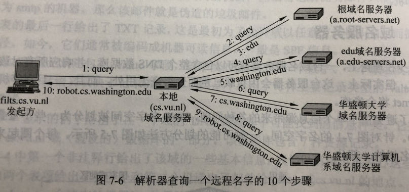

在系统的hosts文件里查找域名对应的IP地址，没有的话向本地DNS发送一个请求报文，本地服务器必须返回完整结果，称为递归查询。如果本地DNS服务器没有，则启动一次远程查询，请求根域名服务器，每次返回一部分域名，直到找到域名对应的IP地址并返回一个响应报文，这个机制称为迭代查询。
	1、查询报文和响应报文都作为UDP数据包发送，即DNS是基于UDP的。
	2、DNS所有的查询答案，包括所有的部分答案都会被缓存，缓存也是有过期时间的。

---

## 一次完整的HTTP请求过程？用到了哪些协议?

一次完整的HTTP请求过程：
1.首先进行域名解析，域名解析具体过程讲一下：浏览器搜索自己的DNS缓存，缓存中维护一张域名与IP地址的对应表；
若没有，则搜索操作系统的DNS缓存；
若没有，则操作系统将域名发送至本地域名服务器（递归查询方式），本地域名服务器查询自己的DNS缓存，查找成功则返回结果，否则，通过以下方式迭代查找：
本地域名服务器向根域名服务器发起请求，根域名服务器返回com域的顶级域名服务器的地址；
本地域名服务器向com域的顶级域名服务器发起请求，返回权限域名服务器地址；
本地域名服务器向权限域名服务器发起请求，得到IP地址；
本地域名服务器将得到的IP地址返回给操作系统，同时自己将IP地址缓存起来；
操作系统将IP地址返回给浏览器，同时自己也将IP地址缓存起来；
至此，浏览器已经得到了域名对应的IP地址。
2.浏览器发起HTTP请求；

3.接下来到了传输层，选择传输协议，TCP或者UDP，TCP是可靠的传输控制协议，对HTTP请求进行封装，加入了端口号等信息；

4.然后到了网络层，通过IP协议将IP地址封装为IP数据报；然后此时会用到ARP协议，主机发送信息时将包含目标IP地址的ARP请求广播到网络上的所有主机，并接收返回消息，以此确定目标的物理地址，找到目的MAC地址；

5.接下来到了数据链路层，把网络层交下来的IP数据报添加首部和尾部，封装为MAC帧，现在根据目的mac开始建立TCP连接，三次握手，接收端在收到物理层上交的比特流后，根据首尾的标记，识别帧的开始和结束，将中间的数据部分上交给网络层，然后层层向上传递到应用层；

6.服务器响应请求并请求客户端要的资源，传回给客户端；

7.断开TCP连接，浏览器对页面进行渲染呈现给客户端。

## HTTP协议

http协议是超文本传输协议。它是基于TCP协议的应用层传输协议，即客户端和服务端进行数据传输的
一种规则。该协议本身HTTP 是一种无状态的协议  

## HTTP状态码

1XX：接收的信息正在处理
2XX：请求正常处理完毕
3XX：重定向
4XX：客户端错误
5XX：服务端错误
常见错误码：
301：永久重定向
302：临时重定向
304：资源没修改，用之前缓存就行
400：客户端请求的报文有错误
403：表示服务器禁止访问资源
404：表示请求的资源在服务器上不存在或未找到  

## 转发和重定向的区别

转发是服务器行为。服务器直接向目标地址访问URL，将相应内容读取之后发给浏览器，用户浏览器地址栏URL不变，转发页面和转发到的页面可以共享request里面的数据。
重定向是利用服务器返回的状态码来实现的，如果服务器返回301或者302，浏览器收到新的消息后自动跳转到新的网址重新请求资源。用户的地址栏url会发生改变，而且不能共享数据。  

## HTTP1.0/1.1/2.0区别

HTTP1.0：规定了请求头和请求尾，响应头和响应尾（get post）；每一个请求都是一个单独的连接，做不到连接的复用。

HTTP1.1默认开启长连接，在一个TCP连接上可以传送多个HTTP请求和响应。使用 TCP 长连接的方式改善了 HTTP/1.0 短连接造成的性能开销；支持管道（pipeline）网络传输，只要第一个请求发出去了，不必等其回来，就可以发第二个请求出去，可以减少整体的响应时间；服务端无法主动push ；

HTTP2.0提出多路复用。多路复用前，文件是串行传输的，请求a文件，b文件只能等待，并且连接数过多。引入多路复用，a文件b文件可以同时传输；引入了二进制数据帧。其中帧对数据进行顺序标识，有了序列id，服务器就可以进行并行传输数据。

---

## http、https、TLS/SSL 区别 

http所有传输的内容都是明文，并且客户端和服务器端都无法验证对方的身份。

https具有安全性的ssl加密传输协议，加密采用对称加密，
https协议需要到ca申请证书，一般免费证书很少，需要交费 。

SSL全称为Secure Sockets Layer即安全套接层，其继任为TLSTransport Layer Security传输层安全协议，均用于在传输层为数据通讯提供安全支持。
可以将HTTPS协议简单理解为HTTP协议＋TLS/SSL  

## HTTPS加密过程

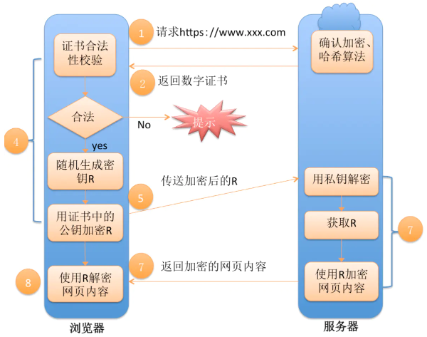

1、浏览器将支持的加密算法信息发给服务器
2、服务器选择一套浏览器支持的加密算法，以证书的形式回发给浏览器
3、客户端(SSL/TLS)解析证书验证证书合法性，生成对称加密的密钥，我们将该密钥称之为client
key，即客户端密钥，用服务器的公钥对客户端密钥进行非对称加密。
4、客户端会发起HTTPS中的第二个HTTP请求，将加密之后的客户端对称密钥发送给服务器
5、服务器接收到客户端发来的密文之后，会用自己的私钥对其进行非对称解密，解密之后的明文就是
客户端密钥，然后用客户端密钥对数据进行对称加密，这样数据就变成了密文 
6、服务器将加密后的密文发送给客户端
7、客户端收到服务器发送来的密文，用客户端密钥对其进行对称解密，得到服务器发送的数据。这样HTTPS中的第二个HTTP请求结束，整个HTTPS传输完成 。

---

## Get与Post区别

Get：向指定资源请求数据，刷新无害，Get请求的数据会附加到URL中，传输数据的大小受到url的限制。
一般HTTP协议里并不限制参数大小限制。但一般由于get请求是直接附加到地址栏里面的，由于浏览器地址栏有长度限制，因此使GET请求在浏览器实现层面上看会有长度限制。

Post：向指定资源提交要被处理的数据。刷新会使数据会被重复提交。post在发送数据前会先将请求头发送给服务器进行确认，然后才真正发送数据。  

# 操作系统

## 什么是操作系统

操作系统是管理计算机硬件和软件资源的计算机程序，提供一个计算机用户与计算机硬件系统之间的接口。向上对用户程序提供接口，向下接管硬件资源。操作系统本质上也是一个软件，作为最接近硬件的系统软件，负责处理器管理、存储器管理、设备管理、文件管理和提供用户接口。

## 操作系统分类

操作系统常规可分为批处理操作系统、分时操作系统、实时操作系统。
若一个操作系统兼顾批操作和分时的功能，则称该系统为通用操作系统。
常见的通用操作系统有：Windows、Linux、MacOS等  

---

## 内核态、用户态

为了避免操作系统和关键数据被用户程序破坏，将处理器的执行状态分为内核态和用户态。

**内核态**是操作系统管理程序执行时所处的状态，能够执行包含特权指令在内的一切指令，能够访问系统内所有的存储空间。
**用户态**是用户程序执行时处理器所处的状态，不能执行特权指令，只能访问用户地址空间。
用户程序运行在用户态,操作系统内核运行在内核态。  

## 如何实现内核态和用户态的切换？

处理器从用户态切换到内核态的方法有三种：系统调用、异常和外部中断。
1、系统调用是操作系统的最小功能单位，是操作系统提供的用户接口，系统调用本身是一种软中断。
2、异常，也叫做内中断，是由错误引起的，如文件损坏、缺页故障等。
3、外部中断，是通过两根信号线来通知处理器外设的状态变化，是硬中断。  

---

## 并发和并行的区别

1、并发（concurrency）：指宏观上看起来两个程序在同时运行，比如说在单核cpu上的多任务。但是从微观上看两个程序的指令是交织着运行的，指令之间交错执行，在单个周期内只运行了一个指令。这种并发并不能提高计算机的性能，只能提高效率（如降低某个进程的相应时间）。
2、并行（parallelism）：指严格物理意义上的同时运行，比如多核cpu，两个程序分别运行在两个核上，两者之间互不影响，单个周期内每个程序都运行了自己的指令，也就是运行了两条指令。这样说来并行的确提高了计算机的效率。所以现在的cpu都是往多核方面发展。  

---

## 进程、线程、协程

**进程**是操作系统资源分配的基本单位，拥有独立代码和数据空间。系统中的每个程序都运行在某个进程的上下文中。
上下文是由程序正确运行所需的状态组成的。这个状态包括存放在内存中的程序的代码和数据，它的栈、通用目的寄存器的内容、程序计数器、环境变量以及打开文件描述符的集合。
进程一般由以下部分组成：1、进程控制块，是进程存在的唯一标志，包含进程标识符PID，进程当前状态，程序和数据地址，进程优先级、CPUU现场保护区（用于进程切换），占有的资源清单等。2、程序段。3、数据段。
创建或撤销时系统为之分配/回收资源开销较大，如内存、IO设备等。

**线程**是处理器任务调度和执行的基本单位。没有资源，共享进程代码和数据空间。上下文切换较快。抢占式。一线程可有多协程。

**协程**：异步机制。是组织好的代码流程，不被操作系统管理，由程序控制。可保留上次调用状态。

进程线程区别：根本区别、资源开销、包含关系、内存分配、影响关系、执行过程。进程就是对CPU处理在一个时间段内工作状态的描述，而线程则是这段时间状态内每一条详细工作内容的描述，本质上进程和线程的区别就是对于CPU工作时间段描述的颗粒度不同。

## 进程的基本操作

以Unix系统举例：
1、**进程的创建**：fork()。新创建的子进程几乎但不完全与父进程相同。子进程得到与父进程用户级虚拟地址空间相同的(但是独立的)一份副本，包括代码和数据段、堆、共享库以及用户栈。子进程还获得与父进程任何打开文件描述符相同的副本，这就意味着当父进程调用 fork 时，子进程可以读写父进程中打开的任何文件。父进程和新创建的子进程之间最大的区别在于它们有不同的 PID。fork函数是有趣的（也常常令人迷惑）， 因为它只被调用一次，却会返回两次：一次是在调用进程（父进程）中，一次是在新创建的子进程中。在父进程中，fork 返回子进程的 PID。在子进程中，fork 返回 0。因为子进程的 PID 总是为非零，返回值就提供一个明 确的方法来分辨程序是在父进程还是在子进程中执行。

```c
pid_t fork(void);
```

2、**回收子进程**：当一个进程由于某种原因终止时，内核并不是立即把它从系统中清除。相反，进程被保持在一种已终止的状态中，直到被它的父进程回收（reaped）。当父进程回收已终止的子进程时，内核将子进程的退出状态传递给父进程，然后抛弃已终止的进程。一个进程可以通过调用waitpid 函数来等待它的子进程终止或者停止。

```c
pid_t waitpid(pid_t pid, int *statusp, int options);
```

3、**加载并运行**程序：execve 函数在当前进程的上下文中加载并运行一个新程序。

```c
int execve(const char *filename, const char *argv[], const char *envp[]);
```

4、**进程终止**：

```c
void exit(int status);  
```

## 进程间通信方法

每个进程各自有不同的用户地址空间，任何一个进程的全局变量在另一个进程中都看不到，所以进程之间要交换数据必须通过内核，在内核中开辟一块缓冲区，进程A把数据从用户空间拷到内核缓冲区，进程B再从内核缓冲区把数据读走，内核提供的这种机制称为进程间通信。 
不同进程间的通信本质：进程之间可以看到一份公共资源；而提供这份资源的形式或者提供者不同，造成了通信方式不同。
进程间通信主要包括管道、系统IPC（包括消息队列、信号量、信号、共享内存等）、以及套接字socket 。

​	https://blog.csdn.net/zhaohong_bo/article/details/89552188

## 进程如何通过管道进行通信  

**管道**是一种最基本的IPC机制，作用于有血缘关系的进程之间，完成数据传递。调用pipe系统函数即可创建一个管道。有如下特质：
1、其本质是一个伪文件(实为内核缓冲区)
2、由两个文件描述符引用，一个表示读端，一个表示写端。
3、规定数据从管道的写端流入管道，从读端流出。
管道的原理: 管道实为内核使用环形队列机制，借助内核缓冲区实现。
管道的局限性：
1、数据自己读不能自己写。
2、数据一旦被读走，便不在管道中存在，不可反复读取。
3、由于管道采用半双工通信方式。因此，数据只能在一个方向上流动。
4、只能在有公共祖先的进程间使用管道。  

1、**匿名管道（pipe）**：实质是一个内核缓冲区。半双工(只能一个方向流动)，只能在具有亲缘关系(父子进程、兄弟)的进程间，单向使用。可看成是一种特殊文件，可用read、write读写，不属于任何文件系统。父创建，子读取，实现通信。

2、**命名管道（ fifo）**：半双工，允许无亲缘关系进程通信。有一个名字对应磁盘索引节点，有了这个文件名，任何具有权限的进程都可访问。进程以先进先出的方式从缓冲区存取数据，缓冲区可看作循环队列，读写自动增加。当读空或写满时，一定规则来控制读写进程是否进入等待队列，当有数据写入/有数据读出时，唤醒队列中进程，继续读写。

3、**信号**：通知接收进程，某个事件已经发生。是进程间通信机制中唯⼀的异步通信机制，可以在任何时候发送信号给某⼀进程，⼀旦有信号产⽣，⽤户进程对信号的处理⽅式有执⾏默认操作，捕捉信号，忽略信号三种选择。

4、**信号量**：计数器，控制多个进程对共享资源的访问。实现互斥与同步，不存储进程间数据。作为锁机制，防止资源同时被多进程访问。也可以实现线程同步。
控制信号量有P操作和V操作两种原⼦操作：
P 操作会把信号量减去 1，相减后如果信号量 < 0，则表明资源已经被占⽤了，进程需阻塞等待；相减后如果信号量 >= 0，说明还有资源可以使⽤，进程可正常继续执⾏。
 V 操作会把信号量加 1，相加后如果信号量 <= 0，表示还有阻塞状态的进程，会将进程唤醒运⾏；相加后如果信号量 > 0，说明没有阻塞中的进程；P 操作是⽤在进⼊共享资源之前，V 操作是⽤在离开共享资源之后，这两个操作必须成对出出现。

5、**共享内存**：使得多个进程可以访问同一块内存空间，不同进程可以及时看到对方进程中对共享内存中数据得更新。该存储区可被多个进程映射到自身地址空间。A进程写入共享内存的信息可以被B C通过内存读取读出，实现进程间通信。**因为数据不需要在进程之间复制**，所以这是**最快的一种通信方式**。利用共享内存实现进程间同步、通信，需要依靠某种同步操作，如互斥锁和信号量等。
特点：
1）共享内存是最快的一种IPC，因为进程是直接对内存进行读写来实现通信，避免了数据在用户空间和内核空间来回拷贝，效率高，只需两次拷贝：输入文件到共享内存区，读到输出文件。
2）因为多个进程可以同时操作，所以需要进行同步处理。
3）信号量和共享内存通常结合在一起使用，信号量用来同步对共享内存的访问。 

6、**套接字**(Socket)：主要用于不同主机进程间通信。

7、**消息队列**：是一系列保存在内核中消息的链表。消息可看作一个记录，具有特定格式及优先级。对消息队列具有读/写权限的进程，可以：创建或打开消息队列，添加消息、读取消息、控制消息队列。

## 什么是信号

一个信号就是一条小消息，它通知进程系统中发生了一个某种类型的事件。 Linux 系统上支持的30 种不同类型的信号。 每种信号类型都对应于某种系统事件。低层的硬件异常是由内核异常处理程序处理的，正常情况下，对用户进程而言是不可见的。信号提供了一种机制，通知用户进程发生了这些异常。
1、发送信号：内核通过更新目的进程上下文中的某个状态，发送（递送）一个信号给目的进程。发送
信号可以有如下两种原因：
内核检测到一个系统事件，比如除零错误或者子进程终止。
—个进程调用了kill 函数， 显式地要求内核发送一个信号给目的进程。一个进程可以发送信号
给它自己。
\2. 接收信号：当目的进程被内核强迫以某种方式对信号的发送做出反应时，它就接收了信号。进程可
以忽略这个信号，终止或者通过执行一个称为信号处理程序(signal handler)的用户层函数捕获这个
信号。  

---

## 进程调度策略

1、**先来先服务**(first come first     serve)
作业调度：从后备作业中选择一个/多个最先进入队列的作业，调入内存，为其分配资源、创建进程、放入就绪队列
进程调度：从就绪队列选择最先入队的进程，为之分配处理机，使其投入运行，直到完成/请求IO阻塞，放弃处理机。
平均等待时间：各进程执行时间加/进程个数
2、**时间片轮转**(round robin)
以一个周期性间隔(时间片)产生时钟中断。中断发生时，当前进程置于就绪队列，基于先进先出选择下个（就绪）就绪作业运行。
3、多级反馈转法（round robin with multiple     feedback）
构建不通优先级的队列，优先权越高的队列，时间片越小。通过降级降队列，实现从上往下的多次反馈。
4、**优先级法**（静态优先级法/动态优先级法）：根据进程优先级调度
动态优先权：作业的优先级随等待时间增加以速率a提高。比率：R=(w+s)/s      （R为响应比，w为等待处理的时间，s为预计的服务时间）。在当前进程完成或被阻塞时，选择R值最大的就绪进程，它说明了进程的年龄。当偏向短作业时，长进程由于得不到服务，等待时间不断增加，从而增加比值，最终在竞争中胜了短进程。
短作业优先法（shortest job      first）：最优调度。根据作业执行时间长短来调度。
预测进程执行时间(Burst time)：批处理系统中长期调度，将用户提交进程时输入的执行时间上限作为依据；短期调度无法提前得知下个被CPU分配进程的执行时间长短，通过历史数据预测。
5、**最高响应比优先法**（highest response_ratio     next）

## 死锁条件

1、**资源互斥**：资源独占、排他使用；进程互斥使用资源，即任一时刻该资源只能给一个进程使用，其他进程若申请该资源时，申请者进行等待，直到资源被占有者释放。资源互斥是资源使用的固有特性，无法改变。
2、**不可剥夺**：进程占用的资源在未被使用完毕之前，不被其他进程强行剥夺，而只能由获得该资源的进程释放。一个进程不能获得所需要的全部资源时，便处于等待状态，等待期间它所占有的资源被隐式的释放，重新加入到系统的资源列表中，可被其他进程使用。而等待的线程只有获得自己原有的资源、以及新申请的资源，才可重新启动执行。
3、**请求与保持**：进程每次申请新资源时，继续占用已分配的资源。
静态分配：每进程在开始执行时就申请它所需的全部资源。
动态分配：进程在申请所需资源时，本身不占用系统资源。
4、**循环等待**：死锁时必然存在等待队列，形成进程等待环路。环路中每个进程所占用的资源同时被另一个资源申请。
资源有序分配：将系统中所有资源顺序编号，紧缺、稀少资源编号较大。在申请资源时，按编号顺序，进程只有获得较小编号资源才可申请较大编号资源。
5、**避免死锁**：动态策略--系统对进程发出的资源申请动态检查，若分配后可能发生死锁则不分配资源，否则予以分配。 若系统可保证所有进程在有限时间内得到需要的全部资源，则系统处于安全状态。
安全状态：一个进程尚需要的资源<=当前剩余资源量+所有进程当前占有资源量
不安全状态：不存在任何一个安全序列。
			


## 进程停止方式

System.exit(0)
Kill
异常关闭：RuntimException、OOM
强制关闭：kill halt 断电 系统关机 系统crash

## 什么时候用多线程

在编写程序时，遇到了阻塞过程而不想使整个程序停止响应时，应使用多线程；一个程序的合理线程数量取决于对实际阻塞的抽象程度。
**高并发：**系统接收多用户请求的高并发访问时。客户端和服务器是多对一，服务器创建多个线程处理来自不同客户端的TCP请求数据，否则会阻塞。
**线程后台处理大任务**：一个程序是线性执行的，若程序执行要花大量时间处理任务时，主程序就得等它执行完。可将其放在线程中后台处理，主程序继续执行，用户无需等待。线程执行完后执行回调函数。比如一旦需要等待用户输入，程序则会阻塞一段时间，这段时间内就无法处理其他请求了。
**大任务分块**：大任务处理耗时，多线程(分片上传等)加快处理。

## 如何结束一个线程

https://blog.csdn.net/xiaoai1994/article/details/110041270

为了保证业务需要，有些系统线程是常驻后台的，一般不会自己终止，需要手动来终止它们。

- **暴力停止**：stop方法可以很快速、方便地终止一个线程。stop会释放锁并强制终止线程，造成线程安全问题，破坏对象一致性。
- **捕获异常**：设置一个中断变量，将该值设置为代码运行的入口条件，当我们捕获到异常的时候，改变中断变量的值以达到跳出循环的目的从而实现停止线程。利用interrupt方法中提到的中断标识，当阻塞方法接收到中断信号的时候，会抛出一个InterruptedException 异常。
- **守护线程**：程序运行时，后台提供辅助功能的一些线程。GC线程（垃圾回收线程）就是守护线程。当JVM发现没有任何业务线程的时候就会离开，守护线程也随之终止。

## 线程生命周期

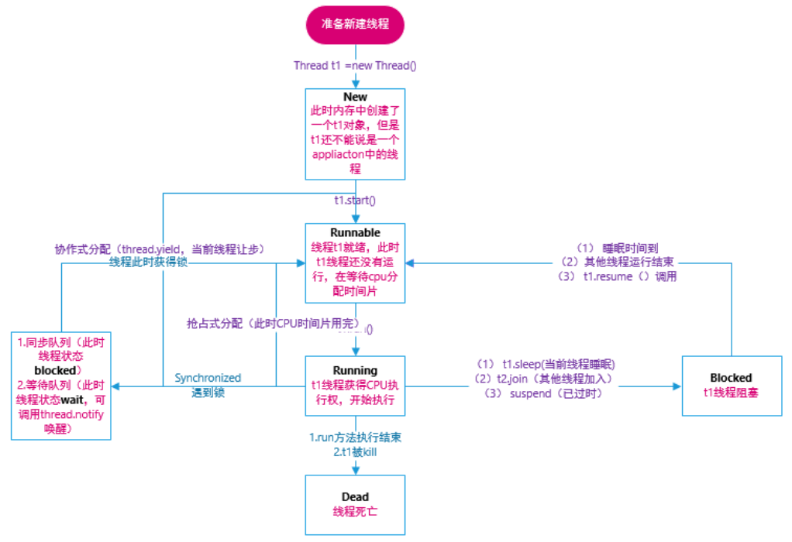

# 设计模式

## 设计模式七大原则

1. 开放封闭原则：对扩展开放，对修改关闭。在程序需要进行拓展的时候，不能人为去修改原有的代码，实现一个热插拔的效果。
2. 单一职责原则：一个类、接口或方法只负责一个职责，这样可以降低代码复杂度以及减少代码变更引起的风险。
3. 依赖倒置原则：针对接口编程，编程依赖于抽象类或接口而不依赖于具体实现类。
4. 接口隔离原则：将不同功能定义在不同接口中来实现接口隔离。
5. 里氏替换原则：任何基类可以出现的地方，子类一定可以出现。
6. 迪米特原则：每个模块对其他模块都要尽可能少地了解和依赖，降低代码耦合度。
7. 合成复用原则：尽量使用组合( has-a )/聚合( contains-a )而不是继承( is-a )达到软件复用的目的。

## 设计模式分类

1. 创建型模式：在创建对象的同时隐藏创建逻辑，不使用 new 直接实例化对象。该模式包含工厂方法模式、抽象工厂模式、单例模式、建造者模式、原型模式。
2. 结构型模式：通过类和接口间的继承和引用实现创建复杂结构的对象。该模式包含适配器模式、装饰器模式、代理模式、外观模式、桥接模式、组合模式、享元模式。
3. 行为型模式：通过类之间不同通信方式实现不同行为。该模式包含策略模式、模板方法模式、观察者模式、迭代子模式、责任链模式、命令模式、备忘录模式、状态模式、访问者模式、中介者模式、解释器模式。

## 1、单例模式

一个单例类在任何情况下都只存在一个实例。

饿汉式实现

```java
//创建Singleton类
public class Singleton{
    //1、创建一个静态单例对象    
    private static Singleton instance = new Singleton();
    //2、私有构造函数，这样该类就不会被实例化
    private Singleton(){}
    //3、获取唯一可用对象
    public static Singleton getIinstance(){
        return instance;
    }
    //附加功能函数
    public void showMessage(){
        System.out.println("Singleton");
    }
}

//从Singleton类获取唯一对象
public class SingletonDemo{
    public static void main(String[] args){
        Singleton s = Singleton.getIinstance();
        s.showMessage();
    }
}
```

懒汉式--线程不安全

```java
public class Singleton{
    //1、
	private static Singleton instance;
    //2、
    private Singleton(){}
    //3、在方法调用时初始化
    public static Singleton getInstance(){
        if(instance == null)	instance = new Singleton();
        return instance;
    }
}
```

懒汉式--线程安全

```java
public class Singleton{
    //1、
	private static Singleton instance;
    //2、
    private Singleton(){}
    //3、方法添加synchronized关键字
    public static synchronized Singleton getInstance(){
        if(instance == null)	instance = new Singleton();
        return instance;
    }
}
```

双重锁/双重校验锁

```java
//Double Check Lock单例模式双重校验 
public class Singleton{
    //1、添加volatile
    private volatile static Singleton instance;	//保证instance对象每次都是从主内存中读取.正确性。但会影响性能
    //2、
    private Singleton(){}
    //3、
    public static Singleton getInstance(){
        if(instance == null){	//第一层判断：避免每次都进入同步状态
            synchronized (Singleton.class){
                if(instance == null){	//第二层判空是为了在null情况下创建实例
                    instance = new Singleton();
                }
            }
        }
        return instance;
    }
}
```

## 2、简单工厂模式

由一个工厂对象类来创建实例，适用于工厂类负责创建对象较少的情况。

例子：BeanFactory使用简单工厂模式，产生Bean对象。

## 3、工厂方法模式

定义一个创建对象的接口，让接口的实现类决定创建哪种对象，让类的实例化推迟到子类中进行。

## 4、抽象工厂模式

提供一个接口，该接口可以创建一系列相关或相互依赖的对象，无需指定它们的具体类。

## 5、代理模式

为其他对象提供一种代理，以控制这个对象的访问。

- 优点：可以增强目标对象的功能，降低代码耦合度，扩展性好。

- 缺点：客户端和目标对象之间增加代理对象会导致请求处理速度变慢，增加系统复杂度。


### 静态代理

在程运行前，就已经存在代理类的字节码文件，代理类和委托类的关系在运行前就确定了。

### 动态代理

程序运行期间，动态的生成代理，所以不存在代理类的字节码文件。代理类和委托类的关系在程序运行时确定。

## 6、适配器模式

将一个接口转换为客户希望的另一个接口，使接口不兼容的那些类可以一起工作。

## 7、模板模式

定义了一个操作中的算法骨架，并将一些步骤延迟到子类，适用于抽取子类重复代码到公共父类。可以封装固定不变的部分，扩展可变的部分。但每一个不同实现都需要一个子类维护，会增加类的数量。

## 8、装饰器模式

可以动态的给对象添加一些额外的属性或行为，即需要修改原有的功能，但又不怨直接去修改原有代码时，设计一个Decorator套在原有代码外面。

## 9、观察者模式

表示一种对象与对象之间的依赖关系，当一个对象的状态发生改变时，所有依赖于它的对象都得到通知并被自动更新。

# Spring

## IOC & AOP

IOC（控制反转），是一种设计思想，即将原本在程序中手动创建对象的控制权，交由spring框架来管理。IOC容器是Spring实现IOC的载体。IOC容器实际上就是一个Map，里面存放的是各种对象，IOC容器可以管理对象之间的依赖关系、完成对象的注入，从而可以简化应用的开发过程。可以把IOC容器类比于一个工厂，当需要创建一个对象的时候，只需要配置好相关的配置文件和注解即可，不用去了解对象的创建过程。

AOP（面向切面编程），是一种编程思想，是面向对象(OOP)的一种补充。面向对象编程将程序抽象成各个层次的对象，而切面编程是程序抽象成各个切面。AOP在不修改源代码的情况下，为系统中业务组件添加某种通用功能，从而减少重复代码，降低模块之间的耦合度，提高程序的可扩展性和可维护性。SpringAOP是基于动态代理实现的，如果被代理对象实现了某个接口，那么Spring AOP会通过JDK动态代理为接口动态生成代理对象；如果被代理对象没有实现接口，则Spring AOP会通过CGLib动态生成目标类的子类来作为代理。

---

## Spring 框架中使用了哪些设计模式？

1、工厂模式，BeanFactory 就是简单工厂模式的体现，用于创建实例对象。

2、单例模式，Spring 中的 Bean 默认为单例模式。

3、代理模式，Spring 的 AOP 功能用到了 JDK 动态代理 和 CGLIB 字节码生成技术。

4、模板方法模式，Spring 中 jdbcTemplate、hibernateTemplate 等以 Template 结尾的对数据库操作的类，它们就使用了模板方法模式 。

5、适配器模式，Spring AOP 的增强或通知 (Advice) 使用了适配器模式、Spring MVC 中也是用到了适配器模式适配`Controller`。

---

#### 对 @Transactional 注解的了解。

> - 首先，@Transactional 注解一般可以添加到方法、类以及接口上，需要注意的是该注解只会对 public 方法生效，一般不推荐在接口上使用该注解。
> - 其次，@Transactional 注解可以配置的参数包括：事务的传播行为，事务的隔离级别，事务的超时时间，指定事务是否为只读事务，以及事务的回滚规则。
> - 最后，@Transactional 注解是基于 AOP 实现的，AOP 又是使用动态代理实现的。如果目标对象实现了接口，默认情况下会采用 JDK 的动态代理，如果目标对象没有实现接口，则会使用 CGLIB 动态代理。

# SpringMVC

## 流程

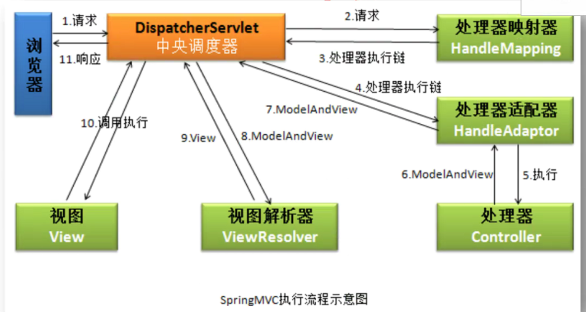

Spring MVC 的主要组件：

- DispatcherServlet：前端控制器，用于把请求转发给具体的控制器；
- Controller：控制器，处理各种请求；
- HandlerMapping：映射处理器，负责请求的映射；
- ModelAndView：服务层返回的数据和视图层的封装类；
- ViewResolver：视图解析器，解析具体的视图；
- Interceptors：拦截器，拦截请求并做相应的拦截处理。

请求的处理过程：

- 客户端（浏览器）发送请求，请求首先会到达`DispatcherServlet`；
- `DispatcherServlet` 根据请求信息调用 `HandlerMapping`，解析请求对应的 `Handler`；
- 解析到对应的 `Handler`（也就是我们平常说的 `Controller` 控制器）后，开始由 `HandlerAdapter` 适配器进行处理；
- `HandlerAdapter` 会根据 `Handler`调用真正的处理器处理请求，并执行相应的业务逻辑；
- 处理器处理完业务后，会返回一个 `ModelAndView` 对象，`Model`返回的是数据对象，`View`是逻辑上的 `View`；
- `ViewResolver`会根据逻辑`View` 查找实际的`View`；
- `DispaterServlet` 把返回的 `Model` 传给 `View`（视图渲染）；
- 最终把 `View` 返回给客户端（浏览器）。

# MySQL

## 索引

索引是一种特殊文件，包含对数据表里所有记录的引用指针。用来快速找出在一个列上有特定值的行。没有索引，则需从第一条记录开始，读完整个表直到它找出相关行。
为何引入：索引可以提高数据查询的效率。索引对数据库查询良好的性能非常关键，当表中数据量越来越大，索引对性能的影响越重要。  

数据库索引是数据库管理系统中一个排序的数据结构。通过B/B+树实现。当表中数据量庞大、where子句中的字段经常被检索时，对内容建立索引形成目录，可通过二分查找等，提高检索速度。

- 优点：加快检索速度；优化隐藏器提高系统性能。
- 缺点：对表中数据增、删、改，需动态维护索引，耗费时间，降低执行效率；占物理空间。

## Mysql有哪些常见索引类型？

数据结构角度：B-Tree索引、哈希索引、R-Tree索引、全文索引
物理存储角度：主键索引（聚簇索引）：叶子节点存的是整行的数据、
							非主键索引（二级索引）：叶子节点存的主键的值  

## B-Tree、B+树、Hash索引、

**B-Tree**：是一种自平衡的多叉树。每个节点都存储关键字值。其左子节点的关键字值小于该节点关键字值，且右子节点的关键字值大于或等于该节点关键字值。
	根节点的槽存放指向子节点的指针，存储引擎根据这些指针向下层查找；通过比较节点页的值 和 要查找的值，可以找到合适的指针进入下层子节点；这些指针实际上定义了子节点页中值的上限和下限。最终存储引擎要么找到对应的值，要么该记录不存在。
	叶子节点的指针指向的是被索引的数据，而不是其他节点页。
	B-Tree对索引列是顺序组织存储的，适合查找范围数据。B树每一个节点都包含key和value，查询效率比B+树高。  

**自适应Hash索引**：InnoDB对于频繁使用的某些索引值，会在内存中基于 B-Tree 索引之上再创键一个哈希索引，这也被称为自适应Hash索引。  

**B+树**也是是一种自平衡的多叉树。其基本定义与B树相同，不同点在于数据只出现在叶子节点，所有叶子节点增加了一个链指针，方便进行范围查询。
B+树中间节点不存放数据，所以同样大小的磁盘页上可以容纳更多节点元素，访问叶子节点上关联的数据也具有更好的缓存命中率。并且数据顺序排列并且相连，所以便于区间查找和搜索。

**哈希索引**：<存储引擎对每行数据的索引列计算哈希码存储在索引中，同时索引表保存指向数据行的指针>。
只有 Memory 引擎显式支持哈希索引。
Hash索引不支持范围查询，无法用于排序，也不支持部分索引列匹配查找。  

## 为什么数据库不用红黑树用B+树

红黑树的出度为 2，而 B Tree 的出度一般都非常大。红黑树的树高 h 很明显比 B Tree 大非常多，IO次数很多，导致会比较慢，因此检索的次数也就更多。B+Tree 相比于 B-Tree 更适合外存索引，拥有更大的出度，IO次数较少，检索效率会更高。  

---

## 聚集索引和稀疏索引

**聚集索引**按每张表的主键构建一棵B+树，数据库中的每个搜索键值都有一个索引记录，每个数据页通过双向链表连接。表数据访问更快，但表更新代价高。
**稀疏索引**不会为每个搜索关键字创建索引记录。搜索过程需要，我们首先按索引记录进行操作，并按顺序搜索，直到找到所需的数据为止。  

## 辅助索引与回表查询

辅助索引是非聚集索引，叶子节点不包含记录的全部数据，包含了一个书签用来告诉InnoDB哪里可以找到与索引相对应的行数据。
通过辅助索引查询，先通过书签查到聚集索引，再根据聚集索引查对应的值，需要两次，也称为回表查询。  

## 联合索引

https://www.cnblogs.com/youngdeng/p/12855524.html
联合索引是指对表上的多个列的关键词进行索引。
对于联合索引的查询，如果精确匹配联合索引的左边连续一列或者多列，则mysql会一直向右匹配直到遇到范围查询（>,<,between,like）就停止匹配。Mysql会对第一个索引字段数据进行排序，在第一个字段基础上，再对第二个字段排序。  

## **最左匹配**

若SQL语句中用到了联合索引中最左边的索引，则该SQL语句就可以用这个联合索引进行匹配。当遇到范围查询(>/</between/like)就会停止匹配。

- SELECT * FROM table WHERE a = 1 and b = 2 and c = 3; 	

  ​		(a,b,c)或者(c,b,a)或者(b,a,c)都可以建立索引，将区分度高的字段放前面。执行SQL时，优化器会帮我们调整where后a/b/c的顺序，让我们用上索引。

- SELECT * FROM table WHERE a > 1 and b = 2; 

  ​	对(b,a)建立索引，则两字段均可用上。

- SELECT * FROM `table` WHERE a > 1 and b = 2 and c > 3; 

  ​	不一定，(b,a)或者(b,c)都可以，结合具体情况具体分析。

- SELECT * FROM `table` WHERE a = 1 ORDER BY b;

  ​	对(a,b)建索引，当a = 1的时候，b相对有序，可以避免再次排序

- SELECT * FROM `table` WHERE a IN (1,2,3) and b > 1; 

  ​	对(a，b)建立索引，因为IN在这里可以视为等值引用，不会中止索引匹配

## 覆盖索引

覆盖索引指一个索引包含或覆盖了所有需要查询的字段的值，不需要回表查询，即索引本身存了对应的值。  

## 基于主键索引的查询和非主键索引的查询有什么区别？

对于select * from 主键=XX，基于主键的普通查询仅查找主键这棵树，对于select * from 非主键=XX，基于非主键的查询有可能存在**回表**过程（回到主键索引树搜索的过程称为回表），因为非主键索引叶子节点仅存主键值，无整行全部信息。

## 非主键索引的查询一定会回表吗？

不一定，当查询语句的要求字段全部命中索引，不用回表查询。如select 主键 from 非主键=XX，此时非主键索引叶子节点即可拿到主键信息，不用回表。  

---

## 事务

指一批操作。

- 原子性（Atomicity）    整个事务中的所有操作，必须作为一个单元全部完成（或全部取消），要么全成功，要么全失败。
- 一致性（Consistency）在事务开始之前与结束之后，数据库都保持一致状态
- 隔离性（Isolation）一个事务不会影响其他事务的运行。多个并发事务对数据库进行操作，事务间互不干扰。  
- 持久性（Durability）    在事务完成以后，该事务对数据库所作的更改将持久地保存在数据库之中，并不会被回滚。对数据的修改是永久的，即使系统故障也不会丢失。

## 隔离级别

决定事务之间可见的级别。

1. 读未提交（Read Uncommitted）：允许A事务看到其他事务未提交的修改。

2. 读已提交（Read Committed）：允许一个事务只能看到其他事务已经提交的修改，未提交的修改不可见。不出现脏读。

3. 可重复读（Repeatable Read）：一个事务执行过程中看到的数据总是和事务启动时看到的数据是一致的。在这个级别下事务未提交，做出的变更其它事务也看不到。
   确保如果在一个事务中执行两次相同的SELECT语句，都能得到相同的结果，不管其他事务是否提交这些修改（银行总账）。为InnoDB缺省设置。不出现脏读、不可重读。

4. 串行化：对于同一行记录进行读写会分别加读写锁，当发生读写锁冲突，后面执行的事务需等前面执行的事务完成才能继续执行。
   将一个事务与其他事务完全地隔离。都避免了。

   例:A可以开启事物,B也可以开启事物

   A在事物中执行DML语句时,未提交

   B不以执行DML,DQL语句

## 一致性问题

多客户端并发访问一个表时：

1. 丢失修改
2. 脏读取(Dirty Read)：当前事务可以查看到别的事务未提交的数据。  A读取第x行数据，但B事务已经更新了x行的数据，但未及时提交。A读到了B未提交的内容。
3. 不可重复读（Non-Repeatable-Read）：在同一事务中，使用相同的查询语句，同一数据资源莫名改变了。  同一个事务中，A读操作对x数据前后两次读取产生的结果不同。
4. 幻读（Phantom Read）：：在同一事务中，使用相同的查询语句，莫名多出了一些之前不存在的数据，或莫名少了一些原先存在的数据。同一事务中，以前没有的行，由于其他事务提交，而出现的新行。

---

## 三大范式

1. 每一行必须唯一，每个表必须有主键；列不可再分，有原子性；合并属性相近的列；
   1. 通过拆分、合并列，来满足第一范式。
2. 非主键字段完全依赖主键，没有部分依赖。
   1. 分表建立对应关系的表，来满足第二范式。多对多
3. 不产生传递依赖。每列与主键直接相关。
   1. 将冗余字段单独拿出来建表，一对多，多的那张表添加外键指向另一方主键。来满足第三范式。

通过主键共享、外键唯一来设计一对一。

数据库设计尽量遵循三范式，根据实际情况取舍，有时可能拿冗余换速度。

## 五大约束

1. 主键约束（Primay Key Coustraint） 唯一性，非空性；
2. 唯一约束 （Unique Counstraint）唯一性，可以空，但只能有一个；
3. 默认约束 (Default Counstraint) 该数据的默认值；
4. 外键约束 (Foreign Key Counstraint) 需要建立两表间的关系；
5. 非空约束（Not Null Counstraint）:设置非空约束，该字段不能为空。

## MySQL建表时应该考虑到什么？

1 表里会包含什么样的数据？
2 表的名称是什么？
3 哪个或那些列组成主键？
4 列字段的名称是什么？
5 每一列的数据类型是什么？
6 每一列的长度是？
7 表里的哪些列可以是null。

---

## MySQL中的日志log

redo log：存储引擎级别的log（InnoDB有，MyISAM没有），该log关注于事务的恢复，在重启mysql服务的时候，根据redo log进行重做，从而使事务有持久性。
undo log：是存储引擎级别的log（InnoDB有，MyISAM没有）保证数据的原子性，该log保存了事务发生之前的数据的一个版本，可以用于回滚，是MVCC的重要实现方法之一。
bin log：数据库级别的log，关注恢复数据库的数据。  

## redo log与binlog的区别？

1、redo log是InnoDB引擎特有的，只记录该引擎中表的修改记录。binlog是MySQL的Server层实现的，会记录所有引擎对数据库的修改。
2、redo log是物理日志，记录的是在具体某个数据页上做了什么修改；binlog是逻辑日志，记录的是这个语句的原始逻辑。
3、redo log是循环写的，空间固定会用完；binlog是可以追加写入的，binlog文件写到一定大小后会切换到下一个，并不会覆盖以前的日志。  

## mysql主从复制

主数据库做什么，从数据库就做什么。
主从复制流程： 1）在事务完成之前，主库线程将改变的日志写入bin log，完成后通知存储引擎提交事务。2）从库将主库的binlog复制到对应的中继日志，即开辟一个I/O工作线程，I/O线程在主库上打开一个普通的连接，然后开始读bin log，将这些事件写入中继日志。3）从库SQL线程解析执行读到的事件（语句），若已经读到最新，线程进入睡眠等待主库产生新事件。
MySQL提供主从复制功能，可以方便的实现数据的多处自动备份，不仅能增加数据库的安全性，还能进行读写分离，提升数据库负载性能。  

## MySQL是如何保证主备一致的？

MySQL通过binlog（二进制日志）实现主备一致。binlog记录了所有修改了数据库或可能修改数据库的语句，而不会记录select、show这种不会修改数据库的语句。在备份的过程中，主库A会有一个专门的线程将主库A的binlog发送给备库B进行备份。其中binlog有三种记录格式：
1、statement：记录对数据库进行修改的语句本身，有可能会记录一些额外的相关信息。优点是binlog日志量少，IO压力小，性能较高。缺点是由于记录的信息相对较少，在不同库执行时由于上下文的环境不同可能导致主备不一致。
2、row：记录对数据库做出修改的语句所影响到的数据行以及对这些行的修改。比如当修改涉及多行数据，会把涉及的每行数据都记录到binlog。优点是能够完全的还原或者复制日志被记录时的操作。缺点是日志量占用空间较大，IO压力大，性能消耗较大。
3、mixed：混合使用上述两种模式，一般的语句使用statment方式进行保存，如果遇到一些特殊的函数，则使用row模式进行记录。MySQL自己会判断这条SQL语句是否可能引起主备不一致，如果有可能，就用row格式，否则就用statement格式。但是在生产环境中，一般会使用row模式。

## crash-safe能力

InnoDB通过redo log保证即使数据库发生异常重启，之前提交的记录都不会丢失，这个能力称为crash safe。

## WAL技术

WAL的全称是Write-Ahead Logging，它的关键点就是先写日志，再写磁盘。事务在提交写入磁盘前，会先写到redo log里面去。如果直接写入磁盘涉及磁盘的随机I/O访问，涉及磁盘随机I/O访问是非常消耗时间的一个过程，相比之下，先写入redo log 后面再找合适的时机批量刷盘能提升性能。  

## 两阶段提交是什么？

为了保证binlog和redo log两份日志的逻辑一致，最终保证恢复到主备数据库的数据是一致的，采用两阶段提交的机制。
1、执行器调用存储引擎接口，存储引擎将修改更新到内存中后，将修改操作记录redo log中，此时redo log处于prepare状态。
2、存储引擎告知执行器执行完毕，执行器生成这个操作对应的binlog，并把binlog写入磁盘。
3、执行器调用引擎的提交事务接口，引擎把刚刚写入的redo log改成提交commit状态，更新完成。  

## 只靠binlog可以支持数据库崩溃恢复吗？

不可以。
历史原因：
1、InnoDB在作为MySQL的插件加入MySQL引擎家族之前，就已经是一个提供了崩溃恢复和事务支持的引擎了。InnoDB接入了MySQL后，发现既然binlog没有崩溃恢复的能力，那引入InnoDB原有的redo log来保证崩溃恢复能力。
实现原因：
2、binlog没有记录数据页修改的详细信息，不具备恢复数据页的能力。binlog记录着数据行的增删改，但是不记录事务对数据页的改动，这样细致的改动只记录在redo log中。当一个事务做增删改时，其实涉及到的数据页改动非常细致和复杂，包括行的字段改动、行头部以及数据页头部的改动，甚至b+tree会因为插入一行而发生若干次页面分裂，那么事务也会把所有这些改动记录下来到redo log中。因为数据库系统进程crash时刻，磁盘上面页面镜像可以非常混乱，其中有些页面含有一些正在运行着的事务的改动，而一些已提交的事务的改动并没有刷上磁盘。事务恢复过程可以理解为是要把没有提交的事务的页面改动都去掉，并把已经提交的事务的页面改动都加上去这样一个过程。这些信息，都是binlog中没有记录的，只记录在了存储引擎的redo log中。
3、操作写入binlog可细分为write和fsync两个过程，write指的就是指把日志写入到文件系统的page cache，并没有把数据持久化到磁盘，fsync才是将数据持久化到磁盘的操作。通过参数设置sync_binlog为0的时候，表示每次提交事务都只write，不fsync。此时数据库崩溃可能导致部分提交的事务以及binlog日志由于没有持久化而丢失。

---

## MVCC

MVCC为多版本并发控制，即同一条记录在系统中存在多个版本。其存在目的是在保证数据一致性的前提下提供一种高并发的访问性能。对数据读写在不加读写锁的情况下实现互不干扰,从而实现数据库的隔离性,在事务隔离级别为读提交和可重复读中使用到。
在InnoDB中，事务在开始前会向事务系统申请一个事务ID，该ID是按申请顺序严格递增的。每行数据具有多个版本，每次事务更新数据都会生成新的数据版本，而不会直接覆盖旧的数据版本。数据的行结构中包含多个信息字段。其中实现MVCC的主要涉及最近更改该行数据的事务ID（DB_TRX_ID）和可以找到历史数据版本的指针（DB_ROLL_PTR）。InnoDB在每个事务开启瞬间会为其构造一个记录当前已经开启但未提交的事务ID的视图数组。通过比较链表中的事务ID与该行数据的值与对应的DB_TRX_ID，并通过DB_ROLL_PTR找到历史数据的值以及对应的DB_TRX_ID来决定当前版本的数据是否应该被当前事务所见。最终实现在不加锁的情况下保证数据的一致性。  

## 读提交和可重复读都基于MVCC实现，有什么区别？

在可重复读级别下，只会在事务开始前创建视图，事务中后续的查询共用一个视图。而读提交级别下每个语句执行前都会创建新的视图。因此对于可重复读，查询只能看到事务创建前就已经提交的数据。而对于读提交，查询能看到每个语句启动前已经提交的数据。  

---

## ORM

Object Relational Mapping，对象关系映射，解决对象与关系数据库 互不匹配的问题。类、对象、属性对应表、行、列。

## 存储引擎

MyISAM：MySQL常用索引，适用大量读、少量更新的混合操作。

1. 使用三个文件表示每个表：格式文件(.frm)、数据文件(.myd)、索引文件(.myi)。
2. B+Tree索引结构
3. MySQL5.1及之前，MyISAM 是默认存储引擎。MyISAM不支持事务，Myisam支持表级锁，不支持行级锁，表不支持外键，该存储引擎存有表的行数，count运算会更快。适合查询频繁，不适合对于增删改要求高的情况  

INNODB：MySQL的默认事务型存储引擎。有较多的数据需更新时选。

1. 每个innodb表在数据库目录中以.frm格式文件表示。
2. 提供一组用来记录事务性活动的日志文件
3. MYSQL服务器崩溃后提供自动恢复功能
4. MVCC多版本、行级锁定，为数据读取和更新的混合操作提供良好并发机制。
5. 实现了四个标准的隔离级别。  默认级别是 REPEATABLE READ，并通过间隙锁策略防止幻读，间隙锁使 InnoDB 不仅仅锁定查询涉及的行，还会对索引中的间隙进行锁定防止幻行的插入。  
6. 支持外键及引用的完整性，包括级联删除和更新
7. B+Tree索引结构

MEMORY：存储非永久需要的数据、或能从基于磁盘的表中重新生成的数据。

1. 数据及索引都存储在内存中，不需要磁盘IO；支持哈希索引，行长度固定，查找速度非常快；表级锁，并发写入的性能较低；不能包含TEXT、BLOB字段。

## InnoDB如何保证事务的原子性、持久性和一致性？

1. 利用undo log保障原子性。该log保存了事务发生之前的数据的一个版本，可以用于回滚，从而保证事务原子性。
2. 利用redo log保证事务的持久性，该log关注于事务的恢复.在重启mysql服务的时候，根据redo log进行重做，从而使事务有持久性。
3. 利用undo log+redo log保障一致性。事务中的执行需要redo log，如果执行失败，需要undo log 回滚。

---

## MySQL锁分类（按粒度）

1. 表级锁: 对当前操作的整张表加锁，实现简单，加锁快，但并发能力低。
2. 行锁: 锁住某一行，如果表存在索引，那么记录锁是锁在索引上的，如果表没有索引，那么 InnoDB 会创建一个隐藏的聚簇索引加锁。行级锁能大大减少数据库操作的冲突。其加锁粒度最小，并发度高，但加锁的开销也最大，加锁慢，会出现死锁。
3. Gap 锁：也称为间隙锁: 锁定一个范围但不包括记录本身。其目的是为了防止同一事物的两次当前读出现幻读的情况。
4. Next-key Lock： 行锁+gap锁。  

## 如何解决数据库死锁

1、预先检测到死锁的循环依赖，并立即返回一个错误。
2、当查询的时间达到锁等待超时的设定后放弃锁请求。

## 乐观锁和悲观锁

**乐观锁**：对于数据冲突保持一种乐观态度，操作数据时不会对操作的数据进行加锁，只有到数据提交的时候才通过一种机制来验证数据是否存在冲突。
**悲观锁**：对于数据冲突保持一种悲观态度，在修改数据之前把数据锁住，然后再对数据进行读写，在它释放锁之前任何人都不能对其数据进行操作，直到前面一个人把锁释放后下一个人数据加锁才可对数据进行加锁，然后才可以对数据进行操作，一般数据库本身锁的机制都是基于悲观锁的机制实现的。  

## MySQL共享锁、排它锁

**共享锁**也称为读锁，相互不阻塞，多个客户在同一时刻可以同时读取同一个资源而不相互干扰。
**排他锁**也称为写锁，会阻塞其他的写锁和读锁，确保在给定时间内只有一个用户能执行写入并防止其他用户读取正在写入的同一资源。

---

## MySQL的架构

MySQL可以分为应用层，逻辑层，数据库引擎层，物理层。
应用层：负责和客户端，响应客户端请求，建立连接，返回数据。
逻辑层：包括SQK接口，解析器，优化器，Cache与buffer。
数据库引擎层：有常见的MyISAM，InnoDB等等。
物理层：负责文件存储，日志等等。

##  SQL语言的执行过程

1、客户端首先通过连接器进行身份认证和权限相关
2、如果是执行查询语句的时候，会先查询缓存，但MySQL 8.0 版本后该步骤移除。
3、没有命中缓存的话，SQL 语句就会经过解析器，分析语句，包括语法检查等等。
4、通过优化器，将用户的SQL语句按照 MySQL 认为最优的方案去执行。
5、执行语句，并从存储引擎返回数据。  

## MySQL优化流程

1、通过慢日志定位执行较慢的SQL语句
2、利用explain对这些关键字段进行分析
3、根据分析结果进行优化  

## 简述MySQL使用EXPLAIN 的关键字段

explain关键字用于分析sql语句的执行情况，可以通过他进行sql语句的性能分析。
type：表示连接类型，从好到差的类型排序为：

- system：系统表，数据已经加载到内存里。
- const：常量连接，通过索引一次就找到。
- eq_ref：唯一性索引扫描，返回所有匹配某个单独值的行。
- ref：非主键非唯一索引等值扫描，const或eq_ref改为普通非唯一索引。
- range：范围扫描，在索引上扫码特定范围内的值。
- index：索引树扫描，扫描索引上的全部数据。
- all：全表扫描。

key：显示MySQL实际决定使用的键。
key_len：显示MySQL决定使用的键长度，长度越短越好
Extra：额外信息

- Using filesort：MySQL使用外部的索引排序，很慢需要优化。
- Using temporary：使用了临时表保存中间结果，很慢需要优化。
- Using index：使用了覆盖索引。
- Using where：使用了where。

## where和having的区别

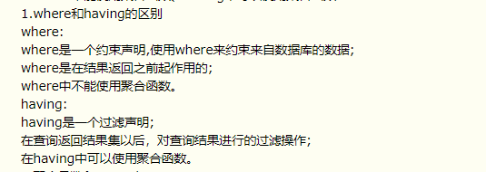


# Redis

## 数据结构类型及应用场景

1、**String 字符串**：存储普通的key-value。redis自己构建了一种简单动态字符串(SDS)，不仅可以保存文本数据，而且可保存二进制数据，获取字符串长度 复杂度为O(1)；且SDS API不会缓存溢出。

2、**Hash字典**：通过数组+链表实现，类似于HashMap，但做了优化。适用于存储对象，可以像在数据库中一样，更新某个属性只需修改该对象的某个字段值。
**场景**：以hash解耦股 存储用户信息、商品信息。

3、**List**：双向链表。支持反向查找和遍历，但是带来了额外内存开销。链表易于数据元素的插入和删除，且可以灵活调整链表长度，但随机访问比较难。
**场景**：发布与订阅，消息队列，慢查询。

4、**Set集合**：无序集合，类似HashSet。当需要存储一个列表数据，又不希望出现重复数据时，set是较好选择。set提供了判断某个成员是否在一个set集合内的重要接口，这个是list不能提供的。可以基于set轻易实现交集、并集、差集操作。
**场景**：需要存放的数据不能重复、以及需要获取多个数据源交集和并集等场景  。将一个用户所有关注的人放在一个集合中，将其所有粉丝放在一个集合。Redis可以方便的实现共同关注、共同粉丝等功能，这个过程就是求交集的过程。

5、**zSet**：有序集合。每个元素带有数字权值，集合中的元素通过权值进行有序排序。还可以通过score的范围来获取元素列表。
**场景：**需要对数据根据某个权重进行排序的场景。比如在直播系统中的实时排行信息：在线用户列表、礼物排行榜、弹幕消息(可以理解为按消息维度的消息排行)。

## zset

有序集合，每个成员有个分数与之对应，成员不可以重复，但是分数是可以重复的，zset会自动用分数对成员进行排序，所以执行速度很快。

zset对象的编码可以是ziplist，也可以是skiplist。

**ziplist**
1、为了提高存储效率，采用经过编码的双向链表，可存储字符串或整数(2进制编码)。
2、ziplist将表中每项 存放在前后连续的地址空间，整体占用一大块内存，是表，不是链表，不存在地址指针和内存碎片的问题。
3、节省内存，但是增删改查等操作较慢。

**skiplist：**dict用来查询数据到分数的对应关系，而skiplist用来根据分数查询数据（可能是范围查找）
1、skiplist是一种查找结构。根据给定key快速查找到所在位置。普通有序链表的查找需要从头，优化了有序链表，o(logN)。
2、新增的指针，无需每个节点比较，而跳跃比较，缩小比较范围，增加查找效率。
3、增删改查非常快，但是相比ziplist会占用更多内存。

数据量较小时，zset是由ziplist来实现的；数据较多时，由一个字典序(dict)和一个跳表(skiplist)来实现。
redis在保存zset时，按如下的规则进行选择：当元素个数超过128或最大元素的长度超过64时用skiplist，其他情况下用ziplist，每次对zset进行插入、删除元素时都会重新判断是否需要转换保存格式。

---

## 持久化RDB、AOP

RDB：在指定时间间隔内，将内存中数据集快照写入磁盘。fork一个子进程，先将数据集写入临时文件，写入成功后，替换旧文件，用二进制压缩。

1、整个数据库只包含一个文件，便于持久化。
2、容灾性好，方便备份。
3、性能最大化。子进程写，主进程继续处理命令，IO最大化。但是数据集较大时，fork过程会导致服务器阻塞。
4、数据集大时，启动效率高。
5、数据安全性低。间隔时间内故障，则数据丢失。适合数据要求不严谨的时候。

AOF：以日志文本形式详细记录 服务器处理的每个写、删除操作，查询不记录。

1、确保数据安全。持久化策略：每秒同步、每修改同步、不同步(由操作系统决定)。
2、以append模式写文件，宕机也不会破坏已经存在的内容。
3、具有重写模式。定期对AOF文件重写，压缩
4、文件较大，恢复较慢；数据集较大时，启动效率低；优先使用AOF还原数据。

---

## 淘汰策略

1、**定期删除**。redis默认是每100ms就随机抽取一些设置了过期时间的key，并检查是否过期，若过期则删除。因此该删除策略不会删除所有的过期key。
2、**惰性删除**。在客户端需要获取某个key时，Redis将首先进行检查，若该key设置了过期时间、并且已经过期，就会删除。
实际上Redis结合上述两种手段，保证删除过期的key。

## 什么情况下使用Redis

1、针对热点数据进行缓存。
2、对于特定限时数据的存放。
3、针对带权值的热点数据的排序
4、分布式锁

## Redis与memcache区别

1、Redis处理网络请求采用单线程模型；memcache采用多线程异步IO。
2、Redis支持数据持久化；后者不支持。
3、Redis支持的数据格式较多。

## 单线程

Redis基于Reactor模式设计开发了一套高效事件处理模型，其对应的是文件事件处理器。由于文件事件处理器(file event handler)是单线程方式运行的，所以一般称Redis是单线程模型。

单线程更容易维护。多线程会存在死锁、上下文切换等问题，影响性能。

Redis性能瓶颈不再是CPU，而主要是内存和网络。Redis6.0后引入多线程也是为了提高网络IO读写性能。

---

## 缓存穿透

缓存穿透指缓存和数据库中均没有需要查询的数据，所有的请求都落到数据库上，使数据库压力过大。导致举个例⼦：某个⿊客故意制造我们缓存中不存在的 key 发起⼤量请求，根本没有经过缓存这⼀层，导致⼤量请求落到数据库。  

**解决办法：**
1、接口层增加校验，在数据库操作访问前进行校验，对不合法的请求直接返回。如用户鉴权校验，id做基础校验，id<=0的直接拦截；
2、对于经常被访问的、且缓存和数据库中均没有的键，这时也可以将key-value对写为key-null记录在缓存中，并对其设置较短的缓存有效时间，如30秒（设置太长会导致正常情况也没法使用）。这样可以防止攻击用户反复用同一个id暴力攻击。
3、采用布隆过滤器，将所有可能存在的数据哈希到一个足够大的 bitmap 中，一个一定不存在的数据会被这个 bitmap 拦截掉，从而避免了对底层存储系统的查询压

## 缓存雪崩

缓存在同⼀时间⼤⾯积的失效，后⾯的请求都直接落到了数据库上，造成数据库短时间内承受⼤量请求。   
指缓存中一大批数据到了过期时间，而从缓存中删除，但该批数据查询量巨大，查询全部走数据库，造成数据库压力过大。

**解决办法：**
1、缓存数据的设置随机过期时间，防止同一时间大量数据过期。
2、设置热点数据永不过期。
3、对于集群部署的情况，将热点数据均匀分布在不同缓存中。

## 缓存击穿

缓存中没有、但数据库中有该数据（一般是缓存时间到期）。一般这种情况，是因为指定数据的缓存时间到期，但由于并发用户访问该数据特别多，因此去数据库去取数据，引起数据库访问压力过大。  

**解决办法：**
1、设置热点数据永不过期。
2、对并发读数据设置并发锁，降低并发性。

---

## Redis集群部署方法

1、主从模式
2、哨兵模式
3、cluster集群模式

## **Redis主从复制**

主从复制，有主库（Master）节点和从库（Slave）节点两个角色。从节点服务启动后，会连接主库，并向主库发送SYNC同步命令。
主节点收到同步命令，启动持久化工作；工作执行完成后，主节点将传送整个数据库文件到从库；从节点接收到数据库文件数据之后将数据进行加载。此后，主节点继续将所有已经收集到的修改命令、和新的修改命令 依次传送给从节点；从节点依次执行，从而达到最终的数据同步。

通过这种方式，可以使写操作作用于主库，而读操作作用于从库，从而达到读写分离。

## 哨兵模式

哨兵模式监控redis集群中Master的工作状态。在Master主服务器宕机时，从slave中选择新机器当作master，保证系统高可用。

每个哨兵，每10秒向主服务器、slave和其他哨兵发送ping。
客户端的请求，通过哨兵，由哨兵提供可供服务的redis master节点。
哨兵只需要配master节点，请求即可自动寻找其对应的slave节点。
监控同一master节点的哨兵会自动互联，组成哨兵网络，当任一哨兵发现master连接不上，即开会投票，投票半数以上决定Master下线，并从slave节点中选取新master节点。

## **cluster集群**

为了高可用，cluster提出了虚拟槽的概念。采用无中心结构，每个节点保存数据和集群状态，每个节点和其他所有节点有连接。

1、redis cluster默认有16384个槽，在集群搭建的时候，需要给哈希槽节点 分配尽可能相同数量虚拟槽。
2、如果目前redis执行set操作，redis先对这个key经过CRC16 hash运算，并把结果对16384取余，得到虚拟槽编号。
3、根据虚拟槽编号，寻找到其对应的redis节点。
4、如果此时执行get操作，节点先验证该key对应的槽编号是不是归本节点管，如果是则保存数据。如果不是，则发送正确节点编号给客户端。

---

# linux、c/c++

| ls -l 等同于 ll   ls -d                                   | 显示当前目录下文件的属性  仅列出目录                         |
| --------------------------------------------------------- | ------------------------------------------------------------ |
| ls -al                                                    | 显示当前目录下所有文件详细信息，包括隐藏文件                 |
| cd [~] [-]                                                | 切换目录 [~目前用户身份的主目录] [-前一个工作目录]           |
| chgrp 用户组 文件名                                       | 修改文件的用户组                                             |
| chown 用户名 文件名                                       | 修改文件的所有者                                             |
| chmod 770 文件名                                          | 修改文件的权限                                               |
| cp A B                                                    | 复制文件A为B                                                 |
| rm A      rm -r A                                         | 删除A  删除非空目录或文件A                                   |
| su root                                                   | 切换为root用户                                               |
| mkdir/rmdir   mkdir -p test1/test2   mkdir -m 777 test2   | 新建目录、删除一个空目录  创建多层空目录  创建目录时设定权限 |
| touch                                                     | 新建空的文件                                                 |
| man 命令                                                  | 查询命令详细解释                                             |
| bzip2                                                     | 压缩文件                                                     |
| bunzip2                                                   | 解压文件                                                     |
| nano                                                      | 文本编辑器                                                   |
| pwd                                                       | 显示当前目录                                                 |
| echo                                                      | 打印                                                         |
| mv 文件名 目标位置   mv A B                               | 移动文件  重命名A为B（目录或文件都可以）                     |
| PATH="$PATH":/root                                        | 添加/root到环境变量中                                        |
| vim                                                       | 进入后按i可以输入  退出按ESC然后:wq  不保存退出 按ESC 然后:q!  一般模式中：  /word 向下寻找word字符串  ?word 向上寻找word字符串  n 重复前一个查找 N 与 n反向重复查找 |
| umask -S                                                  | 查看目前用户在新建文件或目录时候的默认权限                   |
| find                                                      | 搜索文件，很复杂，很多参数                                   |
| tar -jcv -f 名字.tar.bz2 A                                | 压缩“A”变成“名字.tar.bz2”                                    |
| tar -jtv -f 名字.tar.bz2                                  | 查询                                                         |
| tar -jxv -f 名字.tar.bz2 [-C 指定目录]                    | 在当前目录解压 【-C 在指定目录解压】                         |
| groupadd A   groupdel A                                   | 新建用户组A  删除用户组A                                     |
| groups [A]                                                | 查看自己所在的用户组，【查看A所在的用户组】                  |
| usermod    usermod  -G XXX B                              | 该命令有很多参数，可以修改账号各个属性  新建XXX用户组为B的支持用户组，B原来的用户组仍有（支持用户组不是当前用户组，有效用户组才是当前用户组） |
| newgrp B                                                  | 切换当前用户的有效用户组为B                                  |
| useradd A   useradd -u 666 -g B -c "XXX" A                | 新增用户A（必须要设置密码才能用）  新增用户A，用户组为B，UID为666，账号全名是XXX |
| passwd A   echo "XXX" \| passwd --stdin A                 | 给用户A设置密码，若没有A，则是给自己设置密码，密码需要超过8个字符  设置用户A的密码为XXX |
| passwd -l A   passwd -u A   passwd -S A                   | 使账号A密码失效（让其无法登陆）  使账号A密码恢复  查询账号A密码状态 |
| userdel -r A                                              | 删除用户A，连同用户主文件夹一起删除（慎用）                  |
| setfacl -m u:A:rwx B   setfacl -m g:A:rx B   setfacl -b A | 设置账户A针对文件B的权限为rwx（针对单独用户设置权限）  设置用户组A针对文件B的权限为rx  消除文件A的ACL权限 |
| getfacl B                                                 | 查询文件B的权限详情                                          |
| ctrl+c                                                    | 终止当前程序运行                                             |
| ctrl+alt+F1  ctrl+alt+F2-F7                               | 切回图形界面  切回命令行界面                                 |
| yum install XXX                                           | CentOS的apt-get  install XXX                                 |
| which XXX                                                 | 检测某个XXX应用是否安装                                      |
| reboot                                                    | 重启服务器                                                   |
| ifconfig                                                  | 查看Linux（包括本地虚拟机的Linux）的IP地址                   |
| shift+PgUp\PgDn                                           | 命令行界面上下滚动                                           |
| 启动命令 &                                                | 在后台启动，不占用命令窗口，比如启动Redis的时候  ./redis-server & |
| kill -9 PID                                               | 关闭服务，比如某程序PID=6817 kill -9 6817 就关闭了这个服务   |
| top                                                       | 查看当前系统负载情况，如果是单核CPU 那么load average低于1说明没有线程等待 |
| netstat -nap\| grep  5672                                 | 查看端口号5672是否被监听                                     |
| free -m                                                   | 查看内存使用情况                                             |
| ps -A                                                     | 显示所有运行中的进程                                         |
| scp jinsong@IP地址:/远程目录/文件名 ./                    | 拷贝远程电脑的文件到本地                                     |
| df -h                                                     | 显示磁盘上可用空间                                           |
| du -h \| grep "G"                                         | 对文件和目录磁盘使用的空间查看，过滤只显示带有G的数据        |
| ps 参数                                                   | 显示进程状态                                                 |
| ps aux \|grep admin                                       | 显示admin项目是由哪个java版本启动的                          |
| god status                                                | 显示当前机器上部署的服务                                     |

# 数据结构

#### 二叉树的分类

- 满二叉树:除最后一层无任何子节点外，每一层上的所有结点都有两个子结点的二叉树。

- 完全二叉树:所有叶子节点都出现在 最后1层或者倒数第2层，而且从第1层到倒数第2层必须达到最大节点数,也就是满二叉树，最后1层可以不是满的，但是最后1 层的所有节点必须集中在最左边。

- 二叉搜索树(二叉排序树/二叉查找树):如果它的左子树不为空，那么左子树上所有结点的值均小于它的根结点的值;如果它的右子树不空，那么右子树上所有结点的值均大于或等于它的根结点的值；左右子树也分别为二叉搜索树。查找复杂度平均为O(logn)。但是可能存在退化为链表的情况，时间复杂度就为O(n)了。
- 二叉平衡树:平衡二叉树的提出就是为了保证树不至于太倾斜，尽量保证两边平衡。平衡二叉树要么是一棵空树。要么保证左右子树的高度之差不大于 1，同时子树也必须是一颗平衡二叉树。平衡二叉树在添加和删除时需要进行旋转保持整个树的平衡，插入、查找的时间复杂度都是 O(logn)

# 分布式

## 分布式情况下访问数据库的安全问题

1. 使用分布式锁：[redis](http://jump/super-jump/word?word=redis)、zoo[keep](http://jump/super-jump/word?word=keep)er、数据库锁（乐观锁和悲观锁：写锁） 
2. 使用异步队列将多线程转为单线程操作。

## 分布式事务、分布式锁

事务是完成ACID的。锁是保障资源访问线程安全的。

### 集群下的session共享

**会话保持**的缺点： **①负载不均衡了 ②没有彻底解决问题**

**会话复制**的缺点： **集群超过6个节点就会出现一系列的问题**

**会话共享**：会话数据**共享在Nosql（Redis）数据库**中分享。

# 系统设计

大型网站架构设计考虑的地方：

​	高性能：常见的性能优化有

1. 升级硬件？部署多台机器，负载均衡
2. SQL语句问题？指定字段加索引；读写分离；加缓存
3. 死锁？分库分表
4. 安全隐患？内存泄露？
5. 分布式文件系统；异步（耗时）

高可用

1. CAP；BASE；
2. 集群，提高系统稳定性；
3. 超时重试机制
4. 降级、熔断、限流、排队，应对接口级故障

高拓展

- 拆分软件系统

- 性能指标

- - **【响应时间****RT**(Response-Time)】：用户发出请求-收到系统处理结果，所需时间。越短，则系统处理用户请求越快。

  - **并发数**：系统同时能处理的请求数量，越多则负载能力越强。

  - **吞吐量**：系统单位时间内处理的请求数量。请求对系统资源消耗越多，系统吞吐量越少。

  - - **【****QPS**（Query Per Second）】：=并发数/平均响应时间(RT)。服务器每秒可执行的查询次数。

    - - Nginx单机30W+；Redis单机8W+；MySQL单机4K；Tomcat单机2W；

    - **【****TPS**(Transaction Per Second)】：=QPS*平均响应时间(RT)。服务器每秒处理的事务数(事务为客户发出请求到服务器收到请求的过程)

- 性能测试工具

- - 后端：Jmeter、LoadRunner(收费)、Galtling、Apache      Bench
  - 前端：Filddler(抓包工具，修改请求及服务器返回的数据)、HttpWatch(录制HTTP请求)。

- 系统活跃度

- - 【PV(Page      View)】：=独立访客(UV)/刷新的次数。访问量。即页面浏览量或点击量，衡量网站用户访问的网页数量。一定统计周期内，用户每打开、刷新一个页面、多次打开、刷新同一页面，则浏览量累计。
  - 【UV(User Visitor)】：独立访客。从用户个体角度，统计一天内访问某站点的用户数。
  - 【DAU(Daily      Active User)】：日活跃用户数量。
  - 【MAU(Month Active      User)】：月活跃用户人数。

- 数据库优化

- 慢查询

# 手撕

## 大文件中出现次数最多的10个整数

## 字节提前批二面：距离节点为k的所有点

> 给定一个二叉树（具有根结点 root）， 一个目标结点值 target ，和一个整数值 K 。
> 返回到目标结点 target 距离为 K 的所有结点的值的列表。 答案可以以任何顺序返回。
>
> 示例 1：
> 输入：root = [3,5,1,6,2,0,8,null,null,7,4], target = 5, K = 2
> 输出：[7,4,1]
> 解释：
> 所求结点为与目标结点（值为 5）距离为 2 的结点，值分别为 7，4，以及 1
> 提示：
> 树上的每个结点都具有唯一的值 0 <= node.val <= 500 。
> 目标结点 target 是目标值。

先把二叉树转化为图，再用图的BFS/DFS求解。解题关键在于如何把树转化为图。哈希表建图。

```JAVA
class TreeNode{
    int val;
    TreeNode left;
    TreeNode right;
    public TreeNode(int val){	this.val = val;		}
}

class Solution{
    private Map<TreeNode, TreeNode> parents = new HashMap<>();	//建图，保存当前节点和父节点之间的映射关系
    private Set<TreeNode> visited = new HashSet<>();
    private TreeNode targetNode;	//记录目标节点
    
    public List<Integer> distanceK (TreeNode root, TreeNode target, int k){
        find(root, null, target);
        List<Integer> res = new LinkedList<>();
        bfs(targetNode, res, k);		//深搜目标节点相距k的节点放入Res
        return res;
    }

    private void find(TreeNode root, TreeNode parent, TreeNode target){
        if(root == null)	return;
        if(root.val == target.val){
            targetNode = root;
        }
        parents.put(root, parent);
        find(root.left, root, target);
        find(root.right, root, target);
    }

    private void dfs(TreeNode root, List<Integer> res, int distance){
        if(root != null && !visited.contains(root)){
            //标记为已访问
            visited.add(root);
            if(distance <= 0){
                res.add(root.val);	//已经找到距离最末尾的那个节点了，添加到结果集即可
                return;
            }

            dfs(root.left, res, distance - 1);
            dfs(root.right, res, distance - 1);
            dfs(parents.get(root), res, distance - 1);
        }
    }
}
```

BFS：若是图的话，从起始点BFS搜索路径长度为k的点放入集合就好了。二叉树父节点好办，关键在于子节点是没办法回溯父节点的，因此需要先建立左右子节点到父节点的关系，用哈希表保存起来。

```java
class TreeNode{
    int val;
    TreeNode left;
    TreeNode right;
    public TreeNode(int val){	this.val = val;		}
}

//方法2：BFS
class Solution{
    
    private HashMap<TreeNode, TreeNode> map = new HashMap<>();		//key -> 子节点， value -> 对应父节点
    private HashMap<TreeNode, Boolean> visited = new HashMap<>();		//key -> 节点， value -> 之前是否访问过
    private List<Integer> res = new LinkedList<>();	//保存结果
    private TreeNode targetNode;
    
    public List<Integer> distanceK (TreeNode root, TreeNode target, int k){
        if(k == 0){
            res.add(target.val);		//默认寻找的节点一定存在树中
            return res;
        }
        traverse(root, null);		//建立子节点、父节点间的对应关系
        bfs(root, target, k);
        return res;
    }
    
    //深搜树，建立映射关系
    public void traverse(TreeNode node, TreeNode par){
        if(node == null)	return;
        visited.put(node, false);       //这里其实可以用Arrays.fill(visited, false);
        map.put(node, par);
        traverse(node.left, node);
        traverse(node.right, node);
    }
    
    //广搜图，找所有目标节点
    public void bfs(TreeNode root, TreeNode target, int k){
        Queue<TreeNode> q = new LinkedList<>();
        q.add(target);
        visited.put(target, true);

        int step = 0;
        while(!q.isEmpty()){
            step++;
            int sz = q.size();
            for(int i = 0; i < sz; i ++){
                TreeNode temp = q.poll();
                //判断三个方向的节点是否被遍历过，然后依次往外扩
                if(temp.left != null && !visited.get(temp.left)){	//若左子节点没有遍历过
                    if(step == k)	res.add(temp.left.val);
                    q.add(temp.left);
                    visited.put(temp.left, true);
                }
                if(temp.right != null && !visited.get(temp.right)){	//若右子节点没有遍历过
                    if(step == k)	res.add(temp.right.val);
                    q.add(temp.right);
                    visited.put(temp.right, true);
                }
                TreeNode par = map.get(temp);
                if(par != null && !visited.get(par)){	//若父节点没有遍历过
                    if(step == k)	res.add(par.val);
                    q.add(par);
                    visited.put(par, true);
                }
            }
            if(step == k)	break;	//若到达目标距离，则不再广搜了
        }
    }
}
```


func distanceK(root *TreeNode, target int, k int) []int {

}

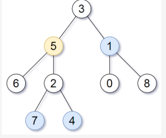

import java.util.*;
class Node{
    int val;
    Node next;
    public Node(int val){
        this.val = val;
    }
}
public class Main {
    public static void main(String[] args) {
        //Scanner in = new Scanner(System.in);
        //int a = in.nextInt();
        //System.out.println(a);
        System.out.println("Hello World!");
    }
    

    public ArrayList<Integer> distanceK(Node node, int target, int  k){
        Queue<Node> q = new LinkedList<>();
        Set<Node> set = new HashSet<>();
        
        q.offer(node);
        set.add(node);
        
        //1、查找5
        findTarget();
        
        //2、遍历5的父节点、左、右
        while(!q.isEmpty()){
            Node cur = q.poll();
            int sz = q.size();
            
            if()
            //只有是需要查找的节点时才进入遍历查找
            for(int i = 0; i < sz; i++){
                //判断
            }
        }
    }
    
    //找到5，返回5.5的父节点存在parent栈中
    Stack<Node> parent = new Stack<>();
    public Node findTarget(Node root ,int target){
       
        if(root == null)    return root;
        
        if(root.val == target)    return root;
        //前序
        parent.add(node);
        
        findTarget(root.left, target);
        findTarget(root.right, target);
        
        parent.poll(node);
        
        if(root.val == target)    return root;
    }

}

在线面试(38134437号房间)第2轮

-  手机视频
-  00:00:00
-  [退出面试房间](javascript:void(0);)
-  [English](javascript:void(0);)

-  [代码考核](javascript:void(0);)
-  [在线演示new](javascript:void(0);)
-  [设备信息](javascript:void(0);)

# 任务

面试官提出的问题将出现在这里。

给定一个二叉树（具有根结点 root）， 一个目标结点值 target ，和一个整数值 K 。

返回到目标结点 target 距离为 K 的所有结点的值的列表。 答案可以以任何顺序返回。

示例 1：

输入：root = [3,5,1,6,2,0,8,null,null,7,4], target = 5, K = 2

输出：[7,4,1]

解释：

所求结点为与目标结点（值为 5）距离为 2 的结点，

值分别为 7，4，以及 1

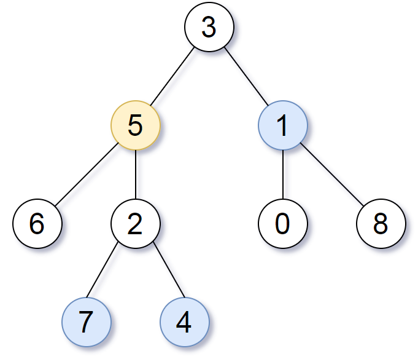

提示：

树上的每个结点都具有唯一的值 0 <= node.val <= 500 。

目标结点 target 是目标值。

func distanceK(root *TreeNode, target int, k int) []int {

}

# 智力题

## 楼层扔鸡蛋


# 性格测评

热情、协作，不能个性太鲜明。个性太鲜明会搞得和团队格格不入。

要把要点转换为自然的语言。自己对团队的贡献是健康的，知道自己心里是健康的。

关于前两次性格测评没有通过的原因，如果有机会的话，您可以透露一下吗，我挺珍惜这个机会的，就算没过，后期也可以自己下去思考一下。

1. 自我介绍

   1. 

2. 项目如何做的，过程中的困难，如何解决、看法

   1. 小组例会，提前熟悉会议内容、对方文档、总结回顾。
   2. 本科到研究生生活的转变和成长。善于利用逆境，积极主动，平稳过度。

3. 优点、缺点

   1. 认真负责，乐于助人，有较强求知欲。
      1. 属于我的工作努力完成，不属于我的工作，我如果可以做，仍然有精力。也会主动把他做了。
   2. 个别情况下会比较关注细节。但是如果大家都认为是正确的方式，那我会暂时接受，下来后自己再自我消化。
   3. 个人想法对别人造成了隐性要求。要开放自己的思维，接收社会及人事物的差异性，自己的想法只用来要去提升自己可以，但是不要给别人造成压力。

4. 为何可以胜任这个工作

   1. 教育背景。学习经历：学校专业对口，各方面专业表现还算优良。工作相关的专业基础知识技能掌握的还行。
   2. 基本技能。
   3. 个人综合素质。性格。
   4. 个人兴趣。

5. 你遇到的挫折是什么

   1. 从本科生到研究生期间，学习生活节奏、整个环境处理事情的适应过程，刚开始有点不太适应。
   2. 音乐、运动，向学长请教，和朋友聊天，积极学习，通过各种方式了解自己的不适应，得到更多有效信息，逐步调整自己的状态。

6. 兴趣爱好

   1. 乒乓球、旅游、看书

7. 对公司的了解程度

8. 看你有哪些技术知识

9. 对自己现在的专业做一个介绍

10. 谈一谈自己对未来的职业规划，为什么想做这个

    1. 首先我选择华为就是基于对未来规划的考虑。
    2. 我为何选择：平台好、企业文化、员工公司实力综合素质比较强，指的学习。
    3. 公司制度、工作流程，比较正规划，对于刚步入社会的学生，没有养成好的额做事习惯、方法的话，对于后期的职业发展非常不利。
    4. 希望在公司，技术、处事方法，尤其是对于思考问题的思维和方式能够有一个更好的提升。
       未来根据自己在工作中具体的表现、适应情况、了解情况，看看自己更适合哪个，具体要根据具体的工作经历和自己的表现。决定往专业性比较强的技术发展，还是偏管理发展。
    5. 我会从程序员先做起，跟着团队一起做项目，在团队中学习和成长，利用3年的时间，充分学习、把握机会，弥补不足，成长为高级程序员；在入职第5年的时候，能够成长为一名可以独立承担工作任务的软件工程师，在业务上更加精进，且有一定的工作技能提升和内在积累，帮助公司取得更好的成果；希望10年以后能够成为一名资深的架构师，成为公司的技术专家，能够独当一面参与更多大项目，在团队中起到更大的作用，与公司一起成长。
       这期间如果公司要我到其他岗位去锻炼的话，我也愿意服从公司的安排，尝试不同的挑战。我相信贵公司应该会有比较合理的成长路线，那么我的职业规划也会变得更具体细化。

11. 问简历相关的东西

12. 对加班的看法

    1. 加班不是目的，目的是为了提高效率，把工作完成。因为项目的进度，必要的加班是不可避免的，但是还是要从中找到提高效率的技巧。

    ​	反对无意义的加班，但是可以接收因公司业务需要而产生的加班。

    

    “如果你与某同事共同参与项目，你的同事多次未能完成自己的任务，导致项目进度缓慢，这时候你会怎么做？”

    首先要保证项目进度，如果我对他的工作比较了解，我可以协助他来加快进度

    如果对他的方向不了解，可以向上反馈找一个人来协助他。

    要把项目做完。

    项目做完之后，针对他的表现，阐述他的表现是什么原因导致的，如果我是组长，会针对他的情况单独交流，然后对其进行改善提升。

    公司首先想要你完成公司的项目。对个人考核的主要目的是帮助你发现问题，解决问题，让个人得到提升，与公司共同进步。目的不是为了惩罚，不要去要求别人，也不能掩盖问题，能帮则帮，时刻要以团队优先。


20211021 华为ATA面试

用过往经历中的具体事例回答，简洁真实。

1. 自我介绍
2. 介绍家庭情况、成长经历。
3. 用一个形容词形容自己的家庭成员。
4. 如果你在工作生活中遇到困难的话，会更愿意和家里人说吗？
5. 你成长过程中什么经历对你影响比较大？
   1. 考研时期的一个老师，肯定我、指导我。
6. 现在还有联系吗？
7. 你觉得这件事现在对你还有什么影响吗？
8. 介绍一下你最好的朋友。
9. 本科时候的朋友吗？
10. 你最欣赏他的一点是什么
    1. 客观理性，包容，倾听
11. 你觉得他有什么待改进的地方吗？
    1. 比较保守
12. 你对于生活中不喜欢的同学或者舍友，要如何处理相处？
13. 但如果他有伤害我或者中伤我，你怎么做？
    1. 交流。
14. 你和同学发生矛盾之后怎么处理的？
    1. 先接受，再客观交流。
15. 那你只是出于善意去安慰，只是方式不适合他，你内心会觉得委屈吗？
16. 被人拒绝的时候，通常会怎么做呢？
17. 你说分情况，具体怎么分情况呢？有什么不同吗？
    1. 关系好的人，更希望一点，亲近的人拒绝，会更加的理解。
18. 收到批评的时候会怎么做？
    1. 感激？。。。
19. 完成项目过程中，有人完不成，你会怎么做？
20. 任务完成过程中遇到的困难，通过你的积极应对得以解决？
    1. 会议流程的改进。着急推进项目
21. 这个方法谁想的？
22. 你觉得解决问题的关键是什么？刚才说的这个事情，解决的关键是什么？
    1. 发现问题，团队成员对你的解决方式有认同
23. 有没有这样的经历，同时面临好几件事情，然后每一件事情都完成了？
    1. 主要是时间分配
24. 平时是怎么平衡自己的工作和生活的？
    1. 时间上的平衡
25. 压力特别大的时候会做些什么
    1. 运动、瑜伽
26. 在什么样的事情来临之前，你会比较紧张？
    1. 未知的事情吧
27. 你紧张的时候会有什么样的行为表现呢？
28. 你觉得最近有什么比较烦心的事情吗？
    1. offer的签约确定。
29. 你和其他人谈过对这件事情的担忧吗？
30. 你觉得导致你这么担心的因素有哪些？
    1. 在意。
31. 最近两三年里面做过最不满意的事情是什么？
    1. 研一没有好好利用课余时间。驱动力不足
32. 现在是研几？
33. 个人发张方向有什么样的考虑？
    1. 技术发展。管理、技术的选择。
34. 你眼中的华为，是什么样的公司？
    1. 有自己核心技术，全力抓紧自己核心点来研究，企业形象、社会价值水到渠成
35. 别人眼中的你是什么样的
    1. 热心、开朗、有主见。近友：有想法，宝藏女孩。
36. 结合工作岗位，说出自己三个优点和缺点
    1. 认真、乐于助人、严谨。关注细节、将自己的要求波及到别人、有些着急。
    2. 建议：专业研究方向。非科班、快速学习能力。


20211027 浙商银行 一面 17min

1. 自我介绍：学习、实习、项目内容。

就简历上的内容进行提问。

1. 意向工作地是西安吗
2. 问项目负责的是什么，主要是后端为主，介绍一下对于c++和java的掌握程度。
3. 博客论坛是自己做的还是和朋友一起做的。
4. 数据库是mysql？redis做什么？最终的点赞数据是存在数据库里面吗？
5. spring的常用注解有哪些？
6. AOP 用的什么设计模型？
7. MYSQL是自学的？索引这一块你了解吗？
8. 你项目中有用到索引吗？
9. 前端怎么做的，前端主流的框架有使用过吗？
10. 研究生项目，详细介绍一下数据的采集？
11. 处理完之后都是用统一的格式传输出去吗？
12. 有提供的Jar包吗？
13. 大概讲解一下工作和生活的毕业三年规划？
14. 日常技术能力提升方面有在做哪些事情？
15. 比赛，比较值得骄傲的地方，介绍一下？本科期间印象比较深的比赛，讲一下。
16. 目前是c++还是java语言，哪个更擅长

后续通过的话会通过短信/邮件与我联系。


