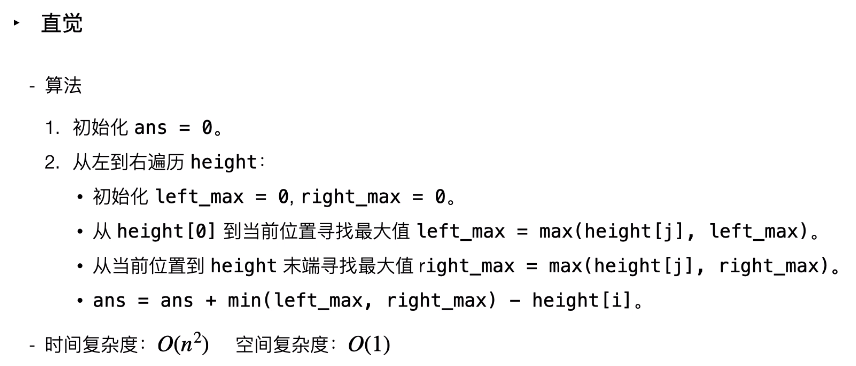
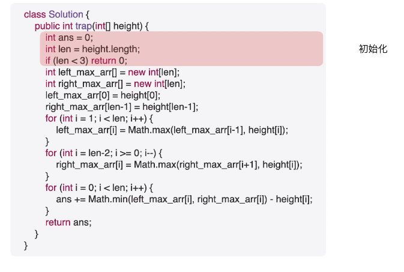

必知必会

## 常用转换

### Scanner

<details><ummary>代码名称</summary>
import java.util.*;
public static void man(String[] args){
    Scanner sc = new Scanner(System.in);
    //
    int n = Integer.parseInt(sc.nextLine());	//"2换行"
    //
    String s = sc.next();						//输入字符串数据
    int a = sc.nextInt();						//"3"
    sc.nextLine();
   	//
    String[] s1 = sc.nextLine().split(",");		//"I,LE,you"
    //
    String s2 = sc.nextLine();					//"isugr,fn"
}
</details>
nextLine会自动识别换行；nextInt会在内存中保留上一次的换行，所以需要额外加一个换行。

### 输出浮点数

```java
System.out.println(String.format("%1$.2f",sum));
```

### String[] → int[]

```java
public int[] stringsToInt(String[] str){
    //方法1：string形式,输入流
    int[] arr = Arrays.stream(str).mapToInt(Integer :: parseInt).toArray();
    
    //方法2: list形式的stream,lambda表达式
    int[] arr = Arrays.asList(str).stream().mapToInt(Integer::parseInt).toArray();
    
    //方法3: for循环
    int[] arr = new int[str.length()];
    for(int i = 0; i < str.lenght(); i++)				 
        arr[i]=Integer.parseInt(str.charAt(i));
}
```

### String[] → list

```java
//方法1: Arrays.asList()
String[] strs = {"aa","bb","ac"};
List<String> list = Arrays.asList(strs);	//aabbac

//方法2: Collections.addAll()
String[] strs = {"aa","bb","ac"};
List<String> list = new ArrayList<>();
Collections.addAll(list, strs);

//方法3: for逐个添加
String[] strs = {"aa","bb","ac"};
List<String> list = new ArrayList<>();
for(String s : strs)	list.add(s);
```

### list → String[]

```java
List<String> list = new ArrayList<>();
list.add("a");
list.add("b");
list.add("c");

//方法1: list.toArray()
String[] strs = list.toArray(new String[list.size()]);

//方法2: for循环依次添加
String[] strs = new String[list.size()];
for(int i = 0; i < list.size(); i++)	strs[i]=list.get(i);
```

### int  ↔ Integer

```java
//int → Integer
int a = 3;
Integer A = new Integer(3);				//方法1
Integer A = new Integer.valueOf(3);		//方法2

//Integer → int
Integer A = new Integer(5);
int a = A.intValue();
```

### int[] 最大值

```java
int[] arr = {1,3,2};
int max = Arrays.stream(arr).max().getAsInt();	//3
```

### list 最大/小值

```java
List<Integer> list = new ArraysList<>();
list.add(1);
list.add(3);
list.add(2);
int min = Collections.min(list);
int max = Collections.max(list);
```

### Integer数组排序


### list 根据字母排序

```java
List<String> list = new ArrayList<>();
Collections.sort(list);
```

### map 根据value排序

map的实现类中，LinkedHashMap按照插入顺序排序；TreeMap根据key自然顺序排序；可传入Comparator排序。

```java
public static <K extends Comparable, V extends Comparable> Map<K,V> sort(Map<K,V> inMap){
    HashMap<K,V> outMap = new LinkedHashMap<>();
    inMap.entrySet().stream().sorted( (p1,p2)->p1.getValue().compareTo(p2.getValue()) ) .connect(Collectrors.toList()).forEach( ele->outMap.put(ele.getKey(), ele.getValue()) );
}
```

### Collections.sort对map、list进行排序

https://www.cnblogs.com/i-tao/p/9105163.html

```java
import java.util.ArrayList;
import java.util.Collections;
import java.util.Comparator;
import java.util.HashMap;
import java.util.List;
import java.util.Map;
import java.util.Map.Entry;
import java.util.TreeMap;

public class Sort {
    public static void main(String[] args) {
        // TreeMap排序1
        Map<String, String> treeMap = new TreeMap<String, String>(new Comparator<String>() {
            public int compare(String o1, String o2) {
                // 升序排序
                return o1.compareTo(o2);
            }
        });
        treeMap.put("c", "ccccc");
        treeMap.put("a", "aaaaa");
        treeMap.put("b", "bbbbb");
        treeMap.put("d", "ddddd");
        // 排序后输出
        for (String key : treeMap.keySet()) {
            System.out.println("Key=" + key + ", Value=" + treeMap.get(key));
        }

        // TreeMap排序2
        Map<String, Integer> treeMap2 = new TreeMap<String, Integer>();
        treeMap2.put("d", 3);
        treeMap2.put("b", 4);
        treeMap2.put("a", 7);
        treeMap2.put("c", 1);
        // 转换成list
        List<Map.Entry<String, Integer>> treeList = new ArrayList<Map.Entry<String, Integer>>(treeMap2.entrySet());
        Collections.sort(treeList, new Comparator<Map.Entry<String, Integer>>() {
            // 升序排序
            public int compare(Entry<String, Integer> o1, Entry<String, Integer> o2) {
                return o1.getValue().compareTo(o2.getValue());
            }
        });
        // 排序后输出
        for (Map.Entry<String, Integer> m : treeList) {
            System.out.println("Key=" + m.getKey() + ", Value=" + m.getValue());
        }

        // HashMap排序
        Map<String, Integer> hashMap = new HashMap<String, Integer>();
        hashMap.put("c", 3);
        hashMap.put("a", 2);
        hashMap.put("b", 1);
        hashMap.put("d", 4);
        List<Map.Entry<String, Integer>> hashList = new ArrayList<Map.Entry<String, Integer>>(hashMap.entrySet());
        Collections.sort(hashList, new Comparator<Map.Entry<String, Integer>>() {
            // 升序排序
            public int compare(Entry<String, Integer> o1, Entry<String, Integer> o2) {
                return o1.getValue().compareTo(o2.getValue());
            }
        });
        // 排序后输出
        for (Map.Entry<String, Integer> m : hashList) {
            System.out.println("Key=" + m.getKey() + ", Value=" + m.getValue());
        }

        // List<Integer>排序
        List<Integer> nums = new ArrayList<Integer>();
        nums.add(3);
        nums.add(5);
        nums.add(2);
        nums.add(1);
        // 升序排序（默认）
        Collections.sort(nums);
        // 排序后输出
        System.out.println(nums);

        // List<Bean>排序
        List<User> users = new ArrayList<User>();
        users.add(new User(2, "jack"));
        users.add(new User(1, "tom"));
        users.add(new User(3, "keck"));
        users.add(new User(4, "tao"));
        // id升序排序
        Collections.sort(users);
        // 排序后输出
        for (User user : users) {
            System.out.println(user.getId() + "," + user.getName());
        }

        // List<Map>排序
        List<Map<String, Integer>> listMap = new ArrayList<Map<String, Integer>>();
        Map<String, Integer> map = new HashMap<>();
        map.put("age", 20);
        map.put("sex", 1);
        listMap.add(map);
        Map<String, Integer> map2 = new HashMap<>();
        map2.put("age", 29);
        map2.put("sex", 2);
        listMap.add(map2);
        Map<String, Integer> map3 = new HashMap<>();
        map3.put("age", 35);
        map3.put("sex", 1);
        listMap.add(map3);
        // 按照map值排序
        Collections.sort(listMap, new Comparator<Map<String, Integer>>() {
            @Override
            public int compare(Map<String, Integer> o1, Map<String, Integer> o2) {
                return o1.get("age").compareTo(o2.get("age"));// age升序排序
            }
        });
        // 排序后输出
        for (Map<String, Integer> m : listMap) {
            System.out.println(m);
        }
    }
}
```

2.List<User>排序的User.java类：

```java
package com.tao.test;

public class User implements Comparable<User>{
    
    private int id;
    private String name;

    public User(int id, String name) {
        super();
        this.id = id;
        this.name = name;
    }

    public String getName() {
        return name;
    }

    public void setName(String name) {
        this.name = name;
    }

    public int getId() {
        return id;
    }

    public void setId(int id) {
        this.id = id;
    }

    @Override
    public int compareTo(User o) {
        return this.id - o.getId();//id升序排序
    }
}
```


### 建类对象，comparator重写排序

对成绩，按照排名、总分、语文、数学、英语、姓名依次排序：

建立student类，包含rank、total、name、chinese、math、english属性及构造函数、get和set方法。

在功能函数中，将指定值添加到list中，并重写comparator实现依次排序。

```java
class Student{
    private int rank = 0;	//可以初始化默认值
    private String name = "";	
    private int total = 0;
    private int chinese = 0;
    private int math = 0;
    private int english;
    
    public Student(String n,int c, int m, int e){
        this.name = n;
        this.chinese = c;
        this.math = m;
        this.english = e;
        this.total = c + m + e;
    }
    int
    public int getTotal(){ 		return total;}
    public String getName(){ 	return name;}
    public int getChinese(){ 	return chinese;}
    public int getMath(){ 		return math;}
    public int getEnglish(){ 	return english;}
    
    public void setName(String n){ 		this.name = n; }
    
    @Override
    public String toString(){	return name + " " + rank; }
}

public void TestStudent(){
    Student student = new Student("zhang",80,90,100);
    Student student1 = new Student("li",80,90,100);
    List<Student> list = new ArrayList<>();
    list.add(student);
    list.add(student1);
    
    Collections.sort(list, new Comparator<Student>(){
       @Override
        public int compare(Student o1, Student o2){
            int num0 = o2.getTotal() - o1.getTotal();	//o2-o1，整体降序排列
            int num1 = num0 == 0 ? o2.getChinese() - o1.getChinese() : num0;	//上一个比较值相等，则比较下一级；否则值一直往后传递到最后
            int num2 = num1 == 0 ? o2.getMath() - o1.getMath() : num1;
            int num3 = num2 == 0 ? o2.getEnglish() - o1.getEnglish() : num2;
            int num4 = num3 == 0 ? o1.getName().compareTo(o2.getName()) : num3;	//o1-o2，按照name整体升序，默认的
            return num4;
        }
    });
    
    //按照要求遍历设置rank，进行输出即可。
}
```

### int[] [] 创建

```java
int[][] a = new int[10][];
int[][] a = new int[10][10];
int[][] a = {{1,2},{3,4}};
int a[][] = new int[10][10];
int a[10][] = new int[][];
int a[10][10] = new int[][];
```

### 输出double类型小数

```java
%.2f表示保留后两位，能四舍五入。
double d = 114.145;
String.format("%.2f", d);
```

### Math.pow(2,5);

```
double pow(double base, double exponent)
```

### 生成随机数

方法1：借助java.util.Random类，产生一个随机数发生器。其有两个构造函数：

1. Random()：以时间为默认种子。每次的种子是不一样的，所以每次运行该程序输出的结果是不一样的
2. Random(long seed)：以指定的种子值进行。种子是产生随机数的第一次使用值，机制是通过一个函数，将这个种子的值转化为随机数空间中的某一个点，且产生的随机数均匀散布在空间中，后续产生的随机数都与前一个随机数有关。

```java
import java.util.Random;
public void createRandom(){
    //1、时间为默认种子
    Random r = new Random();
    System.out.println( r.nextInt() );	//2 5 每次运行结果不一样
    
    //2、指定种子
    Random r = new Random(1);
    System.out.print( r.nextInt() );	//3 3 每次运行结果一样
}

```


### 打印HashSet 

```java

public static void main(String[] args) {
    HashSet h = new HashSet();
    h.add("1");
    h.add("2");
    h.add("3");
    h.add("4");
    h.add("1");//set不可重复，覆盖

    //1、
    System.out.print(h);//默认调用toString
    
    //2、
    for (Object object : h) {
        System.out.print(object);
    }
    
    //3、
    Iterator i = h.iterator();
    while(i.hasNext()){
        System.out.print(i.next());
    }
	
    //4、
    Object[] elements = set.toArray();	//for循环打印
}
```


---

## 双指针

### 快慢指针

一般初始化为指向链表头结点head，前进时，快指针在前，慢指针在后。
只要数组有序，就应该想到双指针技巧。

#### 1、判定链表中有环

经典解法：两指针，A每次前进一步，B每次前进两步。若不含环，跑得快的指针B最终遇到null，说明链表不含环。若含有换，快指针B最终会超慢指针一圈，和慢指针A相遇，说明链表含有环。

```java
boolean hasCycle(ListNode head){
    ListNode fast, slow;
    fast = slow = head;
    while(fast !=  null && fast.next != null){
        fast = fast.next.next;
        slow = slow.next;
        
        if(fast == slow)	return true;
    }
    return false;
}
```

#### 2、已知链表中有环，返回环起始位置。

当快慢指针相遇时，让其中一个指针重新指向头结点，然后让它俩以相同速度前进，再次相遇时的节点位置就是环最开始的位置。
解法：
fast每次2步，slow每次1步；
若fast走到尾，while结束条件为null，则表明链表五无环返回null。若fast与slow相遇，则相遇点在环上的某个位置，不一定是起点。
设相遇时slow走了`s`步，fast走了`f`步，→ `f = 2s`；
设链表头到环入口距离`a`个节点(不包括入口节点)，环长度`b`个节点。相遇时fast比slow多走了nb步(n圈环，n>=1)，双指针都走过 *a* 步，然后在环内绕圈直到重合，重合时 `fast` 比 `slow` 多走 **环的长度整数倍** 。→ `f = s + nb`; 
推导得出：`s = nb ; f = 2nb`;
如果让指针从链表头部一直向前走并统计步数`k`，那么所有 走到链表入口节点时的步数 是：`k=a+nb`（先走 a 步到入口节点，之后每绕 1 圈环（ b 步）都会再次到入口节点）。
而目前，slow 指针走过的步数为 nb 步。因此，我们只要想办法让 slow 再走 a 步停下来，就可以到环的入口。
但是我们不知道 aa 的值，该怎么办？依然是使用双指针法。我们构建一个指针，此指针需要有以下性质：`此指针和slow 一起向前走 a 步后，两者在入口节点重合`。那么从哪里走到入口节点需要 a 步？答案是链表头部head。
双指针第二次相遇：

```java
ListNode detectCycle(ListNode head){
    ListNode fast,slow;
    fast = slow = head;
    while(fast != null && fast.next != null){
        fast = fast.next.next;
        slow = slow.next;
        
        if(fast == slow){
           break;				//跳出然后处理另外的逻辑，就不用在这个里面写很多了
        }
    }
    
    slow = head;
    while(slow != fast){
        slow = slow.next;
        fast = fast.next;
    }
    return slow;
}
```

#### 3、寻找链表中点

快指针一次前进两步，慢指针一次前进一步，当快指针到达链表尽头时，慢指针就处于链表的中间位置。
链表长度为奇数时，slow恰好停在中点位置；若长度是偶数，slow最终位置是中间偏右。

```java
ListNode findMidNode(LsitNode head){
    ListNode fast,slow;
	fast = slow = head;
    while(fast != null && fast.next != null){
        fast = fast.next.next;
        slow = slow.next;
    }
    return slow;
}
```

#### 4、寻找链表倒数第k个元素

快指针先走k步，然后快慢指针开始同速前进。当快指针走到链表末尾null时，慢指针位置所在的位置就是倒数第k个链表节点。（最后一步是倒数第一个节点）

```java
ListNode findReverseKthNode(ListNode head){
    ListNode fast = head, slow = head;
    while(k >= 0){
        fast = fast.next;
    }
    
    while(fast != null){
        slow = slow.next;
        fast = fast.next;
    }
    return slow;
}
```

### 左右指针

左右指针在数组中实际是指两个索引值，一般初始化为left = 0, right = nums.length -1;

双指针的作用就是定位左右边界，双指针的核心是什么时候移动指针、指针从什么地方开始为起始点。
双指针：扩散法、夹逼法、滑动窗口平移法。

#### 1、二分查找（下文有具体分析）

```java
int binarySearch(int[] nums, int target){
    int left = 0;
    int right = nums.length - 1;
    while(left <= right){
        int mid = left + (right - left) / 2;
        if(nums[mid] == target){
            return mid;
        }else if(nums[mid] < target){
            left = mid + 1;
        }else if(nums[mid] > target){
            right = mid - 1;
        }
    }
    return -1;
}
```

#### 2、两数之和

通过调整left和right可以调整sum大小。

```java
int[] towSum(int[] nums, int target){
	int left = 0;
    int right = nums.length - 1;
    while(left < right){
        int sum = nums[left] + nums[right];
        if(sum == target){
            return new int[]{left + 1, right + 1};	//题目要求的索引是从1开始的
        }else if(sum < target){
            left++;
        }else if(sum > target){
            right--;
        }
    }
    return new int[]{-1,-1};
}
```

#### 3、反转数组

```java
void reverse(int[] nums){
    int left = 0;
    int right = nums.length - 1;
    while(left <right){
        //swap(nums[left],nums[right])
        int temp = nums[left];
        nums[left] = nums[right];
        nums[right] = temp;
        
        left++;
        right--;
    }
}
```

#### 4、滑动窗口算法

```java
/*滑动窗口算法框架*/
void slidingWindow(String s, String t){
    //1、初始化。need保存匹配字符串t中各字符出现次数，
    HashMap<Character, Integer> need, window;
    for(Character c : t)	need.put(c, need.getOrDefault(c,0) + 1);	
    
    //2、从头到尾遍历，滑动
    int left = 0, right = 0;
    int valid = 0;				//记录window中有效字符的个数
    while(right < s.length()){
        char c = s.get(right);	//c是将移入窗口的字符
        //3、右移窗口。window.add(s[right]);
        right++;
        //...				//进行窗口内一系列更新

        /*** debug 输出的位置 ***/
        printf("window: [%d, %d)\n", left, right);
        /********************/
        
        //4、判断窗口是否要收缩
        while(window needs shrink){
            char d = s.get(left);		//d是将要移出窗口的字符
            //5、缩小窗口。左移左指针。window.remove(s[lefft]);
            left++;
            //...				//进行窗口内数据的一系列更新
        }
    }
}
```

##### 1、最小覆盖子串76

题：找出字符串S中，包含字符串T所有字母的，最小子串。

need和window相当于计数器，分别记录T中字符出现次数、窗口中对应字符出现次数。

方法1：哈希保存对应字符及出现次数

```java
/**
1、当移动right扩大窗口，即加入字符时，应该更新哪些数据？
2、什么条件下，窗口应该暂停扩大，开始移动left缩小窗口？
3、当移动left缩小窗口，即移出字符时，应该更新哪些数据？
4、我们要的结果应该在扩大窗口时还是缩小窗口时进行更新？
 */
class Solution {
    public String minWindow(String s, String t) {
        //1、初始化临时空间变量。map有contains方法，可以判断滑动窗口、t中是否包含某些字符
        HashMap<Character,Integer> need= new HashMap<>();       //记录t中每个字符的出现次数，索引对应的就是当前字符在t中的位置
        HashMap<Character,Integer> window= new HashMap<>();      //记录滑动窗口中每个字符出现的次数

        //2、初始化need表，统计t中出现的字符及其对应次数
        for(char ch : t.toCharArray()){
             need.put(ch, need.getOrDefault(ch,0) + 1);    //初始化tLen个字符，默认值为1，意思是针对于t中的字符，需要几个，需要1个
         }

        //3、从头到尾遍历S,并更新滑动窗口中的字符统计
        int left = 0, right = 0;   //使用left、right初始化窗口两端，[left,right)。right从头位置开始进行遍历，初始化为0
        int valid = 0;              //统计滑动窗口中满足条件的字符个数
        int start = 0, len = Integer.MAX_VALUE;        //记录最小覆盖子串的起始索引及长度，用来最后返回结果
        while(right < s.length()){

            //4、开始滑动。移动right，扩大窗口时，更新数据
            char c = s.charAt(right);           //提取出来，在下面使用的更方便
            right++;                        //右移窗口
            if(need.containsKey(c)){        //进行窗口内一系列更新
                window.put(c,window.getOrDefault(c,0) + 1);
                if(window.get(c).equals(need.get(c))){
                    valid++;
                }
            }

            // //debug
            // System.out.println(left + "" + right);
                   
            //5、判断左侧窗口是否需要进行收缩
             while(valid == need.size()){
                if(right - left < len){		//判断是否找到了合法的子串，更新最小子串头尾记录
                    start = left;
                    len = right - left;
                }

                char d = s.charAt(left);        //保存即将移出滑动窗口的字符
                left++;                 		//滑动窗口左边界收缩

                //进行窗口内数据更新
                if(need.containsKey(d)){
                    if(window.get(d).equals(need.get(d))){
                        valid--;
                    }
                    window.put(d, window.getOrDefault(d,0)-1);
                }
            } 
        }
        //6、返回结果
        return len==Integer.MAX_VALUE ? "" : s.substring(start,start+len);
    }
}
```

方法2：数组保存对应字符及其出现次数

```java
//方法1，数组实现hash临时数组
class Solution {
    public String minWindow(String s, String t) {
        char[] chars = s.toCharArray(), chart = t.toCharArray();
        int sLen = chars.length, tLen = chart.length;

        int[] hash = new int[128];          //java整数数组默认值是0
        for(char ch : chart) hash[ch]--;    //t中所包含的字符，tLen个全部初始化为0-1=-1；

        String res = "";                    //如果s中不包含t中的全部字符，则返回空字符
        for(int r=0, l=0, cnt=0; r<sLen; r++){      //进行s从左往右的遍历
            hash[chars[r]]++;               //无论是不是首次出现，先将当前字符的hash数组中的个数加1
            if(hash[chars[r]] <= 0) cnt++;  //从-1变为0，说明该字符首次出现，cnt计数加1

            while(cnt == tLen && hash[chars[l]] > 0) {   //当滑动窗口中t中所有字符均具有了，并且滑动窗口左边字符个数>0，即为2个的时候，缩短滑动窗口左边
                hash[chars[l]]--;           //从滑动窗口中移除最左边出现的字符
                l++;                        //并且左边指针向后移动一个
            }

            if(cnt == tLen){                //每当滑动窗口中出现全部字符时，比较长度之后，更新最小的s子字符串
                if(res.equals("") || res.length() > r-l+1){
                    res = s.substring(l, r + 1);        //注意此处是闭区间
                }
            }
        }
        return res;
    }
}   
```

##### 2、字符串排列包含567

题：判断s2是否包含s1的排列。s1字符可重复

```java
class Solution {
    public boolean checkInclusion(String s1, String s2) {
        char[] pattern = s1.toCharArray();   //子字符串。注意此处是字符串数组
        char[] text = s2.toCharArray();      //被遍历的字符串

        int pLen = s1.length();        
        int tLen = s2.length();

        int pCount = 0;                     //字符串s1中所包含的字符种类数
        int winCount = 0;                   //滑动窗口中所包含的字符种类数。注：当两字符的频数相等时才计数

        int[] pFre = new int[26];           //保存s1中将出现的可能的所有字符的频数
        int[] winFre = new int [26];        //保存滑动窗口中出现字符的对应频数

        for(int i=0; i<pLen; i++){          //给1中出现的字符，初始化其对应的频数pFre数组
            pFre[pattern[i] - 'a']++;
        }

        for(int i=0; i<26; i++){            //初始化s1中出现字符的总数
            if(pFre[i] > 0){
                pCount++;
            }
        }

        int left = 0, right = 0;            //遍历s2的两个指针。也即滑动窗口两边的边界索引
        while(right < tLen){                //对s2的字符从左往右进行遍历。结束条件为right遍历完s2
            //进行滑动窗口的字符、字符频数的判断更新
            int indexRight = text[right] - 'a';     //当前字符的ASCII码值
            if(pFre[indexRight] > 0){               //在s1中，s2的当前出现字符的频数>0，则在滑动窗口中也进行更新对应字符的频数
                winFre[indexRight]++;

                //更新滑动窗口中所包含的字符种类数
                if(winFre[indexRight] == pFre[indexRight]){     //如果滑动窗口中当前字符出现的次数=s1中当前字符出现的个数，则滑动窗口所包含字符种类数+1
                    winCount++;
                }
            }

            right++;                        //右指针往后移动一个

            //进行左边界的收缩判别。可以进行收缩的条件是滑动窗口符合题目要求条件
            while(pCount == winCount){
            //注意内层循环中的当前字符索引位为左边界索引，不要继续用上面的右边界索引

                if(right - left == pLen){
                    return true;            //在上面判断完各字符出现频数、字符种类数的情况下，如果滑动窗口长度=s1长度，则满足所有条件直接返回真
                }

                int indexLeft = text[left] - 'a';
                //执行收缩左边界对应的更新滑动窗口中的内容
                if(pFre[indexLeft] > 0){       //如果s1中当前字符出现次数>0。因为上面比较过了，相等才会到下面，所以滑动窗口中该字符个数也是>0的
                    winFre[indexLeft]--;       //滑动窗口中对应左边界字符频数-1

                    //如果当前字符在滑动窗口中频数是1个（即s1中该字符只出现1次），当将其移出左边界之后，滑动窗口中的字符种类数也要进行-1的更新操作
                    if(winFre[indexLeft] < pFre[indexLeft]){      //因为上一句中，当前字符频次数-1了，所以此处的判别条件也可以为！=，也可以为<，不为=是因为前面是=才走到这一步的
                        winCount--;
                    }
                }

                //左边界收缩
                left++;
            }   //pCount!=winCount，即滑动窗口中不满足要求，左边界结束收缩，跳出内循环，进入右
        }   //right遍历到s2尾部，遍历结束
         return false;
    }
}
```

方法2：通不过一个特别长的用例

```java
//东哥滑动窗口
class Solution {
    public boolean checkInclusion(String s1, String s2) {
        String s = s2, t = s1;
    // public String minWindow(String s, String t) {
        //1、初始化临时空间变量。map有contains方法，可以判断滑动窗口、t中是否包含某些字符
        HashMap<Character,Integer> need= new HashMap<>();       //记录t中每个字符的出现次数，索引对应的就是当前字符在t中的位置
        HashMap<Character,Integer> window= new HashMap<>();      //记录滑动窗口中每个字符出现的次数

        //2、初始化need表，统计t中出现的字符及其对应次数
        for(char ch : t.toCharArray()){
             need.put(ch, need.getOrDefault(ch,0) + 1);    //初始化tLen个字符，默认值为1，意思是针对于t中的字符，需要几个，需要1个
         }

        //3、从头到尾遍历S,并更新滑动窗口中的字符统计
        int left = 0, right = 0;   //使用left、right初始化窗口两端，[left,right)。right从头位置开始进行遍历，初始化为0
        int valid = 0;              //统计滑动窗口中满足条件的字符个数
        while(right < s.length()){

            //4、开始滑动。移动right，扩大窗口时，更新数据
            char c = s.charAt(right);           //提取出来，在下面使用的更方便
            right++;                        //右移窗口
            if(need.containsKey(c)){        //进行窗口内一系列更新
                window.put(c,window.getOrDefault(c,0) + 1);
                if(window.get(c) == need.get(c)){
                    valid++;
                }
            }

            // //debug
            // System.out.println(left + "" + right);
                   
            //5、判断左侧窗口是否需要进行收缩
             while(right - left >= t.length()){
                if(valid == need.size()){		//判断是否找到了合法的子串，更新最小子串头尾记录
                    return true;
                }

                char d = s.charAt(left);        //保存即将移出滑动窗口的字符
                left++;                 		//滑动窗口左边界收缩

                //进行窗口内数据更新
                if(need.containsKey(d)){
                    if(window.get(d) == need.get(d)){
                        valid--;
                    }
                    window.put(d, window.getOrDefault(d,0)-1);
                }
            } 
        }
        //6、返回结果
        return false;
    }
}
```


##### 3、找字母所有字母异位词 438

题：相当于，输入一个串`S`，一个串`T`，找到`S`中所有`T`的排列，返回它们的起始索引。

通不过：

```
"aaaaaaaaaaaaaaaaaaaaaaaaaaaaaaaaaaaaaaaaaaaaaaaaaaaaaaaaaaaaaaaaaaaaaaaaaaaaaaaaaaaaaaaaaaaaaaaaaaaaaaaaaaaaaaaaaaaaaaaaaaaaaaaaaaaaaaaaaaaaaaaaaaaaaaaaaaaaaaaaaaaaaaaaaaaaaaaaaaaaaaaaaaaaaaaaaaaaaaaaaaaaaaaaaaaaaaaaaaaaaaaaaaaaaaaaaaaaaaaaaaaaaaaaaaaaaaaaaaaaaaaaaaaaaaaaaaaaaaaaaaaaaaaaaaaaaaaaaaaaaaaaaaaaaaaaaaaaaaaaaaaaaaaaaaaaaaaaaaaaaaaaaaaaaaaaaaaaaaaaaaaaaaaaaaaaaaaaaaaaaaaaaaaaaaaaaaaaaaaaaaaaaaaaaaaaaaaaaaaaaaaaaaaaaaaaaaaaaaaaaaaaaaaaaaaaaaaaaaaaaaaaaaaaaaaaaaaaaaaaaaaaaaaaaaaaaaaaaaaaaaaaaaaaaaaaaaaaaaaaaaaaaaaaaaaaaaaaaaaaaaaaaaaaaaaaaaaaaaaaaaaaaaaaaaaaaaaaaaaaaaaaaaaaaaaaaaaaaaaaaaaaaaaaaaaaaaaaaaaaaaaaaaaaaaaaaaaaaaaaaaaaaaaaaaaaaaaaaaaaaaaaaaaaaaaaaaaaaaaaaaaaaaaaaaaaaaaaaaaaaaaaaaaaaaaaaaaaaaaaaaaaaaaaaaaaaaaaaaaaaaaaaaaaaaaaaaaaaaaaaaaaaaaaaaaaaaaaaaaaaaaaaaaaaaaaaaaaaaaaaaaaaaaaaaaaaaaaaaaaaaaaaaaaaaaaaaaaaaaaaaaaaaaaaaaaaaaaaaaaaaaaaaaaaaaaaaaaaaaaaaaaaaaaaaaaaaaaaaaaaaaaaaaaaaaaaaaaaaaaaaaaaaaaaaaaaaaaaaaaaaaaaaaaaaaaaaaaaaaaaaaaaaaaaaaaaaaaaaaaaaaaaaaaaaaaaaaaaaaaaaaaaaaaaaaaaaaaaaaaaaaaaaaaaaaaaaaaaaaaaaaaaaaaaaaaaaaaaaaaaaaaaaaaaaaaaaaaaaaaaaaaaaaaaaaaaaaaaaaaaaaaaaaaaaaaaaaaaaaaaaaaaaaaaaaaaaaaaaaaaaaaaaaaaaaaaaaaaaaaaaaaaaaaaaaaaaaaaaaaaaaaaaaaaaaaaaaaaaaaaaaaaaaaaaaaaaaaaaaaaaaaaaaaaaaaaaaaaaaaaaaaaaaaaaaaaaaaaaaaaaaaaaaaaaaaaaaaaaaaaaaaaaaaaaaaaaaaaaaaaaaaaaaaaaaaaaaaaaaaaaaaaaaaaaaaaaaaaaaaaaaaaaaaaaaaaaaaaaaaaaaaaaaaaaaaaaaaaaaaaaaaaaaaaaaaaaaaaaaaaaaaaaaaaaaaaaaaaaaaaaaaaaaaaaaaaaaaaaaaaaaaaaaaaaaaaaaaaaaaaaaaaaaaaaaaaaaaaaaaaaaaaaaaaaaaaaaaaaaaaaaaaaaaaaaaaaaaaaaaaaaaaaaaaaaaaaaaaaaaaaaaaaaaaaaaaaaaaaaaaaaaaaaaaaaaaaaaaaaaaaaaaaaaaaaaaaaaaaaaaaaaaaaaaaaaaaaaaaaaaaaaaaaaaaaaaaaaaaaaaaaaaaaaaaaaaaaaaaaaaaaaaaaaaaaaaaaaaaaaaaaaaaaaaaaaaaaaaaaaaaaaaaaaaaaaaaaaaaaaaaaaaaaaaaaaaaaaaaaaaaaaaaaaaaaaaaaaaaaaaaaaaaaaaaaaaaaaaaaaaaaaaaaaaaaaaaaaaaaaaaaaaaaaaaaaaaaaaaaaaaaaaaaaaaaaaaaaaaaaaaaaaaaaaaaaaaaaaaaaaaaaaaaaaaaaaaaaaaaaaaaaaaaaaaaaaaaaaaaaaaaaaaaaaaaaaaaaaaaaaaaaaaaaaaaaaaaaaaaaaaaaaaaaaaaaaaaaaaaaaaaaaaaaaaaaaaaaaaaaaaaaaaaaaaaaaaaaaaaaaaaaaaaaaaaaaaaaaaaaaaaaaaaaaaaaaaaaaaaaaaaaaaaaaaaaaaaaaaaaaaaaaaaaaaaaaaaaaaaaaaaaaaaaaaaaaaaaaaaaaaaaaaaaaaaaaaaaaaaaaaaaaaaaaaaaaaaaaaaaaaaaaaaaaaaaaaaaaaaaaaaaaaaaaaaaaaaaaaaaaaaaaaaaaaaaaaaaaaaaaaaaaaaaaaaaaaaaaaaaaaaaaaaaaaaaaaaaaaaaaaaaaaaaaaaaaaaaaaaaaaaaaaaaaaaaaaaaaaaaaaaaaaaaaaaaaaaaaaaaaaaaaaaaaaaaaaaaaaaaaaaaaaaaaaaaaaaaaaaaaaaaaaaaaaaaaaaaaaaaaaaaaaaaaaaaaaaaaaaaaaaaaaaaaaaaaaaaaaaaaaaaaaaaaaaaaaaaaaaaaaaaaaaaaaaaaaaaaaaaaaaaaaaaaaaaaaaaaaaaaaaaaaaaaaaaaaaaaaaaaaaaaaaaaaaaaaaaaaaaaaaaaaaaaaaaaaaaaaaaaaaaaaaaaaaaaaaaaaaaaaaaaaaaaaaaaaaaaaaaaaaaaaaaaaaaaaaaaaaaaaaaaaaaaaaaaaaaaaaaaaaaaaaaaaaaaaaaaaaaaaaaaaaaaaaaaaaaaaaaaaaaaaaaaaaaaaaaaaaaaaaaaaaaaaaaaaaaaaaaaaaaaaaaaaaaaaaaaaaaaaaaaaaaaaaaaaaaaaaaaaaaaaaaaaaaaaaaaaaaaaaaaaaaaaaaaaaaaaaaaaaaaaaaaaaaaaaaaaaaaaaaaaaaaaaaaaaaaaaaaaaaaaaaaaaaaaaaaaaaaaaaaaaaaaaaaaaaaaaaaaaaaaaaaaaaaaaaaaaaaaaaaaaaaaaaaaaaaaaaaaaaaaaaaaaaaaaaaaaaaaaaaaaaaaaaaaaaaaaaaaaaaaaaaaaaaaaaaaaaaaaaaaaaaaaaaaaaaaaaaaaaaaaaaaaaaaaaaaaaaaaaaaaaaaaaaaaaaaaaaaaaaaaaaaaaaaaaaaaaaaaaaaaaaaaaaaaaaaaaaaaaaaaaaaaaaaaaaaaaaaaaaaaaaaaaaaaaaaaaaaaaaaaaaaaaaaaaaaaaaaaaaaaaaaaaaaaaaaaaaaaaaaaaaaaaaaaaaaaaaaaaaaaaaaaaaaaaaaaaaaaaaaaaaaaaaaaaaaaaaaaaaaaaaaaaaaaaaaaaaaaaaaaaaaaaaaaaaaaaaaaaaaaaaaaaaaaaaaaaaaaaaaaaaaaaaaaaaaaaaaaaaaaaaaaaaaaaaaaaaaaaaaaaaaaaaaaaaaaaaaaaaaaaaaaaaaaaaaaaaaaaaaaaaaaaaaaaaaaaaaaaaaaaaaaaaaaaaaaaaaaaaaaaaaaaaaaaaaaaaaaaaaaaaaaaaaaaaaaaaaaaaaaaaaaaaaaaaaaaaaaaaaaaaaaaaaaaaaaaaaaaaaaaaaaaaaaaaaaaaaaaaaaaaaaaaaaaaaaaaaaaaaaaaaaaaaaaaaaaaaaaaaaaaaaaaaaaaaaaaaaaaaaaaaaaaaaaaaaaaaaaaaaaaaaaaaaaaaaaaaaaaaaaaaaaaaaaaaaaaaaaaaaaaaaaaaaaaaaaaaaaaaaaaaaaaaaaaaaaaaaaaaaaaaaaaaaaaaaaaaaaaaaaaaaaaaaaaaaaaaaaaaaaaaaaaaaaaaaaaaaaaaaaaaaaaaaaaaaaaaaaaaaaaaaaaaaaaaaaaaaaaaaaaaaaaaaaaaaaaaaaaaaaaaaaaaaaaaaaaaaaaaaaaaaaaaaaaaaaaaaaaaaaaaaaaaaaaaaaaaaaaaaaaaaaaaaaaaaaaaaaaaaaaaaaaaaaaaaaaaaaaaaaaaaaaaaaaaaaaaaaaaaaaaaaaaaaaaaaaaaaaaaaaaaaaaaaaaaaaaaaaaaaaaaaaaaaaaaaaaaaaaaaaaaaaaaaaaaaaaaaaaaaaaaaaaaaaaaaaaaaaaaaaaaaaaaaaaaaaaaaaaaaaaaaaaaaaaaaaaaaaaaaaaaaaaaaaaaaaaaaaaaaaaaaaaaaaaaaaaaaaaaaaaaaaaaaaaaaaaaaaaaaaaaaaaaaaaaaaaaaaaaaaaaaaaaaaaaaaaaaaaaaaaaaaaaaaaaaaaaaaaaaaaaaaaaaaaaaaaaaaaaaaaaaaaaaaaaaaaaaaaaaaaaaaaaaaaaaaaaaaaaaaaaaaaaaaaaaaaaaaaaaaaaaaaaaaaaaaaaaaaaaaaaaaaaaaaaaaaaaaaaaaaaaaaaaaaaaaaaaaaaaaaaaaaaaaaaaaaaaaaaaaaaaaaaaaaaaaaaaaaaaaaaaaaaaaaaaaaaaaaaaaaaaaaaaaaaaaaaaaaaaaaaaaaaaaaaaaaaaaaaaaaaaaaaaaaaaaaaaaaaaaaaaaaaaaaaaaaaaaaaaaaaaaaaaaaaaaaaaaaaaaaaaaaaaaaaaaaaaaaaaaaaaaaaaaaaaaaaaaaaaaaaaaaaaaaaaaaaaaaaaaaaaaaaaaaaaaaaaaaaaaaaaaaaaaaaaaaaaaaaaaaaaaaaaaaaaaaaaaaaaaaaaaaaaaaaaaaaaaaaaaaaaaaaaaaaaaaaaaaaaaaaaaaaaaaaaaaaaaaaaaaaaaaaaaaaaaaaaaaaaaaaaaaaaaaaaaaaaaaaaaaaaaaaaaaaaaaaaaaaaaaaaaaaaaaaaaaaaaaaaaaaaaaaaaaaaaaaaaaaaaaaaaaaaaaaaaaaaaaaaaaaaaaaaaaaaaaaaaaaaaaaaaaaaaaaaaaaaaaaaaaaaaaaaaaaaaaaaaaaaaaaaaaaaaaaaaaaaaaaaaaaaaaaaaaaaaaaaaaaaaaaaaaaaaaaaaaaaaaaaaaaaaaaaaaaaaaaaaaaaaaaaaaaaaaaaaaaaaaaaaaaaaaaaaaaaaaaaaaaaaaaaaaaaaaaaaaaaaaaaaaaaaaaaaaaaaaaaaaaaaaaaaaaaaaaaaaaaaaaaaaaaaaaaaaaaaaaaaaaaaaaaaaaaaaaaaaaaaaaaaaaaaaaaaaaaaaaaaaaaaaaaaaaaaaaaaaaaaaaaaaaaaaaaaaaaaaaaaaaaaaaaaaaaaaaaaaaaaaaaaaaaaaaaaaaaaaaaaaaaaaaaaaaaaaaaaaaaaaaaaaaaaaaaaaaaaaaaaaaaaaaaaaaaaaaaaaaaaaaaaaaaaaaaaaaaaaaaaaaaaaaaaaaaaaaaaaaaaaaaaaaaaaaaaaaaaaaaaaaaaaaaaaaaaaaaaaaaaaaaaaaaaaaaaaaaaaaaaaaaaaaaaaaaaaaaaaaaaaaaaaaaaaaaaaaaaaaaaaaaaaaaaaaaaaaaaaaaaaaaaaaaaaaaaaaaaaaaaaaaaaaaaaaaaaaaaaaaaaaaaaaaaaaaaaaaaaaaaaaaaaaaaaaaaaaaaaaaaaaaaaaaaaaaaaaaaaaaaaaaaaaaaaaaaaaaaaaaaaaaaaaaaaaaaaaaaaaaaaaaaaaaaaaaaaaaaaaaaaaaaaaaaaaaaaaaaaaaaaaaaaaaaaaaaaaaaaaaaaaaaaaaaaaaaaaaaaaaaaaaaaaaaaaaaaaaaaaaaaaaaaaaaaaaaaaaaaaaaaaaaaaaaaaaaaaaaaaaaaaaaaaaaaaaaaaaaaaaaaaaaaaaaaaaaaaaaaaaaaaaaaaaaaaaaaaaaaaaaaaaaaaaaaaaaaaaaaaaaaaaaaaaaaaaaaaaaaaaaaaaaaaaaaaaaaaaaaaaaaaaaaaaaaaaaaaaaaaaaaaaaaaaaaaaaaaaaaaaaaaaaaaaaaaaaaaaaaaaaaaaaaaaaaaaaaaaaaaaaaaaaaaaaaaaaaaaaaaaaaaaaaaaaaaaaaaaaaaaaaaaaaaaaaaaaaaaaaaaaaaaaaaaaaaaaaaaaaaaaaaaaaaaaaaaaaaaaaaaaaaaaaaaaaaaaaaaaaaaaaaaaaaaaaaaaaaaaaaaaaaaaaaaaaaaaaaaaaaaaaaaaaaaaaaaaaaaaaaaaaaaaaaaaaaaaaaaaaaaaaaaaaaaaaaaaaaaaaaaaaaaaaaaaaaaaaaaaaaaaaaaaaaaaaaaaaaaaaaaaaaaaaaaaaaaaaaaaaaaaaaaaaaaaaaaaaaaaaaaaaaaaaaaaaaaaaaaaaaaaaaaaaaaaaaaaaaaaaaaaaaaaaaaaaaaaaaaaaaaaaaaaaaaaaaaaaaaaaaaaaaaaaaaaaaaaaaaaaaaaaaaaaaaaaaaaaaaaaaaaaaaaaaaaaaaaaaaaaaaaaaaaaaaaaaaaaaaaaaaaaaaaaaaaaaaaaaaaaaaaaaaaaaaaaaaaaaaaaaaaaaaaaaaaaaaaaaaaaaaaaaaaaaaaaaaaaaaaaaaaaaaaaaaaaaaaaaaaaaaaaaaaaaaaaaaaaaaaaaaaaaaaaaaaaaaaaaaaaaaaaaaaaaaaaaaaaaaaaaaaaaaaaaaaaaaaaaaaaaaaaaaaaaaaaaaaaaaaaaaaaaaaaaaaaaaaaaaaaaaaaaaaaaaaaaaaaaaaaaaaaaaaaaaaaaaaaaaaaaaaaaaaaaaaaaaaaaaaaaaaaaaaaaaaaaaaaaaaaaaaaaaaaaaaaaaaaaaaaaaaaaaaaaaaaaaaaaaaaaaaaaaaaaaaaaaaaaaaaaaaaaaaaaaaaaaaaaaaaaaaaaaaaaaaaaaaaaaaaaaaaaaaaaaaaaaaaaaaaaaaaaaaaaaaaaaaaaaaaaaaaaaaaaaaaaaaaaaaaaaaaaaaaaaaaaaaaaaaaaaaaaaaaaaaaaaaaaaaaaaaaaaaaaaaaaaaaaaaaaaaaaaaaaaaaaaaaaaaaaaaaaaaaaaaaaaaaaaaaaaaaaaaaaaaaaaaaaaaaaaaaaaaaaaaaaaaaaaaaaaaaaaaaaaaaaaaaaaaaaaaaaaaaaaaaaaaaaaaaaaaaaaaaaaaaaaaaaaaaaaaaaaaaaaaaaaaaaaaaaaaaaaaaaaaaaaaaaaaaaaaaaaaaaaaaaaaaaaaaaaaaaaaaaaaaaaaaaaaaaaaaaaaaaaaaaaaaaaaaaaaaaaaaaaaaaaaaaaaaaaaaaaaaaaaaaaaaaaaaaaaaaaaaaaaaaaaaaaaaaaaaaaaaaaaaaaaaaaaaaaaaaaaaaaaaaaaaaaaaaaaaaaaaaaaaaaaaaaaaaaaaaaaaaaaaaaaaaaaaaaaaaaaaaaaaaaaaaaaaaaaaaaaaaaaaaaaaaaaaaaaaaaaaaaaaaaaaaaaaaaaaaaaaaaaaaaaaaaaaaaaaaaaaaaaaaaaaaaaaaaaaaaaaaaaaaaaaaaaaaaaaaaaaaaaaaaaaaaaaaaaaaaaaaaaaaaaaaaaaaaaaaaaaaaaaaaaaaaaaaaaaaaaaaaaaaaaaaaaaaaaaaaaaaaaaaaaaaaaaaaaaaaaaaaaaaaaaaaaaaaaaaaaaaaaaaaaaaaaaaaaaaaaaaaaaaaaaaaaaaaaaaaaaaaaaaaaaaaaaaaaaaaaaaaaaaaaaaaaaaaaaaaaaaaaaaaaaaaaaaaaaaaaaaaaaaaaaaaaaaaaaaaaaaaaaaaaaaaaaaaaaaaaaaaaaaaaaaaaaaaaaaaaaaaaaaaaaaaaaaaaaaaaaaaaaaaaaaaaaaaaaaaaaaaaaaaaaaaaaaaaaaaaaaaaaaaaaaaaaaaaaaaaaaaaaaaaaaaaaaaaaaaaaaaaaaaaaaaaaaaaaaaaaaaaaaaaaaaaaaaaaaaaaaaaaaaaaaaaaaaaaaaaaaaaaaaaaaaaaaaaaaaaaaaaaaaaaaaaaaaaaaaaaaaaaaaaaaaaaaaaaaaaaaaaaaaaaaaaaaaaaaaaaaaaaaaaaaaaaaaaaaaaaaaaaaaaaaaaaaaaaaaaaaaaaaaaaaaaaaaaaaaaaaaaaaaaaaaaaaaaaaaaaaaaaaaaaaaaaaaaaaaaaaaaaaaaaaaaaaaaaaaaaaaaaaaaaaaaaaaaaaaaaaaaaaaaaaaaaaaaaaaaaaaaaaaaaaaaaaaaaaaaaaaaaaaaaaaaaaaaaaaaaaaaaaaaaaaaaaaaaaaaaaaaaaaaaaaaaaaaaaaaaaaaaaaaaaaaaaaaaaaaaaaaaaaaaaaaaaaaaaaaaaaaaaaaaaaaaaaaaaaaaaaaaaaaaaaaaaaaaaaaaaaaaaaaaaaaaaaaaaaaaaaaaaaaaaaaaaaaaaaaaaaaaaaaaaaaaaaaaaaaaaaaaaaaaaaaaaaaaaaaaaaaaaaaaaaaaaaaaaaaaaaaaaaaaaaaaaaaaaaaaaaaaaaaaaaaaaaaaaaaaaaaaaaaaaaaaaaaaaaaaaaaaaaaaaaaaaaaaaaaaaaaaaaaaaaaaaaaaaaaaaaaaaaaaaaaaaaaaaaaaaaaaaaaaaaaaaaaaaaaaaaaaaaaaaaaaaaaaaaaaaaaaaaaaaaaaaaaaaaaaaaaaaaaaaaaaaaaaaaaaaaaaaaaaaaaaaaaaaaaaaaaaaaaaaaaaaaaaaaaaaaaaaaaaaaaaaaaaaaaaaaaaaaaaaaaaaaaaaaaaaaaaaaaaaaaaaaaaaaaaaaaaaaaaaaaaaaaaaaaaaaaaaaaaaaaaaaaaaaaaaaaaaaaaaaaaaaaaaaaaaaaaaaaaaaaaaaaaaaaaaaaaaaaaaaaaaaaaaaaaaaaaaaaaaaaaaaaaaaaaaaaaaaaaaaaaaaaaaaaaaaaaaaaaaaaaaaaaaaaaaaaaaaaaaaaaaaaaaaaaaaaaaaaaaaaaaaaaaaaaaaaaaaaaaaaaaaaaaaaaaaaaaaaaaaaaaaaaaaaaaaaaaaaaaaaaaaaaaaaaaaaaaaaaaaaaaaaaaaaaaaaaaaaaaaaaaaaaaaaaaaaaaaaaaaaaaaaaaaaaaaaaaaaaaaaaaaaaaaaaaaaaaaaaaaaaaaaaaaaaaaaaaaaaaaaaaaaaaaaaaaaaaaaaaaaaaaaaaaaaaaaaaaaaaaaaaaaaaaaaaaaaaaaaaaaaaaaaaaaaaaaaaaaaaaaaaaaaaaaaaaaaaaaaaaaaaaaaaaaaaaaaaaaaaaaaaaaaaaaaaaaaaaaaaaaaaaaaaaaaaaaaaaaaaaaaaaaaaaaaaaaaaaaaaaaaaaaaaaaaaaaaaaaaaaaaaaaaaaaaaaaaaaaaaaaaaaaaaaaaaaaaaaaaaaaaaaaaaaaaaaaaaaaaaaaaaaaaaaaaaaaaaaaaaaaaaaaaaaaaaaaaaaaaaaaaaaaaaaaaaaaaaaaaaaaaaaaaaaaaaaaaaaaaaaaaaaaaaaaaaaaaaaaaaaaaaaaaaaaaaaaaaaaaaaaaaaaaaaaaaaaaaaaaaaaaaaaaaaaaaaaaaaaaaaaaaaaaaaaaaaaaaaaaaaaaaaaaaaaaaaaaaaaaaaaaaaaaaaaaaaaaaaaaaaaaaaaaaaaaaaaaaaaaaaaaaaaaaaaaaaaaaaaaaaaaaaaaaaaaaaaaaaaaaaaaaaaaaaaaaaaaaaaaaaaaaaaaaaaaaaaaaaaaaaaaaaaaaaaaaaaaaaaaaaaaaaaaaaaaaaaaaaaaaaaaaaaaaaaaaaaaaaaaaaaaaaaaaaaaaaaaaaaaaaaaaaaaaaaaaaaaaaaaaaaaaaaaaaaaaaaaaaaaaaaaaaaaaaaaaaaaaaaaaaaaaaaaaaaaaaaaaaaaaaaaaaaaaaaaaaaaaaaaaaaaaaaaaaaaaaaaaaaaaaaaaaaaaaaaaaaaaaaaaaaaaaaaaaaaaaaaaaaaaaaaaaaaaaaaaaaaaaaaaaaaaaaaaaaaaaaaaaaaaaaaaaaaaaaaaaaaaaaaaaaaaaaaaaaaaaaaaaaaaaaaaaaaaaaaaaaaaaaaaaaaaaaaaaaaaaaaaaaaaaaaaaaaaaaaaaaaaaaaaaaaaaaaaaaaaaaaaaaaaaaaaaaaaaaaaaaaaaaaaaaaaaaaaaaaaaaaaaaaaaaaaaaaaaaaaaaaaaaaaaaaaaaaaaaaaaaaaaaaaaaaaaaaaaaaaaaaaaaaaaaaaaaaaaaaaaaaaaaaaabaaaaaaaaaaaaaaaaaaaaaaaaaaaaaaaaaaaaaaaaaaaaaaaaaaaaaaaaaaaaaaaaaaaaaaaaaaaaaaaaaaaaaaaaaaaaaaaaaaaaaaaaaaaaaaaaaaaaaaaaaaaaaaaaaaaaaaaaaaaaaaaaaaaaaaaaaaaaaaaaaaaaaaaaaaaaaaaaaaaaaaaaaaaaaaaaaaaaaaaaaaaaaaaaaaaaaaaaaaaaaaaaaaaaaaaaaaaaaaaaaaaaaaaaaaaaaaaaaaaaaaaaaaaaaaaaaaaaaaaaaaaaaaaaaaaaaaaaaaaaaaaaaaaaaaaaaaaaaaaaaaaaaaaaaaaaaaaaaaaaaaaaaaaaaaaaaaaaaaaaaaaaaaaaaaaaaaaaaaaaaaaaaaaaaaaaaaaaaaaaaaaaaaaaaaaaaaaaaaaaaaaaaaaaaaaaaaaaaaaaaaaaaaaaaaaaaaaaaaaaaaaaaaaaaaaaaaaaaaaaaaaaaaaaaaaaaaaaaaaaaaaaaaaaaaaaaaaaaaaaaaaaaaaaaaaaaaaaaaaaaaaaaaaaaaaaaaaaaaaaaaaaaaaaaaaaaaaaaaaaaaaaaaaaaaaaaaaaaaaaaaaaaaaaaaaaaaaaaaaaaaaaaaaaaaaaaaaaaaaaaaaaaaaaaaaaaaaaaaaaaaaaaaaaaaaaaaaaaaaaaaaaaaaaaaaaaaaaaaaaaaaaaaaaaaaaaaaaaaaaaaaaaaaaaaaaaaaaaaaaaaaaaaaaaaaaaaaaaaaaaaaaaaaaaaaaaaaaaaaaaaaaaaaaaaaaaaaaaaaaaaaaaaaaaaaaaaaaaaaaaaaaaaaaaaaaaaaaaaaaaaaaaaaaaaaaaaaaaaaaaaaaaaaaaaaaaaaaaaaaaaaaaaaaaaaaaaaaaaaaaaaaaaaaaaaaaaaaaaaaaaaaaaaaaaaaaaaaaaaaaaaaaaaaaaaaaaaaaaaaaaaaaaaaaaaaaaaaaaaaaaaaaaaaaaaaaaaaaaaaaaaaaaaaaaaaaaaaaaaaaaaaaaaaaaaaaaaaaaaaaaaaaaaaaaaaaaaaaaaaaaaaaaaaaaaaaaaaaaaaaaaaaaaaaaaaaaaaaaaaaaaaaaaaaaaaaaaaaaaaaaaaaaaaaaaaaaaaaaaaaaaaaaaaaaaaaaaaaaaaaaaaaaaaaaaaaaaaaaaaaaaaaaaaaaaaaaaaaaaaaaaaaaaaaaaaaaaaaaaaaaaaaaaaaaaaaaaaaaaaaaaaaaaaaaaaaaaaaaaaaaaaaaaaaaaaaaaaaaaaaaaaaaaaaaaaaaaaaaaaaaaaaaaaaaaaaaaaaaaaaaaaaaaaaaaaaaaaaaaaaaaaaaaaaaaaaaaaaaaaaaaaaaaaaaaaaaaaaaaaaaaaaaaaaaaaaaaaaaaaaaaaaaaaaaaaaaaaaaaaaaaaaaaaaaaaaaaaaaaaaaaaaaaaaaaaaaaaaaaaaaaaaaaaaaaaaaaaaaaaaaaaaaaaaaaaaaaaaaaaaaaaaaaaaaaaaaaaaaaaaaaaaaaaaaaaaaaaaaaaaaaaaaaaaaaaaaaaaaaaaaaaaaaaaaaaaaaaaaaaaaaaaaaaaaaaaaaaaaaaaaaaaaaaaaaaaaaaaaaaaaaaaaaaaaaaaaaaaaaaaaaaaaaaaaaaaaaaaaaaaaaaaaaaaaaaaaaaaaaaaaaaaaaaaaaaaaaaaaaaaaaaaaaaaaaaaaaaaaaaaaaaaaaaaaaaaaaaaaaaaaaaaaaaaaaaaaaaaaaaaaaaaaaaaaaaaaaaaaaaaaaaaaaaaaaaaaaaaaaaaaaaaaaaaaaaaaaaaaaaaaaaaaaaaaaaaaaaaaaaaaaaaaaaaaaaaaaaaaaaaaaaaaaaaaaaaaaaaaaaaaaaaaaaaaaaaaaaaaaaaaaaaaaaaaaaaaaaaaaaaaaaaaaaaaaaaaaaaaaaaaaaaaaaaaaaaaaaaaaaaaaaaaaaaaaaaaaaaaaaaaaaaaaaaaaaaaaaaaaaaaaaaaaaaaaaaaaaaaaaaaaaaaaaaaaaaaaaaaaaaaaaaaaaaaaaaaaaaaaaaaaaaaaaaaaaaaaaaaaaaaaaaaaaaaaaaaaaaaaaaaaaaaaaaaaaaaaaaaaaaaaaaaaaaaaaaaaaaaaaaaaaaaaaaaaaaaaaaaaaaaaaaaaaaaaaaaaaaaaaaaaaaaaaaaaaaaaaaaaaaaaaaaaaaaaaaaaaaaaaaaaaaaaaaaaaaaaaaaaaaaaaaaaaaaaaaaaaaaaaaaaaaaaaaaaaaaaaaaaaaaaaaaaaaaaaaaaaaaaaaaaaaaaaaaaaaaaaaaaaaaaaaaaaaaaaaaaaaaaaaaaaaaaaaaaaaaaaaaaaaaaaaaaaaaaaaaaaaaaaaaaaaaaaaaaaaaaaaaaaaaaaaaaaaaaaaaaaaaaaaaaaaaaaaaaaaaaaaaaaaaaaaaaaaaaaaaaaaaaaaaaaaaaaaaaaaaaaaaaaaaaaaaaaaaaaaaaaaaaaaaaaaaaaaaaaaaaaaaaaaaaaaaaaaaaaaaaaaaaaaaaaaaaaaaaaaaaaaaaaaaaaaaaaaaaaaaaaaaaaaaaaaaaaaaaaaaaaaaaaaaaaaaaaaaaaaaaaaaaaaaaaaaaaaaaaaaaaaaaaaaaaaaaaaaaaaaaaaaaaaaaaaaaaaaaaaaaaaaaaaaaaaaaaaaaaaaaaaaaaaaaaaaaaaaaaaaaaaaaaaaaaaaaaaaaaaaaaaaaaaaaaaaaaaaaaaaaaaaaaaaaaaaaaaaaaaaaaaaaaaaaaaaaaaaaaaaaaaaaaaaaaaaaaaaaaaaaaaaaaaaaaaaaaaaaaaaaaaaaaaaaaaaaaaaaaaaaaaaaaaaaaaaaaaaaaaaaaaaaaaaaaaaaaaaaaaaaaaaaaaaaaaaaaaaaaaaaaaaaaaaaaaaaaaaaaaaaaaaaaaaaaaaaaaaaaaaaaaaaaaaaaaaaaaaaaaaaaaaaaaaaaaaaaaaaaaaaaaaaaaaaaaaaaaaaaaaaaaaaaaaaaaaaaaaaaaaaaaaaaaaaaaaaaaaaaaaaaaaaaaaaaaaaaaaaaaaaaaaaaaaaaaaaaaaaaaaaaaaaaaaaaaaaaaaaaaaaaaaaaaaaaaaaaaaaaaaaaaaaaaaaaaaaaaaaaaaaaaaaaaaaaaaaaaaaaaaaaaaaaaaaaaaaaaaaaaaaaaaaaaaaaaaaaaaaaaaaaaaaaaaaaaaaaaaaaaaaaaaaaaaaaaaaaaaaaaaaaaaaaaaaaaaaaaaaaaaaaaaaaaaaaaaaaaaaaaaaaaaaaaaaaaaaaaaaaaaaaaaaaaaaaaaaaaaaaaaaaaaaaaaaaaaaaaaaaaaaaaaaaaaaaaaaaaaaaaaaaaaaaaaaaaaaaaaaaaaaaaaaaaaaaaaaaaaaaaaaaaaaaaaaaaaaaaaaaaaaaaaaaaaaaaaaaaaaaaaaaaaaaaaaaaaaaaaaaaaaaaaaaaaaaaaaaaaaaaaaaaaaaaaaaaaaaaaaaaaaaaaaaaaaaaaaaaaaaaaaaaaaaaaaaaaaaaaaaaaaaaaaaaaaaaaaaaaaaaaaaaaaaaaaaaaaaaaaaaaaaaaaaaaaaaaaaaaaaaaaaaaaaaaaaaaaaaaaaaaaaaaaaaaaaaaaaaaaaaaaaaaaaaaaaaaaaaaaaaaaaaaaaaaaaaaaaaaaaaaaaaaaaaaaaaaaaaaaaaaaaaaaaaaaaaaaaaaaaaaaaaaaaaaaaaaaaaaaaaaaaaaaaaaaaaaaaaaaaaaaaaaaaaaaaaaaaaaaaaaaaaaaaaaaaaaaaaaaaaaaaaaaaaaaaaaaaaaaaaaaaaaaaaaaaaaaaaaaaaaaaaaaaaaaaaaaaaaaaaaaaaaaaaaaaaaaaaaaaaaaaaaaaaaaaaaaaaaaaaaaaaaaaaaaaaaaaaaaaaaaaaaaaaaaaaaaaaaaaaaaaaaaaaaaaaaaaaaaaaaaaaaaaaaaaaaaaaaaaaaaaaaaaaaaaaaaaaaaaaaaaaaaaaaaaaaaaaaaaaaaaaaaaaaaaaaaaaaaaaaaaaaaaaaaaaaaaaaaaaaaaaaaaaaaaaaaaaaaaaaaaaaaaaaaaaaaaaaaaaaaaaaaaaaaaaaaaaaaaaaaaaaaaaaaaaaaaaaaaaaaaaaaaaaaaaaaaaaaaaaaaaaaaaaaaaaaaaaaaaaaaaaaaaaaaaaaaaaaaaaaaaaaaaaaaaaaaaaaaaaaaaaaaaaaaaaaaaaaaaaaaaaaaaaaaaaaaaaaaaaaaaaaaaaaaaaaaaaaaaaaaaaaaaaaaaaaaaaaaaaaaaaaaaaaaaaaaaaaaaaaaaaaaaaaaaaaaaaaaaaaaaaaaaaaaaaaaaaaaaaaaaaaaaaaaaaaaaaaaaaaaaaaaaaaaaaaaaaaaaaaaaaaaaaaaaaaaaaaaaaaaaaaaaaaaaaaaaaaaaaaaaaaaaaaaaaaaaaaaaaaaaaaaaaaaaaaaaaaaaaaaaaaaaaaaaaaaaaaaaaaaaaaaaaaaaaaaaaaaaaaaaaaaaaaaaaaaaaaaaaaaaaaaaaaaaaaaaaaaaaaaaaaaaaaaaaaaaaaaaaaaaaaaaaaaaaaaaaaaaaaaaaaaaaaaaaaaaaaaaaaaaaaaaaaaaaaaaaaaaaaaaaaaaaaaaaaaaaaaaaaaaaaaaaaaaaaaaaaaaaaaaaaaaaaaaaaaaaaaaaaaaaaaaaaaaaaaaaaaaaaaaaaaaaaaaaaaaaaaaaaaaaaaaaaaaaaaaaaaaaaaaaaaaaaaaaaaaaaaaaaaaaaaaaaaaaaaaaaaaaaaaaaaaaaaaaaaaaaaaaaaaaaaaaaaaaaaaaaaaaaaaaaaaaaaaaaaaaaaaaaaaaaaaaaaaaaaaaaaaaaaaaaaaaaaaaaaaaaaaaaaaaaaaaaaaaaaaaaaaaaaaaaaaaaaaaaaaaaaaaaaaaaaaaaaaaaaaaaaaaaaaaaaaaaaaaaaaaaaaaaaaaaaaaaaaaaaaaaaaaaaaaaaaaaaaaaaaaaaaaaaaaaaaaaaaaaaaaaaaaaaaaaaaaaaaaaaaaaaaaaaaaaaaaaaaaaaaaaaaaaaaaaaaaaaaaaaaaaaaaaaaaaaaaaaaaaaaaaaaaaaaaaaaaaaaaaaaaaaaaaaaaaaaaaaaaaaaaaaaaaaaaaaaaaaaaaaaaaaaaaaaaaaaaaaaaaaaaaaaaaaaaaaaaaaaaaaaaaaaaaaaaaaaaaaaaaaaaaaaaaaaaaaaaaaaaaaaaaaaaaaaaaaaaaaaaaaaaaaaaaaaaaaaaaaaaaaaaaaaaaaaaaaaaaaaaaaaaaaaaaaaaaaaaaaaaaaaaaaaaaaaaaaaaaaaaaaaaaaaaaaaaaaaaaaaaaaaaaaaaaaaaaaaaaaaaaaaaaaaaaaaaaaaaaaaaaaaaaaaaaaaaaaaaaaaaaaaaaaaaaaaaaaaaaaaaaaaaaaaaaaaaaaaaaaaaaaaaaaaaaaaaaaaaaaaaaaaaaaaaaaaaaaaaaaaaaaaaaaaaaaaaaaaaaaaaaaaaaaaaaaaaaaaaaaaaaaaaaaaaaaaaaaaaaaaaaaaaaaaaaaaaaaaaaaaaaaaaaaaaaaaaaaaaaaaaaaaaaaaaaaaaaaaaaaaaaaaaaaaaaaaaaaaaaaaaaaaaaaaaaaaaaaaaaaaaaaaaaaaaaaaaaaaaaaaaaaaaaaaaaaaaaaaaaaaaaaaaaaaaaaaaaaaaaaaaaaaaaaaaaaaaaaaaaaaaaaaaaaaaaaaaaaaaaaaaaaaaaaaaaaaaaaaaaaaaaaaaaaaaaaaaaaaaaaaaaaaaaaaaaaaaaaaaaaaaaaaaaaaaaaaaaaaaaaaaaaaaaaaaaaaaaaaaaaaaaaaaaaaaaaaaaaaaaaaaaaaaaaaaaaaaaaaaaaaaaaaaaaaaaaaaaaaaaaaaaaaaaaaaaaaaaaaaaaaaaaaaaaaaaaaaaaaaaaaaaaaaaaaaaaaaaaaaaaaaaaaaaaaaaaaaaaaaaaaaaaaaaaaaaaaaaaaaaaaaaaaaaaaaaaaaaaaaaaaaaaaaaaaaaaaaaaaaaaaaaaaaaaaaaaaaaaaaaaaaaaaaaaaaaaaaaaaaaaaaaaaaaaaaaaaaaaaaaaaaaaaaaaaaaaaaaaaaaaaaaaaaaaaaaaaaaaaaaaaaaaaaaaaaaaaaaaaaaaaaaaaaaaaaaaaaaaaaaaaaaaaaaaaaaaaaaaaaaaaaaaaaaaaaaaaaaaaaaaaaaaaaaaaaaaaaaaaaaaaaaaaaaaaaaaaaaaaaaaaaaaaaaaaaaaaaaaaaaaaaaaaaaaaaaaaaaaaaaaaaaaaaaaaaaaaaaaaaaaaaaaaaaaaaaaaaaaaaaaaaaaaaaaaaaaaaaaaaaaaaaaaaaaaaaaaaaaaaaaaaaaaaaaaaaaaaaaaaaaaaaaaaaaaaaaaaaaaaaaaaaaaaaaaaaaaaaaaaaaaaaaaaaaaaaaaaaaaaaaaaaaaaaaaaaaaaaaaaaaaaaaaaaaaaaaaaaaaaaaaaaaaaaaaaaaaaaaaaaaaaaaaaaaaaaaaaaaaaaaaaaaaaaaaaaaaaaaaaaaaaaaaaaaaaaaaaaaaaaaaaaaaaaaaaaaaaaaaaaaaaaaaaaaaaaaaaaaaaaaaaaaaaaaaaaaaaaaaaaaaaaaaaaaaaaaaaaaaaaaaaaaaaaaaaaaaaaaaaaaaaaaaaaaaaaaaaaaaaaaaaaaaaaaaaaaaaaaaaaaaaaaaaaaaaaaaaaaaaaaaaaaaaaaaaaaaaaaaaaaaaaaaaaaaaaaaaaaaaaaaaaaaaaaaaaaaaaaaaaaaaaaaaaaaaaaaaaaaaaaaaaaaaaaaaaaaaaaaaaaaaaaaaaaaaaaaaaaaaaaaaaaaaaaaaaaaaaaaaaaaaaaaaaaaaaaaaaaaaaaaaaaaaaaaaaaaaaaaaaaaaaaaaaaaaaaaaaaaaaaaaaaaaaaaaaaaaaaaaaaaaaaaaaaaaaaaaaaaaaaaaaaaaaaaaaaaaaaaaaaaaaaaaaaaaaaaaaaaaaaaaaaaaaaaaaaaaaaaaaaaaaaaaaaaaaaaaaaaaaaaaaaaaaaaaaaaaaaaaaaaaaaaaaaaaaaaaaaaaaaaaaaaaaaaaaaaaaaaaaaaaaaaaaaaaaaaaaaaaaaaaaaaaaaaaaaaaaaaaaaaaaaaaaaaaaaaaaaaaaaaaaaaaaaaaaaaaaaaaaaaaaaaaaaaaaaaaaaaaaaaaaaaaaaaaaaaaaaaaaaaaaaaaaaaaaaaaaaaaaaaaaaaaaaaaaaaaaaaaaaaaaaaaaaaaaaaaaaaaaaaaaaaaaaaaaaaaaaaaaaaaaaaaaaaaaaaaaaaaaaaaaaaaaaaaaaaaaaaaaaaaaaaaaaaaaaaaaaaaaaaaaaaaaaaaaaaaaaaaaaaaaaaaaaaaaaaaaaaaaaaaaaaaaaaaaaaaaaaaaaaaaaaaaaaaaaaaaaaaaaaaaaaaaaaaaaaaaaaaaaaaaaaaaaaaaaaaaaaaaaaaaaaaaaaaaaaaaaaaaaaaaaaaaaaaaaaaaaaaaaaaaaaaaaaaaaaaaaaaaaaaaaaaaaaaaaaaaaaaaaaaaaaaaaaaaaaaaaaaaaaaaaaaaaaaaaaaaaaaaaaaaaaaaaaaaaaaaaaaaaaaaaaaaaaaaaaaaaaaaaaaaaaaaaaaaaaaaaaaaaaaaaaaaaaaaaaaaaaaaaaaaaaaaaaaaaaaaaaaaaaaaaaaaaaaaaaaaaaaaaaaaaaaaaaaaaaaaaaaaaaaaaaaaaaaaaaaaaaaaaaaaaaaaaaaaaaaaaaaaaaaaaaaaaaaaaaaaaaaaaaaaaaaaaaaaaaaaaaaaaaaaaaaaaaaaaaaaaaaaaaaaaaaaaaaaaaaaaaaaaaaaaaaaaaaaaaaaaaaaaaaaaaaaaaaaaaaaaaaaaaaaaaaaaaaaaaaaaaaaaaaaaaaaaaaaaaaaaaaaaaaaaaaaaaaaaaaaaaaaaaaaaaaaaaaaaaaaaaaaaaaaaaaaaaaaaaaaaaaaaaaaaaaaaaaaaaaaaaaaaaaaaaaaaaaaaaaaaaaaaaaaaaaaaaaaaaaaaaaaaaaaaaaaaaaaaaaaaaaaaaaaaaaaaaaaaaaaaaaaaaaaaaaaaaaaaaaaaaaaaaaaaaaaaaaaaaaaaaaaaaaaaaaaaaaaaaaaaaaaaaaaaaaaaaaaaaaaaaaaaaaaaaaaaaaaaaaaaaaaaaaaaaaaaaaaaaaaaaaaaaaaaaaaaaaaaaaaaaaaaaaaaaaaaaaaaaaaaaaaaaaaaaaaaaaaaaaaaaaaaaaaaaaaaaaaaaaaaaaaaaaaaaaaaaaaaaaaaaaaaaaaaaaaaaaaaaaaaaaaaaaaaaaaaaaaaaaaaaaaaaaaaaaaaaaaaaaaaaaaaaaaaaaaaaaaaaaaaaaaaaaaaaaaaaaaaaaaaaaaaaaaaaaaaaaaaaaaaaaaaaaaaaaaaaaaaaaaaaaaaaaaaaaaaaaaaaaaaaaaaaaaaaaaaaaaaaaaaaaaaaaaaaaaaaaaaaaaaaaaaaaaaaaaaaaaaaaaaaaaaaaaaaaaaaaaaaaaaaaaaaaaaaaaaaaaaaaaaaaaaaaaaaaaaaaaaaaaaaaaaaaaaaaaaaaaaaaaaaaaaaaaaaaaaaaaaaaaaaaaaaaaaaaaaaaaaaaaaaaaaaaaaaaaaaaaaaaaaaaaaaaaaaaaaaaaaaaaaaaaaaaaaaaaaaaaaaaaaaaaaaaaaaaaaaaaaaaaaaaaaaaaaaaaaaaaaaaaaaaaaaaaaaaaaaaaaaaaaaaaaaaaaaaaaaaaaaaaaaaaaaaaaaaaaaaaaaaaaaaaaaaaaaaaaaaaaaaaaaaaaaaaaaaaaaaaaaaaaaaaaaaaaaaaaaaaaaaaaaaaaaaaaaaaaaaaaaaaaaaaaaaaaaaaaaaaaaaaaaaaaaaaaaaaaaaaaaaaaaaaaaaaaaaaaaaaaaaaaaaaaaaaaaaaaaaaaaaaaaaaaaaaaaaaaaaaaaaaaaaaaaaaaaaaaaaaaaaaaaaaaaaaaaaaaaaaaaaaaaaaaaaaaaaaaaaaaaaaaaaaaaaaaaaaaaaaaaaaaaaaaaaaaaaaaaaaaaaaaaaaaaaaaaaaaaaaaaaaaaaaaaaaaaaaaaaaaaaaaaaaaaaaaaaaaaaaaaaaaaaaaaaaaaaaaaaaaaaaaaaaaaaaaaaaaaaaaaaaaaaaaaaaaaaaaaaaaaaaaaaaaaaaaaaaaaaaaaaaaaaaaaaaaaaaaaaaaaaaaaaaaaaaaaaaaaaaaaaaaaaaaaaaaaaaaaaaaaaaaaaaaaaaaaaaaaaaaaaaaaaaaaaaaaaaaaaaaaaaaaaaaaaaaaaaaaaaaaaaaaaaaaaaaaaaaaaaaaaaaaaaaaaaaaaaaaaaaaaaaaaaaaaaaaaaaaaaaaaaaaaaaaaaaaaaaaaaaaaaaaaaaaaaaaaaaaaaaaaaaaaaaaaaaaaaaaaaaaaaaaaaaaaaaaaaaaaaaaaaaaaaaaaaaaaaaaaaaaaaaaaaaaaaaaaaaaaaaaaaaaaaaaaaaaaaaaaaaaaaaaaaaaaaaaaaaaaaaaaaaaaaaaaaaaaaaaaaaaaaaaaaaaaaaaaaaaaaaaaaaaaaaaaaaaaaaaaaaaaaaaaaaaaaaaaaaaaaaaaaaaaaaaaaaaaaaaaaaaaaaaaaaaaaaaaaaaaaaaaaaaaaaaaaaaaaaaaaaaaaaaaaaaaaaaaaaaaaaaaaaaaaaaaaaaaaaaaaaaaaaaaaaaaaaaaaaaaaaaaaaaaaaaaaaaaaaaaaaaaaaaaaaaaaaaaaaaaaaaaaaaaaaaaaaaaaaaaaaaaaaaaaaaaaaaaaaaaaaaaaaaaaaaaaaaaaaaaaaaaaaaaaaaaaaaaaaaaaaaaaaaaaaaaaaaaaaaaaaaaaaaaaaaaaaaaaaaaaaaaaa"
"aaaaaaaaaaaaaaaaaaaaaaaaaaaaaaaaaaaaaaaaaaaaaaaaaaaaaaaaaaaaaaaaaaaaaaaaaaaaaaaaaaaaaaaaaaaaaaaaaaaaaaaaaaaaaaaaaaaaaaaaaaaaaaaaaaaaaaaaaaaaaaaaaaaaaaaaaaaaaaaaaaaaaaaaaaaaaaaaaaaaaaaaaaaaaaaaaaaaaaaaaaaaaaaaaaaaaaaaaaaaaaaaaaaaaaaaaaaaaaaaaaaaaaaaaaaaaaaaaaaaaaaaaaaaaaaaaaaaaaaaaaaaaaaaaaaaaaaaaaaaaaaaaaaaaaaaaaaaaaaaaaaaaaaaaaaaaaaaaaaaaaaaaaaaaaaaaaaaaaaaaaaaaaaaaaaaaaaaaaaaaaaaaaaaaaaaaaaaaaaaaaaaaaaaaaaaaaaaaaaaaaaaaaaaaaaaaaaaaaaaaaaaaaaaaaaaaaaaaaaaaaaaaaaaaaaaaaaaaaaaaaaaaaaaaaaaaaaaaaaaaaaaaaaaaaaaaaaaaaaaaaaaaaaaaaaaaaaaaaaaaaaaaaaaaaaaaaaaaaaaaaaaaaaaaaaaaaaaaaaaaaaaaaaaaaaaaaaaaaaaaaaaaaaaaaaaaaaaaaaaaaaaaaaaaaaaaaaaaaaaaaaaaaaaaaaaaaaaaaaaaaaaaaaaaaaaaaaaaaaaaaaaaaaaaaaaaaaaaaaaaaaaaaaaaaaaaaaaaaaaaaaaaaaaaaaaaaaaaaaaaaaaaaaaaaaaaaaaaaaaaaaaaaaaaaaaaaaaaaaaaaaaaaaaaaaaaaaaaaaaaaaaaaaaaaaaaaaaaaaaaaaaaaaaaaaaaaaaaaaaaaaaaaaaaaaaaaaaaaaaaaaaaaaaaaaaaaaaaaaaaaaaaaaaaaaaaaaaaaaaaaaaaaaaaaaaaaaaaaaaaaaaaaaaaaaaaaaaaaaaaaaaaaaaaaaaaaaaaaaaaaaaaaaaaaaaaaaaaaaaaaaaaaaaaaaaaaaaaaaaaaaaaaaaaaaaaaaaaaaaaaaaaaaaaaaaaaaaaaaaaaaaaaaaaaaaaaaaaaaaaaaaaaaaaaaaaaaaaaaaaaaaaaaaaaaaaaaaaaaaaaaaaaaaaaaaaaaaaaaaaaaaaaaaaaaaaaaaaaaaaaaaaaaaaaaaaaaaaaaaaaaaaaaaaaaaaaaaaaaaaaaaaaaaaaaaaaaaaaaaaaaaaaaaaaaaaaaaaaaaaaaaaaaaaaaaaaaaaaaaaaaaaaaaaaaaaaaaaaaaaaaaaaaaaaaaaaaaaaaaaaaaaaaaaaaaaaaaaaaaaaaaaaaaaaaaaaaaaaaaaaaaaaaaaaaaaaaaaaaaaaaaaaaaaaaaaaaaaaaaaaaaaaaaaaaaaaaaaaaaaaaaaaaaaaaaaaaaaaaaaaaaaaaaaaaaaaaaaaaaaaaaaaaaaaaaaaaaaaaaaaaaaaaaaaaaaaaaaaaaaaaaaaaaaaaaaaaaaaaaaaaaaaaaaaaaaaaaaaaaaaaaaaaaaaaaaaaaaaaaaaaaaaaaaaaaaaaaaaaaaaaaaaaaaaaaaaaaaaaaaaaaaaaaaaaaaaaaaaaaaaaaaaaaaaaaaaaaaaaaaaaaaaaaaaaaaaaaaaaaaaaaaaaaaaaaaaaaaaaaaaaaaaaaaaaaaaaaaaaaaaaaaaaaaaaaaaaaaaaaaaaaaaaaaaaaaaaaaaaaaaaaaaaaaaaaaaaaaaaaaaaaaaaaaaaaaaaaaaaaaaaaaaaaaaaaaaaaaaaaaaaaaaaaaaaaaaaaaaaaaaaaaaaaaaaaaaaaaaaaaaaaaaaaaaaaaaaaaaaaaaaaaaaaaaaaaaaaaaaaaaaaaaaaaaaaaaaaaaaaaaaaaaaaaaaaaaaaaaaaaaaaaaaaaaaaaaaaaaaaaaaaaaaaaaaaaaaaaaaaaaaaaaaaaaaaaaaaaaaaaaaaaaaaaaaaaaaaaaaaaaaaaaaaaaaaaaaaaaaaaaaaaaaaaaaaaaaaaaaaaaaaaaaaaaaaaaaaaaaaaaaaaaaaaaaaaaaaaaaaaaaaaaaaaaaaaaaaaaaaaaaaaaaaaaaaaaaaaaaaaaaaaaaaaaaaaaaaaaaaaaaaaaaaaaaaaaaaaaaaaaaaaaaaaaaaaaaaaaaaaaaaaaaaaaaaaaaaaaaaaaaaaaaaaaaaaaaaaaaaaaaaaaaaaaaaaaaaaaaaaaaaaaaaaaaaaaaaaaaaaaaaaaaaaaaaaaaaaaaaaaaaaaaaaaaaaaaaaaaaaaaaaaaaaaaaaaaaaaaaaaaaaaaaaaaaaaaaaaaaaaaaaaaaaaaaaaaaaaaaaaaaaaaaaaaaaaaaaaaaaaaaaaaaaaaaaaaaaaaaaaaaaaaaaaaaaaaaaaaaaaaaaaaaaaaaaaaaaaaaaaaaaaaaaaaaaaaaaaaaaaaaaaaaaaaaaaaaaaaaaaaaaaaaaaaaaaaaaaaaaaaaaaaaaaaaaaaaaaaaaaaaaaaaaaaaaaaaaaaaaaaaaaaaaaaaaaaaaaaaaaaaaaaaaaaaaaaaaaaaaaaaaaaaaaaaaaaaaaaaaaaaaaaaaaaaaaaaaaaaaaaaaaaaaaaaaaaaaaaaaaaaaaaaaaaaaaaaaaaaaaaaaaaaaaaaaaaaaaaaaaaaaaaaaaaaaaaaaaaaaaaaaaaaaaaaaaaaaaaaaaaaaaaaaaaaaaaaaaaaaaaaaaaaaaaaaaaaaaaaaaaaaaaaaaaaaaaaaaaaaaaaaaaaaaaaaaaaaaaaaaaaaaaaaaaaaaaaaaaaaaaaaaaaaaaaaaaaaaaaaaaaaaaaaaaaaaaaaaaaaaaaaaaaaaaaaaaaaaaaaaaaaaaaaaaaaaaaaaaaaaaaaaaaaaaaaaaaaaaaaaaaaaaaaaaaaaaaaaaaaaaaaaaaaaaaaaaaaaaaaaaaaaaaaaaaaaaaaaaaaaaaaaaaaaaaaaaaaaaaaaaaaaaaaaaaaaaaaaaaaaaaaaaaaaaaaaaaaaaaaaaaaaaaaaaaaaaaaaaaaaaaaaaaaaaaaaaaaaaaaaaaaaaaaaaaaaaaaaaaaaaaaaaaaaaaaaaaaaaaaaaaaaaaaaaaaaaaaaaaaaaaaaaaaaaaaaaaaaaaaaaaaaaaaaaaaaaaaaaaaaaaaaaaaaaaaaaaaaaaaaaaaaaaaaaaaaaaaaaaaaaaaaaaaaaaaaaaaaaaaaaaaaaaaaaaaaaaaaaaaaaaaaaaaaaaaaaaaaaaaaaaaaaaaaaaaaaaaaaaaaaaaaaaaaaaaaaaaaaaaaaaaaaaaaaaaaaaaaaaaaaaaaaaaaaaaaaaaaaaaaaaaaaaaaaaaaaaaaaaaaaaaaaaaaaaaaaaaaaaaaaaaaaaaaaaaaaaaaaaaaaaaaaaaaaaaaaaaaaaaaaaaaaaaaaaaaaaaaaaaaaaaaaaaaaaaaaaaaaaaaaaaaaaaaaaaaaaaaaaaaaaaaaaaaaaaaaaaaaaaaaaaaaaaaaaaaaaaaaaaaaaaaaaaaaaaaaaaaaaaaaaaaaaaaaaaaaaaaaaaaaaaaaaaaaaaaaaaaaaaaaaaaaaaaaaaaaaaaaaaaaaaaaaaaaaaaaaaaaaaaaaaaaaaaaaaaaaaaaaaaaaaaaaaaaaaaaaaaaaaaaaaaaaaaaaaaaaaaaaaaaaaaaaaaaaaaaaaaaaaaaaaaaaaaaaaaaaaaaaaaaaaaaaaaaaaaaaaaaaaaaaaaaaaaaaaaaaaaaaaaaaaaaaaaaaaaaaaaaaaaaaaaaaaaaaaaaaaaaaaaaaaaaaaaaaaaaaaaaaaaaaaaaaaaaaaaaaaaaaaaaaaaaaaaaaaaaaaaaaaaaaaaaaaaaaaaaaaaaaaaaaaaaaaaaaaaaaaaaaaaaaaaaaaaaaaaaaaaaaaaaaaaaaaaaaaaaaaaaaaaaaaaaaaaaaaaaaaaaaaaaaaaaaaaaaaaaaaaaaaaaaaaaaaaaaaaaaaaaaaaaaaaaaaaaaaaaaaaaaaaaaaaaaaaaaaaaaaaaaaaaaaaaaaaaaaaaaaaaaaaaaaaaaaaaaaaaaaaaaaaaaaaaaaaaaaaaaaaaaaaaaaaaaaaaaaaaaaaaaaaaaaaaaaaaaaaaaaaaaaaaaaaaaaaaaaaaaaaaaaaaaaaaaaaaaaaaaaaaaaaaaaaaaaaaaaaaaaaaaaaaaaaaaaaaaaaaaaaaaaaaaaaaaaaaaaaaaaaaaaaaaaaaaaaaaaaaaaaaaaaaaaaaaaaaaaaaaaaaaaaaaaaaaaaaaaaaaaaaaaaaaaaaaaaaaaaaaaaaaaaaaaaaaaaaaaaaaaaaaaaaaaaaaaaaaaaaaaaaaaaaaaaaaaaaaaaaaaaaaaaaaaaaaaaaaaaaaaaaaaaaaaaaaaaaaaaaaaaaaaaaaaaaaaaaaaaaaaaaaaaaaaaaaaaaaaaaaaaaaaaaaaaaaaaaaaaaaaaaaaaaaaaaaaaaaaaaaaaaaaaaaaaaaaaaaaaaaaaaaaaaaaaaaaaaaaaaaaaaaaaaaaaaaaaaaaaaaaaaaaaaaaaaaaaaaaaaaaaaaaaaaaaaaaaaaaaaaaaaaaaaaaaaaaaaaaaaaaaaaaaaaaaaaaaaaaaaaaaaaaaaaaaaaaaaaaaaaaaaaaaaaaaaaaaaaaaaaaaaaaaaaaaaaaaaaaaaaaaaaaaaaaaaaaaaaaaaaaaaaaaaaaaaaaaaaaaaaaaaaaaaaaaaaaaaaaaaaaaaaaaaaaaaaaaaaaaaaaaaaaaaaaaaaaaaaaaaaaaaaaaaaaaaaaaaaaaaaaaaaaaaaaaaaaaaaaaaaaaaaaaaaaaaaaaaaaaaaaaaaaaaaaaaaaaaaaaaaaaaaaaaaaaaaaaaaaaaaaaaaaaaaaaaaaaaaaaaaaaaaaaaaaaaaaaaaaaaaaaaaaaaaaaaaaaaaaaaaaaaaaaaaaaaaaaaaaaaaaaaaaaaaaaaaaaaaaaaaaaaaaaaaaaaaaaaaaaaaaaaaaaaaaaaaaaaaaaaaaaaaaaaaaaaaaaaaaaaaaaaaaaaaaaaaaaaaaaaaaaaaaaaaaaaaaaaaaaaaaaaaaaaaaaaaaaaaaaaaaaaaaaaaaaaaaaaaaaaaaaaaaaaaaaaaaaaaaaaaaaaaaaaaaaaaaaaaaaaaaaaaaaaaaaaaaaaaaaaaaaaaaaaaaaaaaaaaaaaaaaaaaaaaaaaaaaaaaaaaaaaaaaaaaaaaaaaaaaaaaaaaaaaaaaaaaaaaaaaaaaaaaaaaaaaaaaaaaaaaaaaaaaaaaaaaaaaaaaaaaaaaaaaaaaaaaaaaaaaaaaaaaaaaaaaaaaaaaaaaaaaaaaaaaaaaaaaaaaaaaaaaaaaaaaaaaaaaaaaaaaaaaaaaaaaaaaaaaaaaaaaaaaaaaaaaaaaaaaaaaaaaaaaaaaaaaaaaaaaaaaaaaaaaaaaaaaaaaaaaaaaaaaaaaaaaaaaaaaaaaaaaaaaaaaaaaaaaaaaaaaaaaaaaaaaaaaaaaaaaaaaaaaaaaaaaaaaaaaaaaaaaaaaaaaaaaaaaaaaaaaaaaaaaaaaaaaaaaaaaaaaaaaaaaaaaaaaaaaaaaaaaaaaaaaaaaaaaaaaaaaaaaaaaaaaaaaaaaaaaaaaaaaaaaaaaaaaaaaaaaaaaaaaaaaaaaaaaaaaaaaaaaaaaaaaaaaaaaaaaaaaaaaaaaaaaaaaaaaaaaaaaaaaaaaaaaaaaaaaaaaaaaaaaaaaaaaaaaaaaaaaaaaaaaaaaaaaaaaaaaaaaaaaaaaaaaaaaaaaaaaaaaaaaaaaaaaaaaaaaaaaaaaaaaaaaaaaaaaaaaaaaaaaaaaaaaaaaaaaaaaaaaaaaaaaaaaaaaaaaaaaaaaaaaaaaaaaaaaaaaaaaaaaaaaaaaaaaaaaaaaaaaaaaaaaaaaaaaaaaaaaaaaaaaaaaaaaaaaaaaaaaaaaaaaaaaaaaaaaaaaaaaaaaaaaaaaaaaaaaaaaaaaaaaaaaaaaaaaaaaaaaaaaaaaaaaaaaaaaaaaaaaaaaaaaaaaaaaaaaaaaaaaaaaaaaaaaaaaaaaaaaaaaaaaaaaaaaaaaaaaaaaaaaaaaaaaaaaaaaaaaaaaaaaaaaaaaaaaaaaaaaaaaaaaaaaaaaaaaaaaaaaaaaaaaaaaaaaaaaaaaaaaaaaaaaaaaaaaaaaaaaaaaaaaaaaaaaaaaaaaaaaaaaaaaaaaaaaaaaaaaaaaaaaaaaaaaaaaaaaaaaaaaaaaaaaaaaaaaaaaaaaaaaaaaaaaaaaaaaaaaaaaaaaaaaaaaaaaaaaaaaaaaaaaaaaaaaaaaaaaaaaaaaaaaaaaaaaaaaaaaaaaaaaaaaaaaaaaaaaaaaaaaaaaaaaaaaaaaaaaaaaaaaaaaaaaaaaaaaaaaaaaaaaaaaaaaaaaaaaaaaaaaaaaaaaaaaaaaaaaaaaaaaaaaaaaaaaaaaaaaaaaaaaaaaaaaaaaaaaaaaaaaaaaaaaaaaaaaaaaaaaaaaaaaaaaaaaaaaaaaaaaaaaaaaaaaaaaaaaaaaaaaaaaaaaaaaaaaaaaaaaaaaaaaaaaaaaaaaaaaaaaaaaaaaaaaaaaaaaaaaaaaaaaaaaaaaaaaaaaaaaaaaaaaaaaaaaaaaaaaaaaaaaaaaaaaaaaaaaaaaaaaaaaaaaaaaaaaaaaaaaaaaaaaaaaaaaaaaaaaaaaaaaaaaaaaaaaaaaaaaaaaaaaaaaaaaaaaaaaaaaaaaaaaaaaaaaaaaaaaaaaaaaaaaaaaaaaaaaaaaaaaaaaaaaaaaaaaaaaaaaaaaaaaaaaaaaaaaaaaaaaaaaaaaaaaaaaaaaaaaaaaaaaaaaaaaaaaaaaaaaaaaaaaaaaaaaaaaaaaaaaaaaaaaaaaaaaaaaaaaaaaaaaaaaaaaaaaaaaaaaaaaaaaaaaaaaaaaaaaaaaaaaaaaaaaaaaaaaaaaaaaaaaaaaaaaaaaaaaaaaaaaaaaaaaaaaaaaaaaaaaaaaaaaaaaaaaaaaaaaaaaaaaaaaaaaaaaaaaaaaaaaaaaaaaaaaaaaaaaaaaaaaaaaaaaaaaaaaaaaaaaaaaaaaaaaaaaaaaaaaaaaaaaaaaaaaaaaaaaaaaaaaaaaaaaaaaaaaaaaaaaaaaaaaaaaaaaaaaaaaaaaaaaaaaaaaaaaaaaaaaaaaaaaaaaaaaaaaaaaaaaaaaaaaaaaaaaaaaaaaaaaaaaaaaaaaaaaaaaaaaaaaaaaaaaaaaaaaaaaaaaaaaaaaaaaaaaaaaaaaaaaaaaaaaaaaaaaaaaaaaaaaaaaaaaaaaaaaaaaaaaaaaaaaaaaaaaaaaaaaaaaaaaaaaaaaaaaaaaaaaaaaaaaaaaaaaaaaaaaaaaaaaaaaaaaaaaaaaaaaaaaaaaaaaaaaaaaaaaaaaaaaaaaaaaaaaaaaaaaaaaaaaaaaaaaaaaaaaaaaaaaaaaaaaaaaaaaaaaaaaaaaaaaaaaaaaaaaaaaaaaaaaaaaaaaaaaaaaaaaaaaaaaaaaaaaaaaaaaaaaaaaaaaaaaaaaaaaaaaaaaaaaaaaaaaaaaaaaaaaaaaaaaaaaaaaaaaaaaaaaaaaaaaaaaaaaaaaaaaaaaaaaaaaaaaaaaaaaaaaaaaaaaaaaaaaaaaaaaaaaaaaaaaaaaaaaaaaaaaaaaaaaaaaaaaaaaaaaaaaaaaaaaaaaaaaaaaaaaaaaaaaaaaaaaaaaaaaaaaaaaaaaaaaaaaaaaaaaaaaaaaaaaaaaaaaaaaaaaaaaaaaaaaaaaaaaaaaaaaaaaaaaaaaaaaaaaaaaaaaaaaaaaaaaaaaaaaaaaaaaaaaaaaaaaaaaaaaaaaaaaaaaaaaaaaaaaaaaaaaaaaaaaaaaaaaaaaaaaaaaaaaaaaaaaaaaaaaaaaaaaaaaaaaaaaaaaaaaaaaaaaaaaaaaaaaaaaaaaaaaaaaaaaaaaaaaaaaaaaaaaaaaaaaaaaaaaaaaaaaaaaaaaaaaaaaaaaaaaaaaaaaaaaaaaaaaaaaaaaaaaaaaaaaaaaaaaaaaaaaaaaaaaaaaaaaaaaaaaaaaaaaaaaaaaaaaaaaaaaaaaaaaaaaaaaaaaaaaaaaaaaaaaaaaaaaaaaaaaaaaaaaaaaaaaaaaaaaaaaaaaaaaaaaaaaaaaaaaaaaaaaaaaaaaaaaaaaaaaaaaaaaaaaaaaaaaaaaaaaaaaaaaaaaaaaaaaaaaaaaaaaaaaaaaaaaaaaaaaaaaaaaaaaaaaaaaaaaaaaaaaaaaaaaaaaaaaaaaaaaaaaaaaaaaaaaaaaaaaaaaaaaaaaaaaaaaaaaaaaaaaaaaaaaaaaaaaaaaaaaaaaaaaaaaaaaaaaaaaaaaaaaaaaaaaaaaaaaaaaaaaaaaaaaaaaaaaaaaaaaaaaaaaaaaaaaaaaaaaaaaaaaaaaaaaaaaaaaaaaaaaaaaaaaaaaaaaaaaaaaaaaaaaaaaaaaaaaaaaaaaaaaaaaaaaaaaaaaaaaaaaaaaaaaaaaaaaaaaaaaaaaaaaaaaaaaaaaaaaaaaaaaaaaaaaaaaaaaaaaaaaaaaaaaaaaaaaaaaaaaaaaaaaaaaaaaaaaaaaaaaaaaaaaaaaaaaaaaaaaaaaaaaaaaaaaaaaaaaaaaaaaaaaaaaaaaaaaaaaaaaaaaaaaaaaaaaaaaaaaaaaaaaaaaaaaaaaaaaaaaaaaaaaaaaaaaaaaaaaaaaaaaaaaaaaaaaaaaaaaaaaaaaaaaaaaaaaaaaaaaaaaaaaaaaaaaaaaaaaaaaaaaaaaaaaaaaaaaaaaaaaaaaaaaaaaaaaaaaaaaaaaaaaaaaaaaaaaaaaaaaaaaaaaaaaaaaaaaaaaaaaaaaaaaaaaaaaaaaaaaaaaaaaaaaaaaaaaaaaaaaaaaaaaaaaaaaaaaaaaaaaaaaaaaaaaaaaaaaaaaaaaaaaaaaaaaaaaaaaaaaaaaaaaaaaaaaaaaaaaaaaaaaaaaaaaaaaaaaaaaaaaaaaaaaaaaaaaaaaaaaaaaaaaaaaaaaaaaaaaaaaaaaaaaaaaaaaaaaaaaaaaaaaaaaaaaaaaaaaaaaaaaaaaaaaaaaaaaaaaaaaaaaaaaaaaaaaaaaaaaaaaaaaaaaaaaaaaaaaaaaaaaaaaaaaaaaaaaaaaaaaaaaaaaaaaaaaaaaaaaaaaaaaaaaaaaaaaaaaaaaaaaaaaaaaaaaaaaaaaaaaaaaaaaaaaaaaaaaaaaaaaaaaaaaaaaaaaaaaaaaaaaaaaaaaaaaaaaaaaaaaaaaaaaaaaaaaaaaaaaaaaaaaaaaaaaaaaaaaaaaaaaaaaaaaaaaaaaaaaaaaaaaaaaaaaaaaaaaaaaaaaaaaaaaaaaaaaaaaaaaaaaaaaaaaaaaaaaaaaaaaaaaaaaaaaaaaaaaaaaaaaaaaaaaaaaaaaaaaaaaaaaaaaaaaaaaaaaaaaaaaaaaaaaaaaaaaaaaaaaaaaaaaaaaaaaaaaaaaaaaaaaaaaaaaaaaaaaaaaaaaaaaaaaaaaaaaaaaaaaaaaaaaaaaaaaaaaaaaaaaaaaaaaaaaaaaaaaaaaaaaaaaaaaaaaaaaaaaaaaaaaaaaaaaaaaaaaaaaaaaaaaaaaaaaaaaaaaaaaaaaaaaaaaaaaaaaaaaaaaaaaaaaaaaaaaaaaaaaaaaaaaaaaaaaaaaaaaaaaaaaaaaaaaaaaaaaaaaaaaaaaaaaaaaaaaaaaaaaaaaaaaaaaaaaaaaaaaaaaaaaaaaaaaaaaaaaaaaaaaaaaaaaaaaaaaaaaaaaaaaaaaaaaaaaaaaaaaaaaaaaaaaaaaaaaaaaaaaaaaaaaaaaaaaaaaaaaaaaaaaaaaaaaaaaaaaaaaaaaaaaaaaaaaaaaaaaaaaaaaaaaaaaaaaaaaaaaaaaaaaaaaaaaaaaaaaaaaaaaaaaaaaaaaaaaaaaaaaaa"
```

```java
//东哥滑动窗口
class Solution {
    public List<Integer> findAnagrams(String s, String p) {
        String t = p;
    // public String minWindow(String s, String t) {
        //1、初始化临时空间变量。map有contains方法，可以判断滑动窗口、t中是否包含某些字符
        HashMap<Character,Integer> need= new HashMap<>();       //记录t中每个字符的出现次数，索引对应的就是当前字符在t中的位置
        HashMap<Character,Integer> window= new HashMap<>();      //记录滑动窗口中每个字符出现的次数

        //2、初始化need表，统计t中出现的字符及其对应次数
        for(char ch : t.toCharArray()){
             need.put(ch, need.getOrDefault(ch,0) + 1);    //初始化tLen个字符，默认值为1，意思是针对于t中的字符，需要几个，需要1个
         }

        //3、从头到尾遍历S,并更新滑动窗口中的字符统计
        int left = 0, right = 0;   //使用left、right初始化窗口两端，[left,right)。right从头位置开始进行遍历，初始化为0
        List<Integer> res = new ArrayList<>();
        int valid = 0;              //统计滑动窗口中满足条件的字符个数
        while(right < s.length()){

            //4、开始滑动。移动right，扩大窗口时，更新数据
            char c = s.charAt(right);           //提取出来，在下面使用的更方便
            right++;                        //右移窗口
            if(need.containsKey(c)){        //进行窗口内一系列更新
                window.put(c,window.getOrDefault(c,0) + 1);
                if(window.get(c) == need.get(c)){
                    valid++;
                }
            }

            // //debug
            // System.out.println(left + "" + right);
                   
            //5、判断左侧窗口是否需要进行收缩
             while(right - left >= t.length()){
                if(valid == need.size()){		//判断是否找到了合法的子串，更新最小子串头尾记录
                    res.add(left);
                }

                char d = s.charAt(left);        //保存即将移出滑动窗口的字符
                left++;                 		//滑动窗口左边界收缩

                //进行窗口内数据更新
                if(need.containsKey(d)){
                    if(window.get(d) == need.get(d)){
                        valid--;
                    }
                    window.put(d, window.getOrDefault(d,0)-1);
                }
            } 
        }
        //6、返回结果
        return res;
    }
}
```


##### 4、最长无重复子串 3

```java
class Solution {
    public int lengthOfLongestSubstring(String s) {
        // if(s == null || s.length() <= 1)    return s.length();
        HashMap<Character, Integer> map = new HashMap<>();
        int maxWinLen = 0;
        int left = 0;                       //滑动窗口左边界
        for(int i = 0; i< s.length(); i++){
            if(map.containsKey(s.charAt(i))){
                left = Math.max(left, map.get(s.charAt(i)) + 1);
            }
            map.put(s.charAt(i), i);
            maxWinLen = Math.max(maxWinLen, i - left + 1);
        }
        return maxWinLen;
    }
}
```

#### 接雨水





解法1：按行求，高度1乘以满足条件的宽度。
求第i层的水，遍历每个位置，若当前高度<i，且两边有高度>=i的，说明这个地方在这层一定有水，则该区间内的水量+1。
首先用变量temp保存当前积累的水，初始化为0。从左到右遍历墙的高度，遇到>=i的时候，开始更新temp。更新原则是遇到高度<i的，就把temp+1，遇到高度>=i的，则把temp加到最终答案中去，并清零temp。然后继续往后遍历，继续上一层的遍历。

```java
class Solution {
    public int trap(int[] height) {
        int max = getMax(height);	//找到数组最大值
        int sum = 0;
        for(int i = 1; i <= max; i++){
            boolean isStart = false;	//标记是否开始更新
            int temp_sum = 0;
            for(int j = 0; j < height.length; j++){
                if(isStart && height[j] < i){
                    temp_sum++;
                }
                if(height[j] >= i){
                    sum += temp_sum;
                    temp_sum = 0;
                    isStart = true;
                }
            }
        }
        return sum;
    }
    
    private int getMax(int[] height){
        int max = 0;
        for(int i = 0; i < height.length; i++){
            max = Math.max(max, height[i]);
        }
        return max;
    }
}
```

解法2：按列求
关注当前列、左边最高的墙、右边最高的墙。不是指>当前列的扩散，而是找左边里面最大的，找完之后再和当前列比较。根据木桶效应，只看左墙右墙中较矮的那个。
根据较矮的边界墙、当前列墙高度，分为两种情况：1)较矮墙高度>当前列。较矮高度-当前列高度。2)较矮墙高度<=当前列。当前列没有水。
遍历每一列，分别求出当前列两边最高的墙，比较找出较矮的一端，和当前列比较。
时间复杂度：遍历一遍需要N，找出左右边界又是N  ->   O(N2)
空间复杂度：O(1)

```JAVA
class Solution {
    public int trap(int[] height) {
        int res = 0;
        //最两边的不用考虑，肯定有水。所以下标从1到lwn-2
        for(int i = 1; i < height.length - 1; i++){
            //找出左边最高
            int max_left = 0;
            for(int j = i - 1; j >= 0; j--){
                max_left = Math.max(max_left, height[j]);
            }
            //找出右边最高
            int max_right = 0;
            for(int j = i + 1; j < height.length; j++){
                max_right = Math.max(max_right, height[j]);
            }
            //找出两端较小的
            int min = Math.min(max_left, max_right);
            //只有较小的一段>当前列的高度，才会有水，其他情况下不会有水
            if(min > height[i]){
                res += (min - height[i]);
            }
        }
        return res;
    }
}
```

解法3：动态规划
优化解法2中的查找过程。max_left[i]代表第i列左边最高墙 = max(左边邻墙高度，左边邻墙的左边最高高度)，max_right[i] = Max(max_right[i+1], height[i+1]);
再利用解法2，就可以省略里面求左右边界的for循环了。
时间复杂度：O(N)
空间复杂度：O(N)，保存每一列左边最高的墙、右边最高

```java
class Solution {
    public int trap(int[] height) {
        int res = 0;
        int len = height.length;
        int[] max_left = new int[len];
        int[] max_right = new int[len];
        
        //最两边的不用考虑，肯定有水。所以下标从1到len-2
        //更新左边最大值数组
        for(int i = 1; i < height.length - 1; i++){
            
            max_left[i] = Math.max(max_left[i - 1], height[i - 1]);
        }
        //更新右边最大值数组
        for(int i = len - 2; i >=0; i--){
            max_right[i] = Math.max(max_right[i+1], height[i + 1]);
        }
        //遍历每个位置上能盛水的值
        for(int i = 1; i < len - 1; i++){
            int min = Math.min(max_left[i], max_right[i]);
            if(min > height[i]){
                res += (min - height[i]);
            }
        }
        return res;
    }
}
```

解法4：双指针
优化max_left[i]元素，我们仅用一次，因此可以用变量代替整个数组。但是不能两个都省略，因为for是从左向右遍历，而max_right是从右往左更新的。
用left、right双指针从两边向中间遍历。算是看懂了吧？

/*  使用双指针（左右两边各两个指针）
  我们使用一根一根柱子计算装水量的方法
  left 表示左边当前遍历的柱子（即左边我们需要计算能够装多少水的柱子）  
left_max 表示 left 的左边最高的柱子长度（不包括 left）
  right 表示右边当前遍历的柱子
  right_max 表示 right 的右边最高的柱子长度（不包括 right）
  我们有以下几个公式：      
  当 left_max < right_max 的话，那么我们就判断 left_max 是否比 left 高
    因为根据木桶效应，一个桶装水量取决于最短的那个木板，这里也一样，柱子能否装水取决于左右两边的是否都存在比它高的柱子
    因为 left_max < right_max 了，那么我们只需要比较 left_max 即可
      如果 left_max > left，那么装水量就是 left_max - left
      如果 left_max <= left，那么装水量为 0，即 left 装不了水
  当 left_max >= right_max 的话，同理如上，比较 right_max 和 right
  ？？？？ 为什么 right_max 和 left 隔这么远我们还可以使用 right_max 来判断？
  前提：left_max < right_max
  right_max 虽然跟 left 离得远，但有如下两种情况：
  1、left 柱子和 right_max 柱子之间，没有比 right_max 柱子更高的柱子了，
  那么情况如下： left 能否装水取决于 left_max 柱子是否比 left 高

  2、left 柱子和 right_max 柱子之间存在比 right_max 柱子更高的柱子
  那么情况如下：因为存在了比 right_max 更高的柱子，那么我们仍然只需要判断 left_max 是否比 left 高，因为右边已经存在比 left 高的柱子

  初始化指针：
  left = 1;
  right = len - 2;
  left_max = 0;
  right_max = len - 1;
  （因为第一个柱子和最后一个柱子肯定不能装水，因为不作为装水柱子，而是作为左边最高柱子和右边最高柱子）
*/

```java
class Solution {
    public int trap(int[] height) {
        int len = height.length, left = 1, right = len - 2;
        int left_max = 0, right_max = len - 1;	//因为第一个柱子和最后一个柱子肯定不能装水
        int res = 0;
        
        while(left <= right){
            if(height[left_max] < height[right_max]){
                if(height[left_max] > height[left]){
                    res += height[left_max] - height[left];
                }else{
                    left_max = left;
                }
                left++;
            }else{
                if(height[right_max] > height[right]){
                    res += height[right_max] - height[right];
                }else{
                    right_max = right;
                }
                right--;
            }
        }
        return res;
    }
}
```

解法5：栈
类似括号匹配，每次匹配出一对括号(对应的一堵墙)，计算两墙中的水。
当前高度<栈顶高度，将墙的高度入栈，指针后移。
当前高度>栈顶高度，之前的积水到这里停下，可以计算有多少积水了，计算当前墙和栈顶墙之间水的多少，计算当前高度和新栈高度的关系，重复第2步。直到当前墙高度<=栈顶高度/栈为空，然后把当前墙入栈，作为新的积水的墙，指针后移。
相当于从左往右往数组中放墙，遍历时cur只有大于栈顶时，才出栈里面的元素，并计算水量。并累加。
时间复杂度：每个元素最多访问两次，入栈出栈各一次，O(N)
空间复杂度：O(N)，栈的空间

```java
//方法1：单调栈
class Solution {
    public int trap(int[] height){
        int sum = 0;
        Stack<Integer> stack = new Stack<>();	        //存储左边最大值的索引位置
        for(int i = 0; i < height.length; i++){	        //用while(i<height.length)一样的
            while(!stack.isEmpty() && height[i] > height[stack.peek()]){
                int top = stack.pop();
                if(stack.isEmpty())	break;
                int distance = i - stack.peek() - 1;	//宽度
                int bound_height = Math.min(height[i], height[stack.peek()]) - height[top];
                sum += distance * bound_height;
            }
            stack.push(i);
        }
        return sum;
    }
}
```

## 二分查找

常见场景：寻找一个数、寻找左侧边界、寻找右侧边界。

框架

```java
int binarySearch(int[] nums, int target){
    int left = 0, right = ...;
    while(...){
        int mid = left + (right - left) / 2;
        if(nums[mid] == target){
            ...
        }else if(nums[mid] < target){
            left = ...
        }else if(nums[mid] > target){
            right = ...
        }
    }
    return ...
}
```

注：不要出现else，将所有else用else if来写，所有细节会更清晰。

统一逻辑

第⼀个， 最基本的⼆分查找算法：
`因为我们初始化 right = nums.length - 1
所以决定了我们的「搜索区间」 是 [left, right]
所以决定了 while (left <= right)
同时也决定了 left = mid+1 和 right = mid-1
因为我们只需找到⼀个 target 的索引即可
所以当 nums[mid] == target 时可以⽴即返回`
第⼆个， 寻找左侧边界的⼆分查找：
`因为我们初始化 right = nums.length 所以决定了我们的「搜索区间」 是 [left, right)
所以决定了 while (left < right)
同时也决定了 left = mid + 1 和 right = mid
因为我们需找到 target 的最左侧索引
所以当 nums[mid] == target 时不要⽴即返回
⽽要收紧右侧边界以锁定左侧边界  `

第三个， 寻找右侧边界的⼆分查找：
`因为我们初始化 right = nums.length
所以决定了我们的「搜索区间」 是 [left, right)
所以决定了 while (left < right)
同时也决定了 left = mid + 1 和 right = mid
因为我们需找到 target 的最右侧索引
所以当 nums[mid] == target 时不要⽴即返回
⽽要收紧左侧边界以锁定右侧边界
⼜因为收紧左侧边界时必须 left = mid + 1
所以最后⽆论返回 left 还是 right， 必须减⼀  `

搜索区间统一两端都闭：

```java
int binary_search(int[] nums, int target) {
    int left = 0, right = nums.length - 1;
    while(left <= right) {
        int mid = left + (right - left) / 2;
        if (nums[mid] < target) {
        	left = mid + 1;
        } else if (nums[mid] > target) {
        	right = mid - 1;
        } else if(nums[mid] == target) {
            // 直接返回
            return mid;
        }
    } 
    // 直接返回
    return -1;
} 

int left_bound(int[] nums, int target) {
    int left = 0, right = nums.length - 1;
    while (left <= right) {
        int mid = left + (right - left) / 2;
        if (nums[mid] < target) {
            left = mid + 1;
        } else if (nums[mid] > target) {
            right = mid - 1;
        } else if (nums[mid] == target) {
            // 别返回， 锁定左侧边界
            right = mid - 1;
        }
    } 
    // 最后要检查 left 越界的情况
    if (left >= nums.length || nums[left] != target)
    	return -1;
    return left;
} 

int right_bound(int[] nums, int target) {
    int left = 0, right = nums.length - 1;
    while (left <= right) {
        int mid = left + (right - left) / 2;
        if (nums[mid] < target) {
            left = mid + 1;
        } else if (nums[mid] > target) {
            right = mid - 1;
        } else if (nums[mid] == target) {
            // 别返回， 锁定右侧边界
            left = mid + 1;
        }
    } 
    // 最后要检查 right 越界的情况
    if (right < 0 || nums[right] != target)
         return -1;
    return right;
}
```

通过本⽂， 你学会了：
1、 分析⼆分查找代码时， 不要出现 else， 全部展开成 else if ⽅便理解。
2、 注意「搜索区间」 和 while 的终⽌条件， 如果存在漏掉的元素， 记得在最后检查。
3、 如需定义左闭右开的「搜索区间」 搜索左右边界， 只要在 nums[mid] ==target 时做修改即可， 搜索右侧时需要减⼀。
4、 如果将「搜索区间」 全都统⼀成两端都闭， 好记， 只要稍改 nums[mid]== target 条件处的代码和返回的逻辑即可， 推荐拿⼩本本记下， 作为⼆分搜索模板。  

### 寻找一个数

搜索一个数，存在返回其索引，否则返回-1.

```java
int binarySearch(int[] nums, int target){
    int left = 0;
    int right = nums.length - 1;	//注意
    while(left <= right){
        int mid = left + (right - left) / 2;
        if(nums[mid] == target){
            return mid;
        }else if(nums[mid] < target){
            left = mid + 1;			//注意
        }else if(nums[mid] > target){
            right = mid - 1;		//注意
        }
    }
    return -1;						//注意
}
```

1、while(left <= right)

初始化right赋值为nums.length - 1，即最后一个元素的索引，相当于两端都闭区间[left,right]，是每次进行搜索的区间。

若初始化right赋值为nums.length，相当于左闭右开区间[left,right)

2、什么时候停止搜索

if(nums[mid] == target){
            return mid;			找到目标值时停止搜索

若未找到，则while循环终止，返回-1.

3、while什么时候终止

搜索区间为空的时候终止，没得找了。

while(left <= right)终止区间为[left=right+1,right]，区间为空。

while(left < right)终止区间为[left=right,right]，区间还剩一个数字，最后需要打补丁。

```java
//...
while(left < right){
	//...
}
return nums[left] == target ? left : -1;
```

### 寻找左侧边界的二分搜索

#### 常见解法：左闭右开[left,right).

```java
int left_bound(int[] nums, int target) {
	if (nums.length == 0) return -1;
	int left = 0;
	int right = nums.length; 	// 注意1
	while (left < right) { 		// 注意2。
		int mid = (left + right) / 2;
		if (nums[mid] == target) {
			right = mid;		//注意5
		} else if (nums[mid] < target) {
			left = mid + 1;
		} else if (nums[mid] > target) {
			right = mid; 	// 注意3
		}
    } 
    return left;			//注意4
}
```

注意2：根据1处的right来看，终止条件为[left,right)，为空，可以正确终止。

注意3：因为搜索区间是[left,right),当nums[mid]被搜索后，下一步的搜索区间应该去掉mid，并分割为两个区间[left,mid) 或[mid+1,right)。

注意4：没有返回-1的操作。返回left或者right都是一样的，因为终止条件是left==right。对于有序数组 nums = [2,3,5,7] , target = 1 ， 算法会返回 0， 含义是： nums 中⼩于 1 的元素有 0 个。
再⽐如说 nums = [2,3,5,7], target = 8 ， 算法会返回 4， 含义是： nums中⼩于 8 的元素有 4 个  。函数的返回值（即 left 变量的值） 取值区间是闭区间[0, nums.length] ， 所以我们简单添加两⾏代码就能在正确的时候 return -1：  

```java
while (left < right) {
	//...
} 
// target ⽐所有数都⼤
if (left == nums.length) return -1;
// 类似之前算法的处理⽅式
return nums[left] == target ? left : -1;
```

注意5：关键在nums[mid]==target这种情况的处理，找到target不要立即返回，而是缩小搜索区间的上界right，在[left,right)中继续搜索，不断向左收缩，达到锁定边界的目的。

#### 区间两端都闭解法：[left,right]

```java
int left_bound(int[] nums, int target) {
    // 搜索区间为 [left, right]
    int left = 0, right = nums.length - 1;
    while (left <= right) {	//left=right+1终止。当 target ⽐ nums 中所有元素都⼤时，最后返回结果的代码应该检查越界情况
    	int mid = left + (right - left) / 2;
        if (nums[mid] < target) {
            // 搜索区间变为 [mid+1, right]
            left = mid + 1;
        } else if (nums[mid] > target) {
            // 搜索区间变为 [left, mid-1]
            right = mid - 1;
        } else if (nums[mid] == target) {
            // 收缩右侧边界
            right = mid - 1;
        }
    }
    if (left >= nums.length || nums[left] != target)
        return -1;
     return left;
}
```

### 寻找右侧边界的⼆分查找  

#### 常⻅的左闭右开的写法， 只有两处和搜索左侧边界不同  

```java
int right_bound(int[] nums, int target) {
    if (nums.length == 0) return -1;
    int left = 0, right = nums.length;
    while (left < right) {
        int mid = (left + right) / 2;
        if (nums[mid] == target) {
        	left = mid + 1; // 注意
        } else if (nums[mid] < target) {
        	left = mid + 1;
        } else if (nums[mid] > target) {
             right = mid;
        }
    } 
    return left - 1; // 注意
}
```

1、 为什么这个算法能够找到右侧边界？  

nums[mid] == target 时， 不要⽴即返回， ⽽是增⼤「搜索区间」 的下界left ， 使得区间不断向右收缩， 达到锁定右侧边界的⽬的。  

2、 为什么最后返回 left - 1 ⽽不像左侧边界的函数， 返回 left ？ ⽽且我觉得这⾥既然是搜索右侧边界， 应该返回 right 才对。  

while 循环的终⽌条件是 left == right ， 所以 left 和 right是⼀样的， 你⾮要体现右侧的特点， 返回 right - 1 好了。⾄于为什么要减⼀， 这是搜索右侧边界的⼀个特殊点， 关键在这个条件判断：
if (nums[mid] == target) 。因为我们对 left 的更新必须是 left = mid + 1 ， 就是说 while 循环结束时， nums[left] ⼀定不等于 target 了， ⽽ nums[left-1] 可能是target 。  

3、 为什么没有返回 -1 的操作？ 如果 nums 中不存在 target 这个值， 怎么办？
答： 类似之前的左侧边界搜索， 因为 while 的终⽌条件是 left == right ，就是说 left 的取值范围是 [0, nums.length] ， 所以可以添加两⾏代码，正确地返回 -1：  

```java
while (left < right) {
	// ...
} 
if (left == 0) return -1;
return nums[left-1] == target ? (left-1) : -1;
```

#### 「搜索区间」 也统⼀成两端都闭  

```java
int right_bound(int[] nums, int target) {
    int left = 0, right = nums.length - 1;
    while (left <= right) {
        int mid = left + (right - left) / 2;
        if (nums[mid] < target) {
        left = mid + 1;
        } else if (nums[mid] > target) {
        right = mid - 1;
        } else if (nums[mid] == target) {
        // 这⾥改成收缩左侧边界即可
        left = mid + 1;
        }
    } 
    // 这⾥改为检查 right 越界的情况， 当 target ⽐所有元素都⼩时， right 会被减到 -1， 所以需要在最后防⽌越界：
    if (right < 0 || nums[right] != target)
    	return -1;
    return right;
}
```


## 递归

### 表达式求值

题目：写一个整数计算器，支持加减乘三种运算和括号。
方法1：栈+递归。一个单调栈用来存储数字，一个单调栈用来存储符号。右括号需要左括号去匹配，执行到右括号的时候，找到对应的左括号，将中间的值进行弹出，然后求值，后再放入数字栈中。
首先定义两栈，一个用来存数组，一个用来存操作数，prey用来存储数字，因为数字我们是按照字符一个一个遍历的，但是如果数字是12的话，我们只能遍历到个位数，然后将1放到pre里面，然后再将2进行拼接整合，整体12放入pre里面。然后依次遍历所有的字符，如果是字符，就开始判断。如果是括号的话，我们在将操作数压入栈之前，判断之前是否有

#### debug技巧


## BFS

把一些问题抽象成图，从一个点开始，向四周扩散，找起点start到终点target的最近距离。一般用队列，每次将一个节点周围的所有节点加入队列。

BFS找到的路径一定是最短的，但空间复杂度会大。depth每增加一次，队列中的所有节点都向前迈一步，保证了第一次到达终点的时候，走的步数是最少的。BFS借助队列做到一次一步齐头并进，可以在不遍历整棵树的条件下找到最短距离。

DFS是靠递归的堆栈记录走过的路径，可以把所有情况都探索完对比出最短路径有多长，时间复杂度相对高。BFS借助队列做到一次一步齐头并进，可以在不遍历整棵树的条件下找到最短距离。

DFS是线，BFS是面；DFS单打独斗，BFS是集体行动。

题：

- 走迷宫（有些格子是围墙不能走，求最短距离；有传送门）。
- 两单词通过替换把其中一个变成另一个，每次只能替换一个字符，最少替换几次。
- 连连看游戏，两方块消除的条件不仅是图案相同，还得保证两方块间最短连线不能多于两个拐点。

```java
//计算从起点start到终点target的最近距离
int BFS(Node start, Node target){
    Queue<Node> q;			//核心数据结构
    Set<Node> visited;		//避免走回头路
    
    q.offer(start);			//将起点加入队列
    visited.add(start);
    int step = 0;			//记录扩散的步数
    
    while(!q.isEmpty()){
        int sz = q.size();
        /*将当前队列中所有节点想四周扩散*/
        for(int i = 0; i < sz; i++){	//将当前层的节点都出栈遍历，将下一层的都加在后面，供下一层
            Node cur = q.poll();
            /*划重点：这里判断是否到达终点*/
            if(cur is target){
                return step;
            }
            /*将cur的相邻节点加入队列*/
            for(Node x : cur.adj()){
                if(x not in visited){
                    q.offer();
                    visited.add(x);
                }
            }
        }
        /*划重点：更新步数在这里，相当于是层数*/
        step++;
    }
    return step;
}
```

#### 1、二叉树的最小深度(111)

起点是root根节点，终点是两子节点为null的叶子节点。

```java
int min Depth(TreeNode root){
    if(root == null) 	return 0;
    Queue<Node> q = new LinkedList<>();
    q.offer(root);
    int depth = 1;		//root本身就是一层，depth初始化为1
    
    while(!q.isEmpty()){
        int sz = q.size();
        /*将当前队列中所有节点想四周扩散*/
        for(int  i = 0; i < sz; i ++){
            TreeNode cur = q.poll();
            /*判断是否到达终点*/
            if(cur.left == null && cur.right == null){
                return depth;
            }
            /*将cur的相邻接节点加入队列*/
            if(cur.left != null)	q.offer(cur.left);
            if(cur.right != null)	q.offer(xue.right);
        }
        /*这里增加步数*/
        depth++;
    }
    return depth;
}
```

#### 2、解开密码锁最少次数(752)

1、若正常解锁4位密码：4个位置，每个位置可向上/下转，共8种可能。以这8种密码作为基础，再对每个密码转一下，穷举所有可能。以上逻辑可抽象为1幅图，每节点有8个相邻节点。题目中求最少转动次数，可理解为最短距离，即转化为BFS。

2、1)会走回头路。比如从"0000"->"1000"，当队列拿出"1000"时还会拨"0000"，会产生死循环。2)加终止条件，题目要求找到target就应该结束并返回拨动的次数。3)死亡密码不能出现，遇到应跳过。

```java
//超时
class Solution {
    public int openLock(String[] deadends, String target) {
        Set<String> deads = new HashSet<>();    //记录需要跳过的死亡密码
        for(String s : deadends)    deads.add(s);
        
        Set<String> visited = new HashSet<>();  //记录已经穷举过的密码，防止走回头路
        Queue<String> q = new LinkedList<>();
        q.offer("0000");
        visited.add("0000");
        int step = 0;

        while(!q.isEmpty()){
            int sz = q.size();
            for(int i = 0; i < sz; i++){
                String cur = q.poll();

                /**判断是否到达终点 */
                if(deads.contains(cur)) continue;
                if(cur.equals(target))  return step;

                /**将当前节点的未遍历相邻节点加入队列 */
                for(int j = 0; j < 4; j++){
                    String up = plusOne(cur, j);
                    if(!visited.contains(up)){
                        q.offer(up);
                        visited.add(up);
                    }

                    String down = minusOne(cur, j);
                    if(!visited.contains(down)){
                        q.offer(down);
                        visited.add(down);
                    }
                }
            }
            /**在这里增加步数 */
            step++;
        }
        //如果穷举完都没找到目标密码，那就是找不到了
        return -1;
    }

    //将s[j]向上拨动一次
    String plusOne(String s, int j){
        char[] ch = s.toCharArray();
        if(ch[j] == '9')    ch[j] = '0';
        else                ch[j] -= 1;
        return new String(ch);
    }

    //将s[j]向下拨动一次
    String minusOne(String s, int j){
        char[] ch = s.toCharArray();
        if(ch[j] == '0')    ch[j] = '9';
        else                ch[j] += 1;
        return new String(ch);
    }
}
```

双向BFS优化，从起点和终点同时开始扩散，当两边有交集的时候停止。双向BFS必需知道终点在哪里。

```java
//方法2：双向BFS-每次都选择一个较小的集合进行扩散，那么占用的空间增长速度就会慢一些，效率就会高一些。
class Solution{
    public int openLock(String[] deadends, String target) {
        Set<String> deads = new HashSet<>();
        for (String s : deadends) deads.add(s);
        // 用集合不用队列，可以快速判断元素是否存在
        Set<String> q1 = new HashSet<>();
        Set<String> q2 = new HashSet<>();
        Set<String> visited = new HashSet<>();

        int step = 0;
        q1.add("0000");
        q2.add(target);

        while (!q1.isEmpty() && !q2.isEmpty()) {
            // 哈希集合在遍历的过程中不能修改，用 temp 存储扩散结果
            Set<String> temp = new HashSet<>();

            /* 将 q1 中的所有节点向周围扩散 */
            for (String cur : q1) {
                /* 判断是否到达终点 */
                if (deads.contains(cur))
                    continue;
                if (q2.contains(cur))
                    return step;
                visited.add(cur);

                /* 将一个节点的未遍历相邻节点加入集合 */
                for (int j = 0; j < 4; j++) {
                    String up = plusOne(cur, j);
                    if (!visited.contains(up))
                        temp.add(up);
                    String down = minusOne(cur, j);
                    if (!visited.contains(down))
                        temp.add(down);
                }
            }
            /* 在这里增加步数 */
            step++;
            // temp 相当于 q1
            // 这里交换 q1 q2，下一轮 while 就是扩散 q2
            q1 = q2;
            q2 = temp;
        }
        return -1;
    }

    // 将 s[j] 向上拨动一次
    String plusOne(String s, int j) {
        char[] ch = s.toCharArray();
        if (ch[j] == '9')
            ch[j] = '0';
        else
            ch[j] += 1;
        return new String(ch);
    }
    // 将 s[i] 向下拨动一次
    String minusOne(String s, int j) {
        char[] ch = s.toCharArray();
        if (ch[j] == '0')
            ch[j] = '9';
        else
            ch[j] -= 1;
        return new String(ch);
    }
}
```


## 回溯（DFS）

### 解题套路框架

1、路径：已经做出的选择。
2、选择列表：当前可以做的选择。
3、结束条件：达到决策树底层，无法再做选择的条件。

```java
result = []
    def backtrack(路径，选择路径)
    if 满足结束条件：
        result.add(路径)
        return
    for 选择 in 选择列表
        #做选择
        将该选择从选择列表移除
        路径.add(选择)
        backtrack(路径，选择列表)
        #撤销选择
        路径.remove(选择)
        将该选择加入选择列表
```

注意：

穷举整颗决策树，纯暴力穷举，复杂度一般很高。

**写`backtrack`函数时，需要维护走过的「路径」和当前可以做的「选择列表」，当触发「结束条件」时，将「路径」记入结果集**。

要知道怎么「做选择」，这样才能利用递归函数进行穷举。

### 全排列

```java
import java.util.*;
public class Solution {
    ArrayList<String> resList = new ArrayList<>();
     
    public ArrayList<String> Permutation(String str) {
       if(str == null || str.length() == 0) return resList;
        helper(str.toCharArray(),0);
        //用Collections.sort排序为字典序
        Collections.sort(resList);
        return resList;
    }
     
    public void helper(char[] array,int i){
        //到array.length-1就结束，因为最后一个是被动确定的
        //而且在代码里也不影响
        if(i == array.length-1){
            //输入可能会有重复字符
            if(!resList.contains(new String(array))){
                resList.add(new String(array));
            }
            return;
        }
        //多轮循环，用for包围（只用单层递归不够）
        //abcd,abdc;acbd,acdb,adcb,adbc;bacd,badc,bcad,bcda,bdca,bdac;...共24个，相当于是按位进行轮流字符放置。
        for(int j = i;j < array.length;j++){
            swap(array,i,j);
            helper(array,i+1);
            swap(array,i,j);
        }
    }
    
    public void swap(char[] array,int i,int j){
        char temp = array[i];
        array[i] = array[j];
        array[j] = temp;
    }
}


// //方法2：代码随想录。用数组记录选择的是谁，是否选择过
// import java.util.*;
// public class Solution {
//     ArrayList<String> res = new ArrayList<>();
//     StringBuilder path = new StringBuilder();
//     public ArrayList<String> Permutation(String str) {
//         char[] c = str.toCharArray();
//         boolean[] used = new boolean[c.length];
//         backTracking(c,used);
//         return res;
//     }
//     void backTracking(char[] c,boolean[] used){
//         if(path.length()==c.length){
//             if(!res.contains(path.toString())){//a，a情况会出现[aa,aa]
//                 res.add(path.toString());
//             }            
//             return;
//         }
//         for(int i=0;i<c.length;i++){
//             if(used[i]==true) continue;
//             used[i] = true;
//             path.append(c[i]);
//             backTracking(c,used);
//             path.deleteCharAt(path.length()-1);
//             used[i] = false;
//         }
//     }
// }
```


### 0-1背包

```java
/**
状态：「背包的容量」和「可选择的物品」。
选择：「装进背包」或者「不装进背包」
dp[i][w]：对于前i个物品，当前背包的容量为w，这种情况下可以装的最大价值是dp[i][w]。
最终答案：dp[N][W]。
base case ：dp[0][..] = dp[..][0] = 0
*/
int dp[N+1][W+1]
dp[0][..] = 0
dp[..][0] = 0

for i in [1..N]:
    for w in [1..W]:
        dp[i][w] = max(
            把物品 i 装进背包----dp[i-1][w - wt[i-1]] + val[i-1]
            不把物品 i 装进背包 ----dp[i-1][w]
        )
return dp[N][W]
```

### N皇后

```java
/**
    回溯算法：跟全排列差不多，决策树的每一层表示棋盘上的每一行，每个节点可以做出的选择是，在该行的任意一列放置一个皇后。

 */
class Solution {
    List<List<String>> res = new ArrayList<>();

    //主函数，输入棋盘边长n,返回所有合法的放置
    public List<List<String>> solveNQueens(int n) {
        //1、初始化空棋盘。'.'表示空，'Q'表示皇后
        char[][] board = new char[n][n];
        for(char[] c : board){
            Arrays.fill(c, '.');
        }

        backTrack(board, 0);
        return res;
    }

    //路径：track中小于row的那些行，都已经成功放置了皇后
    //选择列表：第row行的所有列都是放置皇后的选择
    //结束条件：row超过board的最后一行
    void backTrack(char[][] board, int row){
        //触发结束条件：每一行都成功放置了皇后，记录结果
        if(row == board.length){
            res.add(charToList(board));
            return;
        }

        int n = board[row].length;
        // 在当前行的每一列都可能放置皇后
        for (int col = 0; col < n; col++) {
            // 排除可以相互攻击的格子
            if (!isValid(board, row, col)) {
                continue;
            }
            // 做选择
            board[row][col] = 'Q';
            // 进入下一行放皇后
            backTrack(board, row + 1);
            // 撤销选择
            board[row][col] = '.';
        }
    }

    /* 判断是否可以在 board[row][col] 放置皇后 
        本应检查8个方向，但是行从上往下遍历，就不用检查下、左下、右下了，每一行放一个，就不用检查左、右了。
    */
    public boolean isValid(char[][] board, int row, int col) {
        int n = board.length;
        // 检查列是否有皇后冲突
        for (int i = 0; i < n; i++) {
            if (board[i][col] == 'Q') {
                return false;
            }
        }

        // 检查右上方是否有皇后冲突
        for (int i = row - 1, j = col + 1; i >=0 && j < n; i--, j++) {
            if (board[i][j] == 'Q') {
                return false;
            }
        }

        // 检查左上方是否有皇后冲突
        for (int i = row - 1, j = col - 1; i >= 0 && j >= 0; i--, j--) {
            if (board[i][j] == 'Q') {
                return false;
            }
        }
        return true;
    }

    public List charToList(char[][] board) {
        List<String> list = new ArrayList<>();

        for (char[] c : board) {
            list.add(String.copyValueOf(c));
        }
        return list;
    }
}
```

剪枝：

```java
// 函数找到一个答案后就返回 true
bool backtrack(vector<string>& board, int row) {
    // 触发结束条件
    if (row == board.size()) {
        res.push_back(board);
        return true;
    }
    ...
    for (int col = 0; col < n; col++) {
        ...
        board[row][col] = 'Q';

        if (backtrack(board, row + 1))
            return true;

        board[row][col] = '.';
    }

    return false;
}
```

### 集合划分问题

把装有`n`个数字的数组`nums`分成`k`个和相同的集合，你可以想象将`n`个数字分配到`k`个「桶」里，最后这`k`个「桶」里的数字之和要相同。

##### 时间复杂度

假设`nums`中的元素个数为`n`。

第一个解法，从数字的角度进行穷举，`n`个数字，每个数字有`k`个桶可供选择，所以组合出的结果个数为`k^n`，时间复杂度也就是`O(k^n)`。

第二个解法，每个桶要遍历`n`个数字，选择「装入」或「不装入」，组合的结果有`2^n`种；而我们有`k`个桶，所以总的时间复杂度为`O(k*2^n)`。

##### 注意

尽量「少量多次」，就是说宁可多做几次选择，也不要给太大的选择空间；宁可「二选一」选`k`次，也不要 「`k`选一」选一次。

##### **视角1：数字视角。**

如果我们切换到这`n`个数字的视角，每个数字都要选择进入到`k`个桶中的某一个**。

```java
// 主函数
public boolean canPartitionKSubsets(int[] nums, int k) {
    // 排除一些基本情况
    if (k > nums.length) return false;
    int sum = 0;
    for (int v : nums) sum += v;
    if (sum % k != 0) return false;

    // k 个桶（集合），记录每个桶装的数字之和
    int[] bucket = new int[k];
    // 理论上每个桶（集合）中数字的和
    int target = sum / k;
    // 穷举，看看 nums 是否能划分成 k 个和为 target 的子集
    return backtrack(nums, 0, bucket, target);
}

// 递归穷举 nums 中的每个数字
boolean backtrack(
    int[] nums, int index, int[] bucket, int target) {

    if (index == nums.length) {
        // 检查所有桶的数字之和是否都是 target
        for (int i = 0; i < bucket.length; i++) {
            if (bucket[i] != target) {
                return false;
            }
        }
        // nums 成功平分成 k 个子集
        return true;
    }

    // 穷举 nums[index] 可能装入的桶
    for (int i = 0; i < bucket.length; i++) {
        // 剪枝，桶装装满了
        if (bucket[i] + nums[index] > target) {
            continue;
        }
        // 将 nums[index] 装入 bucket[i]
        bucket[i] += nums[index];
        // 递归穷举下一个数字的选择
        if (backtrack(nums, index + 1, bucket, target)) {
            return true;
        }
        // 撤销选择
        bucket[i] -= nums[index];
    }

    // nums[index] 装入哪个桶都不行
    return false;
}
```

优化1：**如果我们让尽可能多的情况命中剪枝的那个 if 分支，就可以减少递归调用的次数，一定程度上减少时间复杂度**。

如何尽可能多的命中这个 if 分支呢？要知道我们的`index`参数是从 0 开始递增的，也就是递归地从 0 开始遍历`nums`数组。

如果我们提前对`nums`数组排序，把大的数字排在前面，那么大的数字会先被分配到`bucket`中，对于之后的数字，`bucket[i] + nums[index]`会更大，更容易触发剪枝的 if 条件。

```javascript
public boolean canPartitionKSubsets(int[] nums, int k) {
    // 其他代码不变
    // ...
    /* 降序排序 nums 数组 */
    Arrays.sort(nums);
    int i = 0, j = nums.length - 1;
    for (; i < j; i++, j--) {
        // 交换 nums[i] 和 nums[j]
        int temp = nums[i];
        nums[i] = nums[j];
        nums[j] = temp;
    }
    /*******************/
    return backtrack(nums, 0, bucket, target);
}
```

##### **视角二，桶的视角**

如果我们切换到这`k`个桶的视角：

1、对于每个桶，都要遍历`nums`中的`n`个数字，然后选择是否将当前遍历到的数字装进自己这个桶里；2、当装满一个桶之后，还要装下一个桶，直到所有桶都装满为止**。

```java
public boolean canPartitionKSubsets(int[] nums, int k) {
    // 排除一些基本情况
    if (k > nums.length) return false;
    int sum = 0;
    for (int v : nums) sum += v;
    if (sum % k != 0) return false;

    boolean[] used = new boolean[nums.length];
    int target = sum / k;
    // k 号桶初始什么都没装，从 nums[0] 开始做选择
    return backtrack(k, 0, nums, 0, used, target);
}

//装满所有桶为止
//现在k号桶正在思考是否应该把nums[start]这个元素装进来；目前k号桶里面已经装的数字之和为bucket；used标志某一个元素是否已经被装到桶中；target是每个桶需要达成的目标和。
boolean backtrack(int k, int bucket, 
    int[] nums, int start, boolean[] used, int target) {
    // base case
    if (k == 0) {
        // 所有桶都被装满了，而且 nums 一定全部用完了
        // 因为 target == sum / k
        return true;
    }
    if (bucket == target) {
        // 装满了当前桶，递归穷举下一个桶的选择
        // 让下一个桶从 nums[0] 开始选数字
        return backtrack(k - 1, 0 ,nums, 0, used, target);
    }

    // 从 start 开始向后探查有效的 nums[i] 装入当前桶
    for (int i = start; i < nums.length; i++) {
        // 剪枝
        if (used[i]) {
            // nums[i] 已经被装入别的桶中
            continue;
        }
        if (nums[i] + bucket > target) {
            // 当前桶装不下 nums[i]
            continue;
        }
        // 做选择，将 nums[i] 装入当前桶中
        used[i] = true;
        bucket += nums[i];
        // 递归穷举下一个数字是否装入当前桶
        if (backtrack(k, bucket, nums, i + 1, used, target)) {
            return true;
        }
        // 撤销选择
        used[i] = false;
        bucket -= nums[i];
    }
    // 穷举了所有数字，都无法装满当前桶
    return false;
}
```

### 排列/组合/子集问题

###### 子集

问题：输入一个**不包含重复数字**的数组，要求算法输出这些数字的所有子集。

###### 数学归纳解法：

base case ：当输入集合为空集时，输出子集也就是一个空集。

subset(`[1,2]`) = [ [],[1],[2],[1,2] ]。subset(`[1,2,3]`) - subset(`[1,2]`) = [3],[1,3],[2,3],[1,2,3]。而这个结果，就是把 sebset(`[1,2]`) 的**结果中每个集合再添加上 3。**

如果 `A = subset([1,2])` ，那么：subset(`[1,2,3]`) = A + [A[i].add(3) for i = 1..len(A)]。典型递归结构。

时间复杂度： O(N*2^N)

空间复杂度：如果不计算储存返回结果所用的空间的，只需要 O(N) 的递归堆栈空间。如果计算 `res` 所需的空间，应该是 O(N*2^N)。

```c++
vector<vector<int>> subsets(vector<int>& nums) {
    // base case，返回一个空集
    if (nums.empty()) return {{}};
    // 把最后一个元素拿出来
    int n = nums.back();
    nums.pop_back();
    // 先递归算出前面元素的所有子集
    vector<vector<int>> res = subsets(nums);

    int size = res.size();
    for (int i = 0; i < size; i++) {		//总的迭代次数2^N
        // 然后在之前的结果之上追加
        res.push_back(res[i]);		// O(N)
        res.back().push_back(n);	// O(1)
    }
    return res;
}
```

###### 回溯算法

```c++
vector<vector<int>> res;

vector<vector<int>> subsets(vector<int>& nums) {
    // 记录走过的路径
    vector<int> track;
    backtrack(nums, 0, track);
    return res;
}

void backtrack(vector<int>& nums, int start, vector<int>& track) {
    res.push_back(track);		//对 res 的更新是一个前序遍历，也就是说，res 就是树上的所有节点
    // 注意 i 从 start 开始递增
    for (int i = start; i < nums.size(); i++) {
        // 做选择
        track.push_back(nums[i]);
        // 回溯
        backtrack(nums, i + 1, track);
        // 撤销选择
        track.pop_back();
    }
}
```

###### 组合

## 动态规划

选择
状态
定义dp[i] [j]
状态转移
base case
结果

### 最长递增子序列（输出最小字典序）

贪心 + 二分的题解，很抽象、很难用文字解释：
例如 ： `[2,1,5,3,6,4,8,9,7]`
**1、 辅助数组的含义**
end[i] 表示 “长度为 i 的子序列的最后一位的最小值！” （将索引 0 设为冗余位）可能有很多长度为 i 的子序列，但 end[i] 存全部长度为i 子序列中的 末位最小值， 所以 end 不是解，只是长度关联。
在遍历到 arr[7] 时， end 数组： `[0, 1, 3, 4, 8, 9]`
在遍历到 arr[8] 时， end 数组： `[0, 1, 3, 4, 7, 9]`， 可以注意到最后一位 arr[8] 元素 7 替换了 end[4] 的元素 8 。 表明： 长度为 4 的子序列中，最后一位的最小值变为7。（1348 -> 1347）
**2、 不要尝试证明贪心算法！！！**
**3、 怎么找到字典序最小的解**
需要 maxLen[] 记录以 arr[i] 为结尾的最长子序列的长度。
本例 maxLen `[ 1 1 2 2 3 3 4 5 4 ]`
又贪： 当 maxLen[i] == maxLen[i - 1] ，最小字典序要选 arr[i] ，跳过 i - 1。 反证 ：本例 maxLen[4] maxLen[5]均为3 ，对应元素 6、4 。 如果换位成 4、6，那么 maxLen[5] 的将变为 4 ，矛盾。 （即 maxLen[i] == maxLen[i - 1] 推出 arr[i] <= arr[i - 1]）
为了回避掉 arr[8] 对于 end[4] 的无效更新（因为 arr[7] 是最长序列结尾）

```java
import java.util.*;
public class Solution {
    /**
     * retrun the longest increasing subsequence
     * @param arr int整型一维数组 the array
     * @return int整型一维数组
         
     */
    public int[] LIS (int[] arr) {
        // write code here
        int[] end = new int[arr.length];    //end数组记录的是arr的每个数字对应的最长递增序列长度
        int[] dp = new int[arr.length];    //dp数组下标i对应的是最长序列长度len(即i==len)，下标i的值对应的是以该字符结尾的最长递增子序列的结尾为dp[i],注意这里dp的理解
        end[0] = 1;
        int len = 0;
        
        for(int i = 0; i < arr.length; i++){
            int left = binarySearchInsertPosition(dp, len, arr[i]);
            dp[left] = arr[i];
            if(left == len)    len++;
            end[i] = left;
        }
        
        len -= 1;
        int[] res = new int[len + 1];
        for(int i = arr.length - 1; i >= 0; i--){
            if(end[i] == len)    res[len -- ] = arr[i];
        }
        
        return res;
    }
    
    public static int binarySearchInsertPosition(int[] arr, int len, int val){
        int low = 0, high = len - 1;
        while(low <= high){
            int mid = low + (high - low) / 2;
            if(arr[mid] == val)        return mid;
            else if(arr[mid] > val)    high = mid - 1;
            else                        low = mid + 1;
        }
        return low;
    }
}
```

### 数组-连续子串最大累加和

```JAVA
import java.util.*;
public class Solution {
    /**
    
    dp[i]:从arr[0]到arr[i]位置，累加连续最大和。
    选择：当前arr[i]选择累加
                dp[i] = dp[i - 1] + arr[i];
         当前arr[i]不选择累加
                dp[i] = arr[i];
         取当前最大值
                 dp[i] = Math.max(dp[i - 1] + arr[i], arr[i]);
    */
    
    public int maxsumofSubarray (int[] arr) {
        int[] dp = new int[arr.length + 1];
        dp[0] = arr[0];
        
        int max = arr[0];
        
        for(int i = 1; i < arr.length; i++){
            dp[i] = Math.max(dp[i - 1] + arr[i], arr[i]);
            max = Math.max(dp[i], max);
        }
        return max;
    }
}
```

### 最长公共子串

```java
import java.util.*;
public class Solution {
    /**
        动态规划：
        dp[i][j]:以str1[i]、str2[j]结尾的最长公共子串
        若str1[i]=str2[j]，则dp[i][j]=dp[i-1][j-1]+1;
                     否则，dp[i][j]=0,从头开始
    */
    public String LCS (String str1, String str2) {
        int l1 = str1.length(), l2 = str2.length();
        int max = 0, index = 0;        //子串长度，子串末尾索引位置
        int[][] dp = new int[l1][l2];
        
        for(int i = 0; i < l1; i++){
            for(int j = 0; j < l2; j++){
                if(str1.charAt(i) == str2.charAt(j)){
                    if(i == 0 || j == 0)    dp[i][j] = 1;   //注意边界初始化，否则定义dp多一维也可以
                    else                    dp[i][j] = dp[i - 1][j - 1] + 1;
                    if(max < dp[i][j]){
                        max = dp[i][j];
                        index = j;
                    }
                   
                }
//                 else{                    				//可以省略，因为初始化默认为0
//                     dp[i][j] = 0;
//                 }
            }
        }
        return str2.substring(index - max + 1, index + 1);    //[left,right)的字符子串
    }
}
```

### 最长回文子串

方法1：暴力

```java
public class Solution {
    public int getLongestPalindrome(String A, int n) {
        if(n < 2)    return A.length();
        int maxLen = 0;
        for(int i = 0; i < n - 1; i++){
            for(int j = i; j < n; j++){
                if(isPalindrome(A, i, j)){
                    maxLen = Math.max(maxLen, j - i + 1);
                }
            }
        }
        
        return maxLen;
	}
    
    public boolean isPalindrome(String s, int l, int r){
        while(l <= r){
            if(s.charAt(l++) != s.charAt(r--)){
                return false;
            }
        }
        return true;
    }
}
```

方法2：中心扩散

```java
//方法2：中心扩散
public class Solution {
    public int getLongestPalindrome(String A, int n) {
        if(n < 2)    return A.length();
        int maxLen = 1;
        
        //中心从1枚举到n-2的位置
        for(int i = 1; i < n - 1; i++){
            //比较以i为中心扩散的回文子串 && 以i和i+1为中心扩散的回文子串 哪个大取哪个。铲除奇偶判断的障碍
            int len = centerSpared(A, i, i) > centerSpared(A, i, i+1) ? 
                centerSpared(A, i, i) : centerSpared(A, i, i+1);
            maxLen = Math.max(maxLen, len);
        }
        return maxLen;
    }
    
    //若left==right 则扩散中点为一个，此时的回文子串为奇数
    //若left!=right，则扩散的中点为 left和right，此时的回文子串为偶数
    public int centerSpared(String s, int l, int r){
        int len = s.length();
        while(l >= 0 && r <= len - 1){
            //若相等则继续扩散
            if(s.charAt(l) == s.charAt(r)){
                l--;
                r++;
            }else{
                break;
            }
        }
        //为什么还要减2  因为上面while循环终止了，此时s.charAt(l) != s.charAt(r)
        //所以此时的回文子串的左右边界其实是  l-1，  r-1
        return r - l + 1 - 2;
    }
}
```


方法3：动态规划

```java
//方法3：动态规划
/**
dp[n][n]:boolean,是则返回true,不是则false
dp[i][j]:s[i..j]是否为回文串
base case:dp[i][i] = 1
结果:dp[i][j]中的最大值
状态转移：dp[i][j] = 若[i] [j]两字符相等，
                            若i和j是同一个位置，则是回文子串
                            若i与j相差 <=2,是回文子串
                            若i与j相差 > 2,是往内部进行判断
                                若dp[i + 1][j - 1] = true,dp[i][j] = true;
                                若dp[i + 1][j - 1] = false,dp[i][j] = false;
                                dp[i][j] = dp[i + 1][j - 1];
                    若[i] [j]两字符不相等，则dp[i][j] = false;直接停止后续扩散的判断
*/
public class Solution {
    public int getLongestPalindrome(String A, int n) {
        if(n < 2)    return A.length();
        int maxLen = 1;
        boolean[][] dp = new boolean[n][n];        //默认为false
        for(int r = 1; r < n; r++){
            for(int l = 0; l <= r; l++){
                if(A.charAt(l) != A.charAt(r))    continue;
                
                if(l == r)                dp[l][r] = true;
                else if(r - l <= 2)      dp[l][r] = true;
                else                     dp[l][r] = dp[l + 1][r - 1];
                
                if(dp[l][r] && r- l + 1> maxLen)    maxLen = r - l + 1;
            }
        }
        return maxLen;
    }
}
```


### 矩阵的最小路径和

自顶向下生成路径和，自底向上查找最小路径和
      dp[M+1] [N+1]
      dp[i] [j]:从(0,0)到(i,j)的最小路径和
      base case:初始化每个元素为0.dp[0][..]行和，dp[..][0]列和。dp[1][1]=0，其他初始化为正无穷
      状态转移：dp[i][j] = min(dp[i-1] [j], dp[i] [j-1]) + matrix[i][j]
      时间复杂度：O(M*N)
      空间复杂度：O(M*N)/O(N)
      可以进行压缩，只涉及左边和上边元素，所以只需要2*n空间即可。(滚动数组可以实现)

```java
import java.util.*;
public class Solution {
    public int minPathSum (int[][] matrix) {
        // write code here
        //初始化dp数组
        int m = matrix.length, n = matrix[0].length;
        int[][] dp = new int[m][n];
        dp[0][0] = matrix[0][0];
        for(int i = 1; i < m; i++){        //第一列
            dp[i][0] = dp[i - 1][0] + matrix[i][0];
        }
        for(int i = 1; i < n; i++){        //第一行
            dp[0][i] = dp[0][i - 1] + matrix[0][i];
        }
        
        //状态转移
        for(int i = 1; i < m; i++){
            for(int j = 1; j < n; j++){
                dp[i][j] = Math.min(dp[i - 1][j], dp[i][j - 1]) + matrix[i][j];
            }
        }
        
        return dp[m - 1][n - 1];
    }
}
```

### 求左上到右下，路径总数

题目：一个机器人在m×n大小的地图的左上角（起点）。
机器人每次向下或向右移动。机器人要到达地图的右下角（终点）。
可以有多少种不同的路径从起点走到终点？

```java
    //方法1：经典dp，迭代
    public int uniquePaths (int m, int n) {
        // write code here
        if(m == 0 || n == 0)    return 1;
        
        int[][] dp = new int[m][n];
        dp[0][0] = 1;
        for(int i = 1; i < m; i++)    dp[i][0] = dp[i - 1][0];
        for(int i = 1; i < n; i++)    dp[0][i] = dp[0][i - 1];
        
        for(int i = 1; i < m; i++){
            for(int j = 1; j < n; j++){
                dp[i][j] = dp[i][j - 1] + dp[i - 1][j];
            }
        }
        
        return dp[m - 1][n - 1];
    }

	//方法2：记忆化dp
    int[][] dp;
    public int uniquePaths (int m, int n) {
        dp = new int[m][n];    //默认初始化为0
        return dfs(0, 0, n, m);
    }
    public int dfs(int x, int y, int n, int m){
        if(x == m - 1 || y == n - 1)    return 1;
        
        if(dp[x][y] != 0)    return dp[x][y];
        //自底向上，最后得出0,0位置出发的方法数
        dp[x][y] = dfs(x + 1, y, n, m ) + dfs(x, y + 1, n, m);
        
        return dp[x][y];
    }
    
    
    
    
     //方法3：递归
     public int uniquePaths (int m, int n) {
         // write code here
         if(m == 1 || n == 1)    return 1;
        
         return uniquePaths(m, n - 1) + uniquePaths(m - 1, n);
        
     }
}
```

### 0和1二维矩阵，1组成正方形的最大面积

```java
import java.util.*;
public class Solution {
    /**
     * 最大正方形
         dp[i][j]:矩阵中以坐标(i,j)为右下角的最大正方形边长
         选择：当前节点为0，则dp[i][j]=0;
              当前节点为1，说明可构成一个正方形，且边长至少为1
                          若左上角的值为0，则dp[i][j]=1；
                          若左上角值为1，
                              dp[i][j]左边或上边的某个高度 < dp[i-1][j-1]，取左边/上边的小值
                              dp[i][j]左边或上边的某个高度 >= dp[i-1][j-1],取dp[i-1][j-1]。
                          总结：dp[i][j] = min(dp[i-1][j-1],上边高度，左边高度)+1
         base case：dp[0][0]=0
         结果：每次都更新max长度
         
     * @param matrix char字符型二维数组 
     * @return int整型
     */
     public int solve (char[][] matrix) {
         //二维数组的大小
        int height = matrix.length;
        int width = matrix[0].length;
        int[][] dp = new int[height + 1][width + 1];
        int maxSide = 0;//最大正方形的宽
        for (int i = 1; i <= height; i++) {
            for (int j = 1; j <= width; j++) {
                if (matrix[i - 1][j - 1] == '1') {
                    //递推公式
                    dp[i][j] = Math.min(dp[i - 1][j], Math.min(dp[i - 1][j - 1], dp[i][j - 1])) + 1;
                    //记录最大的边长
                    maxSide = Math.max(maxSide, dp[i][j]);
                }
            }
        }
        //返回正方形的面积
        return maxSide * maxSide;
    }
}
```

## 盛最多水的容器

方法1：暴力解

> 遍历左右边
> 找出所有面积
> 取最大面积

```java
public class Solution{
    public int maxArea(int[] height){
        int maxarea = 0;
        for(int i = 0; i < height.lenght; i++){
            
        }
    }
}
```


## 二叉树

#### N叉树遍历

```java
class TreeNode{
    int val;
    TreeNode[] children;
}
public traverse(TreeNode root){
    for(TreeNode child : root.children){
        traverse(child);
    }
}
```

### 二叉树最大深度

//方法1：递归

```java
//方法1：递归
public int maxDepth(TreeNode root){
    return root == null ? 0 : Math.max(maxDepth(root.left), maxDepth(root.right)) + 1;
}
```

//方法2：DFS


```java
public int maxDepth(TreeNode root){
    if(root == null)	return 0;
    
    Stack<TreeNode> nodes = new Stack<>();	//记录节点
    Stack<Integer> level = new Stack<>();	//记录节点在第几层。两者同时出栈、入栈。
    
    nodes.push(root);
    level.push(1);
	
    int max = 0;
    while(!nodes.isEmpty()){
        TreeNode curN = nodes.pop();
        int curL = level.pop();
        max = Math.max(max, curL);
        if(curN.left != null){
            nodes.push(curN.left);
            level.push(curL + 1);
        }
        if(curN.right != null){
            nodes.push(curN.right);
            level.push(curL + 1);
        }
    }
    
    return max;
}
```

方法3：BFS
通过队列层序遍历，遍历每层的时候，进行计数+1.

```java
public int maxDepth(TreeNode root){
    if(root == null)	return 0;
    
    Deque<TreeNode> deque = new LinkedList<>();
    deque.push(root);
    
    int max = 0;
    while(!deque.isEmpty()){
        int sz = deque.size();
        for(int i = 0; i < sz; i++){
            TreeNode cur = deque.poll();
            if(cur.left != null)	deque.addLast(cur.left);
            if(cur.right != null)	deque.addLast(cur.right);
        }
        max++;
    }
    
    return max;
}
```

#### 二叉搜索树BST(Binary Search Tree)

1. 对于BST的每一个节点node，左子树节点的值，都比node值小，右子树节点的值都比node值大。
2. 对于BST每个节点node，它左侧子树、右侧子树都是BST。

```java
//打印中序遍历:左根右，从小到大
void dfs(TreeNode root){
    if(root == null)	return;
    dfs(root.left);
    System.out.println(root.val);
    dfs(root.right);
}

//打印中序遍历倒序:右根左，从大到小
void dfs(TreeNode root){
    if(root == null)	return;
    dfs(root.right);
    System.out.println(root.val);
    dfs(root.left);
}
```

#### 树形dp-两节点间最大距离

定义节点、定义返回值信息；定义递归函数、调用函数；当调用左右子树时，再加上对自己的处理，构成DP函数。

```java 

```

### 二叉树右视图

```java
import java.util.*;
public class Solution {
    /**
     * 代码中的类名、方法名、参数名已经指定，请勿修改，直接返回方法规定的值即可
     * 求二叉树的右视图
     * @param xianxu int整型一维数组 先序遍历
     * @param zhongxu int整型一维数组 中序遍历
     * @return int整型一维数组
     */
    class TreeNode{
        int val;
        TreeNode left;
        TreeNode right;
        TreeNode(int val){
            this.val = val;
        }
    }
    ArrayList<ArrayList<Integer>> lists = new ArrayList<>();    //保存层序遍历的结果。lists的每个节点保存的是一层的节点
    public int[] solve (int[] xianxu, int[] zhongxu) {
        lists.add(new ArrayList<Integer>());
        TreeNode root = buildTree(xianxu, zhongxu);         //1、构建树
        levelTraversal(root, 0);                            //2、层序遍历，保存层序遍历的结果

        ArrayList<Integer> resList = new ArrayList<>();
        //3、将二叉树层序遍历的结果每一层最后一个值存入新的结果列表中
        for(int i = 0; i < lists.size(); i++){
            int sz = lists.get(i).size();
            resList.add(lists.get(i).get(sz - 1));    //直接过去层序遍历中最后一个节点即可
        }
        int[] result = resList.stream().mapToInt(Integer :: valueOf).toArray();
        return result;
    }
    
    //根据先序和中序，构建二叉树
    public TreeNode buildTree(int[] preOrder, int[]inOrder){
        if(preOrder.length == 0 || inOrder.length == 0){
            return null;
        }
        
        TreeNode node = new TreeNode(preOrder[0]);    //构建当前根节点
        for(int i = 0; i < inOrder.length; i++){    
            if(preOrder[0] == inOrder[i]){            //在中序遍历中找到根节点，构建左右子节点
                node.left = buildTree(Arrays.copyOfRange(preOrder, 1, i + 1), 
                                      Arrays.copyOfRange(inOrder, 0, i));
                node.right = buildTree(Arrays.copyOfRange(preOrder, i + 1, preOrder.length), 
                                       Arrays.copyOfRange(inOrder, i + 1, inOrder.length));    //注意这里是i+1，因为中序跳过了当前根节点
                break;
            }
        }
        return node;
    }
    
    //二叉树层序遍历，存在lists里面
    public void levelTraversal(TreeNode root, int level){       //最开始传入的是0，表示第0层
        if(lists.size() < level + 1){
            lists.add(new ArrayList<Integer>());                //当开始遍历新的一层的时候，新建ArrayList<Integer>用来保存当前层节点
        }
        lists.get(level).add(root.val);                         //第0层加入根节点
        if(root.left != null){
            levelTraversal(root.left, level + 1);
        }
        if(root.right != null){
            levelTraversal(root.right, level + 1);
        }
    }
}
```

## 排序

| 排序法     | 平均时间  | 最差时间     | 稳定度 | 额外空间 | 备注                        |
| ---------- | --------- | ------------ | :----- | -------- | --------------------------- |
| 选择       | O(N^2)    |              | ×      | O(1)     | n小 好                      |
| 冒泡       | O(N^2)    |              | √      | O(1)     | n小 好                      |
| 插入       | O(N^2)    |              | √      | O(1)     | 有序时 好                   |
| 归并       | O(N*logN) |              | √      | O(N)     | n大 好                      |
| 快排(随机) | O(N*logN) | O(N^2)       | ×      | O(logN)  | n大 好                      |
| 堆         | O(N*logN) |              | ×      | O(1)     | n大 好                      |
| 基数       | O(logr B) |              | √      | O(N)     | B是真数(0-9) ,R基数(个十百) |
| 希尔       | O(N*logN) | O(N^S) 1<s<2 | ×      | O(1)     | s为所选分组                 |


目前没有找到时间复杂度O(N*logN)  、额外空间复杂度O(1)、又稳定的排序。快排做不到，因为快排本质上相当于是左右分区域，和奇数放左边偶数放右边是一样的。但是快排是不稳定的，所以做不到相对有序稳定。

### 选择

每一趟从待排序的数据中选择最小(或最大)的一个元素作为首元素，直到所有元素排完为止。

设置一个变量min，每一次比较仅存储较小元素的数组下标，当轮循环结束之后，那这个变量存储的就是当前最小元素的下标，此时再执行交换操作即可。

```java
/**
     * 简单选择排序
     *
     * @param arr
     */
public static void selectSort(int[] arr) {
    for (int i = 0; i < arr.length - 1; i++) {
        int min = i;//每一趟循环比较时，min用于存放较小元素的数组下标，这样当前批次比较完毕最终存放的就是此趟内最小的元素的下标，避免每次遇到较小元素都要进行交换。
        for (int j = i + 1; j < arr.length; j++) {
            if (arr[j] < arr[min]) {
                min = j;
            }
        }
        //进行交换，如果min发生变化，则进行交换
        if (min != i) {
            swap(arr,min,i);
        }
    }
}
```

最好情况：数组完全有序的时候，无需交换移动；最差为数组倒序时。

### 冒泡

对相邻元素两两比较，顺序相反则交换。每趟会将最小/最大元素“浮”到顶端，最终完全有序。


```java
/**
     * 冒泡排序
     *
     * @param arr
     */
public static void bubbleSort(int[] arr) {
    for (int i = 0; i < arr.length - 1; i++) {
        boolean flag = true;//设定一个标记，若为true，则表示此次循环没有进行交换，也就是待排序列已经有序，排序已然完成。
        for (int j = 0; j < arr.length - 1 - i; j++) {
            if (arr[j] > arr[j + 1]) {
                swap(arr,j,j+1);
                flag = false;
            }
        }
        if (flag) {
            break;
        }
    }
}
```

### 插入

每一步将一个待排序的记录，插入到前面已经排好序的有序序列中去，直到插完所有元素为止。


```java
/**
     * 插入排序
     *
     * @param arr
     */
    public static void insertionSort(int[] arr) {
        for (int i = 1; i < arr.length; i++) {
            int j = i;
            while (j > 0 && arr[j] < arr[j - 1]) {
                swap(arr,j,j-1);
                j--;
            }
        }
    }
```


### 归并

分治思想。将问题分成小问题后递归求解，治的阶段将分阶段得到的答案修补在一起。

数组归并：求中点索引，递归地把数组二分，最后合并两个有序数组。

链表归并：二分，合并。


```java
import java.util.Arrays;

public class MergeSort {
    public static void main(String []args){
        int []arr = {9,8,7,6,5,4,3,2,1};
        sort(arr);
        System.out.println(Arrays.toString(arr));
    }
    public static void sort(int []arr){
        int []temp = new int[arr.length];//在排序前，先建好一个长度等于原数组长度的临时数组，避免递归中频繁开辟空间
        sort(arr,0,arr.length-1,temp);
    }
    private static void sort(int[] arr,int left,int right,int []temp){
        if(left<right){
            int mid = (left+right)/2;
            sort(arr,left,mid,temp);//左边归并排序，使得左子序列有序
            sort(arr,mid+1,right,temp);//右边归并排序，使得右子序列有序
            merge(arr,left,mid,right,temp);//将两个有序子数组合并操作
        }
    }
    private static void merge(int[] arr,int left,int mid,int right,int[] temp){
        int i = left;//左序列指针
        int j = mid+1;//右序列指针
        int t = 0;//临时数组指针
        while (i<=mid && j<=right){
            if(arr[i]<=arr[j]){
                temp[t++] = arr[i++];
            }else {
                temp[t++] = arr[j++];
            }
        }
        while(i<=mid){			//将左边剩余元素填充进temp中
            temp[t++] = arr[i++];
        }
        while(j<=right){		//将右序列剩余元素填充进temp中
            temp[t++] = arr[j++];
        }
        t = 0;
        //将temp中的元素全部拷贝到原数组中
        while(left <= right){
            arr[left++] = temp[t++];
        }
    }
}
```


### 快排

通过一趟排序将要排序的数据分割成独立的两部分，其中一部分的所有数据都比另外一部分的所有数据都要小，然后再按此方法对这两部分数据分别进行快速排序，整个排序过程可以[递归](http://baike.baidu.com/view/96473.htm)进行，以此达到整个数据变成有序[序列]。

1. 快排过程中，每次需取一个元素作为枢纽值，以该数字来将序列划分为两部分。
2. 双向扫描，从左边找＞枢纽的值，从右边找<枢纽的值，然后交换。由于枢纽值放在右边，所以要先从左边开始扫描。

工程上对排序的改进：a.利用两个时间复杂度时候的优势，数据量小的时候，直接插入排序，保证稳定性；b.数据量大的时候，继续快排，快但是不稳定。

```java
import java.util.Arrays;
/**
 * Created by chengxiao on 2016/12/14.
 * 快速排序：三数取中，取左中右三个数，排序，将中间数作为枢纽。
 */
public class QuickSort {
    public static void main(String[] args) {
        int[] arr = {9, 8, 7, 6, 5, 4, 3, 2, 1, 0};
        quickSort(arr, 0, arr.length - 1);
        System.out.println("排序结果：" + Arrays.toString(arr));
    }

    /**
     * @param arr
     * @param left  左指针
     * @param right 右指针
     */
    public static void quickSort(int[] arr, int left, int right) {
        if (left < right) {
            //获取枢纽值，并将其放在当前待处理序列末尾
            dealPivot(arr, left, right);
            //枢纽值被放在序列末尾
            int pivot = right - 1;
            //左指针
            int i = left;
            //右指针
            int j = right - 1;
            while (true) {
                while (arr[++i] < arr[pivot]) {
                }
                while (j > left && arr[--j] > arr[pivot]) {
                }
                if (i < j) {
                    swap(arr, i, j);
                } else {
                    break;
                }
            }
            if (i < right) {
                swap(arr, i, right - 1);
            }
            quickSort(arr, left, i - 1);
            quickSort(arr, i + 1, right);
        }

    }

    /**
     * 处理枢纽值
     *
     * @param arr
     * @param left
     * @param right
     */
    public static void dealPivot(int[] arr, int left, int right) {
        int mid = (left + right) / 2;
        if (arr[left] > arr[mid]) {
            swap(arr, left, mid);
        }
        if (arr[left] > arr[right]) {
            swap(arr, left, right);
        }
        if (arr[right] < arr[mid]) {
            swap(arr, right, mid);
        }
        swap(arr, right - 1, mid);
    }

    /**
     * 交换元素通用处理
     *
     * @param arr
     * @param a
     * @param b
     */
    private static void swap(int[] arr, int a, int b) {
        int temp = arr[a];
        arr[a] = arr[b];
        arr[b] = temp;
    }
}
```


### 堆

**大顶堆：arr[i] >= arr[2i+1] && arr[i] >= arr[2i+2]**  

**小顶堆：arr[i] <= arr[2i+1] && arr[i] <= arr[2i+2]** 

1. 将无序序列构建成一个堆，根据升序降序需求选择大顶堆或小顶堆。
2. 将堆顶元素与末尾元素交换，将最大元素"沉"到数组末端。
3. 将剩余n-1个元素重新构造成一个堆，这样会得到n个元素的次小值。如此反复执行，直到整个序列有序。

```java
import java.util.Arrays;
/**
 * Created by chengxiao on 2016/12/17.
 * 堆排序demo
 */
public class HeapSort {
    public static void main(String []args){
        int []arr = {9,8,7,6,5,4,3,2,1};
        sort(arr);
        System.out.println(Arrays.toString(arr));
    }
    public static void sort(int []arr){
        //1.构建大顶堆
        for(int i=arr.length/2-1;i>=0;i--){
            //从第一个非叶子结点从下至上，从右至左调整结构
            adjustHeap(arr,i,arr.length);
        }
        //2.调整堆结构+交换堆顶元素与末尾元素
        for(int j=arr.length-1;j>0;j--){
            swap(arr,0,j);//将堆顶元素与末尾元素进行交换
            adjustHeap(arr,0,j);//重新对堆进行调整
        }

    }

    /**
     * 调整大顶堆（仅是调整过程，建立在大顶堆已构建的基础上）
     * @param arr
     * @param i
     * @param length
     */
    public static void adjustHeap(int []arr,int i,int length){
        int temp = arr[i];//先取出当前元素i
        for(int k=i*2+1;k<length;k=k*2+1){//从i结点的左子结点开始，也就是2i+1处开始
            if(k+1<length && arr[k]<arr[k+1]){//如果左子结点小于右子结点，k指向右子结点
                k++;
            }
            if(arr[k] >temp){//如果子节点大于父节点，将子节点值赋给父节点（不用进行交换）
                arr[i] = arr[k];
                i = k;
            }else{
                break;
            }
        }
        arr[i] = temp;//将temp值放到最终的位置
    }

    /**
     * 交换元素
     * @param arr
     * @param a
     * @param b
     */
    public static void swap(int []arr,int a ,int b){
        int temp=arr[a];
        arr[a] = arr[b];
        arr[b] = temp;
    }
}
```


### 基数

- 先对最后一位进行分类排序，然后再对倒数第二位进行排序，然后倒数第三位，直到最后一位，每次对每一位进行排序时，都会不断变得有序
- 由于每位数大小位0-9，所以我们需要10个桶来排序.

```java
public void redixSort(int[] arr){
    if(arr == null || arrl.length < 2)
}
```

### 希尔

在数组中采用跳跃式分组的策略，通过某个增量将数组元素划分为若干组，然后分组进行插入排序，随后逐步缩小增量，继续按组进行插入排序操作，直至增量为1。希尔排序通过这种策略使得整个数组在初始阶段达到从宏观上看基本有序，小的基本在前，大的基本在后。然后缩小增量，到增量为1时，其实多数情况下只需微调即可，不会涉及过多的数据移动。

选择增量gap=length/2，缩小增量继续以gap = gap/2的方式，这种增量选择我们可以用一个序列来表示，{n/2,(n/2)/2...1}，称为**增量序列**。

```java
package sortdemo;

import java.util.Arrays;

/**
 * Created by chengxiao on 2016/11/24.
 */
public class ShellSort {
    public static void main(String []args){
        int []arr ={1,4,2,7,9,8,3,6};
        sort(arr);
        System.out.println(Arrays.toString(arr));
        int []arr1 ={1,4,2,7,9,8,3,6};
        sort1(arr1);
        System.out.println(Arrays.toString(arr1));
    }

    /**
     * 希尔排序 针对有序序列在插入时采用交换法
     * @param arr
     */
    public static void sort(int []arr){
        //增量gap，并逐步缩小增量
       for(int gap=arr.length/2;gap>0;gap/=2){
           //从第gap个元素，逐个对其所在组进行直接插入排序操作
           for(int i=gap;i<arr.length;i++){
               int j = i;
               while(j-gap>=0 && arr[j]<arr[j-gap]){
                   //插入排序采用交换法
                   swap(arr,j,j-gap);
                   j-=gap;
               }
           }
       }
    }

    /**
     * 希尔排序 针对有序序列在插入时采用移动法。
     * @param arr
     */
    public static void sort1(int []arr){
        //增量gap，并逐步缩小增量
        for(int gap=arr.length/2;gap>0;gap/=2){
            //从第gap个元素，逐个对其所在组进行直接插入排序操作
            for(int i=gap;i<arr.length;i++){
                int j = i;
                int temp = arr[j];
                if(arr[j]<arr[j-gap]){
                    while(j-gap>=0 && temp<arr[j-gap]){
                        //移动法
                        arr[j] = arr[j-gap];
                        j-=gap;
                    }
                    arr[j] = temp;
                }
            }
        }
    }
    /**
     * 交换数组元素
     * @param arr
     * @param a
     * @param b
     */
    public static void swap(int []arr,int a,int b){
        arr[a] = arr[a]+arr[b];
        arr[b] = arr[a]-arr[b];
        arr[a] = arr[a]-arr[b];
    }
}
```

## 链表

https://mp.weixin.qq.com/s/dVqXEMKZ6_tuB7J-leLmtg

### 链表奇偶重排

```java
import java.util.*;
/*
 * public class ListNode {
 *   int val;
 *   ListNode next = null;
 *   public ListNode(int val) {
 *     this.val = val;
 *   }
 * }
 */
public class Solution {
    //方法1
    public ListNode oddEvenList (ListNode head) {
        //从头到尾遍历当前链表节点并赋予它编号值，如果是偶数，则加到偶数链表后面，如果是奇数则加在奇数链表后面。
        //其实也可以不用赋予编号值，因为题中说的是按照编号的奇偶，编号默认就是奇偶交替的，所以只需要轮流遍历原链表再选择添加到某个子链表即可
        ListNode odd = new ListNode(0);
        ListNode even = new ListNode(0);
        ListNode oddHead = odd , evenHead = even;
        boolean flag = true;    //为true是奇数位置节点
        while(head != null){
            odd.next = flag == true ? head : null;
            even.next = flag == false ? head : null;
            
            head = head.next;
            
            odd = flag == true ? odd.next : odd;
            even = flag == true ? even : even.next;
            
            flag = flag == true ? false : true;
        }
        odd.next = evenHead.next;
        return oddHead.next;
    }
}
```

方法2：通过奇偶指针轮流往后指

```java
//方法2
public ListNode oddEvenList (ListNode head) {

    if (head == null || head.next == null)
        return head;

    ListNode odd = head;
    ListNode oddHead = head;
    ListNode even = head.next;
    ListNode evenHead = head.next;

    while (even != null && even.next != null){
        odd.next = even.next;
        odd = odd.next;

        even.next = odd.next;
        even = even.next;
    }
    odd.next = evenHead;

    return oddHead;
}
```

### 判断一个链表是否为回文结构

题目：给定一个链表，判断该链表是否为回文结构。回文链表就是以链表中间为中心点两边对称。
方法1：翻转后半部分链表。常见的是判断一个字符串是否为回文字符串，可以使用两个指针，一个左边一个右边，两指针往中间靠，判断所指的字符是否相等。但此题判断的是单向链表，只能从前往后访问，不能从后往前访问，所以使用判断字符串那种方式是行不通的。我们可以找到链表中间节点后，把后半部分链表反转，再用后半部分反转的链表和千把部分一个个比较即可。

```java
import java.util.*;
/*
 * public class ListNode {
 *   int val;
 *   ListNode next = null;
 * }
 */
public class Solution {
    //方法1：找到链表中间节点，反转后半部分节点，再用后办部门反转的链表和前半部分一个个比较即可。
    public boolean isPail (ListNode head) {
        ListNode fast = head;
        ListNode slow = head;
        ListNode cur = head;
        while(fast != null && fast.next != null){
            fast = fast.next.next;
            slow = slow.next;
        }
        
        if(fast != null)    slow = slow.next;    //说明链表是奇数个,让slow指向链表中间节点
        
        //反转后半部分链表
        slow = reverse(slow);
        
        //前后两部分链表进行比较，判断是否为回文链表
        fast = head;
        while(slow != null){
            if(slow.val != fast.val){
                return false;
            }
            fast = fast.next;
            slow = slow.next;
        }
        
        return true;
    }
    
    public ListNode reverse(ListNode head){
        ListNode pre = null, next = head;
        while(head != null){
            next = head.next;
            head.next = pre;
            pre = head;
            head = next;
        }
        return pre;
    }
}
```

方法2：使用栈解决。
栈是先进后出的结构，先把链表的所有节点都放入栈中，然后再一个个出栈，在出栈的过程中，再与原链表一个个比较。这里可以优化，只比较链表的一半数值即可。

```java
//方法4：为何这个栈就能成功呢？
public boolean isPail(ListNode head) {
    if (head == null)
        return true;
    ListNode temp = head;
    Stack<Integer> stack = new Stack();
    //链表的长度
    int len = 0;
    //把链表节点的值存放到栈中
    while (temp != null) {
        stack.push(temp.val);
        temp = temp.next;
        len++;
    }
    //len长度除以2
    len >>= 1;
    //然后再出栈
    while (len-- >= 0) {
        if (head.val != stack.pop())
            return false;
        head = head.next;
    }
    return true;
}
```

方法3：递归方式
对链表逆序打印如下：

```java
public void printListNode(ListNode head){
    if(head == null)	return null;
    printListNode(head.next);
    System.out.println(head.val);
}
```

改造上述代码，在遍历的过程中进行比较：

```java
ListNode temp;
public boolean isPail(ListNode head){
    temp = head;
    return check(head);
}

public boolean check(ListNode head){
    if(head == null)	return true;
    boolean res = check(head.next) && (temp.val == head.val);
    temp = temp.next;
    return res;
}
```


## 数组

### 两数之和

题目：整数数组numbers，在numbers中找两个和=目标值target的 数，返回两数字下标，下标满足左小右大。
方法1：哈希存储判+判断。for循环遍历numbers数组，每遍历一个数组的时候，如果哈希中没有出现过（目标值-当前数）的这个差值，则将当前数字及其索引存入哈希中；若哈希中出现过（目标值-当前数）的这个差值，则从哈希中读取索引1，当前数的索引作为索引2，组成结果集进行返回。

```java
import java.util.*;
public class Solution {
    /**
     * 
     * @param numbers int整型一维数组 
     * @param target int整型 
     * @return int整型一维数组
     */
    public int[] twoSum (int[] numbers, int target) {
        HashMap<Integer, Integer> map = new HashMap<>();
        int index1 = 0, index2 = 0;
        for(int i = 0 ; i < numbers.length; i++){
            int temp = target - numbers[i];
            if(! map.containsKey(temp)){
                map.put(numbers[i], i);
            }else{
                return new int[]{map.get(temp) + 1, i + 1};    //因为题中返回索引不是数组索引，数组索引小了1
            }
        }
        return new int[]{};	//其实也可以在开始定义一个结果集，在for中，满足条件时进行break，效果一样的
    }
}
```

### 最长无重复子数组

题目：给定数组arr，返回其中最长无重复元素的连续子数组的长度。
方法1：一次for遍历，用一个哈希来保存是否出现过当前值。若出现哈希中出现过当前值，我们就更新滑动窗口的左边界，通过获取left、上次重复数值出现的索引，比较这两者的较大值，作为新的左边界left；并将当前值及其所以加入到哈希中；因为求的是最大长度，还需要有一个结果变量保存每次更新的子数组长度；然后进行下一轮的for循环。
注意：如果left初始化为0，则left就作为满足条件的下标，需要在left更新时+1，res更新时+1；
       若left作为满足条件的左边界的前一个的话，则右边界直接减去left即为结果长度，就不用在后面的两处进行+1了

```java
//方法1：left不是有效左索引。成功
import java.util.*;
public class Solution {
    public int maxLength (int[] arr) {
        HashMap<Integer, Integer> map = new HashMap<>();
        int left = -1, res = 0;    
        
        for(int i = 0 ; i < arr.length; i++){
            if(map.containsKey(arr[i])){//如果里面已经出现过的话，就更新left、res
                left = Math.max(left, map.get(arr[i]));   
            }
            map.put(arr[i], i);
            res = Math.max(res, i - left);
        }
        return res;
    }
}


//方法2：left是满足条件的左索引
import java.util.*;
public class Solution {
    public int maxLength (int[] arr) {
        HashMap<Integer, Integer> map = new HashMap<>();
        int left = 0;
        int res = 0;
        for(int i = 0; i < arr.length; i++){
            if(map.containsKey(arr[i])){
                left = Math.max(left, map.get(arr[i]) + 1);         //此处要加1！！！，保存的是满足条件的左边界索引下标
            }
            map.put(arr[i], i);
            res = Math.max(res, i - left + 1);
        }
        return res;
    }
}
```

### 斐波那契数列

题目：输入一个整数n，输出斐波那契数列第n项。(从0开始，第0项为0)。n<=39。

方法1：直接递归

```java
public int Fibonacci(int n) {
    if(n <= 1)    return n;
    return Fibonacci(n - 1) + Fibonacci(n - 2);
}
```

方法2：加上dp数组，单独定义功能函数，实现记忆化搜索，不做重复计算

```java
public int Fibonacci(int n) {
    int[] dp = new int[n + 1];		//dp[n]:数列第n项数值
    Arrays.fill(dp, -1);			//初始化
    return func(n, dp);
}

public int func(int n, int[] dp){
    if(n <= 1)    return dp[n] = n;		//结束条件
    if(dp[n] != -1)    return dp[n];	//记忆搜索
    dp[n] = func(n-1, dp) + func(n-2, dp);	//递归调用
    return dp[n];
}
```

方法3：dp数组优化为两个变量轮流交替，在主函数中直接for实现动态规划

```java
//方法3：动态规划
public int Fibonacci(int n) {
    if(n <= 1)    return n;
    int a = 0, b = 1, res = -1;
    for(int i = 2; i <= n; i++){
        res = a + b;
        a = b;
        b = res;
    }
    return res;
}
```


### 数组中出现次数超过一半的数字

题目分析：找出数组中的出现次数超过数组大小一半的数字。
**方法1：排序。**
最简单的就是直接对数组进行排序，然后返回二分后中间的位置，即为题解。当然，前提是保证输入的数组一定是满足条件的元素。

```java
import java.util.*;
public class Solution {
    public int MoreThanHalfNum_Solution(int [] array){
        Arrays.sort(array);
        return array[array.length/2];
    }
}
```

**方法2：哈希表。**
1、用哈希表快速统计每个元素出现的次数。key表示一个元素，value表示该元素出现的次数。2、用一个for循环遍历数组nums，并将数组中的每个元素加入到哈希表中，在添加时判断该数字出现的次数是否 >n/2，若满足，则直接返回该数字，否则继续往后遍历。

```java
import java.util.*;
public class Solution {
    public int MoreThanHalfNum_Solution(int [] array){
        if(array == null)    return 0;
        if(array.length == 1)    return array[0];
        
        HashMap<Integer, Integer> map = new HashMap<>();
        for(int i = 0 ; i < array.length; i++){
            if(!map.containsKey(array[i])){
                map.put(array[i], 1);
            }else{
                map.put(array[i], map.getOrDefault(array[i], 0) + 1);
            }
            if(map.get(array[i]) > array.length /2)    return array[i];
        }
        return 0;
    }
}
```

**方法3：摩尔双删。**
若两个数不相等，则消去这两个数，每次消去一个众数和一个非众数。若数组存在众数，则最后留下的肯定是众数。1、初始化候选人 cond = -1，候选人投票次数cnt = 0。2、for遍历数组，若cnt = 0，表示没有候选人，则选取当前数为候选人,++cnt。否则若cnt>0，表示有候选人，若当前数 = cond，则++cnt，否则--cnt。4、直到数组遍历完毕，最后检查候选人是否为众数。其实此处也不需要重新检查是否是众数，因为输入若保证输入的值是符合条件的话，就不用了

```java
public int MoreThanHalfNum_Solution(int [] array){
    int cond = -1, cnt = 0;
    for(int i = 0; i < array.length; i++){
        if(cnt == 0){
            cond = array[i];	//注意此处是i，而不是0，因为每次cnt减为0的时候，都需要更新候选人。
            cnt++;
        }else{
            if(array[i] != cond)	cnt--;
            else 					cnt++;
        }        
    }
    return cond;
}
```

### 矩阵的最小路径和

题目：nm矩阵a，从左上角开始，每次只能向右或向下走，最后到达右下角的位置，路径上所有数字累加起来就是路径和，输出所有的路径中最小的路径和。
题目解析：每次行走有变量，i、j、当前位置上值、路径和，很明显这个题需要用图的dp来做。自顶向下生成路径和，自底向上查找最小路径和。
dp[i] [i]：a[i] [j]这个位置上的最小路径和；从(0,0)到(i,j)的最小路径和。
结果：dp[n -1] [m - 1]最右下角的最小路径和；
base case ：当n、m超出边界的时候，也就是二维矩阵的边界，需要进行初始化，根据定义，是逐个累加下来的，需要用for实现赋初始值。
状态转移：dp[i] [j] = Math.min(dp[i - 1] [j] , dp[ i] [ j -1]) + matrix[i] [j]；因为只能从上边或者左边得到当前位置的最小路径和。
时间复杂度：O(MN)
空间复杂度：O(MN)/O(N)
可以进行压缩，只涉及左边和上边元素，所以只需要2n空间即可。(滚动数组可以实现)

```java
import java.util.*;
public class Solution {
    public int minPathSum (int[][] matrix) {
        int m = matrix.length, n = matrix[0].length;
        int[][] dp = new int[m][n];
        dp[0][0] = matrix[0][0];
        for(int i = 1; i < m; i++){        //第一列
            dp[i][0] = dp[i - 1][0] + matrix[i][0];
        }
        for(int i = 1; i < n; i++){        //第一行
            dp[0][i] = dp[0][i - 1] + matrix[0][i];
        }
        
        for(int i = 1; i < m; i++){
            for(int j = 1; j < n; j++){
                dp[i][j] = Math.min(dp[i - 1][j], dp[i][j - 1]) + matrix[i][j];
            }
        }
        
        return dp[m - 1][n - 1];
    }
}
```

### 有序矩阵中，元素查找

题目：已知int一个有序矩阵**mat**，同时给定矩阵的大小**n**和**m**以及需要查找的元素**x**，且矩阵的行和列都是从小到大有序的。设计查找算法返回所查找元素的二元数组，代表该元素的行号和列号(均从零开始)。保证元素互异。
思考分析：直接两层for循环对数组进行遍历即可，那样的话，遇见相等的时候，就可以进行退出。但是题目中给出了有序，那么就可以利用矩阵的数据左到右是递增、上到下递增，从右上角开始，往左边是小于当前值，往右边是大于当前值。然后根据数值的大小进行一个判断，进行向左或者向右的判断遍历。

```java
import java.util.*;
public class Solution {
    public int[] findElement(int[][] mat, int n, int m, int x) {
        // 从右上角开始搜索
        int i = 0, j = m - 1;
        while (check(i, j, n, m) && mat[i][j] != x) {
            if (mat[i][j] > x) {
                j--;
            } else {
                i++;
            }
        }
        return new int[]{i, j};
    }
    boolean check(int i, int j, int n, int m) {
        return i >= 0 && i < n && j >= 0 && j < m;
    }
}
```


### 合并区间

题目：合并区间，返回合并后的区间。
方法1：按照区间起点进行排序，将起点靠前的依次加入结果集，然后更新该起点需要扩展的右边界，嵌套一个while来逐个往后比较max，当不满足条件的时候，说明开始了新的区间，将那么往结果集中加新的区间即可。

```java
import java.util.*;
/**
 * Definition for an interval.
 * public class Interval {
 *     int start;
 *     int end;
 *     Interval() { start = 0; end = 0; }
 *     Interval(int s, int e) { start = s; end = e; }
 * }
 */
public class Solution {
    public ArrayList<Interval> merge(ArrayList<Interval> intervals) {
        //特殊条件判断
        if(intervals.size() < 2)    return intervals;
        
        ArrayList<Interval> res = new ArrayList<>();
        //1、将intervals按照起始点进行排序
        Collections.sort(intervals, (v1, v2) -> v1.start - v2.start);
        
        int len = intervals.size();
        int i = 0;
        while(i < len){
            int left = intervals.get(i).start;
            int right = intervals.get(i).end;
            //2、合并所有能合并的区间，直到不能合并为止
            while(i < len - 1 && right >= intervals.get(i + 1).start){
                right = Math.max(right, intervals.get(i + 1).end);
                i++;
            }
            res.add(new Interval(left, right));
            i++;    //3、判断下一个单独开始的区间
        }
        
        return res;
    }
}
```

### 缺失的数字

题目：0~n的n+1个数字，选择其中的n个数字依然保持有序，找出这n个数中缺失的那个数，时间复杂度O(N)或者O(logN)或更小。
方法1：从头遍历。
由于抽取数字之和后，还是有序排列的，那么就意味着肯定是从某个n，开始，其索引就全部不等于数值了，二分法或者遍历，找到索引值和数值最开始不相等的那个点，即为缺失的那个数字。

```java
public int solve (int[] a) {
    for(int i = 0 ; i < a.length; i++ ){
        if(a[i] != i)    return i;
    }
    return a.length;
}
```

方法2：二分查找左边界

```java
public int solve (int[] a) {
    int l = 0, r = a.length - 1;    //闭区间[l,r]
    while(l <= r){
        int mid = l + (r - l)/ 2;
        if(a[mid] == mid){
            l = mid + 1;
        }else{
            r = mid - 1;
        }
    }
    return l;    //注意此处返回的不是a[l]，因为a[l]位置上不是l，而是l+1
}
```

方法3：求和做差，即为少的那个数字。将0-n的n+1个数字，减去抽出来的n个数字，差就是少的那个数字。

```java
public int solve (int[] a) {
    int n = a.length;
    int sum = (0 + n) * (n + 1) / 2;

    int sumA  = 0;
    for(int i = 0 ; i < a.length; i++){
        sumA += a[i];
    }

    return sum - sumA;
}
```

方法4：数组与原数组异或。x^x=0,x^0=x,x^y=y^x。那么0-n的n+1个数字，异或上a中的n个数字，每两个相同的相消，则最后剩下那个只剩一个的数字，就是不在数组中出现的数字。

```java
public int solve (int[] a) {
    int res = 0, n = a.length;
    for(int i = 0; i <= n; i++){
        res ^= i;
    }

    for(int i = 0 ; i < n; i++){
        res ^= a[i];
    }
    return res;
}
```

### 顺时针旋转矩阵

题目：N阶矩阵，返回顺时针选装90°后的矩阵，N<=300。

方法1：直接行列对换，赋值。

```java
import java.util.*;
public class Solution  {
    public int[][] rotateMatrix(int[][] mat, int n) {
        int[][] ans = new int[n][n];        
        for(int i = 0;i < n;i++){
            for(int j = 0;j < n;j++){
                ans[j][n-1-i] = mat[i][j];    //按照整行整列来看对应关系，直接根据索引来对应赋值即可
            }
        }
        return ans;
    }
}
```

方法2：沿左对角线对称，再沿中心垂直线左右对称，即可。或者先沿右对角线翻转，再上下翻转对称即可。

```java
import java.util.*;
public class Solution  {
    public int[][] rotateMatrix(int[][] mat, int n) {
        if(n < 2)    return mat;
        
        //1、按照左上右下的对角线翻转，后再左右翻转。
        for(int i = 0; i < n; i++){
            for(int j = 0 ; j < i; j++){
                int temp = mat[i][j];
                mat[i][j] = mat[j][i];
                mat[j][i] = temp;
            }
        }
        
        //2、左右对称翻转
        for(int i = 0; i < n; i++){
            for(int j = 0 ; j < n/2; j++){
                int temp = mat[i][j];
                mat[i][j] = mat[i][n - 1 - j];
                mat[i][n - 1 - j] = temp;
            }
        }
        
        return mat;
    }
}
```

方法3：从外向内，一层层旋转。外层旋转之后始终在外层，只需要一个临时变量实现旋转替换，每次直接四个边的数值一起进行旋转。

```java
import java.util.*;
public class Solution  {
    public int[][] rotateMatrix(int[][] mat, int n) {
        if(n < 2)    return mat;
        int low = 0, high = n - 1;
        for(int i = 0 ; i < n / 2; i++){
            for(int j = 0; j < high-low;j++){
                int tmp=mat[low][low+j];
                mat[low][low+j]=mat[high-j][low];
                mat[high-j][low]=mat[high][high-j];
                mat[high][high-j]=mat[low+j][high];
                mat[low+j][high]=tmp;
            }           
            low+=1;
            high-=1;
        }
        return mat;
    }
}
```

### 加起来和为目标值的组合

题目：给出一组候选数C、目标数T，找出C中和=T的所有组合。C中每个数字在一个组合中只能使用一次。
注意：题中所有数字都是正整数；组合中的数字需要按非递增排序；结果中不包含重复的组合。
思考：先找到所有组合，再去重。==对于寻找所有可行解的题目，我们都可以尝试用搜索的方法来解决==。采用深度优先搜索DFS（num数组，target每个小组当前所需要的大小，res存储每一个和为target的分组，tmp暂时存储每一个分组，start表示开始搜索的起点）。但是仅仅想到搜索维度是不够的，还需要对于重复搜索和无效搜索优化，避免超时。所以在搜索过程中要去重和剪枝。
**方法1：DFS搜索。**
主函数中初始化最终的结果集res，并初始化每一个临时存储列表arr；对入参的特殊情况进行判断；对输入数组进行排序，方便后面处理；进行DFS搜索，随后返回结果。在DFS函数中，先写结束条件，当该小组所需要的目标值为0时，说明当前小组不需要继续往其中添加数值了，则将当前小组加到最终的结果集中，并返回。如果需要搜索的返回超出了给出的数组长度，则终止搜索返回；for循环从当前可以搜索的起始位置一直遍历到整个数组的结尾；在for中判断i是否在可搜索的范围，且判断是否当前要加入的元素和原数组中前一位的元素重复，如果重复的话， 说明之前已经判断过这一位了，直接进行下一轮遍历continue即可；当满足要加入的范围条件后，则如果当前要加入小组的数小于目标数值，则将当前值加入到当前小组arr，更新下一轮需要查找的目标值(target-num[i])，同时进行下一轮DFS，其中的搜索起始位置也需要往后移动一位i+1，然后进行回溯，删除当前小组中刚刚添加的数。接着就可以进行下一轮的for遍历了。

```java
import java.util.*;
public class Solution {
    public ArrayList<ArrayList<Integer>> combinationSum2(int[] num, int target) {
        ArrayList<ArrayList<Integer>> res = new ArrayList<ArrayList<Integer>>();
        ArrayList<Integer> arr = new ArrayList<Integer>();
        if(num == null || target < 0)    return res;
        Arrays.sort(num);                //记得排序
        DFS(num, target, res, arr, 0);
        return res;
    }
    
    public void DFS(int[] num, int target, ArrayList<ArrayList<Integer>> res, 
                   ArrayList<Integer> arr, int start){
        if(target == 0){
            res.add(new ArrayList<Integer>(arr));
            return;
        }
        if(start >= num.length)    return ;
        
        for(int i = start ; i < num.length; i++){    //i从start开始遍历
            if(i > start && num[i] == num[i - 1])    continue;
            if(num[i] <= target){                    //<=
                arr.add(num[i]);
                DFS(num, target - num[i], res, arr, i + 1);
                arr.remove(arr.size() - 1);
            }
        }
        return;
    }
}
```


「回溯」的思想求解：先尝试某一选择，若满足题目条件，则加到最终结果中；否则撤销该选择，重新进行下一次选择。和方法1基本一样。
1、对于原数组，从第一个位置（为10）开始选，加入到临时数组arr中，并将目前的求和结果加入到curr中；2、在选择了第一个数的基础上，从第二个数开始（为10）继续选择，并将目前的求和结果加入到curr中；3、以此类推，若curr的取值大于目标值（如10、10、20、50），说明现有组合无法完成目标，故撤销最后一次选择，重新开始别的选择（从60开始，继续重复上述步骤）；4、若满足条件，则将arr加入到最终结果中。

注意：题目要求最终结果是有序的，因此需要预先对原数组进行排序；题目要求最终结果不存在重复，因此可以考虑利用数据结构set来进行去重。
该方法在最坏情况下，需要对每个位置进行“选择”与“不选择”两种操作，时间复杂度为O(2^N)。该方法需要定义临时数组arr，且递归过程需要消耗栈空间，因此空间复杂度为O(N)。

改进：不利用set**，在遍历过程中加一个排序和判断。**在每次选择完成后，若「下一位置与当前位置取值相同，则跳过」，继续进行下一次选择**，其余思路与方法保持一致。和方法1基本一致。

## 字符串

### 判断回文字符串

方法1：直接首位判断是否相等即可。也可以加入双指针。

```java
import java.util.*;
public class Solution {
    public boolean judge (String str) {
        if(str.length() == 0)    return true;
        
        for(int i = 0 ; i <str.length() / 2; i++){
            if(str.charAt(i) != str.charAt(str.length() - 1 - i)){
                return false;
            }
        }
        return true;
    }
}
```

方法2：用StringBuilder。

```java
public boolean judge (String str) {
    String temp = new StringBuffer(str).reverse().toString();
    return str.equals(temp);
}
```

方法3：递归

```java
//超时越界
public boolean judge(String str) {
    return isPalindromeHelper(str, 0, str.length() - 1);
}

public boolean isPalindromeHelper(String str, int left, int right) {
    if (left >= right)
        return true;
    return str.charAt(left++) == str.charAt(right++) && isPalindromeHelper(str, left, right);
}
```

### 验证是否是有效的IP地址

直接根据题目判断即可，没有什么算法https://www.nowcoder.com/practice/55fb3c68d08d46119f76ae2df7566880?tpId=117&&tqId=37837&&companyId=239&rp=1&ru=/company/home/code/239&qru=/ta/job-code-high/question-ranking

```java
import java.util.*;
/*
1. 合法的IPv4:
1.1 .分割为4组
1.2 每组不为空
1.3 每组长度 <= 3
1.4 每组在0~255之间
1.5 每组不包含前导0, 除非本身为0

2. 合法的IPv6:
2.1 : 分割为8组
2.2 每组不为空
2.3 每组长度 <=4
2.4 每组为一个16进制数: 即字符范围为:  0~9, a~f, A~F
*/

class Solution {
    public String solve(String IP) {
        if (IP == null || IP.length() == 0) return "Neither";
        if (isIPv4(IP)) return "IPv4";
        if (isIPv6(IP)) return "IPv6";
        return "Neither";
    }

    public boolean isIPv4(String IP){
        String[] ips = IP.split("\\.");
        if (ips.length != 4) return false;
        if (IP.charAt(0) == '.' || IP.charAt(IP.length()-1) == '.') return false;
        for (int i = 0 ; i < ips.length ; i ++)
            if (!isIPv4Group(ips[i])) return false;
        return true;
    }

    private boolean isIPv4Group(String IPG){
        if (IPG == null || IPG.length() == 0 || IPG.length() > 3) return false;
        for (int i = 0 ; i < IPG.length();  i++)
            if (!('0' <= IPG.charAt(i) && IPG.charAt(i) <= '9'))  return false;
        int x = Integer.valueOf(IPG);
        if (x< 0 || x > 255 || (IPG.charAt(0) == '0' && IPG.length() > 1))
            return false;
        return true;
    }

    public boolean isIPv6(String IP){
        String[] ips = IP.split(":");
        if (ips.length != 8) return false;
        if (IP.charAt(0) == ':' || IP.charAt(IP.length()-1) == ':') return false;
        for (int i = 0 ; i < ips.length ; i ++){

            if (!isIPv6Group(ips[i])) return false;
        }
        return true;
    }

    private boolean isIPv6Group(String IPG){
        if (IPG == null || IPG.length() == 0 || IPG.length() > 4) return false;
        for (int i = 0 ; i < IPG.length(); i++) 
            if (!('0' <= IPG.charAt(i) && IPG.charAt(i) <= '9' 
                  || 'a' <= IPG.charAt(i) && IPG.charAt(i) <= 'f' 
                  || 'A' <= IPG.charAt(i) && IPG.charAt(i) <='F'))
                return false;
        return true;
    }
}
```

### KMP判出现次数

题目：给你一个文本串S，一个非空模板串T，问S在T中出现了多少次。
思考：相当于是T中有多少个S。如果用暴力法的话，时间复杂度特别高，每次在T上往后走一位，S都要从头到尾的遍历比较，时间复杂度是m*n。而KMP算法，它是用一个数组记录了，T中当前i位置之前，不包含i位，的字符串，前缀与后缀相等的字符串最大长度。如果当前i不满足S，那么直接将需要判定的i指向上一个i位置之前的那个相等的长度的位置上，相当于避免了一部分的重复比较。

```java
import java.util.*;
public class Solution {
    public int kmp (String S, String T) {
        // write code here
        int kmplen = S.length();
        int[] next = new int[kmplen + 1];
        int i = 0;
        int j = 0;
        int count = 0;
        Getnext(next, S);
        while (i < T.length()) {
            if (j == -1 || T.charAt(i) == S.charAt(j)) {
                i++;
                j++;
            } else 
                j = next[j];               //j回退。。。
            if(j >= S.length()){
                count ++;
                int temp = j;
                j = next[j];
            }
        }
        return count;
    }
    
    void Getnext(int next[], String t)
    {
        int j = 0;
        int k = -1;
        next[0] = -1;
        while (j <= t.length() - 1) {
            if (k == -1 || t.charAt(j) == t.charAt(k)) {
                j++;
                k++;
                next[j] = k;
            } else k = next[k];
        }
    }
}
```

### 字符串出现次数的topk问题

问题：给定一个字符串数组，再给定整数k，请返回出现次数前k名的字符串和对应的次数。返回的答案应该按字符串出现频率由高到低排序。如果不同的字符串有相同出现频率，按字典序排序。对于两个字符串，大小关系取决于两个字符串从左到右第一个不同字符的 ASCII 值的大小关系。比如"ah1x"小于"ahb"，"231"<”32“。字符仅包含数字和字母。
[要求] 如果字符串数组长度为N，时间复杂度请达到O(N \log K)*O*(*N*log*K*)

思考分析：因为题目中求的是topK问题，所以自然想到小根堆大根堆结构。小根堆的话，堆顶的数字是最小的；大根堆的话，堆顶的值是最大的。题中需要先对每个字符出现的次数进行统计，此处可以用map进行统计。接着进行排序比较输出。排序的时候，先根据字符出现的次数进行排序，如果两字符串出现的次数相等，则按照两字符的字典序进行排序。最后输出前k大的值，用二维数组进行返回，排在前面的是字典序小的。

代码1：其中的堆是只保留前k个。所以用小根堆，每次一直跟堆顶比较即可。

```java
import java.util.*;
public class Solution {
    /**
     * return topK string
     * @param strings string字符串一维数组 strings
     * @param k int整型 the k
     * @return string字符串二维数组
     */
    static class Node {
        String key;
        int cnt;
        Node (String key, int cnt) {
            this.key = key;
            this.cnt = cnt;
        }
    }
    
    public String[][] topKstrings (String[] strings, int k) {
        //建立小根堆规则。小根堆相当于是建立个k个大小的数，然后一直和尾部比较，求最大 的k个
        PriorityQueue<Node> queue = new PriorityQueue<>(new Comparator<Node>() {
            @Override
            public int compare(Node o1, Node o2) {
                int r1 = o1.cnt - o2.cnt;
                return r1 == 0 ? o2.key.compareTo(o1.key) : r1;
            }
        });

        HashMap<String, Integer> map = new HashMap<>();
        for (String key : strings) {
            Integer val = map.getOrDefault(key, 0);
            map.put(key, val + 1);
        }

        for (String key : map.keySet()) {
            Integer val = map.get(key);
            if (queue.size() < k) {
                queue.add(new Node(key, val));
            } else {
                Node node = queue.peek();
                if (node.cnt < val) {
                    queue.poll();
                    queue.add(new Node(key, val));
                } else if (val.equals(node.cnt) && node.key.compareTo(key) > 0) {
                    queue.poll();
                    queue.add(new Node(key, val));
                }
            }
        }

        String [][] res = new String[k][2];
        int idx = k - 1;
        while (!queue.isEmpty()) {
            Node node = queue.poll();
            res[idx][0] = node.key;
            res[idx][1] = node.cnt + "";
            idx--;
        }

        return res;
    }
}
```

代码2：所有入堆，出的时候，进行个数判断。全部数据全部存进去大根堆中，最后从堆顶往外弹出k个

```java
import java.util.*;
public class Solution {
     public  String[][] topKstrings (String[] strings, int k) {
        //1、构建大根堆的比较逻辑。将全部数据都放进去，最后出来的顺序就是最大的k个
        PriorityQueue<MyNode> queue=new PriorityQueue<>(new MyComparator());

        //2、将输入字符串数组，通过哈希表，统计每个字符串出现的次数。
        HashMap<String,Integer> map=new HashMap<>(16);
        for (int i = 0; i < strings.length; i++){
            if (map.containsKey(strings[i])){
                map.put(strings[i], map.get(strings[i]) + 1);
            }else {
                map.put(strings[i], 1);
            }
        }
         
        //3、将所有不重复的字符串入堆
        for (Map.Entry<String,Integer> entry : map.entrySet()){
            queue.add(new MyNode(entry.getKey(), entry.getValue()));
        }
        
        String[][] result=new String[k][2];
        int j=0;
        while (j < k && !queue.isEmpty()){            //在这里规定输出次数，也就是取堆中前k个
            MyNode node = queue.poll();
            result[j][0] = node.val;
            result[j++][1] = String.valueOf(node.num);
        }
        return result;
    }

    class MyNode{
        String val;
        int num;
        MyNode(String val,int num){
            this.num=num;
            this.val=val;
        }
    }

    class MyComparator implements Comparator<MyNode> {
        @Override
        public int compare(MyNode o1, MyNode o2) {
            if (o1.num == o2.num){
                //字典序小的在前 所以 o1 比 o2
                return o1.val.compareTo(o2.val);
            }else {
                //数量大的在前所以 o2 - o1
                return o2.num-o1.num;
            }

        }
    }
}
```


## 前缀和

[东哥前缀和套路]: https://mp.weixin.qq.com/s?__biz=MzAxODQxMDM0Mw==&amp;mid=2247484488&amp;idx=1&amp;sn=848f76e86fce722e70e265d0c6f84dc3&amp;scene=21#wechat_redirect

适用于：原始数组不会被修改的情况下，频繁查询某个区间的累加和。

题：一个整数数组nums,一个整数k，求共有几个和为k的连续子数组。

方法1：暴力前缀和，两个for循环遍历

1. preSum[i]=nums[0..i-1]的和。
2. 想求nums[i..j],只需操作preSum[j+1] - preSum[i]即可，无需重新遍历数组。
3. 时间复杂度O(N^2),空间复杂度O(N)

```java
public int sunArraySum(int[] arr, int k){
    int n = arr.length;
    //1、构造前缀和数组
    int[] sum = new int[n + 1];
    sum[0] = 0;					//初始化.sum[i]:nums[0..i-1]的和
    for(int i = 0; i < n; i++)	sum[i + 1] = sum[i] + nums[i];
    
    //2、查询区间[i,j]的累加和：穷举所有子数组
    int ans = 0;
    for(int i = 1; i <= n; i++){
        for(int j = 0; j < i; j++){
            if(sum[i] - sum[j] == k)	ans++;
        }
    }
    
    return ans;
}
```

方法2：用哈希表，在记录前缀和的同时，记录该前缀和出现的次数。省掉内存循环

1. 方法1的内存for循环，其实在计算有几个j能使得sum[i]和sum[j]的差为k，每找到满足条件的j，结果加1.
2. 优化：直接记录下有几个sum[j] 和 sum[i]-k相等，直接更新结果，避免内层for循环。用哈希表，在记录前缀和的同时，记录该前缀和出现的次数。

```java 
public int subArraySum(int[] arr, int k){
		int n = arr.length;
		//1、构建map:前缀和->该前缀和出现的次数
		HashMap<Integer, Integer> preSum = new HashMap<>();
		preSum.put(0,1);					//base case：最开始的时候，没有数据，相当于前缀和为0

		//2、开始遍历数组Arr
		int ans = 0, sum_i = 0;
		for(int i = 0; i < n; i++){			//全部遍历完arr数组
			sum_i += arr[i];				//一直累加，用来记录每个i位置的前缀和
			int sum_j = sum_i - k;			//我们要在arr中找的前缀和：num[0..i]中找到一个nums[j] = nums[i]-k，则nums[i..j]的连续数值和为k，是满足条件的结果
			if(preSum.containsKey(sum_j)){	//从之前已经统计过的前缀和中找nums[j]，若在nums[i]之前出现过两次nusm[j]，满足nums[i]-nums[j]=k,有两个j的位置到i中间的连续子数组，都满足条件，
				ans += preSum.get(sum_j);	//则直接更新满足条件的连续子数组个数
			}
			preSum.put(sum_i, preSum.getOrDefault(sum_i, 0) + 1);	//不管有无满足条件的nums[j]，每次都要更新前缀和数组。
		}

		//其实就相当于进行了两次遍历，一次遍历构建preSum的映射关系；另一次是遍历i的过程中找前面有多少满足条件的j。但是i和j需要满足先后关系，所以放在一个循环中用哈希可以减少一个遍历，降低时间复杂度
		return ans;
	}
```

题：统计班上同学考试成绩在不同分数段的百分比

1. 构建count数组，存储每个分数值的同学个数，通过前缀和相减，快速计算某分数段的人数，进而计算百分比。

```java
int[] scores;		//存储所有同学分数
int[] count = new int[150 + 1];		//试卷满分150
for(int score : scores){
    count[score] ++;				//记录每个分数有几个同学
}	
for(int i = 1; i < count.length; i++){	//count[i]:分数在[0..i]范围的总人数 = [分数为i的人数] + [分数为[0..i-1]的人]
    count[i] += count[i - 1];		
}
```

## 差分数组

适用：频繁对原始数组的某个区间的元素进行增减。

1. 先对nums数组构造一个diff差分数组，diff[i] = nums[i] - nums[i - 1]。
2. 再通过diff差分数组，可反推出原始数组：nums[i] = nums[i-1] + diff[i];
3. 若想对区间nums[i..j]的元素全部+3，则只需让diff[i]+=3,再让diff[j+1] -=3。因为：diff[i]+=3意味着nums[i..]的所有元素都加了3；diff[j+1] -=3意味着对于nums[j+1..]的所有元素再减3，综合起来，就是对nums[i..j]中的所有元素都加了3.
4. 只花费O(1)时间修改diff数组，就相当于给nums整个区间进行了修改。多次修改diff，然后通过diff反推，即可得到nums修改后的结果。

```java
class Difference {
	private int[] diff;

	public Difference(int[] nums) {
		assert nums.length > 0;
		diff = new int[nums.length];
		//构造差分数组
		diff[0] = nums[0];
		for (int i = 1; i < nums.length; i++) {
			diff[i] = nums[i] - nums[i - 1];
		}
	}
	
	//给闭区间[i,j]增加val（可为负数）
	public void increament(int i, int j, int val){
		diff[i] += val;
		if(j + 1 < diff.length){	//j+1>=diff.length时，说明对nums[i]及以后的整个数组都进行修改，不需要再给diff数组减val了
			diff[j + 1] -= val;
		}
	}
	
	public int[] result(){
		int[] res  = new int[diff.length];
		res[0] = diff[0];
		for (int i = 1; i < diff.length; i++) {
			res[i] = res[i - 1] + diff[i];
		}
		return res;
	}
}
```

## 图

### 宽度优先遍历

从邻接点开始一圈一圈往外扩。

1. 利用队列实现
2. 从源节点开始依次按照宽度进队列，然后弹出
3. 每弹出一个点，把该节点所有没有进过队列的邻接点放入队列。
4. 直到队列变空。

### 广度优先遍历

从一条路一直走到底，走不动了再一步步往回返。

1. 利用栈实现
2. 从源节点开始把每个节点按照深度放入栈，然后弹出
3. 每弹出一个点，把该节点下一个没有进过栈的邻接点放入栈，同时在此之前再把弹出的节点也放入栈
4. 直到栈变空

```java
//图结构
public class Graph{
    public HashMap<Integer,Node> nodes;     //城市的编号、对应的具体节点，构成map点集。可以通过点集查某个城市是否出现过
    //如果数据比较大的话，自己可用数组结构替代hash表，城市的数值不会很大，数组的查改速度会更快一点。
    public HashSet<Edge> edges;             //边集是一个hashset保存
    public Graph(){
        nodes = new HashMap<>(); 
        edges = new HashMap<>(); 
    }
}

//点结构
public class Node{
    public int value;                   //自己的数据项,0 这个城市就是0
    public int in;                      //一个点的入度
    public int out;                     //该点的出度
    public ArrayList<Node> nexts;       //从当前点出发，发散出去的边直接相连的连接点。
    public ArrayList<Node> edges;       //当前点出发，出度的边集
    public Node(int value){
        this.value = value;
        in = 0;
        out = 0;
        nexts = new ArrayList<>();
        edges = new ArrayList<>();
    }
}

//边结构
public class Edge{
    public int weight;      //有向边，可以拼成无向边
    public Node from;
    public Node to;
    public Edge(int weight, Node from, Node to){
        this.weight = weight;
        this.from = from;
        this.to = to;
    }
}

//接口函数，用户给出一些值，需要将这些值转换为图结构
// matrix 所有的边
// N*3矩阵
// [from节点上的值， to节点上的值, weight]
public class Main{
    //创建图，接口函数。不要哪些，不填即可。
    public Graph createGraph(int[][][] matrix){
        Graph graph = new Graph();
        //将输入的矩阵转换为自己构建的图结构
        for(int i = 0; i < matrix.length; i++){     //matrix[0][0],matrix[0][1],matrix[0][2]
            Integer from = matrix[i][0];
            Integer to = matrix[i][1];
            Integer weight = matrix[i][2];
            //保证点集里面一定有from 、 to
            if(!graph.nodes.containsKey(from)){             //如果from这个城市没有出现过
                graph.nodes.put(from, new Node(from));
            }
            if(!graph.nodes.containsKey(to)){             //如果to这个城市没有出现过
                graph.nodes.put(to, new Node(to));
            }
            //拿出实际的两个点，构建边，赋予权值
            Node fromNode = graph.nodes.get(from);
            Node toNode = graph.nodes.get(to);
            Edge newEdge = new Edge(weight, fromNode, toNode);
            fromNode.nexts.add(toNode);
            fromNode.out++;
            toNode.in++;
            fromNode.edges.add(newEdge);
            graph.edges.add(newEdge);
        }
        return graph;
    }

    //从node出发，图宽度优先遍历：队列
    public void bfs(Node node){
        if(node == null)    return null;
        //1.利用队列实现
        Queue<Node> queue = new LinkedList<>();     //用来进行遍历的临时保存
        HashSet<Node> set = new HashSet<>();        //为队列服务，set保证队列中的点集不重复
        queue.add(node);                            //将出发点放到queue、set中
        set.add(node);
        //4.直到队列变空
        while(!queue.isEmpty()){
            
            //2.从源节点开始依次按照宽度进入队列，然后弹出
            Node cur = queue.poll();            
            
            System.out.println(cur.value);          //出节点的时候，进行自己的处理
            //3、每弹出一个点，把该节点没有进过队列的邻接点放入队列
            for(Node next : cur.nexts){
                if(!set.contains(next)){
                    set.add(next);
                    queue.add(next);
                }
            }
        }
    }


    //图深度优先遍历：栈
    public void dfs(Node node){
        if(node == null){
            return;
        }
        Stack<Node> stack = new Stack<>();          //临时存放遍历到的节点,最深路径
        HahsSet<Node> set = new HashSet<>();        //存放所有遍历过的节点 
        stack.add(node);
        set.add(node);
        while(!stack.isEmpty()){
            Node cur = stack.pop();
            for(Node next : cur.nexts){             //遍历当前节点的出度对应的节点集合
                if(!set.contains(next)){
                    set.add(cur);
                    stack.push(cur);
                    stack.push(next);
                    System.out.println(next.value);
                    break;                          //跳出当前for，遍历cur的下一个出度的节点
                }
            }
        }                                           //直到遍历完所有的节点，依次出栈即可
    } 
}
```

### 拓扑排序

有向图，互相之间有依赖关系，决定做事情的顺序，让所有的点均可被遍历到。
拓扑排序通常用来“排序”具有依赖关系的任务。
比如，如果用一个DAG图来表示一个工程，其中每个顶点表示工程中的一个任务，用有向边表示在做任务 B 之前必须先完成任务 A。故在这个工程中，任意两个任务要么具有确定的先后关系，要么是没有关系，绝对不存在互相矛盾的关系（即环路）。

1. 先看哪个点入度为0，若没有循环依赖，则可以拓扑排序，一定有入度为0的带点。
2. 将该点的影响擦掉，在剩下的图中有一定新的入度为0的点，继续擦掉其影响。

```java
import java.util.ArrayList;
import java.util.HashMap;
import java.util.LinkedList;
import java.util.List;
import java.util.Queue;

public class Code03_TopologySort {

	// directed graph and no loop
	public static List<Node> sortedTopology(Graph graph) {
		HashMap<Node, Integer> inMap = new HashMap<>();		//key:某一个ndoe，value:剩余的入度。表示某个节点还有多少入度
		Queue<Node> zeroInQueue = new LinkedList<>();	//入度为0，才可以放入该队列
		for (Node node : graph.nodes.values()) {	//先看一下整张图的点
			inMap.put(node, node.in);	//将每个点的入度放入inMap，对inMap初始化
			if (node.in == 0) {			//阿静第一批入度为0的点存入
				zeroInQueue.add(node);
			}
		}
        
		List<Node> result = new ArrayList<>();	//拓扑排序的结果，依次加入result结果集，最后结果为整个节点遍历的顺序
		while (!zeroInQueue.isEmpty()) {
			Node cur = zeroInQueue.poll();
			result.add(cur);				//将当前入度为0的节点加入结果集
			for (Node next : cur.nexts) {	//cur的每个后续节点的入度，进行减少更新
				inMap.put(next, inMap.get(next) - 1);
				if (inMap.get(next) == 0) {
					zeroInQueue.add(next);	//下一批次的后代中，入度为0的点继续加入队列
				}
			}
		}
		return result;
	}
}
```

### 最小生成树

保证有向有边权的图中，最小生成树保证连通性，是累加和最小的方案。

#### Kruskal

适用有向图：将所有边排序，从最小权值出发，只看有无形成环，无环则加上该边，形成环则不加。

存在两个大集合，横跨一条边连成一片，一次性加入很多点，所以需要集合来判断。

1. 对外提供一个接口：判断两点是否在一个集合。若在一个集合则返回true,不在一个集合返回false。把from 和to所在的集合拿出来，通过内存地址是一个来判断是一个集合。
2. 对外提供一个接口：合并两个集合为一个大集合。拿出from和to的集合，将to中所有node加到from中去，将to中所有setMapde list都指向fromSet; 内存地址一样了。
3. 并查集可以将2、3两个子函数合并成一个。

```java
import java.util.Collection;
import java.util.Comparator;
import java.util.HashMap;
import java.util.HashSet;
import java.util.PriorityQueue;
import java.util.Set;

//undirected graph only
public class Code04_Kruskal {

	// Union-Find Set
	public static class UnionFind {
		private HashMap<Node, Node> fatherMap;	//key:当前节点，value：当前节点的父节点
		private HashMap<Node, Integer> rankMap;	//每个节点集合中的节点数量。定义一个点的集合，一开始每个点的集合都只有自己。

        //并查集的构造函数
		public UnionFind() {
			fatherMap = new HashMap<Node, Node>();
			rankMap = new HashMap<Node, Integer>();
		}

		private Node findFather(Node n) {
			Node father = fatherMap.get(n);
			if (father != n) {				//如果当前节点不是最顶端的顶节点，那么继续向上查找
				father = findFather(father);	//直到找到最父的节点
			}
			fatherMap.put(n, father);		//并更新当前节点的父节点
			return father;
		}

        //初始化节点集，建立父子关系、等级
		public void makeSets(Collection<Node> nodes) {
			fatherMap.clear();
			rankMap.clear();
			for (Node node : nodes) {
				fatherMap.put(node, node);	
				rankMap.put(node, 1);
			}
		}

        //判断节点a、b是否在一个集合，在一个集合返回true
		public boolean isSameSet(Node a, Node b) {
			return findFather(a) == findFather(b);
		}

        //合并节点a、b所在集合
		public void union(Node a, Node b) {
			if (a == null || b == null) {
				return;
			}
			Node aFather = findFather(a);
			Node bFather = findFather(b);
			if (aFather != bFather) {
				int aFrank = rankMap.get(aFather);
				int bFrank = rankMap.get(bFather);
				if (aFrank <= bFrank) {		//将集合中节点总数小的合并到大的集合中
					fatherMap.put(aFather, bFather);
					rankMap.put(bFather, aFrank + bFrank);
				} else {
					fatherMap.put(bFather, aFather);
					rankMap.put(aFather, aFrank + bFrank);
				}
			}
		}
	}

	public static class EdgeComparator implements Comparator<Edge> {

		@Override
		public int compare(Edge o1, Edge o2) {
			return o1.weight - o2.weight;
		}

	}

    //给定一个图，通过并查集，返回生成最小生成树的过程中经过的边，也就是最小生成树上的边
	public static Set<Edge> kruskalMST(Graph graph) {
		UnionFind unionFind = new UnionFind();
		unionFind.makeSets(graph.nodes.values());
		PriorityQueue<Edge> priorityQueue = new PriorityQueue<>(new EdgeComparator());	//优先级队列内部自动按照边权值从小到大排序
		for (Edge edge : graph.edges) {
			priorityQueue.add(edge);
		}
		Set<Edge> result = new HashSet<>();	//最小生成树边不可重复
		while (!priorityQueue.isEmpty()) {
			Edge edge = priorityQueue.poll();
			if (!unionFind.isSameSet(edge.from, edge.to)) {
				result.add(edge);
				unionFind.union(edge.from, edge.to);
			}
		}
		return result;
	}
}
```

#### prim算法

适用无向图：从点的角度找最小生成树。

从哪个点出发无无所谓，每到一个边，就解锁该边接触点的旁边的边，然后在可选的边中，对于之前未被选中的边中挑选权值最小的边，然后解锁新的点。

每次加入一个新的点，不用复杂的结构，只用hash即可。

1. 从任何一点开始，先加入set中；然后将这个点所有的边放入优先级队列中去。
2. 从优先级队列中拿出最小的边；考察对应的to是新的点，是则放入集合，这个边我要它；把to发散出的所有边都放到优先级队列中去。

```java
import java.util.Comparator;
import java.util.HashSet;
import java.util.PriorityQueue;
import java.util.Set;

// undirected graph only
public class Code05_Prim {

	public static class EdgeComparator implements Comparator<Edge> {

		@Override
		public int compare(Edge o1, Edge o2) {
			return o1.weight - o2.weight;
		}
	}

    //返回最小生成树的边集
	public static Set<Edge> primMST(Graph graph) {
		PriorityQueue<Edge> priorityQueue = new PriorityQueue<>(
				new EdgeComparator());	//边集，从小到大排序
		HashSet<Node> set = new HashSet<>();	//点集，已连通的点，不可重复添加
		Set<Edge> result = new HashSet<>();		//结果集，保存最小生成树的边
		for (Node node : graph.nodes.values()) {	//随便挑了一个点，node是开始的点
			if (!set.contains(node)) {
				set.add(node);					//不包含该点，则加入已经过点的集合
				for (Edge edge : node.edges) {	//将新遍历到的这个点连接的边，加入边集。
					priorityQueue.add(edge);
				}
				while (!priorityQueue.isEmpty()) {
					Edge edge = priorityQueue.poll();
					Node toNode = edge.to;
					if (!set.contains(toNode)) {
						set.add(toNode);
						result.add(edge);
						for (Edge nextEdge : toNode.edges) {
							priorityQueue.add(nextEdge);
						}
					}
				}
			}
		}
		return result;
	}

	// 请保证graph是连通图
	// graph[i][j]表示点i到点j的距离，如果是系统最大值代表无路
	// 返回值是最小连通图的路径之和
	public static int prim(int[][] graph) {
		int size = graph.length;
		int[] distances = new int[size];
		boolean[] visit = new boolean[size];
		visit[0] = true;
		for (int i = 0; i < size; i++) {
			distances[i] = graph[0][i];
		}
		int sum = 0;
		for (int i = 1; i < size; i++) {
			int minPath = Integer.MAX_VALUE;
			int minIndex = -1;
			for (int j = 0; j < size; j++) {
				if (!visit[j] && distances[j] < minPath) {
					minPath = distances[j];
					minIndex = j;
				}
			}
			if (minIndex == -1) {
				return sum;
			}
			visit[minIndex] = true;
			sum += minPath;
			for (int j = 0; j < size; j++) {
				if (!visit[j] && distances[j] > graph[minIndex][j]) {
					distances[j] = graph[minIndex][j];
				}
			}
		}
		return sum;
	}

	public static void main(String[] args) {
		System.out.println("hello world!");
	}
}
```

### 并查集

### 岛屿数量-搜索

题目：一个矩阵只有0、1，每个位置都可和自己的上下左右四个位置相连，若有1片连在一起，则这部分叫做一个岛，求该矩阵有多少个岛。
解析：其实就相当于是求有多少个不连通的1区域。根据左神讲解的做法，先从某个1开始，进行感染，每经过一个1将其变为2；进行了几次感染过程，就找到了几个岛。

```java
public int countIsLands(int[][] m){
    if(m == null && m[0] == null)	return 0;
    
    int N = m.length, M = m[0].length;
    int res = 0;
    for(int i = 0; i < N; i++){
        for(int j = 0; j < M; j++){
            if(m[i][j] == 1){
                res++;
                infect(m, i, j, N, M);
            }
        }
    }
    return res;
}

public void infect(int[][] m, int i, int j, int N, int M){
    if(i < 0 || i >= N || j < 0 || j >= M || m[i][j] != 1)	return;
    
    m[i][j] = 2;
    infect(m, i + 1, j, N, M);
    infect(m, i - 1, j, N, M);
    infect(m, i, j + 1, N, M);
    infect(m, i, j + 1, N, M);
}

//下面是字符判断过程
import java.util.*;
public class Solution {
    /**
     * 判断岛屿数量
     * @param grid char字符型二维数组 
     * @return int整型
     */
    public int solve(char[][] grid) {
        //边界条件判断
        if (grid == null || grid.length == 0)
            return 0;
        //统计岛屿的个数
        int count = 0;
        //两个for循环遍历每一个格子
        for (int i = 0; i < grid.length; i++)
            for (int j = 0; j < grid[0].length; j++) {
                //只有当前格子是1才开始计算
                if (grid[i][j] == '1') {
                    //如果当前格子是1，岛屿的数量加1
                    count++;
                    //然后通过dfs把当前格子的上下左右4
                    //个位置为1的都要置为0，因为他们是连着
                    //一起的算一个岛屿，
                    dfs(grid, i, j);
                }
            }
        //最后返回岛屿的数量
        return count;
    }

    //这个方***把当前格子以及他邻近的为1的格子都会置为1
    public void dfs(char[][] grid, int i, int j) {
        //边界条件判断，不能越界
        if (i < 0 || i >= grid.length || j < 0 || j >= grid[0].length || grid[i][j] == '0')
            return;
        //把当前格子置为0，然后再从他的上下左右4个方向继续遍历
        grid[i][j] = '0';
        dfs(grid, i - 1, j);//上
        dfs(grid, i + 1, j);//下
        dfs(grid, i, j + 1);//左
        dfs(grid, i, j - 1);//右
    }
}
```

## 数学

### 二进制中1的个数

方法1：直接每个数都一位一位的右移，都需要遍历32次。

```java
public int NumberOf1(int n) {
    int sum=0;
    while(n!=0){                //这个是循环32次
        sum+=n&1;//逐个判断低位是否为1；
        n=n>>>1;//无符号右移，例如从11101变成1110
    }
    return sum;
}
```

方法2：用技巧。101100 - 1 = 101011，减一的时候，是最右边的1以及它后面的0，进行了取反；然后将其减一之后的值与和自己相与，得到(101100 & 101011) = 101000，可以看到后三位都是0了；然后新一轮的while循环中，新的n是1010000，n&(n-1) = 101000&100111 = 100000；再进行一轮100000&011111 = 00000.可以看到只需要进行3轮循环就可以了。

```java
public class Solution {
    public int NumberOf1(int n) {
        int count = 0;
        while(n != 0){         //循环输入整数二进制中1的个数次，效率得到了提升
            count ++;
            n = n & (n - 1);    //往后移动几次.
        }
        return count;
    }
}
```


# 笔试记录

自己--华为9.1机试1

## 缓存转发数据包

题目解析：k个节点，每个节点转发能力=m，缓存能力=n。某些节点可能因故障需直接跳过转发，不存在两个连续故障节点。
第一轮操作：向队列发送a个数据包让其转发。因为是队列，所以此处的a只需要输入到队列的首节点即可。
第二轮操作：让缓存的数据包继续转发。若第二轮缓存仍有数据包，丢弃即可。
求两轮最后可能收到的最少数据包总数。

> k：[1..40]
> m、n：[1..1000]
> a：[1..1000]
>
> `2` 	队列中有2个节点
> `50,60 30,25` 	第一个结点的转发=50，缓存=60，第二个节点可转发30，缓存25
> `120` 	第一轮向第一个结点输入120个数据包
> `55` 		当第一个节点故障时，仅第二个节点转发，此时最终收到的数据包=30+25=55

方法1：思考分析：相当于对于两轮转发，第一轮中，若输入的数据包a > 第一轮转发量的最小值min(m)，则第一轮最后输出的值一定是min(m)。
	若考虑到故障点的话，从第三个例子可以看出，题中求的是最后可能受到的最少数据包个数，也就是意味着队列中可以有故障的点，也可以没有故障的点，只要最小转发量的那个点不故障，那么最后输出的值一定收最小转发量的限制，其他情况就是最小转发量的那个节点坏掉，那么其他节点的转发量一定大于最小转发量节点正常情况下输出的值，而我们求的是“可能收到的数据包总数”，直接取所有可能结果的最小值 ，也就是最小转发量节点无故障所对应的结果。
	若缓存最小值 > 转发最小值，则第二轮受制于最小转发量；若缓存最小值 < 转发最小值，那么第二轮最终输出的数据值就是最小缓存值。
	第二轮的缓存最小值，只可能从最开始的两个节点中选取，因为题中说不会有两个连续故障的点，那么队列中的前三个节点的情况只能有“1好 2好 3好、1好 2好 3坏、1好 2坏 3好、1坏 2好 3随意”，不会存在“1好 2坏 3坏、1坏 2坏 3好、1坏 2坏 3坏”，可以看出，第二轮的最开始的节点1和节点2肯定有一个好的节点，那么就可以得出，第二轮的进行往后转发的数据取节点1节点2中缓存值较小的那个即可，然后和整个队列中最小的转发量进行比较，以此确定第二轮最后能收到的数据包数量。
既然第二轮需要确定前两个节点的缓存值来决定往后流转的数据包量，那么如何确定第二轮前两个节点的缓存值呢？那就从第一轮的输入量a来判断，如果两个节点的缓存量都为正数的话（也就是说a均大于m1、m2），那么a2则取min( a-m1 , a-m2 )；若a-m1、a-m2只要有一个为负数，那么第二轮的a2则直接取0，也就是第二轮最后接收的数据包直接为0即可（因为求的是可能收到的最小值，就算a-m*有一个是正数，那么当该节点故障时，另一个节点的转发量为0，则会导致结果更小，所以只要有一个故障，直接取0即可）。

代码实现：实现输入队列长度k；for循环k次，将m和n存入二维数组中；输入a；通过数组流求出m中的最小值min_transfer；判断查找每轮的最小输出值，并在最后进行相加。

```java
//笨拙版的，不清晰，虽然可以成功，但是逻辑有些混乱
public static void main(String[] args) {
    Scanner sc = new Scanner(System.in);
    int k = Integer.parseInt(sc.nextLine());

    // k个节点转发能力数组
    String[] str = sc.nextLine().split(" ");
    int[][] nodes = new int[k][2];
    int i = 0, min_transfer = Integer.MAX_VALUE;
    for (String s : str) {
        String[] str1 = s.split(",");
        // 转发流量容量
        nodes[i][0] = Integer.parseInt(str1[0]);
        min_transfer = Math.min(min_transfer, nodes[i][0]);	//求转发能力的最小值
        // 缓存流量容量
        nodes[i][1] = Integer.parseInt(str1[1]);
        i++;
    }

    int a1 = Integer.parseInt(sc.nextLine());

    int res1 = 0, res2 = 0, res = 0;
    //第一轮输出的数据值
    if(a1 >= min_transfer) res1 = min_transfer;
    else 				   res1 = a1;

    if(k == 1){
        if(a1 >= nodes[0][0] + nodes[0][1])	res2 = nodes[0][1];
        else res2 = Math.min(nodes[0][1], a1 - nodes[0][0]);
    }

    //第二轮前两个缓存的较小值
    if(k >= 2){
        int n1 = 0, m1 = 0, n2 = 0;
        //求节点1在第二轮的换存量
        if(a1 >= nodes[0][0] + nodes[0][1]){
            n1 = nodes[0][1];					//节点1的缓存实际值=满缓存
            m1 = nodes[0][0];					//节点1,满转发
        }else if(a1 < nodes[0][0] + nodes[0][1] && a1 >= nodes[0][0]){
            n1 = a1 - nodes[0][0];				//节点1的缓存实际值=结余缓存
            m1 = nodes[0][0];					//节点1,满转发
        }else if(a1 < nodes[0][0]){	//节点1的缓存实际值=结余缓存
            n1 = 0;
            m1 = a1;							//节点1,转发输入量
        }

        //求节点2在第二轮的换存量。比较节点1转发量和第二个节点的关系
        if(m1 >= nodes[1][0] + nodes[1][1]){
            n2 = nodes[1][1];			//节点2满缓存
        }else if(m1 >= nodes[1][0] && m1 < nodes[1][0] + nodes[1][1]){
            n2 = m1 - nodes[1][0];		//节点2，缓存结余
        }else if(m1 < nodes[1][0]){
            n2 = 0;
        }
        res2 = Math.min(n1, n2);
    }

    res2 = Math.min(res2, min_transfer);

    res = res1 + res2;
    System.out.println(res);
}
```

```java
/**
		 * 1、找出所有节点最小的转发量
		 * 2、因为求的是最少的转发量，所以假设最小转发量的那个节点没产生故障。
		 * 		输入的数据>最小的转发量，则第一轮输出的结果为最小的转发量
		 * 		输入的数据<最小的转发量，则第一轮输出结果为输入的数据。
		 * 		总结：第一轮输出值=max(in, minValue)
		 * 3、若in - maxValueFirst > 第二轮的最小值，则第二轮输入为前两个节点中较小缓存值，然后较小缓存值和最小转发量进行比较
		 * 		若较小缓存值 > 最小转发量，则第二轮输出结果为最小转发量
		 * 		若较小缓存值 <最小转发量，则第二轮输出结果为较小缓存值。
		 * 4、最终两轮总共的转发能力 = 两次的输出结果值相加
		 */

//比较清晰的逻辑，同方法1，可以直接用
public static void main(String[] args) {
    Scanner sc = new Scanner(System.in);
    // 节点数k
    int k = Integer.parseInt(sc.nextLine());
    String[] str = sc.nextLine().split(" ");
    // k个节点转发能力数组
    int[][] arr = new int[k][2];
    int i = 0;
    for (String s : str) {
        String[] str1 = s.split(",");
        // 转发流量容量
        arr[i][0] = Integer.parseInt(str1[0]);
        // 缓存流量容量
        arr[i][1] = Integer.parseInt(str1[1]);
        i++;
    }
    // 初始流量
    int n = sc.nextInt();

    //1
    int minValueTransfer = arr[0][0];
    for (int j = 0; j < arr.length; j++) {
        minValueTransfer = Math.min(minValueTransfer, arr[j][0]);
    }
    //2、
    int minValueFirst = Math.min(minValueTransfer, n);
    int minValueSecond = Math.min(minValueTransfer, Math.min(arr[0][1], arr[1][1]));

    int res = 0;
    if(n - minValueFirst >= minValueSecond){
        res = minValueFirst + minValueSecond;
    }else{
        res = minValueFirst + n - minValueFirst;
    }

    System.out.println(res);
}
```


方法2：dp数组状态轮转
通过函数获取第一个节点两轮的转发数据量dp[1]一维数组。根据dp[1]也就是第一个节点是否发生故障，来取最小的两轮输出转发数据量的和，作为结果res。根据节点数量k的个数，判断输出值。若k=0，则没有节点，第一轮输入的数据包直接输出，因此结果res直接等于输入的数据包n；若k=1，则只有一个节点，直接输入Res（因为res是比较判断过节点1是否出故障的最小值，所以此处没有逻辑问题）。若k>1，也就是多个节点，那么我们就开始从头到尾的依次遍历（从k=2开始，因为1已经计算过了）。
在这个for循环遍历中，本质上还是更新每个节点的两轮输出量，也就是dp[i] [0]和dp[i] [1]，然后每个节点都这样遍历，一直到最后第k个节点，得出dp[k] [0] 和dp[k] [1]，通过判断比较dp[k - 1]和dp[k]，哪个不故障的时候，res值更小，则将Res取为较小的那个两轮数据量的和，即得到最后的结果。
for中，分为上一个节点坏了，和，上一个节点没坏。若上一个节点没坏，则当前节点两轮的转发量通过函数直接获得，函数的参数为上一个节点dp[j-1]以及当前节点的容量限制capacity[j]。若上一个节点坏了，则当前节点的数据更新需要依赖上上个节点dp[j - 2]，同样通过函数得到当前节点的两轮转发量。进行当前状态dp数组的赋值保存，也就是状态转移，选择前一个节点坏、前前一个节点坏，两者中导致当前节点转发量较小的那个，将其赋值给dp[j]，得到当前节点两轮的实际转发量。
对于动态规划函数dpFunction，有三个入参，分别上一个节点两轮的转发量、当前节点的转发限制值和当前节点的缓存限制值，当然这些参数都是通过节点的索引i来作为标识的，所以输入的是长度为2的一维数组。最终需要得到当前节点的两次转发量，并构成一个一维数组进行返回，所以此处通过send1来保存第一轮的当前节点的最小转发量，send2用来保存当前节点的第二轮的最小转发量。
在更新send1的过程是，是当前节点第一轮的转发量，只和第一轮上个节点的转发量（也即当前节点的输入量）pre[0]、capacity[0]（当前节点的转发限制量）有关。若当前节点接收的数据>当前节点的转发量最大值限制，则当前节点的转发口都被占满了，则当前节点的实际转发量send1=当前节点的转发量最大值限制capacity[0]；若当前节点接收的数据<当前节点的最大转发量限制，则当前节点实际上只能转发接收到的值，则send1=pre[0]。因此当前节点第一轮的转发量send1通过一个min系统函数直接取得capacity[0]、pre[0]两者最小值即可。
更新第二轮当前节点的实际转发数据量时，需要与第一轮当前节点的缓存量挂钩比较。若当前节点接收的数据pre[1] > 当前节点的最大转发容量限制，多余的包都无用，不可以往后再传；若当前节点的缓存容量是满的capacity[1]，并且加上前一个节点的缓存包pre[1]也没达到当前节点的最大转发容量限制capacity[0]；若当前节点接收的数据包总量经过当前节点发送后，当前节点没有发送当前轮次的数据前，上一轮留下来的缓存值为pre[0] - capacity[0]，前一个节点第一轮的缓存数量=前一个节点第二轮的转发量pre[1]=当前节点第二轮的接收数据量。如果当前节点的缓存数据包+当前节点接收的数据包 > 当前节点最大转发数据量capacity[0]，则当前节点第二轮的最小转发量直接就=当前节点最大转发数据量capacity[0]，多余的包再次缓存在当前节点的缓存中，但是程序中没有记录，所以不用管，跟此题无关，直接丢弃也行。若当前节点的缓存数据包+当前节点接收的数据包 < 当前节点最大转发数据量capacity[0]，那么取前者。反正就是取最小的那个作为send2，其实不太懂最后的send2的比较更新。其实这个函数不仅是第一轮遍历的时候就会被调用，第二轮的时候也会被调用，所以才添加了三个数值的比较？。

```java
//网上的例子，跑出来的结果不对
public static void main(String[] args) {
    Scanner sc = new Scanner(System.in);
    // 节点数k
    int k = Integer.parseInt(sc.nextLine());
    String[] str = sc.nextLine().split(" ");
    // k个节点转发能力数组
    int[][] capacity = new int[k + 1][2];
    int i = 1;
    for (String s : str) {
        String[] str1 = s.split(",");
        // 转发流量容量
        capacity[i][0] = Integer.parseInt(str1[0]);
        // 缓存流量容量
        capacity[i][1] = Integer.parseInt(str1[1]);
        i++;
    }
    // 初始流量
    int n = sc.nextInt();
    // DP状态：dp[i][0]为从i发送的数据包，dp[i][1]为第二次从i发送出去的数据包数量
    int[][] dp = new int[k + 1][2];
    // base case
    dp[0][0] = n;
    dp[0][1] = 0;
    dp[1] = dpFunction(dp[0], capacity[1]);
    int res = Math.min(dp[0][0] + dp[0][1], dp[1][0] + dp[1][1]);
    if (k == 0) {
        System.out.println(n);
    }
    if (k == 1) {
        System.out.println(res);
    }
    else {
        for (int j = 2; j <= k; j++) {
            // 上一个没坏，从上一个节点（j - 1）直接传到当前节点（j），没有故障
            int[] res1 = dpFunction(dp[j - 1], capacity[j]);
            // 上上一个节点（j - 2）传过来，上一个节点（j - 1）出现故障
            int[] res2 = dpFunction(dp[j - 2], capacity[j]);
            // 状态转移，选择值最小的一种传递方案
            dp[j] = res1[0] + res1[1] <= res2[0] + res2[1] ? res1 : res2;
        }
        // 最后一个节点坏掉或者正常情况比较较小值
        res = Math.min(dp[k][0] + dp[k][1], dp[k - 1][0] + dp[k - 1][1]);
        System.out.println(res);
    }
}
private static int[] dpFunction(int[] pre, int[] capacity) {
    int send1 = Math.min(pre[0], capacity[0]);					// 第一次发送的数据包数量，根据节点发送能力判断
    int send2 = Math.min(pre[1] + capacity[1], capacity[0]);	//第二轮发送的数据包量
    if(pre[0] - capacity[0] > 0) {                //如果第一轮缓存没存满，且缓存>0
        send2 = Math.min((pre[0] - capacity[0]) + pre[1], send2);
    }else{
        send2 = Math.min(send2, pre[1]);			//如果第一轮的缓存存满了，
    }
    return new int[]{send1, send2};
}
```

## 知识图谱--拓扑排序

题目解析：知识图谱看作有向图，点（概念/实例），边（概念/实例间的相关关系）。父子概念通过subClassOf关联，可有多个层级。实例仅和概念间通过instanceOf关联。一个节点连接多个节点，一个概念可以有多个子概念，一个概念可以有多个实例，一个概念可以有多层子代概念（多层有向边的指向）。
给定知识图谱，编写方法：根据概念查找所有实例。若某概念有其子概念，则返回的结果需包含其所有子概念的实例；若输入的概念没有实例，则返回“empty”。
限制：有向图不存在环路；大小写敏感。

> 例子解析：
> `3` 														  图中有多少边（关系）
> `student sunClassOf person`
> `Tom insatanceOf student`
> `Marry instanceOf person` 		   图谱中的关系三元组（每行字符不超过100）
> `person` 												待查找的元节点（是关系三元组中存在的点）
>  `Marry Tom` 										 字典序升序排列输出，概念及其子概念的所有实例

思考：根据三元组来建有向图，图中的点内容为实例和概念，概念之间存在层次关系，实例只和概念存在一个联系。也就是说所有实例出度=1，入度0；整个图的所有父概念入度>0，出度=0；子概念出度=1，入度>=0。根据最后输入的待查找的子节点，我们需要去找其子概念、子概念的子概念、当前概念的实例、当前概念子概念的实例、当前概念子概念的子概念的实例...一直往下找到末尾的概念及其实例。

其实先遍历哪个概念是没有关系的，因为我们只需要找到所有实例，最终都是会对这个实例进行字典排序输出的，所以不必在意结果集中加入的顺序，也就不用在意概念之间的遍历先后。只需要找到概念之间的相关关系，然后将所有有关联的概念点，存在一个集合中，然后依次遍历输出该概念节点所包含的实例，最后排序即可。

所以问题转换为了建立概念之间的关系、查找要查找的概念、查找与目标概念相关联的概念。因为各概念间存在先后查找的关系，就自然想到了图的拓扑排序。

`笔试原代码解析`：（代码1）
建立了一个父子概念关系的哈希表sub，key->概念的名字，value->该概念的子概念们；同时建立一个概念和实例关系的哈希表ins，key->概念，value->该概念的实例；建立一个输出列表`ArrayList`用来保存排序后的所有相关实例结构进行输出。因为图中的所有点是不重复的，而哈希表的key不可以重复，也是满足的；同时子概念和实例，都可能是多个，所以均用列表来作为key进行直接存储。
然后就是进行初始化两个哈希表；
通过`Scanner`进行输入处理；行数直接通过`Integer.parseInt`转换即可；n行的三元组通过for循环，执行n次的处理输入；每次通过一个String 一维字符串数组输入的三个关键信息；然后对中间的边的内容temp[1]进行判断，从而决定对两个哈希表的构建；如果0 2 间的关系是`"subClassOf"`，那么说明是父子概念，先获取该父概念对应的子概念的列表，并将当前0 的子概念加入到子概念的列表中，并加该子概念列表及其父概念，更新到sub哈希表中（不用管哈希表中原来是否有改父概念，因为此处只是更新对应的子概念列表内容，原来没有则直接put新建，原来有的话，就是相当于更新了）。若0 2 间的关系是`"instanceOf"`，则创建实例列表，并将该实例加入到实例列表，同时将实例与概念的对应关系更新到ins的哈希表中。继续输入需要查找的概念`find` ；并初始化输出的结果集；

进行dfs查找遍历，将要查找的概念传入`dfs` 函数，结果集直接更新最后输出即可，因为前面的三个集合都是建立的全局变量，因此不用作为参数传入。

通过`Collections.sort`进行对结果集中的字符串（也就是实例），进行排序。最后直接通过for循环遍历res结果集，通过索引get到对应的值并进行打印，要注意打印的时候，每个实例之间是存在空格的，且最后一个实例后面没有空格。

DFS函数的逻辑：先查找概念和实例对应的哈希表`ins` ，如果ins中包含该key，也即是ins中有实例的概念，包含我们所要查找的这个find；同时，ins中该find概念的实例个数不为0的话，就进行对查找的这个概念，进行遍历其所有实例 并 加入res集合；如果ins哈希中，不包含我们所要查找的概念find（那不就意味着该概念没没有实例吗？因为只有instanceOf的时候，我们才会加入ins，也就是说，如果改概念==null，说明没有出现在ins里面，那么说明输入的时候就没有实例，所以判断条件也就不需要写ins.get(find).size( ) == 0 了，直接判断ins中有没有find即可）；如果ins里面没有find，说明该概念本身没有实例，那就去sub中找其子概念或者子代概念；查找sub的过程如下，若sub中包含find概念，说明其find一定存在子概念，因为在加入的时候，只有父子关系才会被加入到sub中，所以后面的判断find的子概念个数不为0 ，就是废话，可以省略；若sub中包含find概念，就遍历find的子概念，每遍历一个子概念的时候，就进行dfs继续判断是否有子孙概念及其实例；在逐层的DFS过程中，就会 将所有的实例加入到res中；如果两个判断都没有找到的话，自然会向上返回，也就不需要我们自己写return函数了，java自带的void方法，如果没有写return的话，那就默认返回。

注意：网上搜了一下，说是等于某个值的时候，其实就不用写return，因为那是唯一的，只要递减/增遍历到那个值了，就返回了；但是如果是大于或小于这种不确定性的话，会一直进行持续输出，则需要在恰当的地方写return，终止DFS。上述程序中如果非要加的话，那就加在两个if后面，当最后都没有满足条件的值的时候，就开始向上返回。

思考修改：后来想到题中还有个empty的输出，也就是需要在加入结果集的时候，遍历到某个没有实例的概念，则添加的是`empty` ，否则的话才遍历实例。
根据字典序进行排序的话，treeset是有序集合，可以默认根据字典序对存放在其中的字符串进行排序，所以也可以将结果集改变为TreeSet来存储输出结果。
修改了这两点之后，考试结束后在自己的IDE上跑用例是跑通了的。

`网上代码1分析`：自己建立一个节点类；具有set集合的属性，来存放该节点的实例ins；具有ArrayList的String列表来存放sub子概念；在Node节点类中定义有参/无参构造方法、子概念和实例属性的set、get方法。
全局变量：建立一个哈希表，key->节点名称的字符串，value->节点结构（具有其子概念和实例）。有序集合TreeSet用来保存结果。
主函数：输入n（对应关系的数量）；for循环n次进行输入；每次判断temp[2]概念是否在哈希表中（因为所有的父子概念、有实例的概念，都会加入哈希表map中）；若在哈希表中，说明之前添加过该概念，然后获取该概念所对应的value节点node，然后根据temp[1]来决定对当前概念的Node节点的对应属性进行更新；若temp[1] = subClassof，则获取到当前节点的sub子概念列表sub，添加当前新输入的这个子概念(sub.add)，并更新放回（node.set）到节点node我的对应值中；如果temp[1] = "instanceOf"，则获取node的实例集合ins，并通过set将当前值temp[0]加入后更新到node中(node.setIns)。若点哈希表map不包含当前的概念temp[2] ，则新建节点node，并同样的根据temp[1] 对当前节点的值的子概念或者实例进行更新，最后将该新建的node 加入到哈希表中，其对应的key就是temp[2]。

printDFS进行输出：如果节点哈希表中有我们要找的节点，才进入第一个if里面；在第一个if中，若当前概念没有实例，则结果集加入"empty"，若当前概念的实例个数>0，则遍历该实例的集合，并全部加入到结果集res中；若哈希表中有我们要找的节点，且其子概念的数量>0，则遍历其子概念集合，并DFS将其子概念依次加入到结果集中。最终跑的还是有异常。

`网上代码2分析` ： 

DFS：判断子类的时候需要dfs，就是子类的子类也要算进来，全通过了。
用递归将要查找的属性的所有子属性都取出来然后存在一个列表里，然后再遍历判断，通过百分之百。

```java
//代码1、提交版本。测试用例是通过的，但是在线通过了35%
public class HuaWei_MyTest02 {
	private static HashMap<String, ArrayList<String>> sub;	//当前概念的子概念
	private static HashMap<String, ArrayList<String>> ins;	//当前节点的实例
	private static TreeSet<String> res;						//保存结果的结果集

	public static void main(String[] args) {
		Scanner sc = new Scanner(System.in);
		int n = Integer.parseInt(sc.nextLine());		//建立节点
		sub = new HashMap<>();
		ins = new HashMap<>();
		res = new TreeSet<>();
		for (int i = 0; i < n; i++) {
			String[] temp = sc.nextLine().split(" ");
			if(temp[1].equals("subClassOf")){
				//概念集中不包括当前父概念，则新建，包括，则获取其概念节点，s1是当前父概念
				ArrayList<String> s1 = sub.getOrDefault(temp[2], new ArrayList<>());
				s1.add(temp[0]);		//将当前子概念添加到当前父概念下
				sub.put(temp[2],s1);	//将保存了自己子概念的父概念，添加到概念集中
			}else{		//实例和概念之间的关系
				//s2是获取到的当前父概念，若存在该父概念，则返回；不存在则新建
				ArrayList<String> s2 = ins.getOrDefault(temp[2], new ArrayList<>());
				s2.add(temp[0]);
				ins.put(temp[2],s2);	//将当前实例添加到当前概念中，并放回实例集合里
			}
		}	//遍历完之后，sub保存了某节点及其对应的子概念；ins保存了某节点及其实例

		String find = sc.nextLine();
		res = new TreeSet<>();			//结果集，全局变量
		printDfs(find);
		for (int i = 0; i < res.size() - 1; i++) {
			System.out.print(res.pollFirst() + " ");
		}
		System.out.print(res.pollFirst());
	}

	static void printDfs(String find){
		if(ins.get(find).size() == 0)		//如果当前概念的实例为0.输出空
			res.add("empty");
		else if(ins.get(find).size() > 0){	//如果当前概念的实例不为空，则全部添加
			for(String s : ins.get(find)) {
				res.add(s);
			}
		}

		if(sub.containsKey(find) && sub.get(find).size() > 0){
			for(String s : sub.get(find)){		//遍历实例,并将每个子概念的实例添加到结果集中
				printDfs(s);
			}
		}
	}
}
```

```java
//网上参考的，但是空指针异常了。。。。没跑通
/**\
 *  * 题解1：
 * 		网上：链表、hashmap 可以通过。
 * 		hashmap的key不能重复，所以可以用链表。
 * 		数据结构：
 * 			1、节点：一个set放实例（字符串），一个arraylist放子概念（因为可能存在多个子概念）。
 * 			2、hashmap:<字符串，节点的地址>
 * 		主程序：
 * 			1、对每一行，考虑是否需要新建节点，需要新建则建完之后加到hashmap；无需新建则从hashmap找地址，得到地址。
 * 			2、判断是子概念还是实例，放到对应节点的属性值中。
 */
class Node{
	HashSet<String> ins;                //存放实例
	ArrayList<String> sub;        //存放子概念

	public Node(HashSet<String> ins, ArrayList<String> sub) {
		this.ins = ins;
		this.sub = sub;
	}

	public Node() {
	}

	public HashSet<String> getIns() {
		return ins;
	}

	public ArrayList<String> getSub() {
		return sub;
	}

	public void setIns(HashSet<String> ins) {
		this.ins = ins;
	}

	public void setSub(ArrayList<String> sub) {
		this.sub = sub;
	}
}

/**
 * student subClassOf person
 * Tom instanceOf student
 * Marry instanceOf person
 * person
 */
public class HuaWei_MyTest02 {
	private static HashMap<String, Node> map = new HashMap<>();        //一行作为一个节点
	private static TreeSet<String> res = new TreeSet<>();

	public static void main(String[] args) {
		Scanner sc = new Scanner(System.in);
		int n = Integer.parseInt(sc.nextLine());                //建立节点
		String[] temp ;
		for (int i = 0; i < n; i++) {
			temp = sc.nextLine().split(" ");
			if(map.containsKey(temp[2])){ 				//如果包含当前概念
				if(temp[1].equals("subClassOf")){
					if(!map.containsKey(temp[0])){						   //新建子概念
						map.put(temp[0], new Node());
					}
					Node node = map.get(temp[2]);
					ArrayList<String> sub = node.getSub();        		//存放子概念
					sub.add(temp[0]);
					node.setSub(sub);
				}else{
					Node node = map.get(temp[2]);
					if(node.getIns() == null)	node.setIns(new HashSet<>());
					HashSet<String> ins = node.getIns();                	//存放实例
					ins.add(temp[0]);
					node.setIns(ins);
				}
			}else{                                                                                //如果不包含当前概念

				if(temp[1].equals("subClassOf")){					   //新建子概念
					if(!map.containsKey(temp[0])) map.put(temp[0], new Node());
					map.put(temp[2], new Node());
					ArrayList<String> sub = new ArrayList<>();        	//存放子概念
					sub.add(temp[0]);
					map.get(temp[2]).setSub(sub);
				}else{
					map.put(temp[2], new Node());
					if(map.get(temp[2]).getIns() == null)	map.get(temp[2]).setIns(new HashSet<>());
					HashSet<String> ins = map.get(temp[2]).getIns();            //存放实例
					ins.add(temp[0]);
					map.get(temp[2]).setIns(ins);
				}
			}
		}

		String find = sc.nextLine();
		//进行输出
		printDfs(find);
		for (int i = 0; i < res.size() - 1; i++) {
			System.out.print(res.pollFirst() + " ");
		}
		System.out.print(res.pollFirst());
	}

	public static void printDfs(String find){
		if(map.containsKey(find)){
			if(map.get(find).getIns().size() == 0)                //如果当前概念的实例为0.输出空
				res.add("empty");
			else if(map.get(find).getIns().size() > 0){        	  //如果当前概念的实例不为空，则全部添加
				for(String s : map.get(find).getIns()) {
					res.add(s);
				}
			}

			if(map.get(find).getSub().size() > 0){
				for(String s : map.get(find).getSub()){                //遍历实例,并将每个子概念的实例添加到结果集中
					printDfs(s);
				}
			}
		}
	}
}
```


## 湖泊联通--最小生成树（斯坦纳树）

题目解析：地图上有多个湖泊（点），挖通道使湖泊联通（建边），对角线不可执行。每个位置有三种可能，0是湖泊，1普通陆地，2坚硬石头，M*N地图。求连接所有点0的最短通道，若不存在这样的通道，则返回0。

> M、N：[1..20]
> 湖泊个数：<=11
>
> `3`
> `4`				矩阵的行、列 数
> `0101`
> `1020`
> `0100`		 矩阵地图内容
> `2`				将所有0连通，最小需挖通2块陆地（1行2列、3行2列）

`网络解法1：斯坦纳树` ：
将指定点集合中的所有点连通，且边权总和最小的生成树称为最小斯坦纳树。
最小生成树是最小斯坦纳树的一种特殊情况。
求给定必经点的最小生成树，且必经点较少，可以状态压缩时，此类问题可以考虑状态压缩动态规划求解。

## 查找积分树-0915华为机试1

n个人参加比赛，每人两次机会，每次都会得到一个积分x被记录。若成绩不达标，则扣分，得分可能会负数。
所有人比赛完后得到2*n个积分，两两组成n个积分对。希望所有的积分对的和都可以被平均得分整除；若无法组成这样的积分对，则输出0；可以组成这样的方案时，输出组合方案。
输出时，先输出所有可能组合中，和最大的积分对，直到输出所有积分对。若有多个相同的积分，则先输出较大数更大的那个积分对。

方法1：输入的作为被除数，然后输入2N个积分数值。将积分数值精心排序。从后往前进行遍历，遍历的同时将当前数值放入map中，key为9，value为2n-1，也就是索引下标；然后遍历8的时候，在map中找

方法2：暴力，直接从头到尾的开始放入