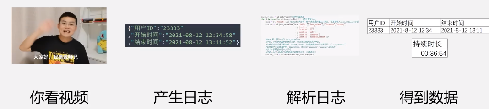
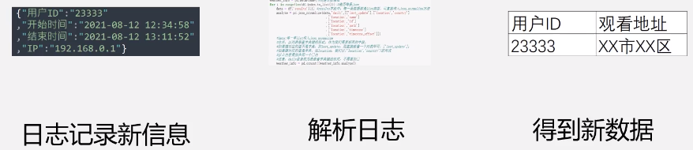
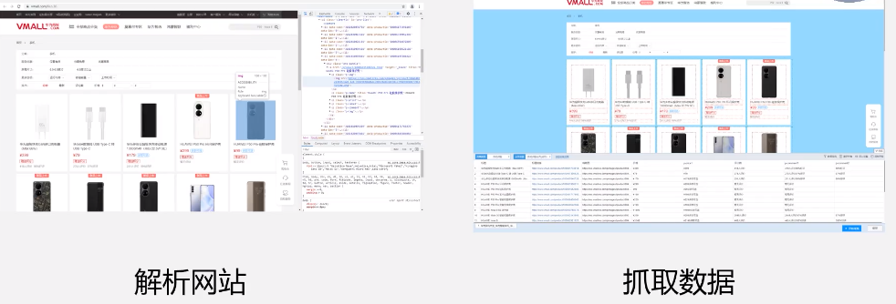
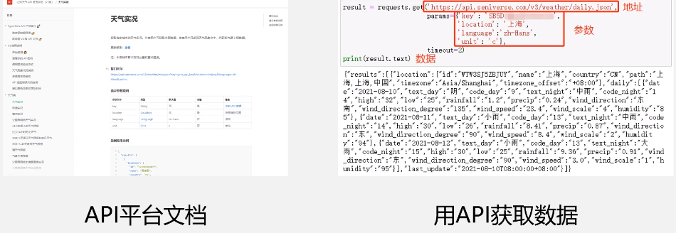
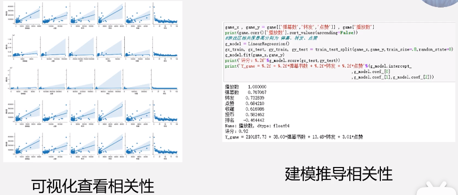
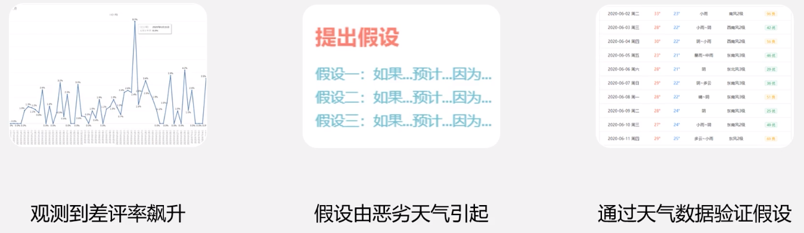
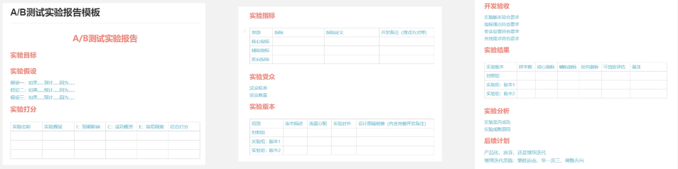
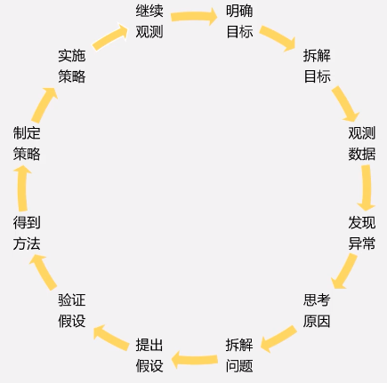
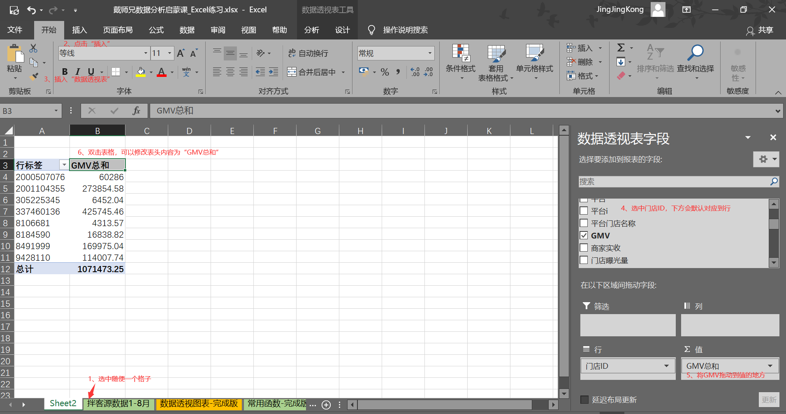

# 一、什么是数据分析

数据分析是一种客观认知世界、改造世界的方法。

**观测、实验、应用。**

1. 观测：通过技术手段获取数据，对事物形成客观量化的认知（制作报表、图表）。
2. 实验：发现规律、提出假设、验证假设。经常用的是AB比大小，哪个更好用哪个。
3. 应用：不断基于数据反馈迭代产品。

## 1.1 观测

**1.1.1 采集数据**

1、采集数据：解析系统日志。
看视频 → 产生日志 → 解析日志 → 得到数据

2、采集数据：埋点获取新数据

3、采集数据：通过传感器采集

4、采集数据：爬虫

5、采集数据：API（Application Programming Interface）

**1.1.2 存储数据**
用各种类型的数据库进行储存。我们初学的人员，只需要从数据库获取数据，进行展示。

**1.1.3 展示数据**
可视化高效传达信息。可以用工具自动的展示数据。

### 为什么要分析数据（目的）

**1.1.4 设定标准**
数据是客观统一的。在任何人眼里：1+1=2，有统一的认知才能有共同的目标。

**1.1.5 发现异常**
对于异常值的发现，能够帮助得到更好的反馈和结果。

**1.1.6 研究关系**
找到数据之间的因果关系

## 1.2 实验

1.2.1 提出假设，然后验证假设。一切未经事实数据验证的想法都是假设。

1.2.2 设计A/B测试，获取数据

如何在业务只有少量数据时设计数据实验?
如何在无法同时测试两个版本时比较数据?

## 1.3 应用

如何应用数据创造价值?
一、基于数据反馈不断迭代产品和业务策略
二、基于数据训练算法，让机器自动化地完成工作

**拆解方法**
·AARRR、·PEST、·RFM、.SWOT、.5W1H
·流程拆解法、·二分法、·象限拆解法、·杜邦分析法
拆解只要符合MECE法则即可。

**将数据应用于业务**

**将数据应用于算法**
训练算法 = 训练一个还不会打怪兽得到迪迦奥特曼去打怪兽

基于数据和算法的竞争，无时无刻不在互联网行业上演。数据分析将会成为职场人士的必备技能。所以我们必须基于数据提升业务或者算法！

# Excel基础操作 | 大厂周报制作 | 常用函数

Ctrl + Shift + L : 对所有内容进行筛选

uv (Unique visitor)
是指通过互联网访问、浏览这个网页的自然人。访问网站的一台电脑客户端为一个访客。00:00-24:00内相同的客户端只被计算一次。一天内同个访客多次访问仅计算一个UV。
Pv(Page View)
即页面浏览量或点击量，用户每1次对网站中的每个网页访问均被记录1个Pv。用户对同一页面的多次访问，PV会累计。
CPc (Cost Per Click)：每产生一次点击所花费的成本

1、拿到所有数据第一步先进行数据备份。将原表格复制一个副本，并进行隐藏，避免对数据造成不可修复的错误。

2、行是数字来标识的，列是字母来标识的。选中一行/一列需要选中最开始的地方出现箭头时。
每列数据有自己的列名，我们称为表头。表头+该列的数据=字段。
行和列组成一个工作表。
在下面可以新建很多工作表。

3、Excel功能区熟悉。

4、熟悉教程中的数据。
1）需要知道数据的大小。当选中某一行或者某一列，在右下角可以看到计数大小。
2）数据是线上外卖门店的数据。第一列，日期，指的是当天所有营业额所归属的日期。第二列，品牌ID，相当于品牌的身份证号。第三列，品牌名称。第四列，门店ID。第五列城市。第I列的那个平台门店名称，存在关店重开的情况。第J列，JMV就是一个商家的营业额，在单位时间内的入账金额，指的是订单的原价。商家实收是实际可以进入平台账户的金额。门吊曝光量，这家外卖店在平台上可以被多少人看到。门店访问量，指用户进入该门店。

5、基本的Excel操作。

1）随便选中某一个格点，`“插入”`，“`数据透视表`”，在右侧的选项中选择。
