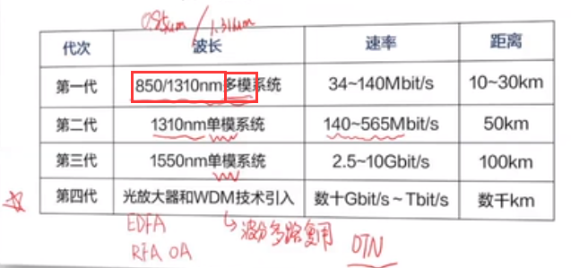
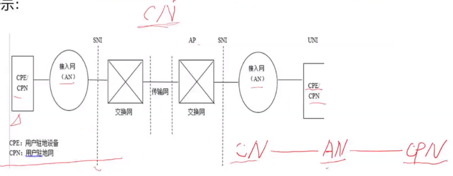
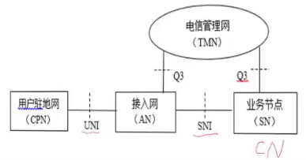

# 光纤通信技术

通信一定涉及到发送方和接收方、移动终端设备。终端设备传输的信号都是数字信号，而在电路中传输时会转换为电信号。

光纤传输技术中，是光 ↔ 电之间的转换

## 第一章、光纤通信原理基本概念（导光原理、传输特性）

**通信**是指人与人、人与自然之间通过某种行为或媒介进行的信息交流与传递。
**通信系统**是通信过程的具体实现。
一个完整的通信系统包括了信息的采集、格式变换、传输和交换等过程所涉及的所有实体。
**光通信**是指利用某种特定波长（频率)（c=fλ）（波分多路复用和频分多路复用，是对应的）的光信号承载信息，并将此光信号通过光纤或者大气信道传送到对方，然后再还原出原始信息的过程。
**光纤通信**是光通信最主要的实现形式。（光通信包含光纤通信）

### 光通信

光纤通信
①使用光导纤维作为传输媒质;
②目前最主要的光通信应用形式。

大气/空间光通信
①光信号直接在大气（或其他介质)中传输（垂直/水平方向);
②地面-卫星通信或接入网中应用。

### 光纤通信的早期雏形

远古时代：烽火狼烟。古时候的烽火通信就是光信号通信。
近代：旗语，灯光
1880，A.G.Bell 发明光电话
20世纪60年代初，激光器诞生
70年代——面临实用化挑战。光源:能否制造出室温下连续工作的激光器，媒质:能否找到损耗足够低的传输媒质?

### 光纤通信的奠基人

1966年，在**英国**标准电信实验室工作的**华裔**科学家==**高锟**==(C.K.Kao )首先提出用石英玻璃纤维作为光纤通信的媒质，为现代光纤通信奠定了理论基础。

### 光纤通信实用化开端

传输距离与损耗系数有关系。

1970年，美国康宁公司用超纯石英为材料，首先拉制出损耗为20dB/km光纤。
1970年，美国贝尔实验室研制成功可在室温下连续振荡的嫁铝砷（GaAIAs )半导体激光器，为光纤通信找到了合适的光源。
1973年，贝尔实验室将光纤的损耗系数下降到1dB/km。
1974年，日本解决了光缆的现场敷设及接续问题。
1976年，日本把光纤的损耗降低到0.5dB/km，同年美国首先成功地进行了系统容量为44.736Mbit/s，传输距离为10km的光纤通信系统现场试验。
70年代光源和光纤技术的快速成熟，为光纤通信的商用化打下了坚实的基础。（并没有实现商用化）

### 光纤通信系统的发展

## 第二章、设备

### 光源

LD
LED

### 光接收机

PIN
APD

### 光中继、光放大器

### 光电检测器OTDR

## 第三章、光传送网

PDH → SDH → WDM  →OTN

# 宽带接入技术

## 一、什么是宽带

宽带是指能够提供超过每秒2Mb的数据传输速度或比特率的传输技术。与标准的(或窄带）电话线所具有的每秒**64Kb**的传输容量相比，宽带提供的容量能显著地支持业务量高峰，由此提高潜在的业务提供能力。宽带可提供LAN（局域网）接入的速率基本能做到千兆到小区、百兆到居民楼和十兆到用户。

## 二、接入网的定义

所谓接入网是指**核心网络到用户终端**之间的所有链路和设备，在苏格兰格拉斯会议上被首次提出。其长度一般为几百米到几千米，因而，被形象地称为**“最后一公里”**。它负责将终端用户接入到核心网中，并将各种电信业务透明的传送给用户。

## 三、接入网的定界

### (一)电信网

要说明接入网，首先，就要谈到电信网，电信网是利用有线、无线、光或其它电磁系统，对符号、信号、文字、图像、声音或其它性质的信息进行传输、发送或接收。电信网是由一定数量的节点和传输链路按照规定的协议，实现两点或多点之间通信的网络。现代电信网络正在向综合化、宽带化和个人化的方向发展。电信网按照不同的角度可以分为4类:
①按区域或者运营方式分为公用通信网和专用通信网;
②按信息类型分为电话通信网和数据通信网;
③按技术层次分为业务网、传送网和支撑网（机房主要业务）;
④按所处位置可以分为==**核心网(CN)**==、==**接入网（AN)**==和==**用户驻地网（CPN )**==。如图所示:

### G.902

1995年7月ITU-T建议G.902中对接入网做出如下定义︰接入网(AN)是由一系列实体（诸如线缆装置、传输设备等）组成的，为了在一个==**业务节点接口( SNI)**==和每一个与之相关联的==**用户网络接口（UNI）**==之间提供电信业务，而提供所需传送承载能力的一个实现。接入网可以经由==Q3（管理）==接口进行配置和管理。接入网可以实现的UNIl和SNI的类型和数量原则上没有限制。

从接入网的定义可以看出:
①接入网是由线缆装置、传输设备等实体构成的一个实施系统;
②接入网为电信业务提供所需的传送承载能力;
③电信业务是在SNI和每一个与之关联的UNI之间提供的；UNI接口是靠近用户侧的。
④接入网可以经由Q3（**电信管理网TMN**的接口)进行配置和管理;
⑤接入网不解释用户信令。接入网不认识控制设备的信息，不管用户设备传入的信息内容，只负责传输到核心网或者传输回来。

这个定义的抽象性、概括性很强。如果不是互联网技术的冲击，应该有非常广泛的指导意义。通过后面的讨论可以知道，G.902建议的接入网定义存在一定弱点：
①由于接入网不解释用户信令，所以电信接入网不具备交换能力。这一点表明，用户不能通过用户信令控制接入网的动作，例如：动态改变UNI和SNI的关联以使用另一个SN提供的业务。这是电信接入网定义的一个重大不足，后来在Y.1231建议中定义的IP接入网有了根本性的改进;
②强调通过Q3接口管理（由电信管理网管理），没有考虑SNMP等其他管理协议的地位;
③使用业务，需要在UNI与SNI之间逐一建立关联，这种关联的相对静态特性与当今互联网的主流应用模式不一样。

接入网的范围可由3个接口来定界，如图所示：（位于本地交换机和用户驻地网之间的接口没有Q3）

这是接入网最基本也是最重要的一个图。有接入网定界图可以清楚的看出:AN以UNI、SNI和Q3接口为边界连到其他网络实体，AN通过UNl和SNI连接用户终端和业务节点SN，为传送SNI和与之关联的UNI之间电信业务提供承载能力，AN通过Q3接口与TMN（电信管理网）进行管理交互。

# 数据通信网1

